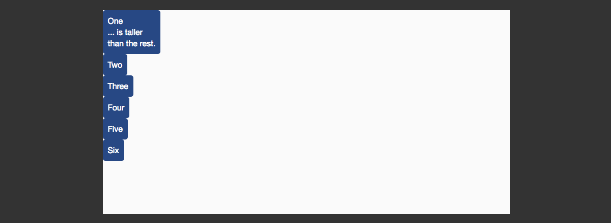
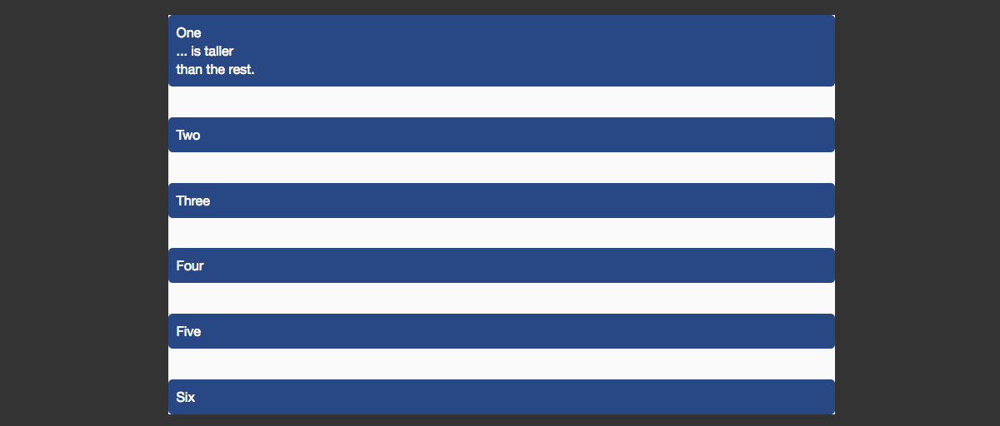
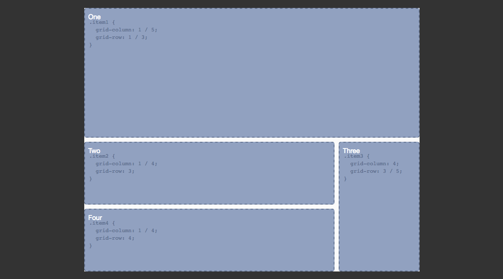
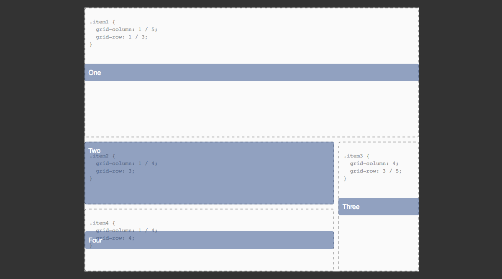
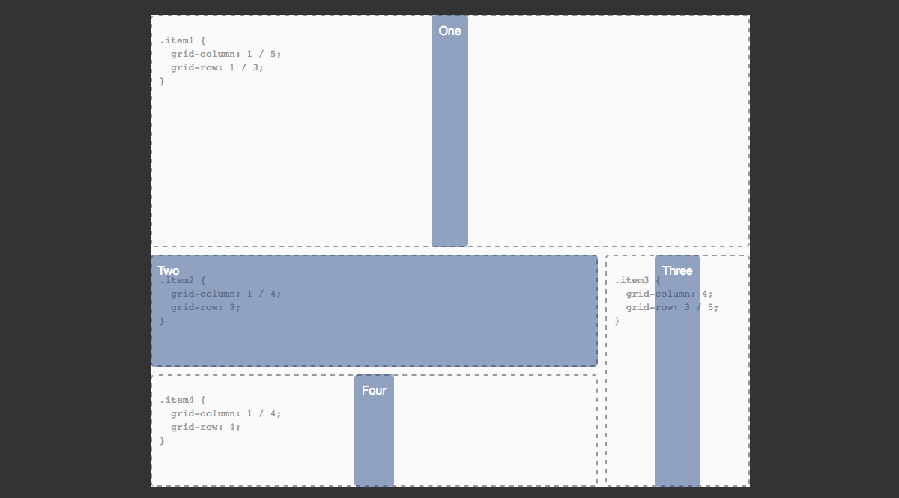
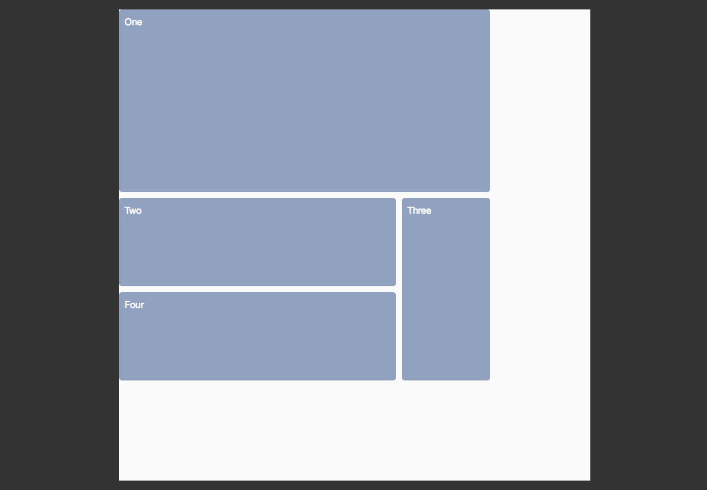
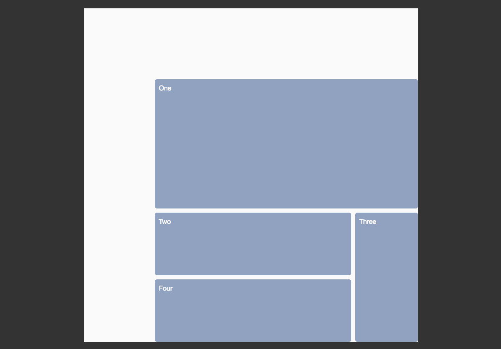
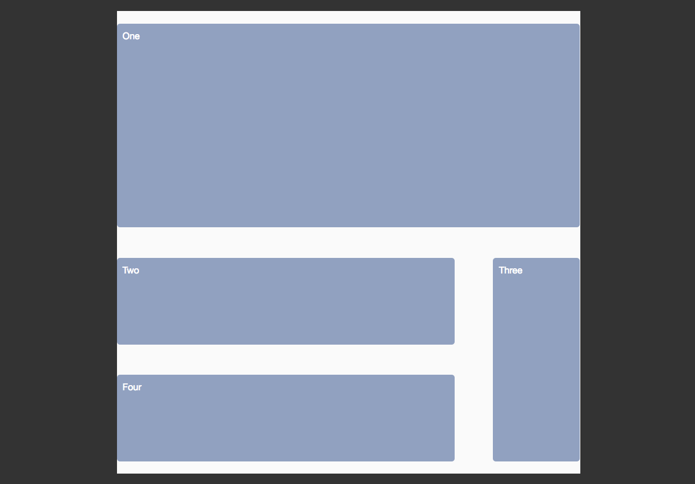
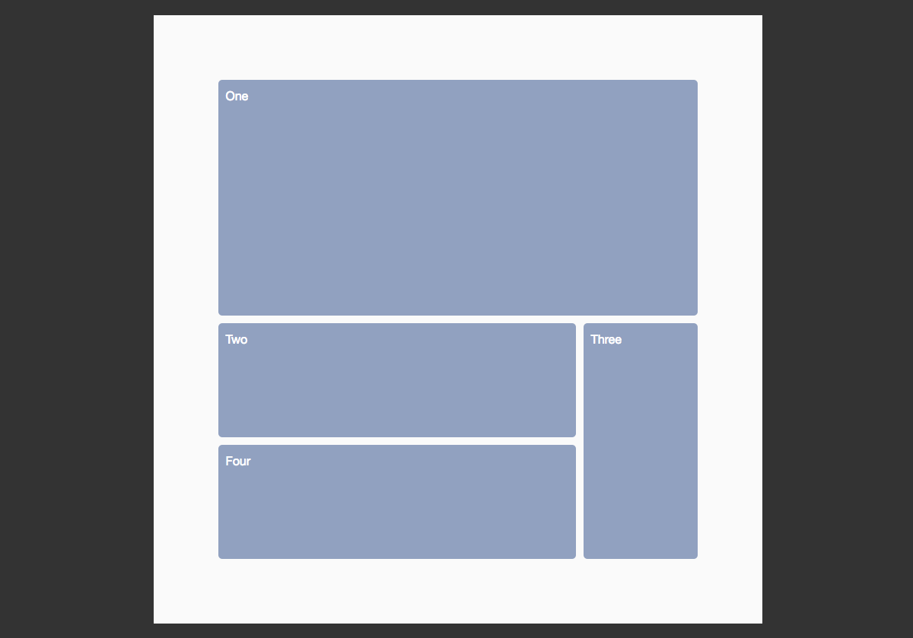

>原文标题：CSS Grid, Flexbox And Box Alignment: Our New System For Web Layout  
> 原文链接：[https://www.smashingmagazine.com/2016/11/css-grids-flexbox-and-box-alignment-our-new-system-for-web-layout/](https://www.smashingmagazine.com/2016/11/css-grids-flexbox-and-box-alignment-our-new-system-for-web-layout/)

<!--more-->

Layout on the web is hard. The reason it is so hard is that the layout methods we’ve relied on ever since using CSS for layout became possible were not really designed for complex layout. While we were able to achieve quite a lot in a fixed-width world with hacks such as faux columns, these methods fell apart with responsive design. Thankfully, we have hope, in the form of flexbox — which many readers will already be using — CSS grid layout and the box alignment module.

**在网页上布局是很费劲的。**布局如此艰难的原因是因为，自从使用 CSS 进行布局成为可能之后，我们所依赖的那些布局方法并不是真正为复杂布局而设计的。尽管我们能够通过一些 hack 来实现很多固定宽度的世界，比如仿制的栏。但是这些方法在响应式的设计中要崩溃了。谢天谢地，我们还是有希望的。，CSS Grid, Flexbox 和 Box Alignment就是我们的希望。

In this article, I’m going to explain how these fit together, and you’ll discover that by understanding flexbox you are very close to understanding much of grid layout.

在这篇文章中，我将要阐明如何将这些组合在一起，同时你将会发现，理解了 flexbox 之后，更加明白网格布局。

## A Note On Browser Support 浏览器支持的一个注记

CSS grid layout is currently behind a flag or available in the developer and nightly builds of Firefox, Safari, Chrome and Opera. Everything you see here can be seen to be working if you use a developer or nightly browser or enable the flag in a mainstream browser that has flagged support. I am trying to keep an up-to-date list of support for grid layouts.

CSS 网格布局目前在 Firefox 的开发者版本和 nightly 版，Safari，Chrome 和 Opera中支持，或者在一个标志之后（。。。。）。如果使用的是你开发者版本或者 nightly版的浏览器或者激活了支持标记的主流浏览器（比如Chrome），你在这所看到的一切都能生效。 我尽量保持一个最新的[ list of support for grid layouts](http://gridbyexample.com/browsers/)。

## New Values For Display  Display 的新值

Both grid and flexbox are new values for the display property. To make an element a flex container, we use display: flex; to make it a grid container, we use display: grid.

grid 和 flexbox 都是 display 属性的新值。我们可以使用`display: flex` 将一个元素变成 flex 容器；可以使用`display: grid`将一个元素变成 grid 容器。

As soon as we do so, the immediate children of our flex or grid container become flex or grid items. Those immediate children take on the initial values of flex or grid items.

一旦我们这么做之后， flex 或者 grid 容器当前的子元素变成 flex 或者 grid 项。这些子元素拥有 flex 或者 grid 项的初始值。

### DISPLAY: FLEX LINK

In the first example, we have three elements in a wrapper element set to display: flex. That’s all we need to do to start using flexbox.

在第一个例子中，在一个设置了`dispaly: flex`的包装元素中有三个子元素。这就是我们开始使用 flexbox 所需要做的。

Unless we add the following properties with different values, the initial values for the flex container are:

如果我们不添加下面这些不同值的属性，flex 容器的初始值是：

* flex-direction: row
* flex-wrap: no-wrap
* align-items: stretch
* justify-content: flex-start

The initial values for our flex items are:

flex 项的初始值是：

* flex-grow: 0
* flex-shrink: 1
* flex-basis: auto

We’ll look at how these properties and values work later in this article. For now, all you need to do is set display: flex on a parent, and flexbox will begin to work.

稍后在文章我们将看看这些属性值是如何工作的。目前，你所要做的是在父元素上设置`display: flex`，flexbox 将会开始生效。

See the Pen <a href="http://codepen.io/rachelandrew/pen/ZOpOqB/">Flexbox Defaults</a> by rachelandrew (<a href="http://codepen.io/rachelandrew">@rachelandrew</a>) on <a href="http://codepen.io">CodePen</a>.

### DISPLAY: GRID LINK

To lay out items on a grid, we use display: grid. In order that we can see the grid’s behavior, this example has five cards to lay out.

为了在网格中布置项，我们使用`display: grid`。这个例子有五个卡片来布局，以便我们能够看到网格的行为。

Adding display: grid won’t make a dramatic change; however, our child items are all now grid items. They have fallen into a single-column track grid, displaying one below the other, the grid creating implicit row tracks to hold each item.

添加`display: flex`不会制造一个戏剧性的变化；然而，所有的子元素现在都是 grid 项。它们都在一个单列的通道网格中，一个接一个的往下排列，网格创建了一个隐式的行轨道保持它们。

See the Pen <a href="http://codepen.io/rachelandrew/pen/QEKGNm/">Grid Defaults</a> by rachelandrew (<a href="http://codepen.io/rachelandrew">@rachelandrew</a>) on <a href="http://codepen.io">CodePen</a>.

Once again, we have some default behavior in evidence. We haven’t positioned any of these grid items, but they are placing themselves onto our grid, one per cell of the grid. The initial values of the grid container are:

再一次，很明显地看到，（布局）有一些默认的行为。我们没有摆放任何 grid 项，但它们都把自己放到我们的网格之中，每一个 grid 项占据一个网格单元。grid 容器的初始值是：

* grid-auto-flow: row
* grid-auto-rows: auto
* align-items: stretch
* justify-items: stretch
* grid-gap: 0

These initial values mean that our grid items are placed one into each cell of the grid, working across the rows. Because we have a three-column track grid, after filling the grid cell of the third column, a new row is created for the rest of the items. This row is auto-sized, so will expand to fit the content. Items stretch in both directions, horizontal and vertical, filling the grid area.

这些初始值表示的意思是：在每一行中，每一个 grid 项都被放在网格中的一个单元格中。因为我们有一个三栏的通道网格，所以在第三栏填满之后，剩下的 grid 项会创建新的一行。这个新行是大小是自适应的，所以将会拓展以适应内容。网格中的元素在水平和垂直两个方向上伸展填充网格区域。

## Box Alignment

In both of these simple examples, we are already seeing values defined in the box alignment module in use. “Box Alignment Module Level 3” essentially takes all of the alignment and space distribution defined in flexbox and makes it available to other modules. So, if you already use flexbox, then you are already using box alignment.
Let’s look at how box alignment works in flexbox and grid, and the problems that it helps us solve.

在这些简单的例子中，我们已经使用了一些在 box alignment 模块中定义的值。“Box Alignment Module Level 3”基本上拥有所有 flexbox 中定义的的对齐和空白分配能力，并且让它能够在其他模块中使用。所以，如果你已经使用了 flexbox，那么你已经在使用 box alignment。让我们来看看 box alignment 是如何在 flexbox 和 grid 中工作的，和一些 box alignment 可以帮我们解决的难题。

### EQUAL-HEIGHT COLUMNS 等高列

Something that was very easy to create with old-school table-based layouts, yet fiendishly difficult using positioning and floats, is equal-height columns. In the floated example below, our cards contain unequal amounts of content. We have no way of indicating to the other cards that they should visually take on the same height as the first card — they have no relationship to each other.

有一种布局使用老式的表单布局来创建是非常简单的，但是使用定位和浮动确实极其困难，这就是等高列布局。在下面的浮动例子中，我们的卡片包含不相同的内容。我们无法告知其他的卡片在视觉上和第一个卡片保持高度一致——他们彼此之间没有关联。

See the Pen <a href="http://codepen.io/rachelandrew/pen/YWGrPy/">Floated Columns</a> by rachelandrew (<a href="http://codepen.io/rachelandrew">@rachelandrew</a>) on <a href="http://codepen.io">CodePen</a>.

As soon as we set the display property to grid or flex on a parent, we give the children a relationship to each other. That relationship enables the box-alignment properties to work, making equal-height columns simple.

一旦我们为父元素设置display属性为 `grid` 或者 `flex`，便给子元素彼此之间赋予了关联性。这种关联性使得box-alignment 属性能够生效，让登高栏的实现变得简单。 

In the flex example below, our items have unequal amounts of content. While the background on each lines up, it doesn’t sit behind the content as it would for floated elements. Because these items are displayed in a row, the property that controls this behavior is align-items. Creating equal-height columns requires that the value be stretch — the initial value for this property.

在下面的 flex 例子中，flex 子项有不同数量的内容。当每一项都加上背景色时，背景色不像在浮动元素中一样在内容区域的后面。因为这些项都是在一行中显示。控制这个行为的属性是`align-items`。创建等高列需要将`align-items`的值设置成`stretch`——它的初始值。

See the Pen <a href="http://codepen.io/rachelandrew/pen/ZOpXEM/">Flexbox Equal Height Columns</a> by rachelandrew (<a href="http://codepen.io/rachelandrew">@rachelandrew</a>) on <a href="http://codepen.io">CodePen</a>.

We see the same with grid layouts. Below is the simplest of grid layouts, two columns with a sidebar and main content. I’m using those fraction units again; the sidebar has 1 fraction of the available space, and the main content 3 fractions. The background color on the sidebar runs to the bottom of the content. Once again, the default value of `align-items` is `stretch`.

在网格布局中我们可以看到相同的效果。下面是最简单的网格布局例子，两列，一列侧边栏，一列主要内容。我再次使用这些分数单位；侧边栏是可用空间中的1份，主体内容是可用空间中的3份。侧边栏的背景色跑到了内容的底部（对齐在底部）。再说一次，`align-items`的默认值是`stretch`。

See the Pen <a href="http://codepen.io/rachelandrew/pen/GqjMJj/">Grid Equal Height Columns</a> by rachelandrew (<a href="http://codepen.io/rachelandrew">@rachelandrew</a>) on <a href="http://codepen.io">CodePen</a>.

### ALIGNMENT IN FLEXBOX Flexbox 中的对齐

We’ve seen how the default value of `align-items` for both `grid` and `flexbox` is `stretch`.

我们已经看到了 `align-items`在 flex 和 grid 中的默认值都是`stretch`。

For flexbox, when we use `align-items`, we are aligning them inside the flex container, on the cross axis. The main axis is the one defined by the `flex-direction` property. In this first example, the main axis is the row; we are then stretching the items on the cross axis to the height of the flex container. The height of the flex container is, in this case, determined by the item with the most content.

对于 flexbox，当我们使用`align-itmes`时，我们是将它们在 flex 容器中的十字轴上对齐。主轴由 `flex-direction`属性定义。在这个例子中，主轴是 row；然后我们十字轴上的项目延伸到容器的高度。在这种情况下，flex 容器的高度由 flex 项的最大高度决定。

I could give the wrapper a height, and in this case the height of the flex container would be defined by that height.

我可以给包装器添加一个高度，在这种情况下，这个高度将定义flex 容器的高度。

We can use other values, instead of the default `stretch`:

我们可以设置其他的值来取代默认的`stretch`:

- `flex-start`
- `flex-end`
- `baseline`
- `stretch`

To control the alignment on the main axis, use the `justify-content`property. The default value is `flex-start`, which is why our items are all aligned against the left margin. We could instead use any of the following values:

要控制在主轴上的对齐，使用 `justify-content`。默认值是`flex-start`，这就是为什么 flex 项全部对齐做外边距的原因。我们可以使用下面的任意值来替代：

- `flex-start`
- `flex-end`
- `center`
- `space-around`
- `space-between`

The `space-between` and `space-around` keywords are especially interesting. With `space-between`, the space left over after the flex items have been displayed is distributed evenly between the items.

`space-between`和`space-around`关键字尤其有趣。使用`space-between`，flex 容器中剩余的空白位置会平均分布在 flex 项之间。

Using `space-around` is similar except that the space left over is distributed on both sides of the items. You get a half-sized gap on each end.

使用`space-around`，flex 容器中剩余的空白位置会平均分布在 flex 项两边。

You can see these properties and values in the CodePen below.

你可以在下面的 CodePen中看到这些属性和值。

See the Pen <a href="http://codepen.io/rachelandrew/pen/PzGJzm/">Flexbox Alignment flex-direction: row</a> by rachelandrew (<a href="http://codepen.io/rachelandrew">@rachelandrew</a>) on <a href="http://codepen.io">CodePen</a>.

We can display flex items as a column rather than a row. If we change the value of `flex-direction` to `column`, then the main axis becomes the column, and the cross axis is along the row — `align-items` is still `stretch` by default, and so stretches the items across row-wise.

我们可以将 flex 项按照列摆放而不是行。如果我们将`flex-direction`的值设置成`column`，然后主轴变成column，横轴沿着 row——`align-items`依旧是默认值`stretch`，所以在每一行上拓展 flex 项。

If instead we want them to align to the start of the flex container, we use `flex-start`.

如果我们想要 flex 项在 flex容器的开始位置对齐，我们使用`flex-start`。

We can use `justify-items`, too, including `space-between` and `space-around`. The container needs to have enough height for you to see each in action, though!

我们也可以使用`justify-items`，包括`space-between`和`space-around`。但是要看到这些效果，容器需要足够的高度！

See the Pen <a href="http://codepen.io/rachelandrew/pen/JKRrvY/">Flexbox Alignment flex-direction: column</a> by rachelandrew (<a href="http://codepen.io/rachelandrew">@rachelandrew</a>) on <a href="http://codepen.io">CodePen</a>.

### ALIGNMENT IN GRID LAYOUT 网格布局中的对齐

In a grid layout, the behavior is similar, except that we are aligning items within the defined grid area. In flexbox, we talk about the main and cross axis; with grids, we use the terms “block” or “column axis” to describe the axis defining our columns, and “inline” or “row axis” to describe the axis defining our rows, as [defined in the specification](https://www.w3.org/TR/css-grid-1/#grid-concepts).

在网格布局中，对齐的行为是相似的，除了在定义的网格区域对去 grid 项。在 flexbox 中，我们讨论的是主轴和横轴；在网格中，我们用“block”或者“column axis（列轴）”的说法来描述列中定义的轴，用“inline”和“row axis（横轴）”的说法来描述行中定义的轴，比如[defined in the specification](https://www.w3.org/TR/css-grid-1/#grid-concepts)

We can align content inside a grid area using the properties and values described in the box alignment specification.

我们可以使用 box alignment 中定义的属性和值来对齐一个网格区域中的内容。

A grid area is one or more grid cells. In the example below, we have a four-column and four-row track grid. The tracks are separated by a grid gap of 10 pixels, and I have created three grid areas using line-based positioning. We’ll look at this positioning properly later in this guide, but the value before the `/` is the line that the content starts on, and the value after where it ends.

一个网格区域可以是一个或者更多网络单元格。在下面的例子中，我们有四行四列的通道网格。这些轨道之间有一个10像素的分割间隙，同时以线为基础创建了是三个网格区域，并放在合适的位置。稍后我们会在这个指南中看看这个正确的位置。`/`前面的数字表示的是内容在这一行的起点，后面的数字表示的是内容在何处结束（译者注：千万别当做五分之一来看待，这里的意思是，内容从第一列开始，到第五列结束）。

See the Pen <a href="http://codepen.io/rachelandrew/pen/EygpMv/">Grid Alignment: align-items and justify-items</a> by rachelandrew (<a href="http://codepen.io/rachelandrew">@rachelandrew</a>) on <a href="http://codepen.io">CodePen</a>.

The dotted border is on a background image, to help us see the defined areas. So, in the first example, each area uses the defaults of `stretch` for both `align-items` on the column axis and `justify-items`on the row axis. This means that the content stretches to completely fill the defined area.

虚线边框是背景图中的，帮助我们看到定义的区域。那么，在第一个例子中，每个区域在列轴上使用`stretch`作为`align-items`的默认值，在行轴上使用`justify-items`。这意味着内容会延伸到完全填充定义的区域。

In the second example, I have changed the value of `align-items` on the grid container to `center`. We can also change this value on an individual grid item using the `align-self` property. In this case, I have set all items to `center`, but item two to `stretch`.

在第二个例子中，我将 grid 容器的`align-items`的值修改成`center`。我们也可以修改一个单独的 gird 项上的`align-self`属性的值。此时，我把所有的项都设置成`center`，但是第二个项设置成 `stretch`。	

In the third example, I have changed the value of `justify-items` and `justify-self` again, setting these to `center` and `stretch`.

在第三个例子中，我再次修改了`justify-items`和`justify-self`的值，将这些设置成`center`和`stretch`。

In all of the examples above, I have aligned the content of the grid areas, the areas defined by the start and end grid lines.

上面的所有例子，我将网格区域中的内容对齐，这些网格区域由起点网格线和终点网格线定义。

We can also align the entire grid inside the container, if our grid tracks are sized so that they take up less space than the container that has been set to `display: grid`. In this case, we use the `align-content`and `justify-content` properties, as with flexbox.

我们也可以将容器中的网格整个对齐，如果我们的网格轨道是有固定大小的，那么它们将会比设置了`display: grid`的容器占据更小的空间。此时，我们使用 `align-content` 和 `justify-content`，就像 flexbox。

See the Pen <a href="http://codepen.io/rachelandrew/pen/aZBozX/">Grid Alignment: aligning the grid</a> by rachelandrew (<a href="http://codepen.io/rachelandrew">@rachelandrew</a>) on <a href="http://codepen.io">CodePen</a>.

In the first example, we see the default alignment of a grid where the columns and rows have been defined in absolute units and take up less space than the fixed-sized wrapper allows for. The default values for both are `start`.

在第一个例子中，我们可以看到网格的默认布局，行和列都被定义在绝对大小单位中，占据的空间比固定大小的包装器允许的空间更小。`align-content`和`justify-content`的默认值都是`start`。

To move the tracks to the bottom right, we change the values to `end`.

为了将轨道移动到右下角，我们可以把值变成`end`。

Just as with flexbox, we can use `space-around` and `space-between`. This might cause some behavior that we don’t want as the grid gaps essentially become wider. However, as you can see from the image below and in the third example in the CodePen, we get the same space between or around the tracks as we see with flexbox.

就像 flexbox 一样，我们可以使用`space-around`和`sapce-between`。这可能会引发一些我们不希望看到的行为，我们不想网格间隙变得更宽。然而，正如下图和 CodePen 中的第三个例子中你看到的一样，在轨道之间或者周围有相同的空间，就像在 flexbox 中一样。

The fixed-sized tracks will gain additional space if they span more than one track. Element two and four in our example are wider and three is taller because they are given the extra space assigned to the gap they span over.

如果固定大小的轨道跨度超过一个轨道的宽度，它将会获得额外的空间。在我们例子中的例子二和四更宽，例子三更高，因为他们有额外的空间分配给他们跨过的间隙。

We can completely center the grid by setting both values to `center`, as shown in the last example.

我们可以通过将两个值设置成`center`来完全地将网格居中，就像最后一个例子中展示的一样。

We have very nice alignment abilities in both flexbox and grid, and they work in a generally consistent way. We can align individual items and groups of items in a way that is responsive and prevents overlap — something the web has lacked until now!

在 flexbox 和 grid 中我们有非常完美的对齐能力，同时它们以一种普遍一直的方式工作。我们可以对齐单独的项也可以对齐一组项，这反应迅速，同时放置部分重叠——直到现在，web 一直都缺乏的东西。

## Responsive By Default 默认反应

In the last section, we looked at alignment. The box-alignment properties as used in grid and flexbox layouts are one area where we see how these specifications have emerged in a world where responsive design is just how things are done. Values such as `space-between`, `space-around` and `stretch` allow for responsiveness, distributing content equally among or between items.

在最后一节中，我们看看 alignment。在 flexbox 和网格布局中使用的box-alignment 属性作用在一个区域，在这个区域我们看到了这些参数是如何形成一个世界的，而这个世界就是响应式设计需要做的。像`space-betweem`，`space-around`和`stretch`这些值都允许响应，在项之间或者周围平均的分配内容。

There is more, however. Responsive design is often about maintaining proportion. When we calculate columns for a responsive design using the `target ÷ context` approach introduced in Ethan Marcotte’s original [article on fluid grids](http://alistapart.com/article/fluidgrids), we maintain the proportions of the original absolute-width design. Flexbox and grid layouts give us far simpler ways to deal with proportions in our designs.

但是，还有很多。响应式设计经常需要维护比例。当我们使用[Ethan Marcotte's 的文章](http://alistapart.com/article/fluidgrids)中介绍的`target除以 context`方法为响应式设计计算列时，我们维持原来绝对宽度设计的比例。Flexbox 和网格布局给了我们很简单的方法来处理设计中 的比例。

Flexbox gives us a **content-out** approach to flexibility. We see this when we use a keyword value of `space-between` to space our items evenly. First, the amount of space taken up by our items is calculated, and then the remaining space in the container is divided up and used evenly to space out the items. We can get more control of content distribution by way of properties that we apply to the flex items themselves:

Flexbox给了我们一种从内容外部入手实现弹性的方法。当我们使用`space-between`来平均分配空间时，我们可以看到这种方式。首先，一些空间呗计算过之后的项占据，然后容器中剩余的空间被分割开，平均地分配在项外面。我们可以通过在 flex 项自身上应用属性来得到更多的内容分配的控制权。

- `flex-grow`
- `flex-shrink`
- `flex-basis`

These three properties are more usually described by the shorthand `flex` property. If we add `flex: 1 1 300px` to an item, we are stating that `flex-grow` should be `1` so that items can grow, `flex-shrink`should be `1` so that items can shrink, and the `flex-basis` should be 300 pixels. Applying this to our cards layout gives us the example below.

这些属性通常更多地是用简单的 flex 属性来描述。如果我们对一个项添加`flex: 1 1 300px`，我们来陈述一遍，`flex-grow`是1，项可以扩大，`flex-shrink`是1，项可以收缩，并且`flex-basis`是300像素。把这个应用到我们的卡片不居中，可以得到下面的这个例子。

See the Pen <a href="http://codepen.io/rachelandrew/pen/gMLrEG/">Flexbox: flex properties</a> by rachelandrew (<a href="http://codepen.io/rachelandrew">@rachelandrew</a>) on <a href="http://codepen.io">CodePen</a>.

Our `flex-basis` here is 300 pixels, and we have three cards in a row. If the flex container is wider than 900 pixels, then the remaining space is divided into three and distributed between the items equally. This is because we have set `flex-grow` to `1` so that our items can grow from the `flex-basis`. We have also set `flex-shrink` to `1`, which means that, where we don’t have space for three 300-pixel columns, space will be removed equally.

`flex-basis`在这里是300像素，我们三个卡片是在一行的。如果 flex 容器比900像素宽，那么剩下的空间会平均分配三个卡片之。这是因为我们设置了`flex-grow`为`1`，所以项会在`flex-basis`的基础上扩大。我们也设置了`flex-shrink`为`1`，这一位置如果三个300像素的列之间没有足够的空间，项之间的空间会被移除。

If we want these items to grow in different proportions, then we can change the `flex-grow` value on one or more items. If we would like the first item to get three times the available space distributed to it, we would set `flex-grow` to `3`.

如果我们想这些项以不同的比例扩大，我们可以修改一个或者更多项的`flex-grow`，如果我们想第一个项在空间足够时变成三倍，我们将设置 `flex-grow`为`3`。

See the Pen <a href="http://codepen.io/rachelandrew/pen/NrbNmz/">Flexbox: flex properties</a> by rachelandrew (<a href="http://codepen.io/rachelandrew">@rachelandrew</a>) on <a href="http://codepen.io">CodePen</a>.

The available space is distributed *after* the amount needed for `flex-basis` has been taken into account. This is why our first item is not three times the size of our other items, but instead gets a share of three parts of the remaining space. You will see a bigger change by setting the value for `flex-basis` to `0`, in which case we wouldn’t have a starting value to remove from the overall container. Then, the entire width of the container could be distributed in proportion to our items.

可用空间是在`flex-basis`被考虑需要的空间大小之后分配的。这就是为什么我们的第一项不是扩大原来的三倍，而是三个卡片的剩余空间。将 `flex-basis`设置成`0`你将看到一个更大的变化。在这种情况下，我们没有一个从整个容器中移除的初始值。然后整个容器的宽度都将按比例分配给各项。

See the Pen <a href="http://codepen.io/rachelandrew/pen/jrVqoQ/">Flexbox: flex properties</a> by rachelandrew (<a href="http://codepen.io/rachelandrew">@rachelandrew</a>) on <a href="http://codepen.io">CodePen</a>.

A very useful tool to help you understand these values is [Flexbox Tester](https://madebymike.com.au/demos/flexbox-tester/). Pop the different values into the tester, and it calculates the actual sizes at which your items will end up, and explains why they end up at that size.

Flexbox Tester 是一个帮助你理解这些值的非常好用的工具。

If you use `auto` as your `flex-basis` value, it will use any size set on the flex item as the `flex-basis` value. If there is no size, then it defaults to be the same as the value of `content`, which is the content’s width. Using `auto` is, therefore, very useful for reusable components that might need to have a set size on an item. You can use `auto` and be sure that if the item needs to be around a size defined on it, flexbox will respect it.

如果你使用`auto`作为`flex-basis`的值，这将会使用任何大小来设置 flex 项，就像`flex-basis`的值。如果没有大小，那么默认值是内容的宽度。对于那些没有定义大小的可复用组件，使用`auto`非常有用的。你可以使用`auto`来确保项的大小是否和定义的差不多。

In the next example, I have set the `flex-basis` on all cards to `auto`. I then gave the first card a width of 350 pixels. So, the `flex-basis` of that first card is now 350 pixels, which is used to work out how to distribute space. The other two cards have a `flex-basis` based on their content’s width.

在下一个例子中，我把所有的卡片的`flex-basis`设置成`auto`。然后我给第一个卡片设置宽度为350像素。那么第一个卡片的`flex-basis`现在是350像素，用来解决如何分配空间。其他两个卡片的`flex-basis`基于他们的内容的宽度。

See the Pen <a href="http://codepen.io/rachelandrew/pen/mEOPZM/">Flexbox: flex properties</a> by rachelandrew (<a href="http://codepen.io/rachelandrew">@rachelandrew</a>) on <a href="http://codepen.io">CodePen</a>.

If we go back to our original `flex: 1 1 300px`, add more items to our example and set `flex-wrap: wrap` on the container, the items will wrap in order to maintain as near as possible the `flex-basis` value. If we have five images and three fit onto one row, then the next two will wrap onto a new row. As the items are allowed to grow, they both grow equally, and so we get two equal-sized items on the bottom row and three in the row above.

如果我们回到`flex: 1 1 300px`，在我们的例子中添加更多项，并且在容器上设置`flex-wrap: wrap`，这些项为了尽可能地维持 `flex-basis`的值而换行。如果我们有五个项，三个占据一行，那么接下来的两个将会换行到行的一行中。因为这些项都是允许扩大的，所以他们也会平均地扩大。所以在底部一行我们会有两个相同大小的项，上面一行有三个。

See the Pen <a href="http://codepen.io/rachelandrew/pen/QEGNeZ/">Flexbox: wrapping</a> by rachelandrew (<a href="http://codepen.io/rachelandrew">@rachelandrew</a>) on <a href="http://codepen.io">CodePen</a>.

The question then asked is often, “How can I get the items on the bottom row to line up with the ones on the top, leaving a gap at the end?” The answer is that you don’t, not with flexbox. For that kind of behavior you need a grid layout.

那么问题来了，“我怎么做才能让最后一行像顶部一样排列，在末尾留下空隙？”这个回答是，你别，别用 flexbox。对于这种行为，你需要网格布局（译者注：其实可以在后面加上n个看不见不占据空间的卡片，n为每行的卡片个数）。

#### KEEPING THINGS IN PROPORTION WITH GRID LAYOUT

Grid layouts, as we have already seen, have a concept of creating column and row **tracks** into which items can be positioned. When we create a flexible grid layout, we set the proportions when defining the tracks on the grid container — rather than on the items, as with flexbox. We encountered the `fr` unit when we created our grids earlier. This unit works in a similar way to `flex-grow` when you have a `flex-basis`of `0`. It assigns a fraction of the available space in the grid container.

网格布局，正如我们所见，有这个概念：创建列和行轨道，项可以在里面定位。当我们创建一个弹性的网格布局时，我们在 grid 容器中定义轨道时设置比例——而不是在项上，就像 flexbox 一样。在我们之前创建网格时，遇到了`fr`单位，这个单位以和 `flex-grow`相似的方式工作，就像 `flex-basis: 0`。它分配grid 容器中可用空间的一部分。

In this code example, the first column track has been given `2fr`, the other two `1fr`. So, we divide the space into four and assign two parts to the first track and one part each to the remaining two.

在这个例子中，第一列轨道分配了`2fr`，其他两个`1fr`。所以，我们将空间分成四份，两份分配第一列轨道，其他的轨道每个分配一份。

See the Pen <a href="http://codepen.io/rachelandrew/pen/xOROVO/">Simple grid show fraction units</a> by rachelandrew (<a href="http://codepen.io/rachelandrew">@rachelandrew</a>) on <a href="http://codepen.io">CodePen</a>.

Mixing absolute units and `fr` units is valid. In this next example, we have a `2fr` track, a `1fr` track and a 300-pixel track. First, the absolute width is taken away, and then the remaining space is divided into three and assigned three parts to track 1 and one part to track 2.

混合使用绝对单位和 `fr`是有效的。在接下来的例子中，我们有一个`2fr`的轨道，一个`1fr`的轨道和一个300像素的轨道。首先，绝对宽度被占据，然后剩下的空间分成三份，两份给轨道1，一份给轨道2。

See the Pen <a href="http://codepen.io/rachelandrew/pen/rLWLLa/">Grid: Mixing absolute and  fraction units</a> by rachelandrew (<a href="http://codepen.io/rachelandrew">@rachelandrew</a>) on <a href="http://codepen.io">CodePen</a>.

What you can also see from this example is that our items fit into the defined tracks — they don’t distribute across the row, as they do in the flexbox example. This is because, with grid layouts, we are creating a two-dimensional layout, then putting items into it. With flexbox, we get our content and work out how much will fit in a single dimension in a row or column, treating additional rows or columns as entirely new flex containers.

在这个例子中你还可以看到，我们的项刚好放入定义的轨道中——他们没有跨行分配，就像在 flexbox 的例子一样。这是因为，使用 grid 布局是，我们创建一个二维布局，然后将项放在里面。使用 flexbox 时，我们解决了在一维空间中的行和列中内容如何适应，对待额外的行或者列就像是一个完整的新的 flex 容器。

What would be nice, however, is to still have a way to create **as many columns of a certain size as will fit into the container**. We can do this with `grid` and the `repeat` syntax.

这很 nice，然而依然有方法来创建很多确定大小的列填满容器。我们可以使用 `grid`和`repeat`语法来做这个。

In the next example, I will use the `repeat` syntax to create as many 200-pixel columns as will fit in our container. I am using the `repeat`syntax for the track listing, with a keyword value of `auto-fill` and then the size that I want the repeated tracks to be.

在下面例子中，我将使用`repeat`语法来创建很多200像素的列来填入我们的容器。

(At the time of writing, this was not implemented in Chrome, but works in Firefox Developer Edition.)

在写文章的时候 Chrome 不支持，但是在 Firefx 的开发者版本中有效。

See the Pen <a href="http://codepen.io/rachelandrew/pen/Pzbzze/">Grid: As many 200 pixel tracks as will fit</a> by rachelandrew (<a href="http://codepen.io/rachelandrew">@rachelandrew</a>) on <a href="http://codepen.io">CodePen</a>.

We can go a step further than that and combine fraction units and an absolute width to tell the grid to create as many 200-pixel tracks as will fit in the container and to distribute the remainder equally.

我们可以更远的一步，结合fr 单位和绝对宽度来告诉网格创建很多200像素的轨道填充容器同时平均分配剩下的空间。

See the Pen <a href="http://codepen.io/rachelandrew/pen/EyNyNK/">Grid: As many 200 pixel tracks as will fit, distribute remain space evenly</a> by rachelandrew (<a href="http://codepen.io/rachelandrew">@rachelandrew</a>) on <a href="http://codepen.io">CodePen</a>.

In this way, we get the benefits of a two-dimensional layout but still have flexible quantities of tracks — all without using any media queries. What we also see here is the grid and flexbox specifications diverging. Where flexbox ends with distributing items in one dimension, grid is just getting started.

在这种方式下，我们既得到了二维布局的好处同时依旧拥有弹性的轨道——所有的这些都没有使用任何的媒体查询。同时我们还看到grid he flexbox 规格的区别。flexbox 在一维上以分配项目而结束，grid 则是刚刚开始。

#### A SEPARATION OF SOURCE ORDER AND VISUAL DISPLAY

With flexbox, we can’t do a lot in terms of positioning our flex items. We can choose the direction in which they flow, by setting `flex-direction`to `row`, `row-reverse` or `column`, `column-reverse`, and we can set an order, which controls the visual order in which the items display.

在 flexbox 在 flex项的定位上不能做太多的声明。我们可以通过设置`flex-direction`成`row`，`row-reverse`或者`column`，`column-reverse`，并且我们可以设置顺序，控制他们在视觉上的呈现顺序。

See the Pen <a href="http://codepen.io/rachelandrew/pen/YWpWVE/">Flexbox: order</a> by rachelandrew (<a href="http://codepen.io/rachelandrew">@rachelandrew</a>) on <a href="http://codepen.io">CodePen</a>.

With grid layouts, we get to properly position child items onto the grid we have defined. In most of the examples above, we have been relying on grid auto-placement, the rules that define how items we have not positioned are laid out. In the example below, I am using line-based positioning to position the items on the grid.

在网格布局中，我们实现了网格中子项的正确定位。在上面大多数的例子中，我们依赖网格的自动布局，这个规则是如何定义我们没有定位的项的我们并没有展开。在下面的例子中，我使用基于行的定位来定位网格中的项。

The `grid-column` and `grid-row` properties are a shorthand for `grid-column-start`, `grid-row-start`, `grid-column-end` and `grid-row-end`. The value before the `/` is the line that the content starts on, while the value after is the line it ends on.

`grid-colum` 和 `grid-row` 属性是 `grid-column-start`，`grid-row-start`，`grid-column-end` 和 `grid-row-end` 的简写形式。`/`前面的值是线中内容开始的地方，后面的值是线结束的地方。

See the Pen <a href="http://codepen.io/rachelandrew/pen/rLWLwO/">Grid: line-based positioning</a> by rachelandrew (<a href="http://codepen.io/rachelandrew">@rachelandrew</a>) on <a href="http://codepen.io">CodePen</a>.

You can also name your lines. This happens when you create your grid on the grid container. Name the lines in brackets, and then position the items as before but using the names instead of the line index.

你也可以命名你的线。当你在 gird 容器中创建你的网格时会发生。在方括号中给线命名，然后想之前一样定位项，但是使用名字而不是线的索引。

See the Pen <a href="http://codepen.io/rachelandrew/pen/aZBZEB/">Grid: line-based positioning, named lines</a> by rachelandrew (<a href="http://codepen.io/rachelandrew">@rachelandrew</a>) on <a href="http://codepen.io">CodePen</a>.

You can have multiple lines with the same name, and then target them by line name and index.

你可以有很多重名的线，然后通过线的名字和索引指向它们。

You can use a span keyword, spanning a number of lines or, for example, to the third line named col. This type of positioning is useful for creating components that sit in various places in the layout. In the example below, I want some elements to span six column tracks and others to span three. I am using auto-placement to lay out the items, but when the grid encounters an item with a class of wide, the start value will be auto and the end value will be span 2; so, it will start on the line it would normally start on based on the auto-placement rules, but span two lines.

你可以使用一个 `span` 关键字，来跨过一定数量的线，比如，第三条线名字叫做 col，这种类型的定位用来创建在布局中不同地方的组件是十分有用的。在下面的例子中，我希望一些元素横跨六列轨道其他的元素横跨三列。我使用自动布局来放置项，但是当网格遇到一个带有 `wide` 类的项时，开始的值将会变成自 `auto`，并且结束值将会是 `span2`。所以它会基于自动布局从线的起点开始，但是横跨两条线。

See the Pen <a href="http://codepen.io/rachelandrew/pen/LZbZdj/">Grid: multiple lines with the same name</a> by rachelandrew (<a href="http://codepen.io/rachelandrew">@rachelandrew</a>) on <a href="http://codepen.io">CodePen</a>.

