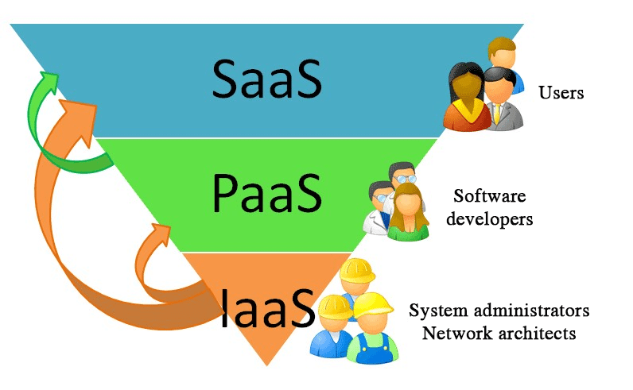
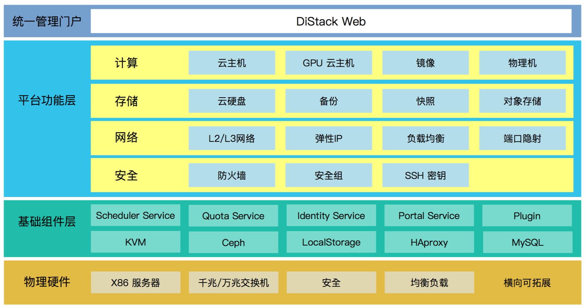
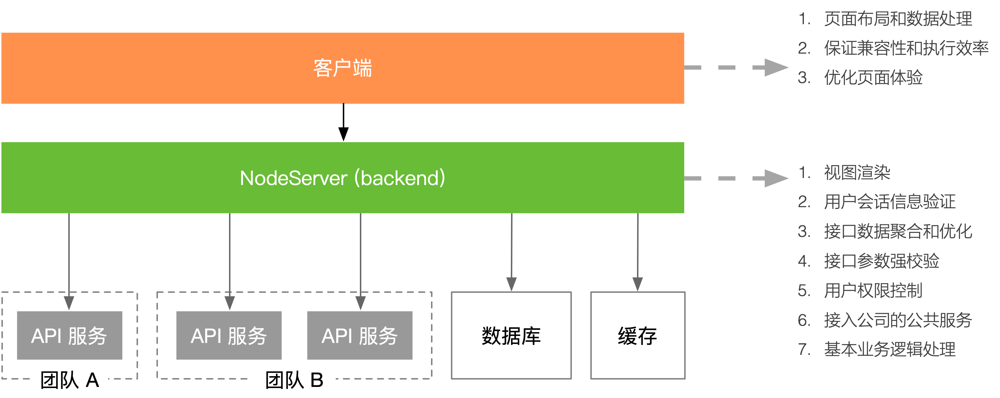
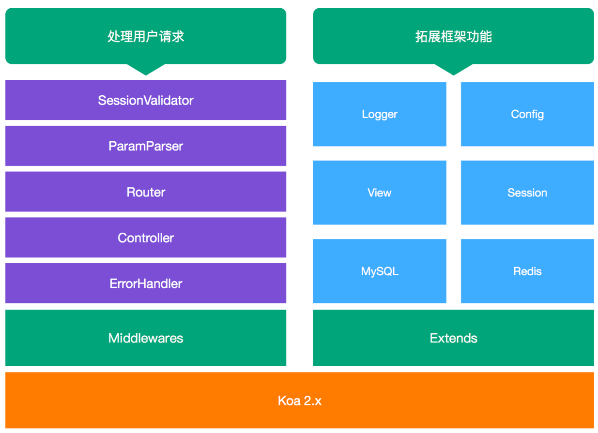
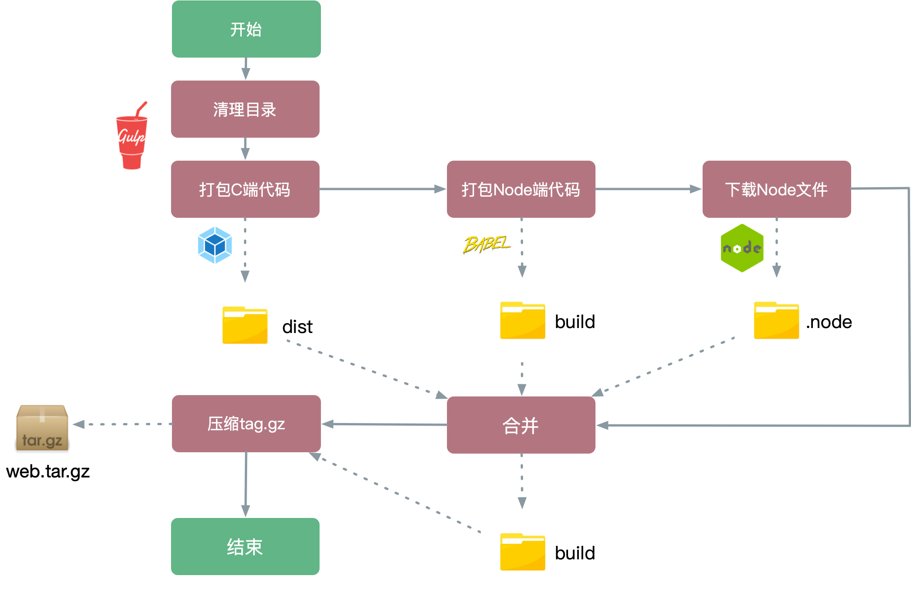
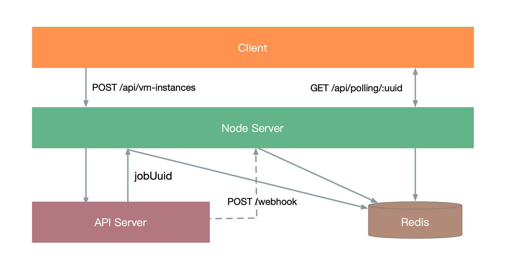

在大概18年上半年，有幸被抽调到一个FT，参与云平台私有云项目的开发中。这个项目是一个产品化的IaaS解决方案，为企业提供管理包括计算，网络，存储在内的数据中心资源的能力。

## 私有云和IaaS

私有云(Private Clouds)是为一个客户单独使用而构建的，因而提供对数据、安全性和服务质量的最有效控制。该公司拥有基础设施，并可以控制在此基础设施上部署应用程序的方式。可由公司自己的 IT 机构，也可由云提供商进行构建。云计算提供商可以安装、配置和运营基础设施，以支持一个公司企业数据中心内的专用云。有时候也会称之为“内部云”

核心点在于：利用虚拟化技术将源自物理硬件的资源组合到共享池中，使用时从共享池中按需获取所需资源。

在云计算服务中，有下面三类，自下往上依次是：

1. IaaS：基础设施即服务 (Infrastructure as a Service)把计算基础(服务器、网络技术、存储和数据中心空间)作为一项服务提供给客户。它也包括提供操作系统和虚拟化技术、来管理资源。消费者通过Internet可以从完善的计算机基础设施获得服务。 
2. PaaS：平台即服务(Platform as a Service）PaaS实际上是指将软件研发的平台作为一种服务，供应商提供超过基础设施的服务，一个作为软件开发和运行环境的整套解决方案，即以SaaS的模式提交给用户。因此，PaaS也是SaaS模式的一种应用。
3. SaaS：软件即服务 (Software as a Service)SaaS是一种交付模式，主要还是面向企业的服务，国外比较有名的比如CRM起家的Salesforce等等，国内比较有名的比如做企业通讯的钉钉和企业销售管理的纷享销客等等



## 三件小事

对于私有云项目，简而言之就是我们自己做产品，然后买给企业，帮助部署。交付形式是实施的同学大家背后的实体物理机器，然后将整个软件部署在机子上(通过U盘复制项目代码，进入企业机房，拷贝安装，然后部署。后续的运维和管理操作，则在配套的Web管控系统中完成。我主要负责了Web管控系统从0到1的所有工作，期间有几个比较有意思的点，可以和大家分享一下。




### 一、BFF架构的全栈开发

当时的需求中要求管控系统要维护用户登录状态之外，还需要对写入操作进行操作记录。FT中没有可分配的人力来提供这些后端能力，而我有使用Node做Web开发的经验，于是果断采用了Node作为中间层来满足这些需求。事实证明这个选择没有错。操作日志模块后续还增加了批量导出为excel的能力。



当时参考了一些社区解决方案和当前项目现状(主要是不能用公司内部代码)，决定采用Koa作为框架，利用Koa的生态来打造一个功能健全的Web服务。



### 二、构建和打包

因为私有化部署的关系，我们最终交付的软件包是通过U盘拷贝的形式来部署代码的，部署和运行的过程不能依赖外部网络。这意味着我需要我所有的运行时依赖都打包在一起，能到达到解压即可运行的程度。

在我最终产出的压缩包中有一个 `control.sh` 脚本，提供了 `start`，`stop` 之类的几个命令，后端同学只要能调用这个脚本，就能在项目部署阶段将管控系统给部署起来。

在具体构建过程中，前端通过 `Webpack` 已经全部构建好输出到指定目录了，浏览器端的代码很好解决。Node 中间层这边稍稍不一样，运行除了依赖 `node_modules` 中的包，还依赖 `Node`的可执行文件。、在构建阶段我把 `node_modules` 下载好，将 `node` 可执行文件也放入其中，随代码一起打包输出。最后交付的压缩包就包含了所有的运行依赖。

这个是构建过程。具体过程大概是：

1. 获取 `package.json` 里面设置的 `version 和指定的操作系统
2. 构建完成之后从镜像网站下载对应的node文件，放到临时目录。如果临时目录已经有存在的版本，跳过下载，已提高打包速度
3. 完成之后将 `node` 文件复制到 `node_modules` 中
4. 在 `control.sh` 启动脚本中指定node程序的目录



### 三、异步API的处理

这里面还有一个比较有意思的是后端接口异步API的请求。底层API基于分为同步API和异步API两种：

* 同步API

  所有使用GET方法的API都是同步API，调用方收到的HTTP Response中直接包含了API的结果。例如：

  ```bash
  GET zstack/v1/zones/f3fa7671894a40f6a73f5bfc7d90c126 { "inventory": { "uuid": "f3fa7671894a40f6a73f5bfc7d90c126", "name": "zone1", "description": "test", "state": "Enabled", "type": "zstack", "createDate": "Jan 6, 2017 3:51:16 AM", "lastOpDate": "Jan 6, 2017 3:51:16 AM" } }
  ```

* 异步API

  除了登录相关的API外，所有不使用GET方法的API都为异步API。用户调用一个异步API成功后会收到202返回码以及 Body中包含的一个轮询地址（location字段），用户需要周期性的GET该轮询地址以获得API的执行结果。例如:

  ```bash
  Status Code: 202 Body: { "location": "http://localhost:8080/v1/api-jobs/967a26b7431c49c0b1d50d709ef1aef3" }
  ```

为什么说有意思呢？那如果按照浏览器轮询Node层，Node层再去轮询后端，一来二去这个消耗就大了，接口请求慢不说，在一定程度上可以说增加了服务器的压力。那怎么办呢？首先每次创建一个异步任务，我就在redis这边保存一份job相关的数据，每次浏览器轮询的时候，通过jobUuid直接查redis，速度快。然后在Node层提供一个webhook接口，每次任务执行完成时，后端调用这个接口，将任务执行返回的结果同步更新到redis中。这样当异步任务完成之后，浏览器端的轮询也能很快地得到返回的结果。



## 其他

除了上面的“三件小事”之外，针对项目的优化也做了不少。开发测试和项目打包巨慢，浏览器端代码的体积巨大。针对这些问题，在构建流程上做了一些优化，总结下来无非就是：

1. 优化Webpack的编译速度。优化 Loader 配置，合理设置文件路径，增加 Cache 之类的
2. 打包拆分模块，按需加载。结合Vue的异步组件和 Webpack 的 Code Split 功能，实现路由组件的懒加载
3. 抽离公共组件，适当减低源码体积。
4. 优化压缩输出文件的体积。

## 结束

从18年5月开始到19年6月，差不多一年的时间一直全职在跟这个项目。上面提到的一些技术点，大方向是一开始就明确的，但是具体实现的细节是在整个项目过程中不断演进和优化的。合作过程中也认识了不少人，算是一个还不错的回忆吧