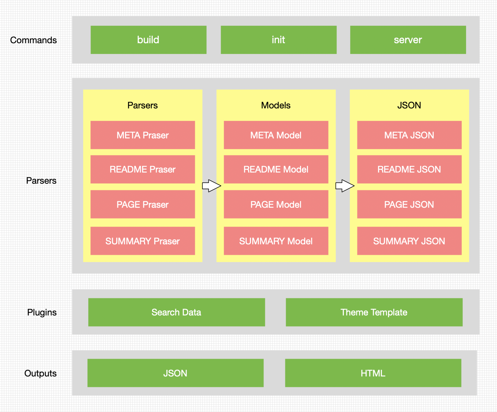

## 背景

所在团队承接了架构部所有的底层服务的用户系统的建设，包括面向业务方的自助服务系统和面向运维同学的后台系统。随着各系统的不断迭代，系统提供的自助化能力越来越强大。在滴滴，业务方在业务中通常是同时使用多个基础服务来支撑业务需求。比方说，使用MySQL服务存储数据，使用Redis服务缓存数据，使用ES服务做数据检索。但是这些服务的用户系统最初都是独立的域名，彼此之间没有联系，除了输入域名访问，没有其他入口。导致当时系统访问方式都是口口相传。

为了提升用户使用的体验，同时打造部门影响力，在统一了系统的UI风格之后，逐渐往平台化的方向走，成立了基础服务平台，将这些服务相关的信息收拢在一个平台，以统一的用户界面提供给业务方。

入口收敛了，服务和部门对外宣传和推广的口子也有了。运行了一段时间之后，其他部门提供基础通用能力的团队也将自家服务或者应用接入到了平台。

但是服务的一些文档还处于“信息孤岛”的状态。不同服务团队各自维护和管理自家文档的方式大不相同。即使是在架构部内部，由于历史原因，文档管理方式也是五花八门，更别提其他部门了。通过对一些团队的走访和调研，发现主要有一下几种管理文档的方式：

1. 使用内部的wiki系统维护
2. 通过开源工具自己部署维护

内部wiki系统有大量的文档数据，通过搜索往往不能找到自己想要的东西。虽然有空间搜索，但是前提是你要知道对应的入口链接。

使用开源工具自己维护文档单独部署，需要有同学专门维护。除了要解决入口的问题之外，还存在功能不完善的问题，比如：不支持搜索。

而我们想做的事情，说白了就是：在平台的基础上，为服务提供统一的文档管理和展示的窗口。降低维护成本，提升文档的可用性。（同时提升平台的用户粘性。狗头

## 文档格式化

说到程序员写文档，不由自主地想到markdown。Markdown 是一种轻量级的标记语言，常用与文章排版，通过markdown parser能markdown转换成我们想要的内容，甚至还能自定义解析器来实现自定义语法的转换。markdown的有很多好处：

1. 语法简单，专注写作内容
2. 支持自定义语法拓充
3. 轻松导出html，pdf 或者json等数据
4. 纯文本内容，可读，直观，学习成本低
5. Vistual Stdio Code 和 Gitlab等支持高亮和预览

## 静态站点生成

类似 Hexo, Hugo之类的静态站点生成工具种类非常多，除了 Hexo，Hugo这种主要用在静态博客场景的，还有类似 Gastby，Docusaurus 等定位是面向开源文档的书写。尤其是 Gastby，基于React，Node.js 和 GrapQL的功能强大的工具。静态站点生成有很多优点：

1. 可靠安全稳定
2. 版本可控制
3. 易于部署，提交即上线
4. 灵活，易于定制

回顾一下原始诉求

1. 降低维护成本。开发人员只要写文档就行，不用关心部署和展示之类的
2. 提升可用性。文档最多的就是搜索，使用全文搜索，提高搜索效率。建立反馈机制，帮助提升文档质量。

往简单了来看，我们的诉求似乎就是编写 Markdown 原文件然后转换成页面，这些工具可以帮助我们轻松实现。但是，轻量级的类似 Hexo，Hugo 定制性太差，重量级的 Gastby 虽功能强大，但是对我们的场景来说有点大材小用，引入了 GraphQL，整合到我们现有技术体系有点困难。

那怎么办呢？仔细想想，如果将 Markdown 原文件转换成页面这个过程拆分成 Markdown 原文件转换成数据，使用数据渲染出页面呢？这是不是就变成了一个简单的日常web开发？


对于文档维护者来说，一次文档部署的过程应该是如下图所示：


在目前的场景中，三个简单的步骤还不足以支撑完备的业务需求。

1. 平台包含的服务数量过百。如果所有内容放在一个仓库中，仓库体积会越来越大，每次构建的时间也会越来越长。
2. 需要支持搜索。如果直接编译成HTML，全文搜索只能使用前端方案，不利于后续拓展，同时文档数据的使用场景也将受限与前端场景。

于是乎，在上述的流程中补充一点细节。

## 流程设计

创建一个Git repo 组，每个服务都是单独的一个仓库。通过约定的持续集成流水线配置，可以实现每个仓库的单独构建和部署。 负责编辑的同学只需要关注自己的仓库即可。

构建过程中，将仓库中每一个文档都转换成JSON数据，存入MySQL中。再使用定时任务，采集bingLog 日志，导入到ElasticSearch中。使用MySQL中的数据用于页面的渲染，使用ElasticSearch的数据实现全局搜索。


## DocBuilder

借鉴GitBook的思路，开发了一个DocBuilder，下面是架构图：



除了最核心的扫描目录，解析 Markdown，生成JSON之外，针对 Markdown 做了一些语法上的拓展。比如输入
`@dchat张伦(zhanglun)`会解析成一个**内容为“张伦”，点击打开公司 IM 的 a 标签**；输入`:::info  :::`可以创建一个info类型的提示区域等等。未来还会支持PDF, PPT文件的预览。

## 提升开发体验

为了让编辑人员在写文档的时候能有写代码的感受。通过工程化的角度，对整个流程做了一下小小的优化。docbuilder除了核心的构建能力之外，还提供了快速初始化，语法检查和本地预览启动的功能。使用也很简单，安装之后通过几个命令就使用。

```bash
# 安装
npm i -g docbuilder

# 初始化文档项目。包含约定的目录结构和ci配置
docbuilder init

# 本地启动预览
docbuilder serve
```

当编辑完成之后，只需要将代码推送到远端master分支，触发持续集成之后，开始构建和打包。最后将数据导入数据库，实现自动更新。

## 增加内容反馈，帮助提升文档质量

为了让用户和文档中心形成一个较好的沟通体系，在每一篇文档中的最底部都增加了针对这篇文档的反馈入口，效果如图下所示：


在数据库的设计中，增加了一张feedback表，用于统计信息。用户每反馈一次便增加一条数据。同时在后台按照每个服务的维度做了数据统计，包括总数，每日新增，已回复，未处理等。服务团队可以按需派人针对收集到的问题对文档内容进行改进。


## 结束语

其实整个系统在设计和落地过程中远比上文描述的要复杂。更多的细节就不在文中细说。从技术难度的角度上来说，当我完成并落地之后，并不认为难度有多高。相反我认为实现需要一定的创造力和想象力，熟悉工具及其背后原理，才能将不同的环节串联在一起。在第一版上线之后，还化身“客服”的角色，推动服务方接入，这是从未有过的经历，虽然前期很痛苦，但是好在坚持下来，接入文档的服务方慢慢的增加。我自己也一直是以接入方的视角来思考如何推动更多服务的接入，比如提供了预览环境支持上线前的预览，提供接入指南，创建客服群增进沟通等等，后续还有跟多的想法希望在接下来的工作中能够逐步完善。
