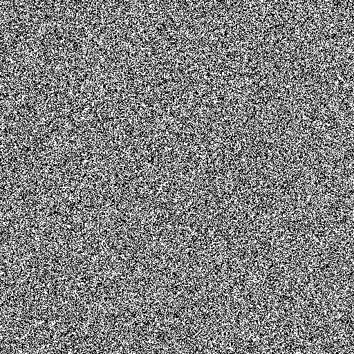
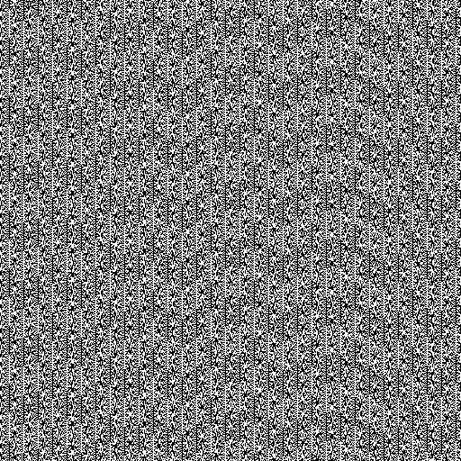

最近正在实现一个动画特效，有一个非常简单的需求

> 请求获取到一个数组A之后，将数组的内容以动画弹窗的方式展示给用户，要求：
> 1. 每次弹窗出现的时间间隔是随机
> 2. 弹窗的内容从数组A随机的一个元素

这里就涉及到随机数的创建了。

### 在JavaScript中生成随机数

在JavaScript中获取随机数的方式很简单，`Math.random()`返回一个范围[0, 1)的随机数。

```js
const value = Math.random();
```

利用这个可以快速实现指定区间内的随机数.

```js
// [0, max)区间的一个随机整数
function getRandomInt(max) {
  return Math.floor(Math.random() * max);
}

// [min, max)区间的一个随机数
function getRandomArbitrary(min, max) {
  return Math.random() * (max - min) + min;
}

// [min, max)区间的一个随机整数
function getRandomInt(min, max) {
  min = Math.ceil(min);
  max = Math.floor(max);
  return Math.floor(Math.random() * (max - min)) + min; //不含最大值，含最小值
}
// [min, max]区间的一个随机整数
function getRandomIntInclusive(min, max) {
  min = Math.ceil(min);
  max = Math.floor(max);
  return Math.floor(Math.random() * (max - min + 1)) + min; //含最大值，含最小值 
}
```

似乎`Math.random()`就只有这么多内容？如果只是使用，似乎足矣。但是对一个小细节我很在意：`Math.random()`返回的**伪随机数**。伪随机数？假的随机？难道随机数还分真假？好奇心驱使我继续挖掘

### 真假随机数？

在讨论真假之前，先明确**随机数**的定义。随机数在不同领域范畴有不同含义，在密码学领域中，一个数字是否是随机数，需要满足下面三个条件：

1. 统计学伪随机性。统计学伪随机性指的是在给定的随机比特流样本中，1的数量大致等于0的数量，同理，“10”“01”“00”“11”四者数量大致相等。类似的标准被称为统计学随机性。满足这类要求的数字在人类“一眼看上去”是随机的。
2. 密码学安全伪随机性。其定义为，给定随机样本的一部分和随机算法，不能有效的演算出随机样本的剩余部分。
3. 真随机性。其定义为随机样本不可重现。实际上只要给定边界条件，真随机数并不存在，可是如果产生一个真随机数样本的边界条件十分复杂且难以捕捉（比如当地的背景辐射波动值），可以认为用这个方法演算出来了真随机数。但实际上，这也只是非常接近真随机数的伪随机数，一般认为，无论是背景辐射、物理噪音、抛硬币等等都是可被观察了解的，任何基于经典力学产生的随机数，都只是伪随机数

相应的，随机数也分为三类：

1. 伪随机数：满足第一个条件的随机数。
2. 密码学安全的伪随机数：同时满足前两个条件的随机数。可以通过密码学安全伪随机数生成器计算得出。
3. 真随机数：同时满足三个条件的随机数。

也就是说前面提到的 `Math.random()`返回的伪随机数满足条件：统计学伪随机性，简单来说就是“看上去随机的”。那在计算机中这个所谓的“统计学伪随机”是怎么一回事呢？下面是来自wiki百科的解释

> 伪随机性（英语：Pseudorandomness）是一个过程似乎是随机的，但实际上并不是。例如伪随机数是使用一个确定性的算法计算出来的似乎是随机的数序，因此伪随机数实际上并不随机。

在计算机中，计算随机数的函数称之为随机函数。这些函数都是有周期性的。怎么理解这个周期性？简单来说就是生成的随机数有着周期性变化规律，一旦掌握了这个规律，便能推测下一次随机的返回的结果。下图1是真随机数的可视化效果，图2是伪随机数的可视化效果


图1



图2

周期性体现在图2的有规律的纹理中，关于这个周期性参数，也是一个很大的课题，不在本次研究的范围。所有的计算机算法均是确定性算法，所以随机函数生成的都是伪随机数。大部分编程语言库中预备了的随机函数生成的都是统计学伪随机数。试着用伪代码来实现一个rondaon

```js
let int next = 1;    // 种子

// 生成伪随机数
const rand = () => {
    next = next * 1103515245 + 12345;
    return (next / 65536) % 32768;
}

// 修改种
const srand = (seed) {
    next = seed;
}
```

### Web Crypto API

Math.random() 不能提供像密码一样安全的随机数字。不要使用它们来处理有关安全的事情。使用 `Web Crypto API` 来代替, 和更精确的 `window.crypto.getRandomValues() 方法。Crypto.getRandomValues() 方法可以获取符合密码学要求的安全的随机值。传入参数的数组被随机值填充。

```js
var array = new Uint32Array(10);
window.crypto.getRandomValues(array);

console.log("Your lucky numbers:");
for (var i = 0; i < array.length; i++) {
    console.log(array[i]);
}
```

### V8中的Random

先明确一点，在ECMAScript中定义的 [Math.random()](https://262.ecma-international.org/6.0/#sec-math.random)是规范，各自的实现取决于宿主环境。在V8和大多数的JavaScript引擎中，random都是使用一个伪随机数生成器（PRNG）实现的。在PRNG中，随机数都是从一个内部的状态导出的，也就是我们常说的“随机种子”，内部再通过确定的方法确定新的随机数。由于seed是确定的，创建的一系列随机数也是确定的，又因为seed的大小是固定的，使得最后创建的数字会出现重复。

有很多PRNG算法，比较有名的是Mersenne-Twister算法和LCG算法。他们各有优势和不足，感兴趣的朋友可以自行查阅，这里不做讨论（超纲了）。在15年的之前V8使用的是MWC1616算法来实现随机数，但是有一些([问题](https://v8.dev/blog/math-random))，在15年之后将算法替换成了[xorshift128+](http://vigna.di.unimi.it/ftp/papers/xorshiftplus.pdf)。


### 参考

1. [伪随机性](https://zh.wikipedia.org/wiki/%E4%BC%AA%E9%9A%8F%E6%9C%BA%E6%80%A7)
2. [Math.random()](https://developer.mozilla.org/zh-CN/docs/Web/JavaScript/Reference/Global_Objects/Math/random)
3. [There’s Math.random(), and then there’s Math.random()](https://v8.dev/blog/math-random)
4. [sec-math.random](https://262.ecma-international.org/6.0/#sec-math.random)