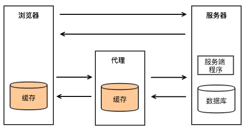
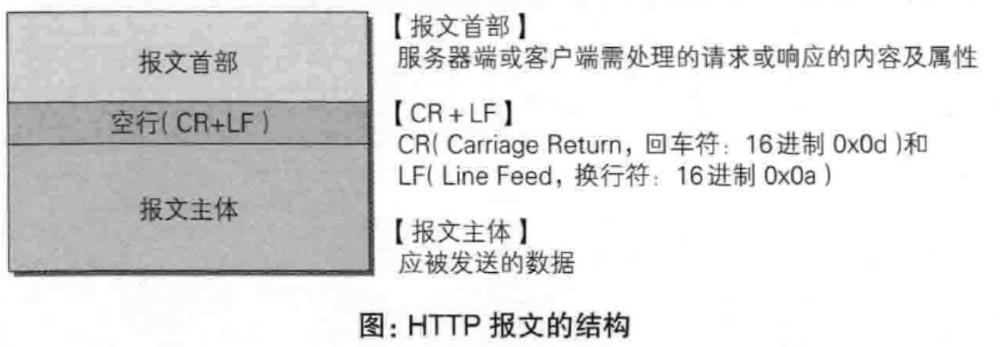
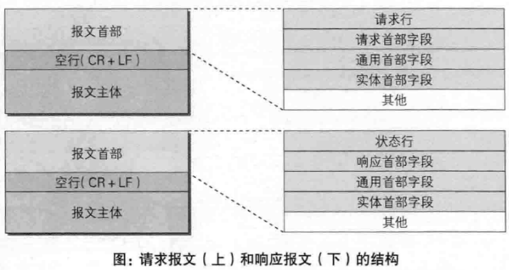
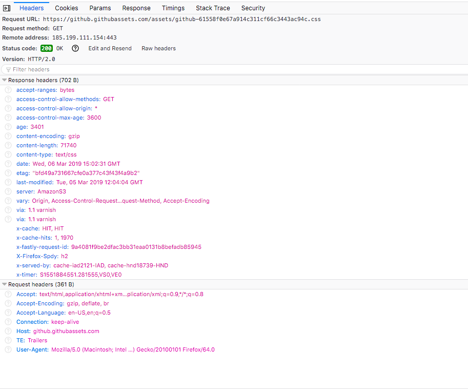
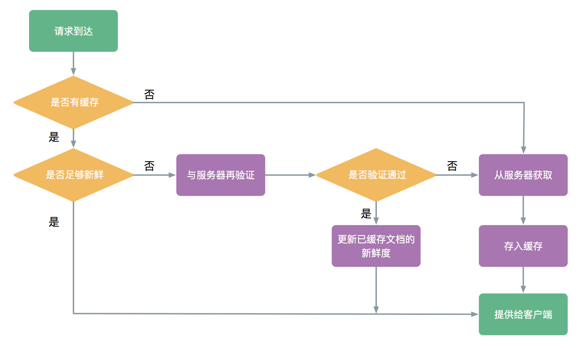
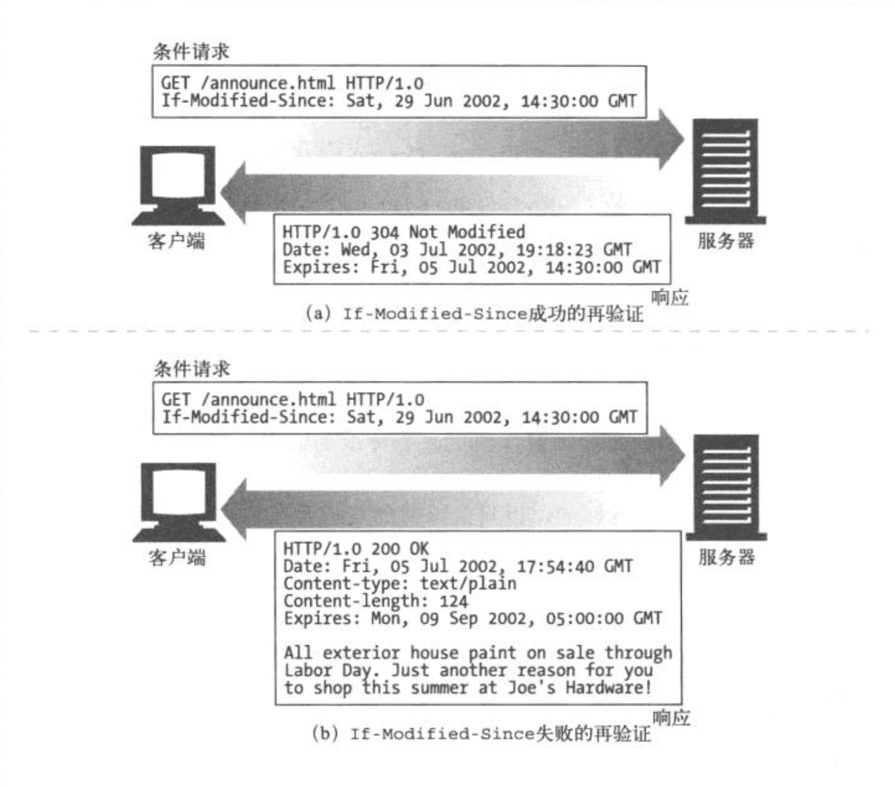
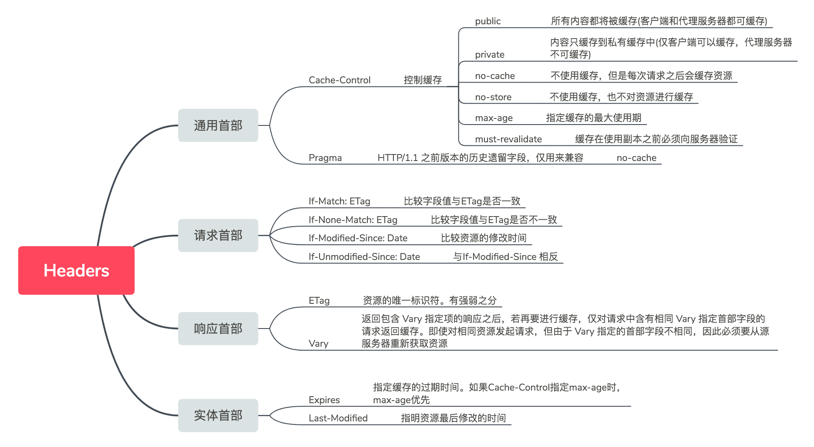

说到缓存大家可能觉得很简单。“不就是检查资源是否有缓存，如果有就加以利用”，“可以节约服务器资源呗”。如果再深入一点，有的cache-control, last-modified, etag 之类的名词，但如果真的考究一下这些字段的细节，恐怕大多数人也说不清楚。遂做了一番整理，希望对大家有所帮助

<!--more-->

## HTTP 缓存

HTTP 缓存是一种保存资源副本并在下次请求时直接使用该副本的技术。最为常见的是，浏览器在本地缓存 HTML 页面、图片等静态资源文件静态文件。

> A HTTP cache is an information technology for the temporary storage (caching) of web documents, such as HTML pages and images, to reduce server lag. A web cache system stores copies of documents passing through it; subsequent requests may be satisfied from the cache if certain conditions are met. A web cache system can refer either to an appliance, or to a computer program.
> 摘自 Wiki百科 [Web cache - Wikiwand](https://www.wikiwand.com/en/Web_cache)


合理利用缓存可以实现：

1. 减少冗余数据的传输，节约网络费用
2. 缓解了网络瓶颈的问题，节约带宽
3. 降低服务器压力，服务器可以更快的响应
4. 减少网络延迟，提升站点的访问速度



如图所示HTTP缓存存在于浏览器和Web代理中。当然在服务器内部，也存在着各种缓存，比如本地缓存GuavaCache/Ehcache，分布式缓存Memcached/Redis等，但这不是本文要讨论的HTTP缓存。

**为了方便描述，下文将用“缓存”代替“HTTP 缓存”**

## 缓存的分类

在我看来，无论按照什么场景或者维度来划分，HTTP缓存本质上就是两类：客户端缓存和服务端缓存。

为什么这么说呢？因为在两台计算机之间使用HTTP协议通信时，在一条通信线路上，必定一端是客户端，一端是服务端。

HTTP协议规定，请求从客户端发出，最后服务端响应。换言之，HTTP协议是能够明显区分哪一端是客户端，哪一段是服务端的。

像 [MDN文章：HTTP 缓存 - HTTP \| MDN](https://developer.mozilla.org/zh-CN/docs/Web/HTTP/Caching_FAQ#%E5%90%84%E7%A7%8D%E7%B1%BB%E5%9E%8B%E7%9A%84%E7%BC%93%E5%AD%98) 中提到的私有缓存和共享缓存是从网络的拓扑结构层面来解释。

至于网上大部分博文中提到的“强缓存”， “协商缓存”，我没有在任何文档中找到这两个关键词的定义，如果有知道的同学，欢迎留言。

由于前端开发人员多与浏览器打交道，所以日常工作中大多时候会用 “浏览器缓存”来代替“客户端缓存”，这一点无伤大雅。


## HTTP 的简单介绍

在具体解释HTTP首部字段对缓存的控制规则之前，简单介绍一些与 HTTP 协议有关的内容，作为后续内容的铺垫。

### HTTP 协议

> HTTP协议是 Hyper Text Transfer Protocol（超文本传输协议）的缩写,是用于从万维网（WWW:World Wide Web ）服务器传输超文本到客户端的传送协议。

### HTTP 报文

HTTP 报文是HTTP协议传输的数据单元，即一次请求或者一次响应时，发送给对方的数据块。HTPP报文包含了将要发送的完整的数据信息。



HTTP 报文分为**请求报文**和**响应报文**。


请求报文和响应报文中必定包含 HTTP 首部，为客户端和服务端分别处理请求和响应提供所需要的信息。首部字段类型按照实际用途分为四种：

1. 通用首部字段 (General Heaer Fields) - 请求报文和响应报文双方都会使用的首部
2. 请求首部字段 (Request Header Fields) - 发送请求报文时使用的首部
3. 响应首部字段 (Resposne Header Fields) - 返回响应报文时使用的首部
4. 实体首部字段 (Entity Header Fields) - 报文实体部分使用的首部



开发者工具中的 Network选项中，可以查看请求的具体信息



## 缓存的工作机制

对于一条GET请求的基本缓存处理过程包括七个步骤。

1. 发送 – 缓存从网络中读取即将的请求报文
2. 解析 – 缓存对报文进行解析，提取出URL和各种首部
3. 查询 – 缓存查看是否有本地副本可用，如果没有，就获取一份副本，并保存在本地
4. 新鲜度检测 – 缓存查看已缓存副本是否足够新鲜，如果不是，就询问服务器是否有任何更新
5. 创建响应 – 缓存会用新的首部和已缓存主体来构建一条响应报文
6. 返回 – 服务器通过网络将响应发回给客户端

这里的缓存可以是本地客户端缓存，也可以是代理缓存之类的缓存服务器。服务器可能是源服务器也可能是缓存服务器、客户端可以能是浏览器也可能是缓存服务器

### 新鲜度检测和服务器再验证

什么是新鲜度检测？要知道，不是所有的缓存副本都与服务器上的文档一致。毕竟，不同场景下，文档都有其变化的原则。比如说，一份报告可能每个月更新一次，在线报纸每天都有新的内容，而金融类的数据可能每过几秒钟就发生变化，如果缓存总是提供老的数据，反而变得毫无用处。

文档副本在被缓存的一段时间内，都认为文档是“新鲜的”，缓存可以在不联系服务器的情况下，直接提供文档的副本，在客户端的体现为:`from cache`。当缓存的保留的时间过长，超过了限值，就认为文档“过时了”。在使用这个文档之前，缓存需要与服务端确认，文档是否发生变化，而这就是服务端再验证。

HTTP 提供称之为`文档过期(document expiration)` 和 `服务器再验证(server revalidation)`的机制。可以在不要求服务器记住哪些文档拥有缓存的情况下，还能够了保证缓存与服务器之间的充分一致，

下图是一个GET请求的缓存流程图



接下来解释该图中几个关键点的具体工作机制。

#### 文档过期

通过通用首部 `Cache-Control` 和 `Expires`，HTTP 让服务器对每个文档附加一个“过期时间”，这些首部表示在多长的时间内可以将这些内容视为新鲜的。就像是给食物加上过期时间一样。


`Expires` 和 `Cache-Control: max-age` 所做的事情本质上都是过期日期。但前者使用的是绝对时间，定义的是过期的时间，超过这个时间，文档将被视为“过时了”。后者使用的是相对时间，定义的是缓存的使用时间，从第一次生成文档到文档不再新鲜，无法使用位置的最大合法生存时间，单位为秒。

比如你在2019年3月1日买了一瓶牛奶，`Expires` 告诉你在3月15日后过期，而`Cache-Control:max-age` 告诉你是1209600秒 (14 * 24 * 60 * 60) 后过期。

**`Expires` 是来自HTTP/1.0版本的首部，目前存在的意义主要是向下兼容。**

#### 服务器再验证

当缓存的新鲜度不再，意味着到了核对的时间了，缓存需要询问服务器原始文档是否发生了变化。这个过程只有两种结果：

1. 内容发生了变化，缓存将会获取一份新的文档副本，代替原来的副本，然后文档发给客户端
2. 内容没有发生变化，缓存获取新的首部，首部中包含新的过期时间，然后更新缓存中的首部

这种机制的好处在于：按需校验，在保证缓存自动更新的前提下还能够节约服务器资源。

HTTP提供了一些特殊的条件首部，当一个GET请求在请求首部中带上条件首部时，只有当条件为True时，服务器才会返回对象。

##### If-Modified-Since: [Date]

如果再指定日期后文档被修改了，条件判定为 True，请求成功后，新的文档将会被缓存，新首部会包含一个新的过期日期。反之响应报文的状态码 `304 Not Mofified`，不返回文档的主体。 

与响应首部中的`Last-Modified`配合使用。文档请求成功返回时，服务器将文档的的最后修改日期以`Last-Modified`加在响应报文中。当缓存进行验证时，将用这个值作为`If-Modified-Since`首部的字段值：

```
If-Modified-Since: <cached last-modified date>
```

如果此时文档内容被修改，修改日期就会有所不同，条件判定为True。




用 Node.js 来简单实现这个过程：

```js
const http = require("http");
const url = require("url");
const fs = require("fs");
const path = require("path");

const mimeList = {
  css: "text/css",
  gif: "image/gif",
  html: "text/html",
  ico: "image/x-icon",
  jpeg: "image/jpeg",
  jpg: "image/jpeg",
  js: "text/javascript",
  json: "application/json",
  pdf: "application/pdf",
  png: "image/png",
  svg: "image/svg+xml",
  swf: "application/x-shockwave-flash",
  tiff: "image/tiff",
  txt: "text/plain",
  wav: "audio/x-wav",
  wma: "audio/x-ms-wma",
  wmv: "video/x-ms-wmv",
  xml: "text/xml"
};

const Expires = {
  maxAge: 60 * 60 * 24 * 365
};

const server = http.createServer((req, res) => {
  const pathname = url.parse(req.url).pathname; //解析路径
  const resourcePath = path.join(__dirname , pathname);
  const suffix = path.extname(pathname).slice(1); //获取后缀
  const contentType = mimeList[suffix];

  if (fs.existsSync(resourcePath)) {
    //判断资源是否存在，存在则读取
    fs.stat(resourcePath, function(err, stat) {

      // stat.mtime 返回 文件最后修改的时间
      const lastModified = stat.mtime.toUTCString();
      const ifModifiedSince = "If-Modified-Since".toLowerCase();
      const expires = new Date();

      res.setHeader("Last-Modified", lastModified);
      res.setHeader("Content-Type", contentType);
      res.setHeader("Expires", expires.toUTCString());
      res.setHeader("Cache-Control", "max-age=" + Expires.maxAge);

      expires.setTime(expires.getTime() + Expires.maxAge * 1000);

      // 服务端的lastModified 与请求中携带的 “If-Modified-Since”的字段值对比
      if (req.headers[ifModifiedSince] && lastModified == req.headers[ifModifiedSince]) {
        //实现304逻辑
        res.writeHead(304, "Not Modified");

        // 注意：此处没有返回资源
        res.end();
      } else {
        const resource = fs.createReadStream(resourcePath);

        res.writeHead(200, "Ok");
        resource.pipe(res);
      }
    });
  } else {
    res.writeHead(404, { "Content-Type": contentType });
    res.write("No Found");
    res.end();
  }
});

server.listen(8080, function() {
  console.log("Server Listen: http://localhost:8080");
});
```

1. 在第一次请求时，因为本地没有缓存，node server 返回状态码 200和实体文件，响应首部增加 `Last-Modified`
2. command+R 刷新页面(此时浏览器会给请求加上一个Cache-Control: max-age=0)。在第二次请求时，请求报文增加 `If-Modified-Since`，值为第一次请求时返回的`Last-Modified`。因为文件的最后修改时间没有发生变化，server 返回 304。
3. 重新编辑资源文件，再次刷新访问，请求报文依旧增加 `If-Modified-Since`，值为第一次请求时返回的 `Last-Modified`。此时 server 判定缓存失效，返回状态码 200和资源内容

##### If-None-Match: [ETag]

有些情况下，仅使用最后修改时间来做验证是不够的：

* 有时候文档被重写，内容没有变化，但是修改时间变化
* 有时候文档修改的内容不重要，对使用也没有影响
* 有的服务器无法准确判断最后修改时间
* 有的场景下文档的数据需要精确亚秒级别，比如实时监控。而 Last-Modified 只能精确到秒

为了解决这个问题，引入了ETag(实体标签)作为版本标识符。ETag 是根据资源本身的特征经过计算得到的一个值，用来标识一个资源。并不像 Last-Modified 那样直接依赖修改时间而是依赖资源，所以要更加可靠和灵活。ETag在响应返回的时候附加在报文中，当文档发生了修改之后，可以修改对应的ETag来表名这是一个新的版本。缓存可以通过`If-None-Match`的校验结果来判断使用缓存还是重新获取文档。


ETag的生成规则没有严格规定包括，文档内容的hash值，对最后修改时间的hash值，甚至是约定的版本号。作为服务器再验证机制中的一环，有强弱之分

强校验的ETag匹配要求两个资源内容的每个字节需完全相同，包括所有其他实体字段（如Content-Language）不发生变化。一个强校验ETag校验符的表示形式："22FAA065-2664-4197-9C5E-C92EA03D0A16"。

弱校验的ETag匹配要求两个资源在语义上相等，不需要每个字节相同。一个弱校验ETag校验符的表现形式：w/"22FAA065-2664-4197-9C5E-C92EA03D0A16"。

同样用Node.js 来简单实现：

```js
const server = http.createServer((req, res) => {
  const pathname = url.parse(req.url).pathname; //解析路径
  const resourcePath = path.join(__dirname, pathname);
  const suffix = path.extname(pathname).slice(1); //获取后缀
  const contentType = mimeList[suffix];

  if (fs.existsSync(resourcePath)) {
    //判断资源是否存在，存在则读取
    fs.stat(resourcePath, function(err, stat) {
      const resource = fs.readFileSync(resourcePath);

      let hash = crypto.createHash("sha1");
      let tag = hash.update(resource).digest("base64");

      console.log(tag);

      res.setHeader('ETag', tag);

      if (req.headers["if-none-match"] === tag) {
        res.writeHead(304);
        res.end();

        return;
      }

      res.writeHead(200);
      res.end(resource);
      // res.writeHead(200, "Ok");
    });
  } else {
    res.writeHead(404, { "Content-Type": contentType });
    res.write("No Found");
    res.end();
  }
});

server.listen(8080, function() {
  console.log("Server Listen: http://localhost:8080");
});
```

1. 在第一次请求时，因为本地没有缓存，node server 返回状态码 200和实体文件，响应首部增加 `ETag`
2. command+R 刷新页面(此时浏览器会给请求加上一个Cache-Control: max-age=0)。在第二次请求时，请求报文增加 `If-None-Match`，值为第一次请求时返回的`ETag`。因为文件的内容没有发生变化，server 返回 304。
3. 重新编辑资源文件，再次刷新访问，请求报文依旧增加 `ETag`，值为第一次请求时返回的 `ETag`。此时server获取到的ETag值已经发生了变化，判定缓存失效，返回状态码 200和资源内容


##### If-Unmodified-Since: Date

类似于If-Modified-Since，意义相反。区别是当服务器资源条件不满足时，不是返回 304 Not Modified，而是返回 412 Precondition Failed。

##### If-Match: ETag

和If-None-Match 相反

说了这么多，再回到之前 GET 请求的缓存流程，结合刚才的解释，可以重新绘制一个流程图：


### 与缓存相关的首部

总结一下目前涉及到的一些与缓存相关的首部字段，方便大家理解和体会：



内容有些许枯燥，但还是希望能够帮助大家理解


**参考资料**

1. [HTTP 缓存 - HTTP \| MDN](https://developer.mozilla.org/zh-CN/docs/Web/HTTP/Caching_FAQ#%E5%90%84%E7%A7%8D%E7%B1%BB%E5%9E%8B%E7%9A%84%E7%BC%93%E5%AD%98)
2. [浏览器缓存机制 \| Fundebug博客](https://blog.fundebug.com/2019/01/08/browser-cache-mechanism/)
3. [Different Types of Caching and Their Differences - SwiftCache Lite](https://swiftcachelite.swiftserve.com/different-types-of-caching-and-their-differences/)
4. [http - How to control web page caching, across all browsers? - Stack Overflow](https://stackoverflow.com/questions/49547/how-to-control-web-page-caching-across-all-browsers)
5. [HTTP Caching  \|  Web Fundamentals  |  Google Developers](https://developers.google.com/web/fundamentals/performance/optimizing-content-efficiency/http-caching) 
6. [HTTP ETag - Wikiwand](https://www.wikiwand.com/en/HTTP_ETag)


