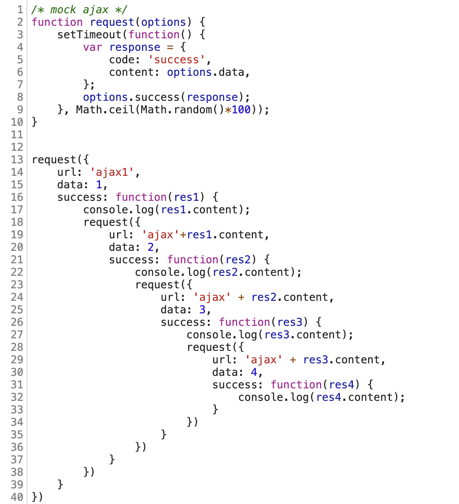

如标题所述，本文主要是重新梳理JavaScript的异步编程方案，部分内容来自网络

## 同步

在开始之前，先简单说说JavaScript中的同步。先来个两个简单的例子：

```js
const btn = document.querySelector('button');
btn.addEventListener('click', () => {
  alert('危!');

  let pElem = document.createElement('p');
  pElem.textContent = '哈哈哈';
  document.body.appendChild(pElem);
});
```

这段代码, 一行一行的顺序执行：

1. 先取得一个在DOM里面的 \<button\> 引用。
2. 点击按钮的时候，添加一个 click 事件监听器:
3. alert() 消息出现。
4. 一旦alert 结束，创建一个 \<p\> 元素。
5. 给它的文本内容赋值。
6. 最后，把这个段落放进网页。


再比如，模拟一个现实中网页可能遇到的情况：因为渲染UI而阻塞用户的互动，这个例子有2个按钮:

```js
function expensiveOperation() {
  for(let i = 0; i < 1000000; i++) {
    ctx.fillStyle = 'rgba(0,0,255, 0.2)';
    ctx.beginPath();
    ctx.arc(random(0, canvas.width), random(0, canvas.height), 10, degToRad(0), degToRad(360), false);
    ctx.fill()
  }
}

fillBtn.addEventListener('click', expensiveOperation);

alertBtn.addEventListener('click', () =>
  alert('You clicked me!')
);
```

1. 点击的时候用1百万个蓝色的圆填满整个\<canvas\> 
2. 点击显示 alert 消息

在浏览器中只有一个主线程(main thread)能够任务，也就是我们常说的`JavaScript是单线程的（single threaded）`。在一个线程中，任务只能one by one 执行，这也就是所谓的“同步阻塞”。

但是在实际场景中，只是同步无法满足日常需求，比如用户代理(User Agent)提供了一些API特性，特别是从外部的设备上获取资源，譬如，从网络获取文件，访问数据库，从网络摄像头获得视频流等等，这些都是耗时操作。同步则一定导致阻塞，在用户使用的角度上来说，感受不够友好。

接下来回顾一下JavaScript中异步解决方案

## 老派Callback

以DOM事件和XMLHttpRequest为代表

```js
btn.addEventListener('click', () => {
  alert('You clicked me!');

  let pElem = document.createElement('p');
  pElem.textContent = 'This is a newly-added paragraph.';
  document.body.appendChild(pElem);
});

```

```js
function loadAsset(url, type, callback) {
  let xhr = new XMLHttpRequest();
  xhr.open('GET', url);
  xhr.responseType = type;

  xhr.onload = function() {
    callback(xhr.response);
  };

  xhr.send();
}

function displayImage(blob) {
  let objectURL = URL.createObjectURL(blob);

  let image = document.createElement('img');
  image.src = objectURL;
  document.body.appendChild(image);
}

loadAsset('coffee.jpg', 'blob', displayImage);
```

上述两个例子中，都会将callback注册到EventLoop的任务队列中，这两类都属于宏任务。在 `main thread` 空闲时执行。

传统的callback处理方式容易陷入`回调地域`

。

## Promise

>A Promise is an object that is used as a placeholder for the eventual results of a deferred (and possibly asynchronous) computation

Promise 对象本质上表示的是一系列操作的中间状态，或者说是未来某时刻一个操作完成或失败后返回的结果。Promise并不保证操作在何时完成并返回结果，但是保证在当前操作成功后执行您对操作结果的处理代码，或在操作失败后，优雅地处理操作失败的情况。

早在 1980 年代，早期的 promise 和 future（类似/相关概念） 实现开始出现。单词 “promise” 的使用由 Barbara Liskov 和 Liuba Shrira 在 1988 年创造 [wiki：Future and promises](https://en.wikipedia.org/wiki/Futures_and_promises)。Liuba的[论文pdf版本](https://heather.miller.am/teaching/cs7680/pdfs/liskov1988.pdf)

CommonJS组织提出了 [Promises/A](http://wiki.commonjs.org/wiki/Promises/A) 制定异步模式编程规范，最早的时间可以追溯到2010年。比较出名的实现有： [Q](https://github.com/kriskowal/q)， [jQuery](https://api.jquery.com/category/deferred-object/) 。

我第一次在 JavaScript 中听说 promise 时，在2015年实习阶段使用Angular的时候。在此之前也稍微接触了jQuery的`Defferd对象`。典型的案例就是使用jQuery提供的ajax方法，举个例子：

```js
var jqxhr = $.ajax( "example.php" )
  .done(function() {
    alert( "success" );
  })
  .fail(function() {
    alert( "error" );
  })
  .always(function() {
    alert( "complete" );
  });
 
jqxhr.always(function() {
  alert( "second complete" );
});
```

由于在那段时间 jQuery 极其流行，它迅速成为了使用最广泛的 promise 实现。jQuery 正式使得 JavaScript promise 成为主流。一些更好的独立 promise 库如 Q、When、Bulebird 开始流行。jQuery 的一些不一致的实现驱使 Promise 标准做了一些重要的阐明，重写并更名为 [Promises/A+](https://promisesaplus.com/)。

历史在发展，时代在进步。经过一段时间各种Libary的锤炼，ES6
中也新增了[Promise](https://tc39.es/ecma262/#sec-promise-objects)。不过要注意一点。ES6中的Promise规范完全覆盖了的Promise/A+规范。Promise/A+规范设计成最小规范。ES6的Promise规范完全兼容A+，同时又包含诸如`catch`,`finially`等特性

关于Promise的使用本文不再赘述，网上已经有很丰富的资料内容了。

## Generator

类似的，`Generator`的概念也是计算机科学中普遍存在的概念之一

>In computer science, a generator is a routine that can be used to control the iteration behaviour of a loop.

其本质是一个可以控制一个循环迭代行为的子程序(routine)。可以理解就是函数。可以简单的认为它是一个返回数组的函数。在ES6中，也把它翻译成`生成器函数`。讨论Generator必然离不开`协程`。协程又称微线程，纤程，英文名 `Coroutine`。协程的作用，是在执行函数A时，可以随时中断，去执行函数B，然后中断继续执行函数A（可以自由切换）。但这一过程并不是函数调用（没有调用语句），这一整个过程看似像多线程，然而协程只有一个线程执行.

协程由于由程序主动控制切换，没有线程切换的开销，所以执行效率极高。对于IO密集型任务非常适用。我们也正是利用协程随时切换的特性来实现异步编程。

在真正使用Generator来实现异步编程时，你还得先搞清楚什么是`Iterator Protocal`，什么是`Iteratable Protocal`。同样本文也不再赘述。虽然从根本上来说`Generator`诞生之初并不是为了解决异步任务，但是不妨碍广大前端朋友的机智创新。举个简单例子：

```js
let fs = require('fs')
function read(file) {
  return new Promise(function(resolve, reject) {
    fs.readFile(file, 'utf8', function(err, data) {
      if (err) reject(err)
      resolve(data)
    })
  })
}
function* r() {
  let r1 = yield read('./1.txt')
  let r2 = yield read(r1)
  let r3 = yield read(r2)
  console.log(r1)
  console.log(r2)
  console.log(r3)
}
let it = r()
let { value, done } = it.next()
value.then(function(data) { // value是个promise
  console.log(data) //data=>2.txt
  let { value, done } = it.next(data)
  value.then(function(data) {
    console.log(data) //data=>3.txt
    let { value, done } = it.next(data)
    value.then(function(data) {
      console.log(data) //data=>结束
    })
  })
})

// 2.txt=>3.txt=>结束
```

可以看到手动迭代 Generator 函数很麻烦。

## Async/Await

简单的说async函数就相当于自执行的Generator函数，在await的部分等待返回，返回后自动执行下一步。而且相较于Promise，async的优越性就是把每次异步返回的结果从then中拿到最外层的方法中，不需要链式调用，只要用同步的写法就可以了。更加直观而且，更适合处理并发调用的问题。但是async必须以一个Promise对象开始 ，所以async通常是和Promise结合使用的。babel和typescript的`async/await`是用`yield/generator`实现的
如下所示同样的代码中
```js
async function a () {
	return 1
}
async function b () {
	await a()
}

b()
```

在[babel repl]中设置`presets`中勾选`es2016`和`es2017`时，编译后的结果中使用了 `Promise` 和 `Generaotr`。

```js
function asyncGeneratorStep(gen, resolve, reject, _next, _throw, key, arg) { 
  try { 
    var info = gen[key](arg); 
    var value = info.value; 
  } catch (error) { 
    reject(error); return; 
  } 
  
  if (info.done) {
    resolve(value); 
  } else { 
    Promise.resolve(value).then(_next, _throw);
  }
}

function _asyncToGenerator(fn) { 
  return function () { 
    var self = this, 
    args = arguments; 
    return new Promise(function (resolve, reject) { 
      var gen = fn.apply(self, args); 
      function _next(value) { 
        asyncGeneratorStep(gen, resolve, reject, _next, _throw, "next", value); 
      } 
      function _throw(err) {
        asyncGeneratorStep(gen, resolve, reject, _next, _throw, "throw", err); 
      } 
      
      _next(undefined);
    }); 
  }; 
}

function a() {
  return _a.apply(this, arguments);
}

function _a() {
  _a = _asyncToGenerator(function* () {
    return 1;
  });
  return _a.apply(this, arguments);
}

function b() {
  return _b.apply(this, arguments);
}

function _b() {
  _b = _asyncToGenerator(function* () {
    yield a();
  });
  return _b.apply(this, arguments);
}

b();
```

当输出的js版本修改为更低版本时，编译后的代码将会包含使用[regenerator](https://github.com/facebook/regenerator)提供的`regeneratorRuntime`来实现 generator 函数

在[Typescript Repl](https://www.typescriptlang.org/play?target=2#code/IYZwngdgxgBAZgV2gFwJYHsI2DAFAShgG8AoASACcBTZBCrARhIF8TRJZEUMsAjPQqTLAA7sFTJsBFiRK9pJIA)中将`Target`设置为`es2015`，可以看到编译结果中同样也以后`Promise`和`Generator`的身影

```js
"use strict";
var __awaiter = (this && this.__awaiter) || function (thisArg, _arguments, P, generator) {
    function adopt(value) { return value instanceof P ? value : new P(function (resolve) { resolve(value); }); }
    return new (P || (P = Promise))(function (resolve, reject) {
        function fulfilled(value) { try { step(generator.next(value)); } catch (e) { reject(e); } }
        function rejected(value) { try { step(generator["throw"](value)); } catch (e) { reject(e); } }
        function step(result) { result.done ? resolve(result.value) : adopt(result.value).then(fulfilled, rejected); }
        step((generator = generator.apply(thisArg, _arguments || [])).next());
    });
};
function a() {
    return __awaiter(this, void 0, void 0, function* () {
        return 1;
    });
}
function b() {
    return __awaiter(this, void 0, void 0, function* () {
        yield a();
    });
}
b();
```

将输出版本修改为`ES5`时，可以看到些许差别。Typesciprt编译的结果中包含generator的实现

```js
"use strict";
var __awaiter = (this && this.__awaiter) || function (thisArg, _arguments, P, generator) {
    function adopt(value) { return value instanceof P ? value : new P(function (resolve) { resolve(value); }); }
    return new (P || (P = Promise))(function (resolve, reject) {
        function fulfilled(value) { try { step(generator.next(value)); } catch (e) { reject(e); } }
        function rejected(value) { try { step(generator["throw"](value)); } catch (e) { reject(e); } }
        function step(result) { result.done ? resolve(result.value) : adopt(result.value).then(fulfilled, rejected); }
        step((generator = generator.apply(thisArg, _arguments || [])).next());
    });
};
var __generator = (this && this.__generator) || function (thisArg, body) {
    var _ = { label: 0, sent: function() { if (t[0] & 1) throw t[1]; return t[1]; }, trys: [], ops: [] }, f, y, t, g;
    return g = { next: verb(0), "throw": verb(1), "return": verb(2) }, typeof Symbol === "function" && (g[Symbol.iterator] = function() { return this; }), g;
    function verb(n) { return function (v) { return step([n, v]); }; }
    function step(op) {
        if (f) throw new TypeError("Generator is already executing.");
        while (_) try {
            if (f = 1, y && (t = op[0] & 2 ? y["return"] : op[0] ? y["throw"] || ((t = y["return"]) && t.call(y), 0) : y.next) && !(t = t.call(y, op[1])).done) return t;
            if (y = 0, t) op = [op[0] & 2, t.value];
            switch (op[0]) {
                case 0: case 1: t = op; break;
                case 4: _.label++; return { value: op[1], done: false };
                case 5: _.label++; y = op[1]; op = [0]; continue;
                case 7: op = _.ops.pop(); _.trys.pop(); continue;
                default:
                    if (!(t = _.trys, t = t.length > 0 && t[t.length - 1]) && (op[0] === 6 || op[0] === 2)) { _ = 0; continue; }
                    if (op[0] === 3 && (!t || (op[1] > t[0] && op[1] < t[3]))) { _.label = op[1]; break; }
                    if (op[0] === 6 && _.label < t[1]) { _.label = t[1]; t = op; break; }
                    if (t && _.label < t[2]) { _.label = t[2]; _.ops.push(op); break; }
                    if (t[2]) _.ops.pop();
                    _.trys.pop(); continue;
            }
            op = body.call(thisArg, _);
        } catch (e) { op = [6, e]; y = 0; } finally { f = t = 0; }
        if (op[0] & 5) throw op[1]; return { value: op[0] ? op[1] : void 0, done: true };
    }
};
function a() {
    return __awaiter(this, void 0, void 0, function () {
        return __generator(this, function (_a) {
            return [2 /*return*/, 1];
        });
    });
}
function b() {
    return __awaiter(this, void 0, void 0, function () {
        return __generator(this, function (_a) {
            switch (_a.label) {
                case 0: return [4 /*yield*/, a()];
                case 1:
                    _a.sent();
                    return [2 /*return*/];
            }
        });
    });
}
b();
```

所以现阶段可以这么认为：

```
Async/Await = Generaotr + Promise
```


