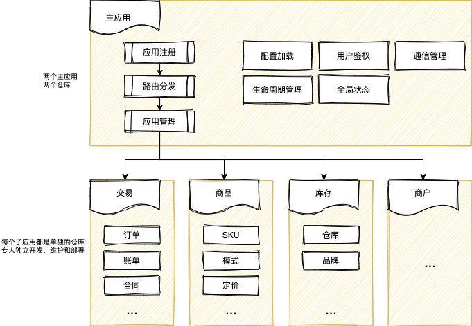
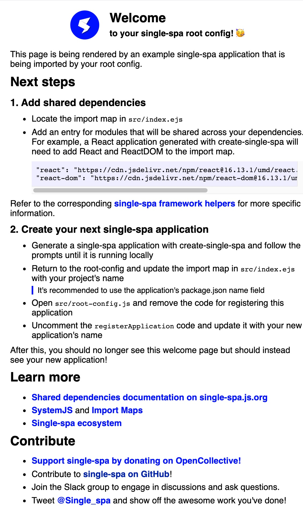

## 背景

随着组织架构调整，目前来车服租车团队已经有一段时间了。虽然主要业务工作还是B端系统的开发，但是租车业务因其业务特点以及一些历史原因，我面对的是两个“巨无霸”型后台系统-Car系统和Car-mis系统。这两个系统历史悠久，经手多个团队，所有租车相关的业务模块诸如交易，商品，履约，车险，商户，车辆库存和权限等，都集成在这两个系统中。


随着业务迭代，两个系统日渐臃肿，高达90+的模块数使得无论是本地开发还是上线，很多时间都浪费在编译打包阶段；随着应用框架和技术方案等升级和迁移，多框架多版本共存的问题无法避免；两个系统的基本业务逻辑一致，UI上存在一些差异，各自独立开发和维护，无法充分复用相同业务逻辑的代码。微前端可能是目前解决这类问题的最佳方案。

微前端将微服务的理念应用于浏览器端，将 Web 应用由单一的单体应用转变为多个小型前端应用聚合为一的应用。各个前端应用还可以独立运行、独立开发、独立部署。由此也能看出，微前端不是单纯的框架或者工具，是一套完整的体系。对于其价值，目前业界比较认可的观点有以下几个：

1. 无技术栈限制
2. 应用单独开发，解耦
3. 多应用整合，复用

而这三个特点，似乎能够解决当前租车B端系统的问题。结合现有工程的项目，我们对我们的需求进行分析，并确定了预期的收益

1. 拆分应用：按照业务拆分成不同的仓库进行维护，独立开发，独立维护
2. 加速体验：开发模块提速；上线部署提速
3. 侵入性低：改动尽可能小，允许渐进迁移
4. 学习成本低：保持现有开发模式，没有学习成本
5. 统一技术栈：约定统一使用React技术栈，渐进迁移到16.8以后的版本

针对微前端方案，社区已经有了总结和对比，我们决定采用“基座模式”来实现我们租车业务线的微前端方案。基座模式是由一个主应用和一系列业务子应用构成的系统，并由这个主应用来管理其他子应用，包括从子应用的生命周期管理到应用间的通信机制。作为系统的统一入口，负责将对应的请求指向对应的服务。子应用，则是负责各个子模块的业务实现。更多微前端相关的介绍可以去看看这些文章：

1. [What are Micro Frontends](https://micro-frontends.org/)
2. [Thinking in Microfrontend (微前端的那些事儿)](https://microfrontends.cn/)

按照预期，使用微前端方案之后，B端系统的架构也会发生响应的变化



基座模式的代表[single-spa](https://github.com/single-spa/single-spa), [qiankun](https://qiankun.umijs.org/zh/guide)亦是站在前者的肩膀之上诞生的国产的微前端实现库。处于“科研”的考虑，先从single-spa开始入手，了解其原理，学习其思想

## single-spa 的使用

single-spa的灵感来自现代组建框架的生命周期，抽象了整个应用程序的生命周期。现在是一个能够启用前端微服务架构的稳定库，这个架构就是我们说的微前端，microfrontend。一个single-spa的应用包含以下部分：

1. 一个 root config。渲染HTML页面和执行应用注册的JavaScript。每个应用注册时需要：
  - 应用名
  - 一个加载应用代码的函数
  - 一个确定应用何时处于活跃\非活跃状态的函数
2. 其他应用。 每个应用需要知道如何将自己从DOM中引导，挂载和卸载。和传统的单页应用的主要区别在于，这些程序能够共存吗，因为他们不包含彼此的HTML页面。就像你的React或者Vue应用一样。当活跃时，监听url的路由事件，将内容放进DOM。当不活跃时，不再监听变化，同时将内容从DOM中移除。

官方发布的脚手架[create-single-spa](https://single-spa.js.org/docs/create-single-spa/)能够帮助我们快速上手
### 创建一个root config

使用脚手架可以快速创建root config

```bash
npx create-single-spa --moduleType root-config
```

创建之后，进入目录`start`启动，访问页面可以看到：


### 创建子应用

接下来创建一个子应用，同样使用脚手架提供的命令

```js
npx create-single-spa --moduleType app-parcel
```

同样启动之后访问对应的页面，但是此时你会发现，无法通过url正常访问子应用。子应用默认是集成模式，`standalone-single-spa-webpack-plugin`是关闭的，在不修改配置之前，是无法以独立应用的方式来访问的。那如何开始开发调试呢？如果你不需要启动基座应用，可以通过官方提供的[playground](http://single-spa-playground.org/playground)访问。访问的格式是 `http://single-spa-playground.org/playground/instant-test?name=@[orgName]/[&url=[port]`。

另外一种方式是本地启动主应用，然后再将子应用注入。访问主应用页面的 console, 设置 localStorage，`localStorage.setItem('devtools', true)`。刷新之后右下角会出现一个小部件，展开之后找到子应用的模块名，填入子应用的地址，然后再刷新一次，如果没有找到对应的模块名，可以手动添加。

接下来将子应用注入到主应用，编辑`src/index.ejs`，在import Map中添加子应用的地址和其他需要共享的依赖。

```js
{
  "imports": {
    "@zhang/root-config": "//localhost:9000/zhang-root-config.js",
    "@zhang/app1": "//localhost:8500/zhang-app1.js",
    "react": "https://cdn.jsdelivr.net/npm/react@16.13.1/umd/react.production.min.js",
    "react-dom": "https://cdn.jsdelivr.net/npm/react-dom@16.13.1/umd/react-dom.production.min.js"
  }
}
```

编辑`root-config.js`，将子应用注册。

```js
// root-config.js
import { registerApplication, start } from "single-spa";

registerApplication({
  name: "@zhang/app1",
  app: () => System.import("@zhang/app1"),
  activeWhen: ["/"]
});

start({
  urlRerouteOnly: true,
});
```

接下来访问主应用时子应用也能够正常渲染。这种方式特别适合子应用依赖主应用上下文的情况。如果你的子应用非常独立，可以使用`npm run start:standalone`启用standalone模式。

按照官方的文档体验下来感受还是挺不错的，通过功能健全的脚手架，项目初始化的过程十分轻松。接下来再来聊聊 single-spa提出的一些其他概念，以帮助更好理解和使用这个框架。

## 三种类型

在 `single-spa` 的上下文中，有三种微前端（microfrontend):

1. single-spa applications: 为具体的路由渲染组建
2. single-spa parcels: 渲染不控制路由的组件
3. utility modules: 共享的代码逻辑，不渲染组件

一个Web应用可能会包含一个或者多个不同类型的微前端，三者具体的对比如下：

|| Application|	Parcel|	Utility|
|---|---|---|---|
|路由|多路由|无路由|无路由|
|API类型|	声明式 API	| 命令式 API|	导出一个公共接口|
|是否渲染UI|是|是|maybe|
|生命周期|single-spa管理|	自己管理|外部模块，不管理生命周期|
|何时使用|核心|需要支持多框架时|共享逻辑或者创建一个service|
## 应用的生命周期

要添加一个应用，首先需要注册该应用。一旦应用被注册后，必须在其入口文件(entry point)实现下面提到的各个生命周期函数。注册的应用会经过下载(loaded)、初始化(initialized)、被挂载(mounted)、卸载(unmounted)和unloaded（被移除）等过程。single-spa会通过“生命周期”为这些过程提供钩子函数。

生命周期函数是在各应用的主文件中注册， single-spa 查找对应的函数名并进行调用。

> 1. bootstrap, mount, and unmount的实现是必须的，unload则是可选的
> 2. 生命周期函数必须有返回值，可以是Promise或者async函数
> 3. 如果导出的是函数数组而不是单个函数，这些函数会被依次调用，对于promise函数，会等到resolve之后再调用下一个函数
> 4. 如果 single-spa 未启动，各个应用会被下载，但不会被初始化、挂载或卸载。


生命周期函数使用 `props` 传参，这个对象包含`single-spa`相关信息和其他的自定义属性。以`bootstrap`为例

```js
function bootstrap(props) {
  const {
    name,        // 注册到 single-spa 的应用名称
    singleSpa,   // 对singleSpa 实例的引用
    mountParcel, // 手动挂载的函数
    customProps  // 自定义属性
  } = props;     // Props 会传给每个生命周期函数
  return Promise.resolve();
}
```

`customProps`允许在使用时将自定义属性传递给各个周期，

```js
// root-config.js
singleSpa.registerApplication({
  name: 'app1',
  activeWhen,
  app,
  customProps: { authToken: "d83jD63UdZ6RS6f70D0" }
});
singleSpa.registerApplication({
  name: 'app1',
  activeWhen,
  app,
  customProps: (name, location) => {
    return { authToken: "d83jD63UdZ6RS6f70D0" };
  }
});
```
在注册的回调方法中可以获取到传入的自定义属性

```js
export function mount(props) {
  console.log(props.authToken); // 可以在 app1 中获取到authToken参数
  return reactLifecycles.mount(props);
}
```

## single-spa 生态系统

single-spa是一个与框架无关的微前端框架，整个体积压缩之后只有5kb左右，它所做的事情就是应用的注册和启动，以及提供生命周期。好在它的生态系统正在蓬勃发展，正在尽可能多地支持更多框架和构建工具，帮助开发者用自己喜欢的框架编写Web程序。这其实印证了前面所提到的： 微前端不是单纯的框架或者工具，是一套完整的体系。


下一篇文章将对single-spa和single-spa-react的源码进行一次分析，来看看其背后到底是怎么运作的


参考

1. [Thinking in Microfrontend (微前端的那些事儿)](https://github.com/phodal/microfrontends#%E8%B7%AF%E7%94%B1%E5%88%86%E5%8F%91%E5%BC%8F%E5%BE%AE%E5%89%8D%E7%AB%AF)
2. [getting-started-overview](https://single-spa.js.org/docs/getting-started-overview#documentation)


