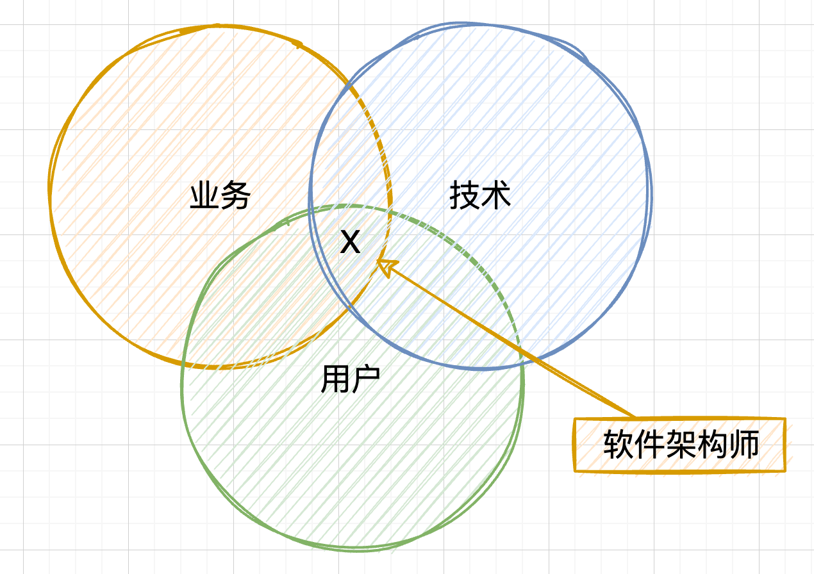

> 本系列内容来自《架构师修炼之道》。在自己的笔记中以半摘录的方式，用 blockquote 穿插自己的思考和感悟，以加深对内容的理解和消化。

全书整体分为三个部分

1. 第一部分介绍软件架构的基础知识和架构师必备的设计思维
2. 第二部分讲解架构师需要掌握的核心技能和知识
3. 第三部分讨论一系列使用的架构设计方法

前两部分适合从头到尾通读，第三部分用于参考和检索。

”软件架构导论“是第一部分的大标题，从标题可以看到，这一部分是介绍一些基本概念，架构原则和一些基础的设计知识等内容。作为深入架构设计的铺垫，这些内容必不可少。

## 1 成为软件架构师

### 1.1 软件架构师的职责

什么是软件架构师？除了编程之外，还多诸多其他职责。从工程角度看待问题，将系统拆解成为众多可实现的模块，同时兼顾大局，保证系统整体有效运作；权衡软件功能和软件质量，管控技术栈，尽可能减少技术债务；锻炼和提升整个团队的架构设计能力；等等

架构师在团队里面的角色很独特。不是项目经理，却需要把控软件交付周期。不是产品经理，却要保证软件满足业务目标。编程的同时，还需要做更多的架构设计。

### 1.1.1 从工程角度定义问题

软件的所有利益相关方都有着自己对项目的预期。所以架构师需要和产品经理、项目经理一起协作，共同定义项目的需求和目标。虽然大部分场景下都是产品经理定义功能特性，也就是我们说的”需求“，但是架构师需要关注另一种需求——质量属性。除此之外，还需要密切关注影响架构设计方向的约束和特性。

### 1.1.2 分解系统，分配职责

有的软件系统，挤成一团，臃肿笨重，一起发布迭代。如果将软件拆分成各种”零件“，大家各司其职，开发和交付的过程都会变得顺利很多。

架构师只有把软件系统进行分解，才能制定出一个满足质量属性和其他系统需求的策略。比如，你可以指定一个组件实现用户注册的功能，指定另外一个组件负责图像的识别；可以分配不同的团队开发不同的模块；可以将数据读写分离，使系统具备更高的可靠性，可用性，可伸缩性。

### 1.1.3 关注大局

软件系统所处的环境中包含用户，企业，开发团队三类角色。企业雇佣和管理开发团队，开发团队开发并设计软件系统，将其运行在选用的硬件中。用户使用软件，从中获取乐趣与利润。企业则从用户中获取利润与收益。整个环境中包含的角色，软件，硬件等㩐诸多因素。

从全局角度考虑整体系统意味着架构师需要处理的不仅仅是技术问题，人员，过程，业务需求等技术和非技术因素都将影响最后的软件系统。即使一个小小的决策也可能会产生深远的影响。所以架构师必须高瞻远瞩，纵观全局，不能只着眼于局部细节的设计。

软件设计是一个不断挣扎的过程，在想要达成的目标与必须接受的现实之间寻找平衡。必须深思熟虑并做出取舍。

### 1.1.4 在质量属性之间做取舍

举个例子，假设需求目标要求系统的并发必须高达N/qps，（假设N是一个很大的值），我们可以通过加机器的方式来提高负载。但是这样一来硬件成本也就增加了。这就是一个典型的取舍：用高成本来换取高可用

软件开发过程中，类似的取舍很常见。架构师需要找出备选方案，再与各方一起协商如何取舍最合理。系统的拆解和分割也不一定会有预期般的干净利落，过程中可能会犯错。开发过程中也会不断地往架构中引入技术债。

### 1.1.5 管理技术债务

所有的软件都有技术债务。软件架构师知道系统是如何分解的，关注大局，指导划分出的各个模块协调工作，还需要将业务目标和技术决策放在一起考虑。只有这样才能游刃有余地管理技术债务。

技术债务就像一条鸿沟，一边是当前的软件系统设计，另一边是你想要的，能够持续产生价值的设计。债务的多少可以通过填平这一鸿沟所需的代价衡量。

> 这一点深有体会。现在维护的系统中，充斥着过去多个团队的设计理念和技术选型，并一直影响着后续接受维护的开发人员。技术债务就像是泛滥的洪水，硬生生地阻挡在我和我目标架构中间。目前唯一的策略是， 治理泛滥洪水的同时修建一些健壮的桥梁，帮助早日抵达目标。而这些都是偿还技术债务的代价。
> 

有时候，开发团队会适当引入技术债务来帮助快速实现业务目标，后续再逐步偿还代价。架构师在这个过程中，需要明确技术债务，帮助开发团队决定何时采用，如何管理。

### 1.1.6 提升团队的架构技能

架构师是整个团队的导师和顾问。设计酷炫却无人理解的架构毫无意义。作为团队的架构专家，架构师有责任向团队分享知识，帮助他们成功地开发出软件

架构师应当适时地传授设计技巧和架构理念。可以和组员结对设计，写文档授业解惑，还可以提出建设性的批评。把架构设计当作是一项社交活动，让团队成员参与到设计过程中来，这是最有效提升团队架构技能的方法。

> 个人感觉在这里架构师的角色有一点leadership的意思，带领大家往前冲，达成目标。有leadership的加持，应该能够帮助成为更好的架构师吧？
> 

## 1.2 什么是软件架构

> 所谓的架构，是指构成一个系统的主要元素及它们之间的主要关联，这些元素和关联能够反映该系统的本质特征。从抽象的系统层面来看，软件架构、系统架构、解决方案架构和企业架构，本质上是一致的，区别在于关注的主体不同。
> 

软件架构是关于如何组织软件的一系列重大设计决策的集合，旨在实现期望的质量属性和其他软件特性。

设计决策的重要性体现在许多方面。可能对软件的质量属性、开发进度、成本产生影响。可能会影响到很多人，甚至影响到上下游的其他软件系统。

好的架构能提升需求方要求的质量属性，抑制或者消除潜在的隐患。帮助开发团队多快好省地输出成果，不用连续加班。

### 1.2.1 定义基本结构

软件有它的主体结构。这个结构定义了软件系统的组织和协调方式。体现在你编写的代码和运行的软件中，甚至体现在你与他人的协作中。

将两个元素以某种关系连接在一起。为了避免空想架构导致无法落地，可以使用三种类型的元素和关系来构建架构。在《Software Architecture in Practice》一书中将这三种类型定义为模块（module）、组件连接器（component & connector 简称 C&C）和分配（allocation）。将相同类型的元素和关系连接在一起，就形成了结构。

|  | 示例元素 | 示例关系 |
| --- | --- | --- |
| 模块 | 类、包、层、存储过程、模块、配置文件、数据库表 | 使用、允许使用、依赖 |
| 组件连接器 | 对象、连接、线程、进程、层、过滤器 | 调用、订阅、管道、发布、返回 |
| 分配 | 服务器、传感器、台式机、负载均衡器、团队、用户、Docker 容器 | 运行于、负责、开发、存储、支付 |

模块结构存在于设计阶段。编写代码的过程也是你与模块结构进行交互的过程。即使软件没有运行，模块结构依然存在于文件系统中。

组件连接器结构在软件运行时出现。在运行时，组件可以创建与其他组件的连接、产生新进程以及实例化新对象。系统不运行时C&C结构便不复存在。只能从其运行留下的日志文件或者数据库条目中窥见其身影。

分配结构展示了模块与C&C之间，以及这些元素与现实物理元素之间的协同与响应关系。分配结构又称映射结构，因为它显示了元素之间的映射关系。比如某一个元素时运行在客户端，还是运行在服务器上？A团队负责构建系统的哪个部分？分配结构恩卡依回答这些问题。

不同类型的结构适合用来思考不同的系统特性。比如模块接口可以考虑测试性和可维护性。C&C结构则考虑运行时的问题，比如可以性和性能。如果你发现自己使用了混合结构（如静态元素使用了动态关系），那说明你的理解还有不足之处。

## 1.3 称为团队的架构师

有的团队有明确的架构师角色，而有的没有。虽然有的团队没有这样的头衔，但是仔细观察你会发现，有人在不知不觉中承担了这份工作。

架构师可以是团队的领导者，也可以是那些以特定方式思考软件设计的人。架构师的名片上不一定印着”软件架构师“。每个团队都需要至少一名架构师，优秀的团队则不止一位。

如果团队没有架构师，那么我们的机会就来了。只要乐意，你可以随时将架构思维引入团队的设计讨论，询问关于质量属性的问题，指明团队如何取舍，主动设计决策并开始接受更多架构设计职责。

如果团队有架构师，可以主动帮忙，多多合作。开发软件系统是浩大的工程，关注细节的人越多，团队成功的可能性越大。

### 1.3.1 从程序员向架构师转变

在成为架构师之前，应该参与开发过3-5个系统，且承担的技术职责应该不断增加。随着架构职责增加，你会发现编程的时间越来越少。这是正常的，但是架构师不能完全放弃编程。

为了记录和评估你从程序员到架构师的转变过程，你可以建立一个档案吗，记录你在每个项目中担任的角色，简要描述系统情况以及开发过程中学到的知识。这种回顾对所有技术领导者，尤其是架构师来说是必不可少的。

针对档案中的每一个项目，回答一下问题：

- 项目的利益方是谁，主要业务目标是什么？
- 项目的整体解决方案是什么样的？
- 涉及到哪些技术？
- 最大的风险是什么？你是如何克服的？
- 如果有机会重新做一遍项目，你会如何改进？

无论你希望获得职位晋升，还是提高专业水平，都要有耐心。时刻做好准备，把握一切设计架构的机会。

> 确实如此。站在技术的角度来说，如果想要能够往上走一个层级（这个层级指的是内在的能力，评价标准是个人过往的经验核能力。不是国内各公司的职级体系），确实需要有耐心，时刻准备。
> 

架构师不仅是团队中的角色，更是一种思维方式。即使是程序员，每天也会做出很多设计决定，其中有一部分是具有架构意义的。所以无论是谁，都应该慎重决策。

## 1.4 开发出色的软件

> 书中提到架构可以从6个方面指引开发团队打造出色的软件，并在后续的章节中详细讲解了这几个方面。
> 

1. 架构将大问题分解为容易处理的小问题。
2. 软件就爱够告诉大家如何协同工作。
3. 软件架构为讨论负责设计提供了基本词汇
4. 软件架构关注的不仅仅是功能
5. 软件架构让你避免犯重大错误
6. 架构让软件更灵活

## 笔记结语

以上是《架构师修炼之道》一书的第一章节的内容，主要阐述了什么是架构师、什么是软件架构、以及软件架构对软件开发一些帮助。通过细品本章内容，我也意识到，其实我的工作已经是半个架构师了。书中提到的技术债务有亲身经历，好的架构可以为项目带来的帮助和提升这一点也是感同身受。

下一章将介绍如何借助设计思维来确定架构设计该怎么做