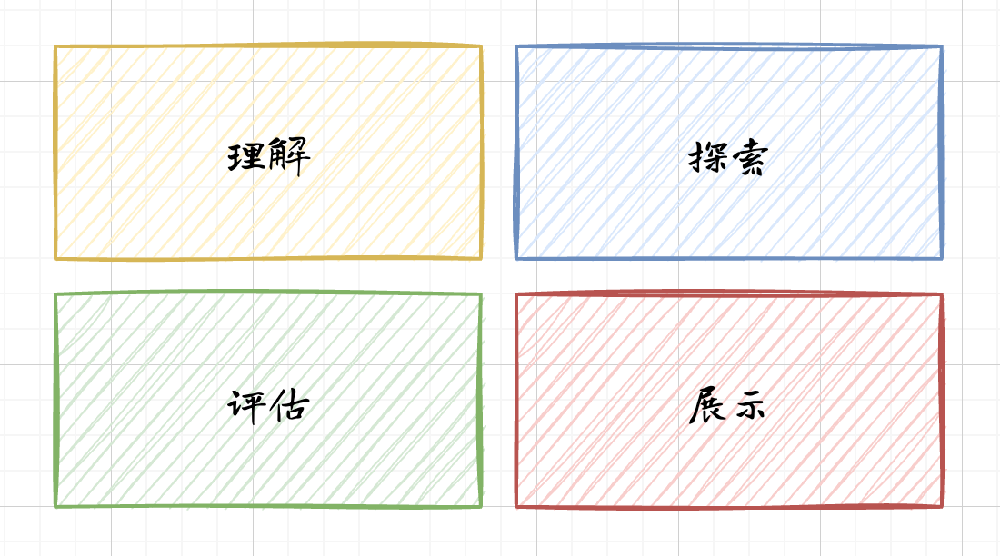

> 本系列内容来自《架构师修炼之道》。在自己的笔记中以半摘录的方式，用 blockquote 穿插自己的思考和感悟，以加深对内容的理解和消化。
> 

全书整体分为三个部分

1. 第一部分介绍软件架构的基础知识和架构师必备的设计思维
2. 第二部分讲解架构师需要掌握的核心技能和知识
3. 第三部分讨论一系列使用的架构设计方法

前两部分适合从头到尾通读，第三部分用于参考和检索。

第二章的标题是“设计思维基础”，整章的主要讲解如何在架构设计中运用设计思维。首先介绍设计思维的四条基本原则，然后学习使用思维模式确保架构设计朝正确的方向前进。最后教我们如何选择何时的思维模式。

## 2.1 设计思维的四条原则

设计思维是一种从他人的角度思考问题及其解决方案的一种方式。设计思维有基本的规则，在《Design Thinking: Understand Improve-Apply》一书提出了四条基本的设计原则。这些原则不仅适用于软件架构设计，也适用于程序设计，交互设计，以及所有设计工作。下面是这四条设计原则：

1. **以人为本（human）**：设计的本质是社交
2. **推迟决策（ambiguity）**：推迟不确定的决策
3. **善于借鉴（redesign）**：所有设计都是在已有设计基础上的重新设计和调整创新
4. **化虚为实（tangibility）**：让想法具体化、有形化，以便于沟通交流

我们使用“HART”来记忆这些原则。

### 2.1.1 以人为本 Design for Humans

设计本身是围绕人展开的工作。软件既为人所用，也依靠人开发。架构设计中的每一个决策都要以某种方式让人们受益。每个设计决策也都必须与他人分享并获得理解。

架构师必须要有同理心，能够理解利益相关方的要求。要关心的不仅是最终用户，还有最终用户要帮助的人，编写代码的程序员，测试人员，项目经理。设计软件系统需要与团队合作，请尊重他们，倾听他们的心声，理解他们的意图，这才是以人为本的设计方法

> 架构师要理解需求，理解背后的受益，站在利益相关方的角度来思考和设计。架构设计需要团队合作，架构师需要与团队成员多沟通、多倾听，换位思考。架构师处于多角色的中心，在团队中会承担起胶水的作用，将团队紧紧团结在一起。
> 

尊重所有直接和间接与架构有关的人，换位思考，理解他们的感受，你才能成为出色的架构师、沟通者、领导者。

### 2.1.2 推出决策

工程上的“模棱两可”是危险的，设计决策必须做到准确、清晰。在不到条件成熟的最后一刻，不要着急做出最终的决策。

软件架构的目标是安排系统结构，提升期望的质量属性。建议设计极简主义架构。极简主义架构只关心高优先级的质量属性，只考虑如何在提升这些质量属性的同时尽量降低风险。除此之外的其他设计决策都可以悬置，等时机成熟之后再做决定。

这要求我们尽可能推迟那种一旦决定就难以更改的设计决策。推迟决策可以让我们更加从容地应对软件开发大环境的变化。

### 2.1.3 善于借鉴

善于借鉴原则鼓励我们留心琢磨熟悉的事物——研究以往的设计、探索其中的规律。随着人们开发的软件越来越多，我们在软件设计方面沉淀的知识也越来越多。你所面临的问题，其他团队可能已经遇到过，甚至有可借鉴的解决方案。你完全可以在别人的基础上开始自己的设计。又或许有人已经搭建了框架，正好可以解决你的问题。

在设计软件架构之前，我们应该多花点时间研究已有的设计，而不是凭空创建一个新的出来。忽视千人的经验是最低效的架构设计方法之一。

> 借鉴本身是一种非常好的学习方式。前人的经验总结可以在一定程度上帮助解决我们的问题。就像文中说到的，甚至有现成的方案或者框架可以采用。

目前行业内对借鉴这事可以说是已经“炉火纯青”了。使用社区开源的方案，包装之后打上自己的标签和品牌，进行“二次开源”。对外获取影响力和声望，对内获取晋升的机会。但是在“二次开源”的过程中，大家往往都选择有意忽视自己借鉴、学习的方案，试图将自己的成果装饰成是开创性的、先进性的。这借鉴的开源项目及其作者、团队都是十分不公平的。
> 

### 2.1.4 化虚为实

代码不够直观，不适合用来讨论质量属性、组件、设计原理、决策结果之类的问题。讲解架构设计，只展示代码是行不通的，必须用其他方式把架构呈现出来。

呈现架构的方式有很多，可以画出来，可以制作原型或者简单的模型，可以演示部分系统的控制流程，甚至可以打比方。这些方式能从不同的角度展示软件的结构和质量属性，方便他人理解架构设计。

化虚为实与以人为本密切相关。人们只有通过感性的认识才能理解和消化架构。分享架构的唯一方式是把它具体地呈现出来。

## 2.2 运用思维模式

设计软件系统需要我们从不同的角度考虑架构。设计思维模式可以帮助我们在合适的时机关注合适的细节。

设计思维模式分为：理解、探索、展示、评估。每种思维模式都有配套的方法。设计架构时，我们先选择一种思维模式，再运用配套的方法发现架构，然后不断重复这个过程。

### 2.2.1 理解问题

理解问题要求我们主动从利益相关方获取信息，清晰地描述问题。理解对方的需求其实就是站在对方的角度考虑问题。为了理解问题，我们必须要了解所有与系统相关的人以及他们需要什么。

我们纪要关心研究利益相关方关心的业务目标和质量属性，也要掌握开发团队自身的工作风格，这样才能把我设计的轻重缓急，取舍利弊。

### 2.2.2 探索想法

探索指的是形成一系列设计概念，确定解决问题的工程方法。头脑风暴只是探索想法的一种手段。

探索软件架构意味着尝试各种结构的组合，直到找到最能提升目标质量属性的那种组合。为了找到最佳组合，需要研究大量的模式、技术、开发方法。这种思维模式不仅能在架构规划时发挥作用，在与利益相关方协作时也能派上用场。

### 2.2.3 展示想法

最常见的展示方式是制作模型，除了线框图，你还可以制作原型、编写文档、展示数据，等等。

这种思维模式是帮助团队摆脱“分析瘫痪”的绝佳方式。

### 2.2.4 评估适用性

我们怎么知道某一个设计决策是否真能解决问题呢？评估可以帮助我们发现设计决策是否合适。评估不是要么不做，要么全做。我们既可以评估全部架构，也可以评估部分架构，还可以只评估某个模型、概念、想法。最常用的评估方式是针对不同的场景审视某一块架构，还可以通过做实验，或者通过检查决策风险来展开评估。

评估在验证架构设计时非常有用。评估还可以用来检查任何工作成果，判断它们是否满足我们的需求。

思维模式需要与一种循环流程配合使用，以便我们能够从一种思维模式快速切换到另一种。

## 2.3 思考、动手、检查

软件开发每天都会接触到新东西，为了调整我们的思维模式，跟上不断变化的环境，我们需要一套循环流程。

这个方法分三步：思考、动手、检查。我们称之为 TDC 循环。每一次循环迭代都针对一种特定的思维模式展开。

### 2.3.1 迭代学习

一次循环可长可短，短则几分钟，长则好几天。每次迭代都遵循相同的步骤，但具体执行会采用思维模式的不同而变化。

**思考** 我们想要了解什么？我们需要回答哪些问题？最大的风险是什么？想想如何制定计划获取信息，从而解答疑问、降低风险。

**动手** 制作有形的、具体的东西，方便快捷地分享思路、检验想法。

**检查** 慎重检查执行上一步的成果，以便决定下一步行动。从检查中获得的洞察和理解将告诉我们下一步做什么。然后再回到第一步-思考。

### 2.3.2 组合运用思维模式

你可以把四种思维模式想象成四个工具箱，每个箱子里都装着适合特定类型设计工作的工具。挑选合适的思维模式，才能在深入理解问题的同时降低风险。

有经验的架构师往往没有意识到他们在从不同的角度考虑架构设计。多年的实践经验让他们可以凭借本能和直觉做判断。然而对于一般人来说，认识这四种思维模式可以更好地帮我们跳出思维定势。

### 2.3.3 实践： TDC循环与思维模式

用一个具体的例子展示TDC循环和思维模式在实际工作中的使用。假设客户刚刚告诉我们一个新的约束条件-增加了项目的风险-系统架构因此可能无法满足性能要求。

> 我将书中的内容整理成一个表格，方便理解
> 

| 运用的思维模式 | 思考 | 行动 | 检查 |
| --- | --- | --- | --- |
| 理解问题 | 找出相关的质量属性场景 | 用头脑风暴的方式收集场景，记录在案 | 团队和客户审查场景并提供反馈意见 |
| 探索想法 | 设计一个实验，验证设计决策能否提升特定的质量属性 | 编写简单的脚本，用于驱动系统已有部分以及收集数据。进行实验 | 收集到数据口，检查结果得出结论：新的约束会影响性能，但只有几百毫秒的延迟 |
| 展示想法 | 做一个简单的原型，便于沟通 | 制作用于演示程序工作流程的原型 | 演示原型给客户看，介绍为什么性能受到了影响。 |

原型让客户直观体会到此前不了解的问题。接下来，我们再采用理解模式提炼新的需求。借助探索模式检查双方对问题的理解。TDC就这样继续下去。

## 笔记结语

以上是《架构师修炼之道》一书的第二章节的内容，主要介绍了HART原则，介绍了四种思维模式，阐述了如何通过TDC循环组合使用思维模式来帮助架构师实现架构设计，并给出了一个简单的案例。这一部分属于架构设计相关的理论知识，后续的章节将从架构设计原理开始一步步展开实践，讲解如何使用这些原则和模式完成软件架构设计。