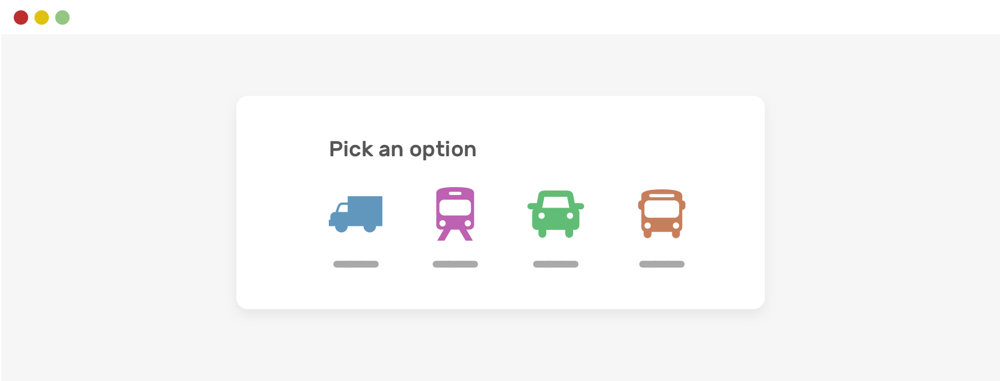

> 原文标题：Defensive CSS
> 原文链接：[https://ishadeed.com/article/defensive-css/](https://ishadeed.com/article/defensive-css/)

有时候，我们希望有一种方式来避免遇到某种CSS的问题或者行为。要知道，内容是动态的，网页上的内容会发生变化，从而增加了出现CSS问题或者一些奇怪行为的可能性。

防御性CSS是一个片段的集合，可以帮助你编写受保护的CSS。换句话说，你在未来会遇到更少的问题。

<!--more-->

如果你按照我的博客，你可能会读到我不久前写的一篇文章，它被称为“以防万一的心态”。这篇文章是在它的基础上写的，并将是一个持续的片段列表。如果你有任何建议，请随时让我知道。

## Flexbox Wrapping

CSS flexbox 是现在最有用的CSS布局特性之一。在一个选择器上添加 `display: flex`，让子项挨着排序，这很诱人。

问题是，当空间不足时，那些子项默认不会插入到一个新的行。我们需要使用 flex-wrap：wrap 来改变这个行为。下面是一个典型的例子。我们有一组需要挨着排序的选项。

```css
.options-list {
    display: flex;
}
```



当空间较少时，会出现水平滚动条。这应该是预料之中的，实际上并不是一个“问题”。


注意，子项依然是挨在一起的。要修复这个问题，我们需要允许flex换行。

```css
.options-list {
    display: flex;
    flex-wrap: wrap;
}
```


使用flexbox时，一般的经验法则是允许换行，除非你想要一个滚动条。这是另一回事，但尽量使用flex-wrap 来避免意外的布局行为（在我们的例子中，是水平滚动）。

## Spacing

开发者需要考虑不同内容的长度。这意味着，间距需要添加到组件中，即使它看起来不需要


在这个例子中，在右边有一个标题和一个操作按钮。现在看起来很好。但是，让我们来看看当标题更长时会发生什么。


注意到文字离操作按钮太近了吗？你可能正在考虑换行，但是我将在另外一节中讨论这个问题。现在，让我们把注意力放在间距上。

如果标题有间距和文本截断，我们就不会看到这个问题。

```css
**.section__title** {
    margin-right: 1rem;
}
```


# Long Content

在构建布局时，考虑到长内容是很重要的。正如你在前面所看到的，当章节的标题太长时，就会被截断了。这是可选的，但是对于一些UI来说，考虑到这一点很重要。

对我来说，这是一种防御性的CSS方法。在“问题”真正发生之前就去解决它，这很好。

这里是一个人名的列表，现在看起来很完美。


然而，因为这是用户产生的内容，我们需要注意在内容太长的情况下如何布局。请看下图：


在这样的布局中，一致性很重要。为了实现这个一致性，我们可以通过使用`text-overflow`和它的朋友，简单地截断名字。

```css
**.username** {
    white-space: nowrap;
    overflow: hidden;
    text-overflow: ellipsis;
}
```


如果你有兴趣磨练你在CSS中处理长内容的技巧，我写了[一篇关于这个主题的详细文章](https://ishadeed.com/article/css-short-long-content/)。

## 防止图片被拉伸或者被压缩

当我们在网页上无法控制图片的长宽比时，最好能提前考虑，当用户上传的图片没有与长宽比对齐时，提供一个解决方案。

在下面的例子中，我们有一个带有照片的卡片组件。它看起来不错。


当用户上传了一张不同尺寸的图片是，它会被拉伸。这不是好事。看看图片是如何被拉伸的。


最简单的修复方式是使用 CSS `object-fit` 。

```css
**.card__thumb** {
    object-fit: cover;
}
```


在项目层面上，我倾向于为所有图像添加对象匹配，以避免出现意外的图像结果。

```css
img {
    object-fit: cover;
}
```

在 Smashing Magazine 的[这篇文章](https://www.smashingmagazine.com/2021/10/object-fit-background-size-css/)中学习更多关于`object-fix`的内容。

## 锁定滚动链（Lock Scroll Chaining)

你是否曾经打开一个模态并开始滚动，然后当你到达终点并继续滚动时，模态下面的内容（主体元素）会滚动？这就是所谓的滚动链(Scroll Chaining)。

在过去的几年里，有几种hack方式可以做到这一点，但是现在，我们可以只使用CSS来做，这里要感谢`overscroll-behavior`这个CSS属性。

在下图中，你可以看到默认的滚动链行为。


为了提前避免这种情况，我们可以将其添加到任何需要滚动的组件中（例如：聊天组件、移动菜单...等）。这个属性的好处是，在有滚动之前，它不会产生影响。

```css
**.modal__content** {
    overscroll-behavior-y: contain;
    overflow-y: auto;
}
```


如果你想了解更多情况，我写了一篇[详细的文章]([https://ishadeed.com/article/prevent-scroll-chaining-overscroll-behavior/](https://ishadeed.com/article/prevent-scroll-chaining-overscroll-behavior/)

## CSS 变量降级

CSS 变量在网页设计中得到了越来越多的应用。我们可以使用一种方法，在CSS变量的值因某种原因为空的情况下，以一种不破坏体验的方式使用它们。

这在通过 Javascript 输入 CSS 变量的值时特别有用。下面是一个例子。

```css
**.message__bubble** {
    max-width: calc(100% - var(--actions-width));
}
```

 `--actions-width` 在 `calc()` 方法中被使用，并且它的值来自 JavaScript。假设因为某些原因，JavaScrippt失败了，会发生什么呢？`max-width` 将会被计算为 `none`

我们可以提前避免，在var()中添加一个回退的值。

```css
**.message__bubble** {
    max-width: calc(100% - var(--actions-width, 70px));
}
```

这样依赖，如果变量没有定义，就会使用降级（70px）值。这种方法可以在变量有可能失效的情况下使用。否则就不需要了。

## 使用固定宽度或者高度

破坏布局的常见情况之一是对一个有不同长度内容的元素使用固定宽度或者高度。

### 固定高度

我经常看到一个 `hero` 章节有一个固定的高度，而内容却大于这个高度，这导致了布局的破坏。不确定这看起来是什么样子的？在这里：

```css
**.hero** {
    height: 350px;
}
```


为了避免内容从`hero`中漏出，我们需要使用`min-height`来代替`height`。

```css
**.hero** {
    min-height: 350px;
}
```


这样依赖，如果内容变大了，布局也不会破坏。

### 固定宽度

你有没有见过一个按钮，它的标签离左右边缘太近？这是由于使用了固定宽度。

```css
**.button** {
    width: 100px;
}
```

如果按钮的标签比100px长，标签会离边缘很近。如果标签太长了，文字就会从里面溢出，这样不好。


要修复这个问题，我们可以简单地使用`min-width`代替`width`。

```css
**.button** {
    min-width: 100px;
}
```

# 忘记了 `Background-Repeat`

很多时候，当使用一张大的图片作为背景时，我们往往会忘记考虑设计在大屏幕上观看时的情况。那个背景会默认重复。

这在笔记本电脑的屏幕上大多不会看到，但在大屏幕上可以清楚地看到。


为了提前避免这种行为，请确保重置了 `background-repeat`

```css
**.hero** {
    background-image: url('..');
    background-repeat: no-repeat;
}
```

## 垂直方向的媒体查询

有时候，我们总是禁不住写一个组件，并且只通过调整浏览器的宽度进行测试。根据浏览器的高度进行测试可以发现一些有趣的问题。

这里有一个我见过很多次的问题。我们有一个带有主要和次要链接的aside组件。次要链接应该被定位在旁白部分的最底部。

考虑一下下面的例子。主导航和次导航看起来还不错。在我看到的这个例子中，开发者给二级导航添加了`position: sticky`，这样它就可以粘在底部了。


然而，如果浏览器的高度变小了，布局就会破碎。注意这两个导航是如何重叠的。


通过使用 CSS 垂直媒体查询，我们可以避免这样的问题。

```css
**@media** (min-height: 600px) {
    **.aside__secondary** {
        position: sticky;
        bottom: 0;
    }
}
```

这样一来，只有当视图高度大于或者等于600像素时，二级导航才会被粘在底部。好多了，对吧？

可能有更好的方法来实现这一行为（比如使用 margin-auto），但我在这个例子中专注于垂直查询。

## 使用 `Justify-Content: Space-Between`

在一个flex容器中，你可能会使用 `justify-content` 来使子项之间有一定的间隔。如果有一定数量的子项目，布局看起来会很好。然而，当它们增加或减少时，布局会看起来很奇怪。考虑下面的例子。


我们有一个flex容器，它有四个子项。子项之间的间距不是`gap`或者`margin`，这是因为容器使有`justify-content: space-between`

```css
**.wrapper** {
    display: flex;
    flex-wrap: wrap;
    justify-content: space-between;
}
```

当子项的数量小于4个时，将发生以下情况。


这样不好，有几种不同的解决方案：

- Margin
- Flexbox gap (谨慎使用)
- Padding (可以应用于每个子元素的父元素)
- 添加空的元素作为间隔

为了简单起见，我将使用`gap`

```css
**.wrapper** {
    display: flex;
    flex-wrap: wrap;
    gap: 1rem;
}
```


## 悬停在图片上的文字

当使用悬停在一个图片附近的文字时，必须考虑到图像无法加载的情况。文本会是什么样子？

这是一个例子：


文字看起来时可阅读的，但是，当图片加载失败的时候，它就会了。


我们可以通过给图片元素添加一个背景颜色来轻松解决。这个背景只有在图片加载失败的时候才会可见。这很酷，不是吗？

```css
**.card__img** {
    background-color: grey;
}
```


## 当心CSS网格中的固定值

假设我们有一个网格，它包含一个aside和main。CSS 看起来是这样：

```css
**.wrapper** {
    display: grid;
    grid-template-columns: 250px 1fr;
    gap: 1rem;
}
```

由于缺乏空间，这在小的视口尺寸上会出现问题。为了避免这样的问题，在使用上述CSS网格时，一定要使用媒体查询。

```css
**@media** (min-width: 600px) {
    **.wrapper** {
        display: grid;
        grid-template-columns: 250px 1fr;
        gap: 1rem;
    }
}
```

## 只有在需要的时候显示滚动条

幸运的是，只有在内容较长的情况下，我们才能控制是否显示滚动条。也就是说，我们强烈建议使用`auto`作为`overflow`的值。

请看下面的例子。


请注意，即使内容很短，也有一个滚动条可见。这对一个用户界面来说并不是好事。作为一个设计师，在不需要滚动条的情况下看到滚动条是很混乱的。

```css
**.element** {
    overflow-y: auto;
}
```

使用overflow-y: auto，滚动条只有在内容较长时才可见。否则，它就不会在那。下面是一个更新之后的图


## 滚动条的槽

另一个和滚动相关的事情就是滚动条的槽。以前面的例子为例，当内容变长时，增加一个滚动条会导致布局转移。发生布局移动的原因是为滚动条预留了一个空间。

考虑如下图：


请注意，由于显示了滚动条，当内容变长时，它是如何移位的。我们可以通过使用 `scrollbar-gutter`属性来避免这种行为

```css
**.element** {
    scrollbar-gutter: stable;
}
```


## CSS Flexbox中的最小内容尺寸

If a flex item has a text element or an image that is bigger than is longer than the item itself, the browser won’t shrink them. That is the default behavior for flexbox.

Consider the following example.

如果一个flex项中的文本元素或图像大于或长于该项目本身，浏览器就不会缩小它们。这就是Flexbox的默认行为。

```css
**.card** {
    display: flex;
}
```

When the title has a very long word, it won’t wrap into a new line.

当标题有一个很长的单词，它不会插入到新的一行。


即使我们使用 `overflow-break: break-word`,它不管用。

```css
**.card__title** {
    overflow-wrap: break-word;
}
```

要改变这个默认行为，我们需要设置flex项目的`min-width`为`0`。这是因为`min-width`的默认值是`auto`，所以出现了溢出

```css
**.card__title** {
    overflow-wrap: break-word;
    min-width: 0;
}
```

同样的方法也适用于列flex容器，但是我们使用`min-height： 0`来代替。


## CSS 网格中的最小内容尺寸

与flexbox类似，CSS grid对其子项目有一个默认的最小内容尺寸，即`auto`。这意味着，如果有一个元素比网格项大，它将溢出。


在上面的例子中，我们在主部分有一个 carousel。为了说明情况，这里是HTML和CSS。

```css
<div class="wrapper">
    <main>
        <section class="carousel"></section>
    </main>
    <aside></aside>
</div>
```

```css
**@media** (min-width: 1020px) {
    **.wrapper** {
        display: grid;
        grid-template-columns: 1fr 248px;
        grid-gap: 40px;
    }
}

**.carousel** {
    display: flex;
    overflow-x: auto;
}
```

由于carousel是一个灵活的容器，不会换行，它的宽度比主部分大，因此网格项也“尊重”它。结果，出现了水平滚动。

为了解决这个问题，我们有三种不同的解决方案。

- 使用 `minmax()`
- 为网格项设置 `min-width`
- 为网格项添加 `overflow: hidden`

作为一种防御性的CSS机制，我会选择第一种，即使用 `minmax()` 函数

```css
**@media** (min-width: 1020px) {
    **.wrapper** {
        display: grid;
        grid-template-columns: minmax(0, 1fr) 248px;
        grid-gap: 40px;
    }
}
```

[https://www.notion.so](https://www.notion.so)

## 自动填充 VS 自动适应

当使用 CSS 网格的 minmax() 方法是，决定使用`auto-fit`还是`auto-fill`的关键字很重要。一旦使用不当，会导致意想不到的结果。

当使用minmax()函数时，auto-fit关键字将扩展网格项目以填补可用空间。而auto-fill将保留可用的空间，而不改变网格项的宽度。


也就是说，使用`auto-fit`可能会导致网格项目太宽，特别是当它们小于预期时。考虑一下下面的例子。

```css
**.wrapper** {
    display: grid;
    grid-template-columns: repeat(auto-fit, minmax(250px, 1fr));
    grid-gap: 1rem;
}
```

如果只有一个网格项目，并且使用了`auto-fit`，该项目将展开以填充容器宽度。


在大部分时间，这样的行为是不需要的。所以在我看来，使用`auto-fill`是更好的。

```css
**.wrapper** {
    display: grid;
    grid-template-columns: repeat(auto-fill, minmax(250px, 1fr));
    grid-gap: 1rem;
}
```


## 图片最大宽度

作为一般规则，不要忘记给所有的图片设置最大宽度：100%。这可以添加到你使用的 CSS reset 中。

```css
img {
    max-width: 100%;
    object-fit: cover;
}
```

# Position: Sticky Css Grid

你有没有试过对网格容器的一个子项使用 `position: sticky`？网格项目的默认行为是拉伸 stretch 。结果是，下面的例子中的旁置元素等于主部分的高度。


为了让它能按照预期的那样工作，你需要重置 `align-self` property.

```css
aside {
    align-self: start;
    position: sticky;
    top: 1rem;
}
```


# 选择器分组

我们不建议将那些需要在不同浏览器上使用的选择器分组。例如，为一个输入的占位符设计样式，需要在每个浏览器上使用多个选择器。根据w3c的规定，如果我们把选择器分组，整个规则就会失效

```css
*/* Don't do this, please */*
input::-webkit-input-placeholder**,**input:-moz-placeholder {
    color: #222;
}
```

而是这样做：

```css
input::-webkit-input-placeholder {
    color: #222;
}

input:-moz-placeholder {
    color: #222;
}
```

# 这不是终点

这还不是结束，但我真的很喜欢记录所有这些技术。这是一个正在进行的防御性CSS技术的列表，我个人使用这些技术取决于我正在做的项目。如果你有什么建议，请通过Twitter @shadeed9联系我们