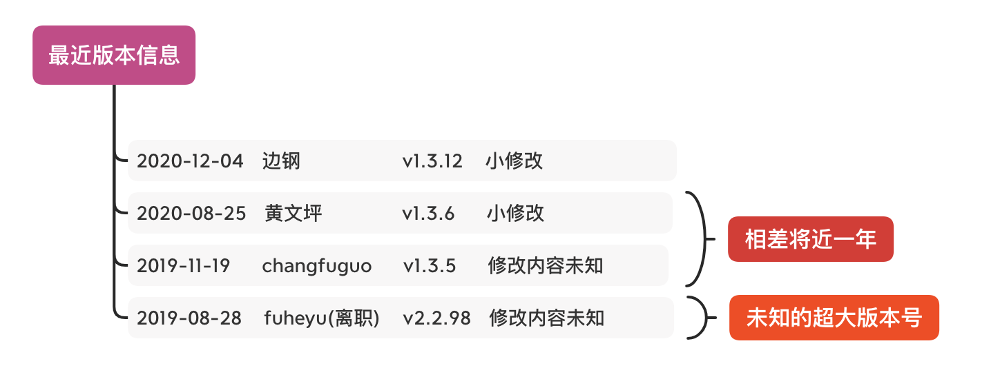

## 背景

作为业务组件库，zen在多个租车B端系统中被广泛使用。

zen在提高租车B端的研发效率的同时，保证B端系统的UI和交互的一致性。

但是当初的维护人员已离职或者转岗，没有专人(团队)维护

- 最新版本为v1.3.12，发布时间2020-12-04 11:15:24，发布人在职。小修补
- 最大版本号v2.2.98，发布时间2019-08-28 11:21:43，发布人已离职。找不到该版本的信息
- v1.3.5 发布时间 2019-11-19 11:13:56 ，v1.3.6发布时间 2020-08-25 19:38:05。间隔了将近一年。同样找不到v1.3.5的记录



## 当前现状


**组件使用情况**


所以，这件事情是有必要做的

## 改进计划


上图是第一次分析时得出的初步计划，在仔细研读zen现有的代码和设计的时候遇到了下面几个比较头疼的点

1. React版本16.3.0和Antd3.x，有很多API提示将要废弃。在此基础上改造收益不高
2. 工程化相关的配置比较老旧和冗余，改造成当前流行的最佳实践成本较大
3. 新增业务组件必须使用老版本的react和antd，开发人员积极性不高


所以决定

1. 原有版本继续维护，只做bugfix
2. 开启新项目zen-next(zen2.0)

***新老项目并存必然会带来一些问题***

1. 老项目新旧版本如何共存？
2. 新老版本依赖了不同版本的react和antD，是否会存在冲突或者冗余，如何解决？

首先明确一点，新老版本共存这个事实将会客观存在，并且将存在一段时间。子应用中可以使用新版本，老系统可以暂时不用care。随着子应用的逐个拆分，老系统最后将会边成一个架子。当不在有项目依赖老版本zen时，zen就可以退出历史舞台。

关于依赖的问题，对于组件库来说，第三方依赖不应该被包含在产出物中，尤其是React,antd之类的超级依赖，(一些小体积的辅助工具可忽略，比如按需引入的lodash函数)。所以zen-next的产出物会将不包含react antd。目前老系统和zen-pc-bc 都是将二者打包在产出物中，所以不会存在冲突。


## Zen-next

首先对zen-next的提出几个要求：

1. 详细的使用文档
2. 兼容的API设计
3. 标准的协作共建
4. 舒适的研发体验

接下来按照下面几个步骤来一步步开始和完善zen-next

1. 制定规范
2. 确定需要改造和迁移的组件
3. 确定API
4. 评审
5. 开始开发
6. 重复步骤2

## 项目规范

### 项目目录

```jsx
|-- docs 项目文档
|-- scripts 工程化相关脚本
|----| webpack webpack配置目录
|----| commander 项目命令集合
|-- src 组件库源码
|----| _style 公共样式目录
|----| _hepler 工具类函数
|----| components 组件目录
|----| components 组件目录
|------| Component1 
|--------| demo demo目录，一个文件为一个demo用例
|----------| start.mdx
|----------| ...
|--------| index.tsx 组件入口
|--------| index.css 组件样式
|--------| index.mdx 文档页面
|--------| ... (其他按需添加)
|-- lib 输出产出物目录
|-- site 组件库文档
```

### 组件规范

```bash
| Component1 
|--| demo demo目录，一个文件为一个demo用例
|----| start.mdx
|----| ...
|--| index.tsx 组件入口
|--| index.css 组件样式
|--| index.mdx 文档页面
|--| ... (其他按需添加)
```

具体细节可查询项目 `docs` 目录

### 代码规范

**ESLint 和 PrettierJS**

为了减少对某些约束的无意义的讨论，采用社区推荐的规范。项目使用 React 和 TypeScript开发，所以使用 **[@typescript/parser](https://www.npmjs.com/package/@typescript-eslint/parser)** 作为parser，配合 **[eslint-plugin-react](https://www.npmjs.com/package/@typescript-eslint/parser)** ，再加上少许定制。

而在代码格式方面则使用**PrettierJS**推荐的配置。

### 提交规范

毫无疑问，采用推荐的 **约定式提交。** 为提交信息增加人机可读含义的规范。

### 为什么使用约定式提交

- 自动化生成 CHANGELOG。
- 基于提交的类型，自动决定语义化的版本变更。
- 向其他人传达变化的性质。
- 触发构建和部署流程。
- 让人们探索一个更加结构化的提交历史，以便降低对你的项目做出贡献的难度。

具体细节可查询 [约定式提交](https://www.conventionalcommits.org/zh-hans/v1.0.0-beta.4/) 。

在约定式提交的基础上，使用 [standard-version](https://github.com/conventional-changelog/standard-version) 可以按照 `semver`标准来实现自动更新版本号和更新 `ChangeLog.md`。

## 工程化


完善的工程化设计，能够很好的帮助开发。