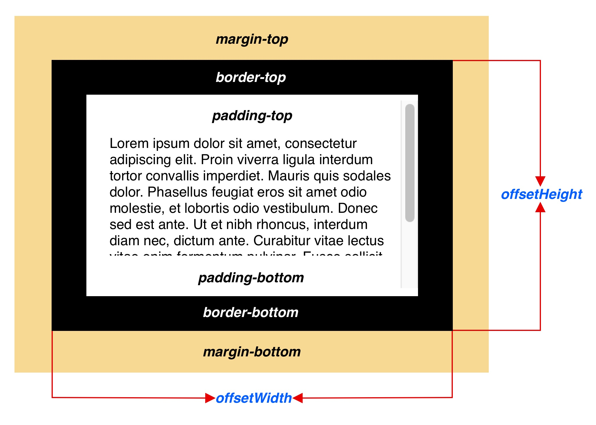

平时在写页面交互的时候经常使用兼容性不错的 getBoundindClientReact 方法，以快速获取元素大小和元素位置。最近无意中看到getBoundingClientRect方法会导致回流的说法，但是并没有提及为什么，很是好奇，遂研究了一番。

<!-- more -->

我按照以下顺序，一一介绍相关内容

1. 常见的几种获取元素大小和位置的方法
2. getBoundingClientRect()的用法
3. 什么是重绘和回流
4. 为什么说getBoundingClientRect()会触发回流
5. 使用IntersectionObserver监听元素位置

### 常见的几种获取元素大小和位置的方法

### 获取元素大小

在DOM中提供了多个与元素宽高相关的方法，想要确认元素的宽高时有几种属性可以选择。

#### offsetWidth和offsetHeight




### 获取元素位置

### getBoundingClientRect()的用法

该方法返回元素的大小和当前相对视窗(viewport)的位置

```typescript
const reactObject: DOMReact = $Element.getBoudingClientReact()
```


参考资料：
1. [what-forces-layout.md](https://gist.github.com/paulirish/5d52fb081b3570c81e3a)