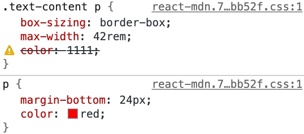
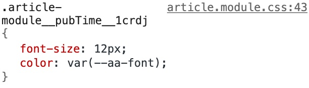
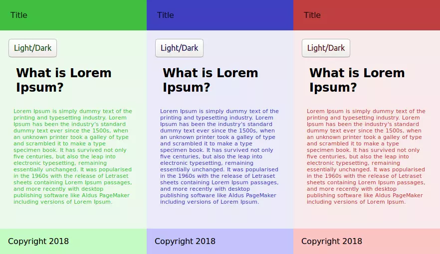
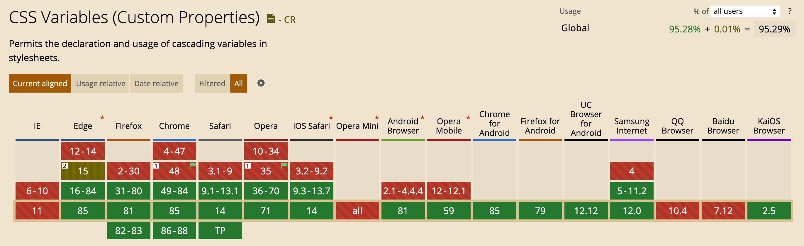

最近在写自己的小项目时，想试试 CSS variables，于是便有了此文。

之前也使用过 Sass，Less 之类的预处理器。因为 node-sass 的安装和编译频繁出现失败的问题，所以一直都是 Less 用的比较多。当我回想日常使用Less的经历时，却发现似乎除了变量，嵌套和函数这三个特性，其他功能基本上没有太多使用。这不由得让我陷入了思考：我在自己的项目中是否还需要使用预处理器？

在我的日常使用习惯中，变量主要是为了解决重复地显式书写变量名或者值，降低设计修改带来的维护成本。而嵌套和函数的使用则主要是为了服务 [BEM](http://getbem.com/introduction/) 规范的，自动编译出长长的 ClassName。

使用 `CSS Module` 的方案，可以实现类似BEM规范的精髓，使用 `CSS custom properties` 提供变量的能力。二者结合使用原生CSS就能满足我的需求，无需额外的工具。

`CSS Module` 也具备类似预处理器的声明变量的能力，但是它的语法在 `.css` 文件中是不支持的，在我看来算是一种侵入式拓展，至于预处理器提供的 loop、condition 等能力，我相信未来的 CSS 也会支持。


**CSS 变量(CSS variables)** 是 **CSS自定义属性的(CSS custom properties)**的别称，有时候也会称之为**级联变量(cascading variabels)**。使用规定的语法定义和获取变量的值

## 基本用法

使用`--`作为属性名的前缀，属性值可以是任何有效的CSS值。比如`--main-bg-color`，然后通过`var()`来获取对应的属性值。不过要注意的是，自定义属性名是大小写敏感的。

```css
element {
  --main-bg-color: brown;
  background-color: var(--main-bg-color);
}
```

同时要清楚的明白：自定义属性也只是属性，仅用于匹配当前选择器及其子孙，这和通常的CSS是一样的。所以我觉得叫做`CSS变量`还是没有`CSS自定义属性`更加贴切。

## 作用域

JavaScript 中变量是有作用域的，要么是全局作用域，要么就是局部作用域。CSS 变量亦是如此。

在CSS变量中，`:root` 选择器允许你定位到 DOM 中的最顶级元素或文档树。这种方式声明的变量就属于具有全局作用域的变量。

```css
:root {
  --main-color: red;
}

.a {
  color: var(--main-color);
}
```

可以在选择器中，声明相同的自定义属性

```css
:root {
  --main-color: red;
}

.a {
  --main-color: green;
  color: var(--main-color);  //最后是 color: green;
}
```

## 继承

同普通的 CSS 属性一样，自定义属性也会被继承，如果在一个给定的元素上，没有为这个自定义属性设置值，在其父元素上的值会被使用。看一下下面的例子

```css
div {
  --color: red;
}

div.test {
  color: var(--color)
}

div.ew {
  color: var(--color)
}
```

`.test`和`.ew` 都会继承来自`div`的`--color`。甚至可以在HTML的style标签来设置。

```html
<!--HTML-->
<html style="--color: red">
```

```css
body {
  color: var(--color)；
}
```

## 有效值

在普通的 CSS 属性中，如果属性值是非法值，将会被忽略，如果有继承值，则使用继承值。



当自定义属性值被解析，浏览器不知道它们什么时候会被使用，所以必须认为这些值都是有效的。但是无效的var()会使用继承值或者初始值代替。在Chrome的调试工具中可以看到，即使是无效的var(), 也不会出现被划去的横线



来看一下下面这个例子

```css
:root { --text-color: 16px; } 
p { color: blue; } 
p { color: var(--text-color); }
```

浏览器将 `--text-color` 的值替换给了 `var(--text-color)`，但是 `16px` 并不是 `color` 的合法属性值。代换之后，该属性不会产生任何作用。浏览器会执行如下两个步骤：

1. 检查属性 `color` 是否为继承属性。是，但是 <p> 没有任何父元素定义了 color 属性。转到2。
2. 将该值设置为它的默认初始值，浏览器中 `color`的默认值是 `black`。

> 从这里也可以看出来区别于预处理器的编译，`CSS custom properties` 属于运行时。

## 通过 JavaScript 操作自定义属性

在这里你会发现，通过JavaScript操作自定义属性和操作CSS样式根本就是一回事。这样再次表名，这的确就是“自定义CSS属性”。

```js
// 获取一个 Dom 节点上的 CSS 变量
element.style.getPropertyValue("--my-var");

// 获取任意 Dom 节点上的 CSS 变量
getComputedStyle(element).getPropertyValue("--my-var");

// 修改一个 Dom 节点上的 CSS 变量
element.style.setProperty("--my-var", jsVar + 4);
```

## 实现主题色

通过简单的代码实例来阐述说明主题色实现的方式。demo来自[Advanced CSS Theming with Custom Properties and JavaScript](https://www.sitepoint.com/css-theming-custom-properties-javascript/)。

首先在全局下定义自定义属性

```css
:root {
  --main-hue: 350;
}
```

然后定义页面样式

```css
nav{
  background: hsl(var(--main-hue) , 50%, 50%);
  padding: 1.3rem;
  color: hsl(var(--main-hue), 50%, 10%);
}
```

如果要指定除红色以外的其他颜色，则只需将相应的值指定给 --main-hue 即可。

```css
:root{
  --red-hue: 360;
  --blue-hue: 240;
  --green-hue: 120;
  --main-hue : var(--red-hue);
}
```

为红色，蓝色和绿色定义了三个自定义属性，然后将 `--red-hue` 变量分配给 `--main-hue`。



只需要通过一小段代码就可以动态修改主题色

```js
document.documentElement.style.setProperty('--main-hue', 240);
```

## 实现暗黑模式

通过这种方式，可以很方便实现现在很流行的暗黑模式。利用作用域特性，定义全局变量和局部变量，默认是浅色模式

```css
:root {
  --links: #ee9ca7;
  --text: #333;
  --background-color: #fff;
}

.darkmode {
  --text: #fff;
  --links: #66e387;
  --background-color: #333;
}

body {
  font-size: 1.2rem;
  background: var(--background-color);
  color: var(--text);
}

a {
  color: var(--links-dark);
}
```

通过 JavaSctipt 来控制 ClassName，下面是伪代码，假设有一个触发操作的按钮

```ts
const button: HTMLButtonElement = document.querySelector(".color-switch");
button.addEventListener("click", function() {
  const body: HTMLBodyElement = document.querySelector("body");
  
  body.classList.toggle("darkmode");
  if (button) {
    button.innerText = body.classList.contains("lightmode") ? "Dark" : "Light";
  }
});
```

## 兼容性

浏览器支持性非常好，基本所有的现代浏览器都支持良好（本文写作时已超过 95.29%）



## 总结

下面开始技术总结

1. `CSS custom properties` 允许开发人员自定义CSS属性及对应的属性值
2. 自定义属性有作用域之分，`：root`可以定义全局范围的自定义属性，在选择器内部的自定义属性只能子元素下作用
3. 自定义属性也遵循CSS属性的继承和级联规则
4. 如果自定义属性的值无效，将会使用继承值或者默认值
5. 可以用JavaSctript操作自定义属性，就像操作CSS原生属性一样

