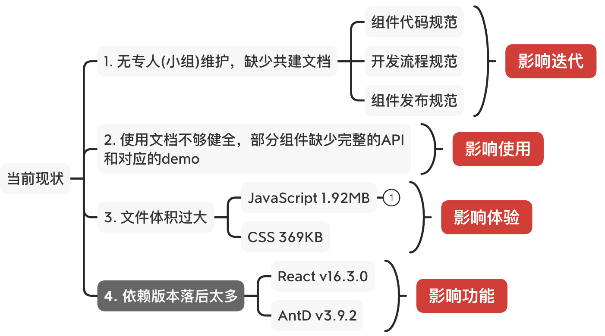
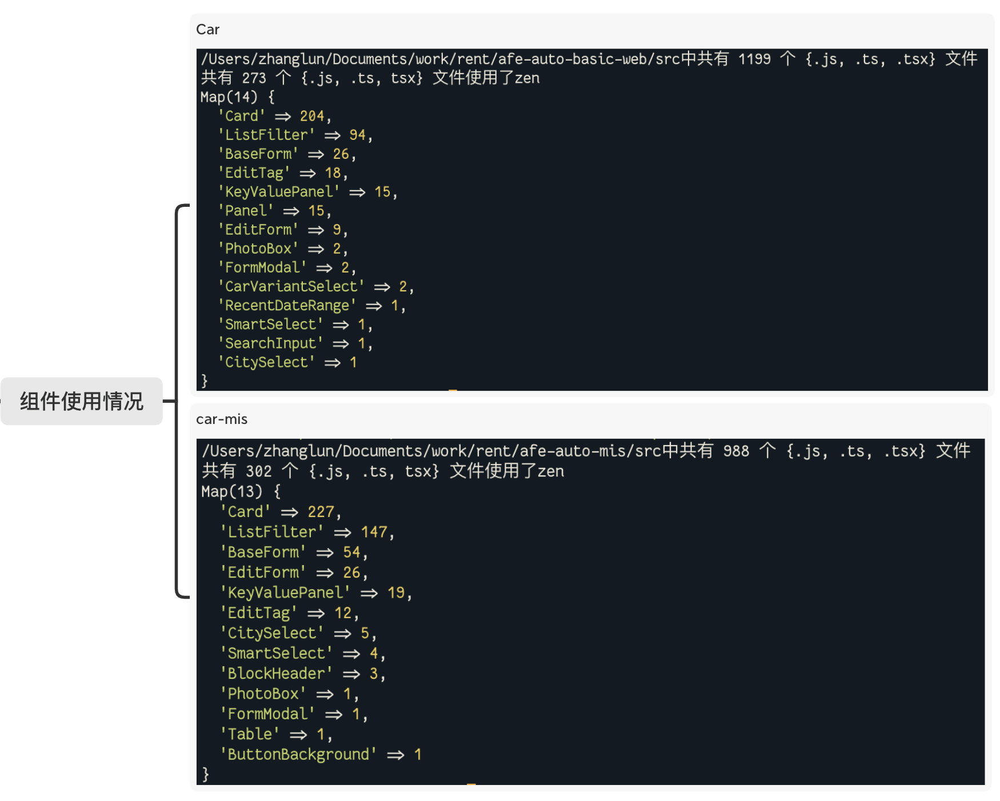
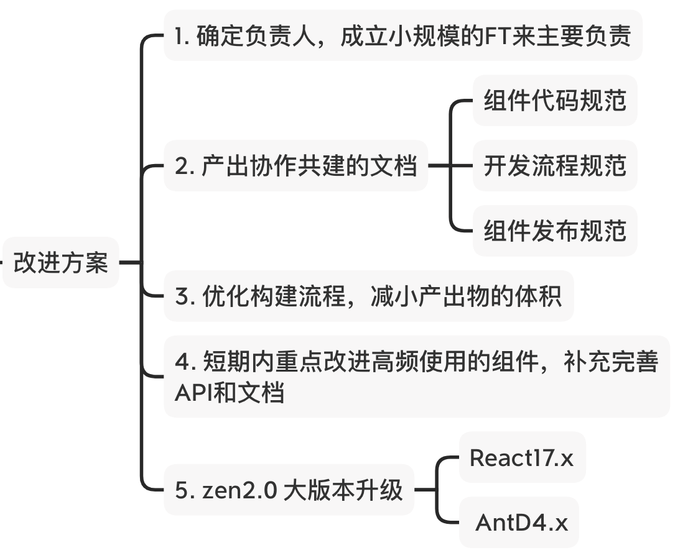
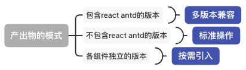
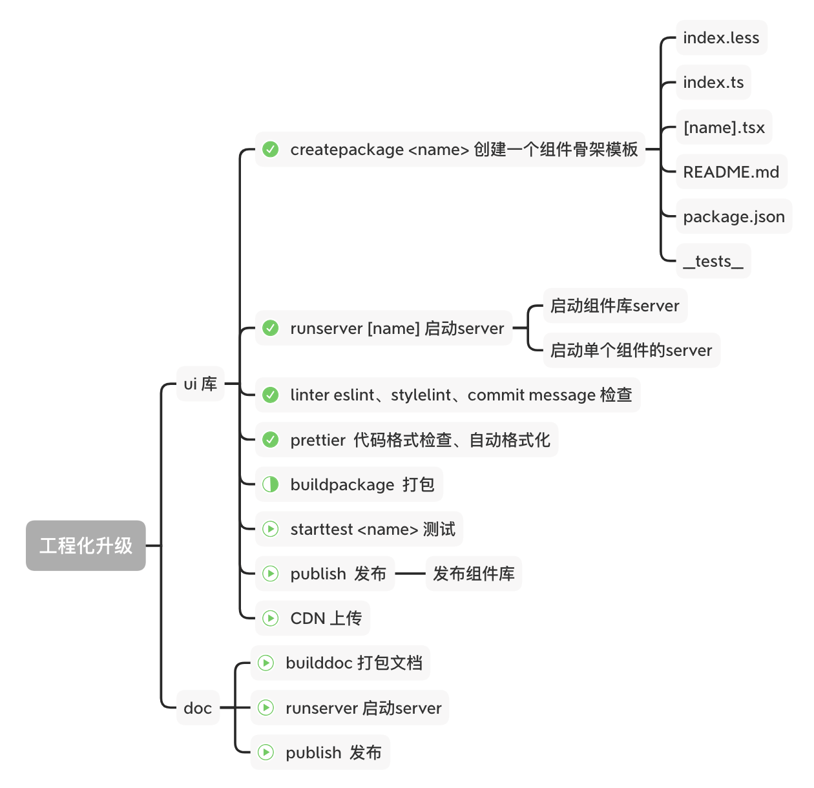
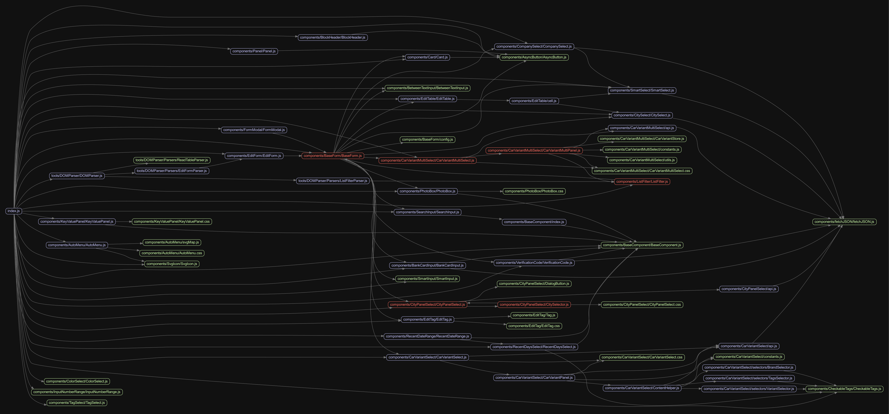
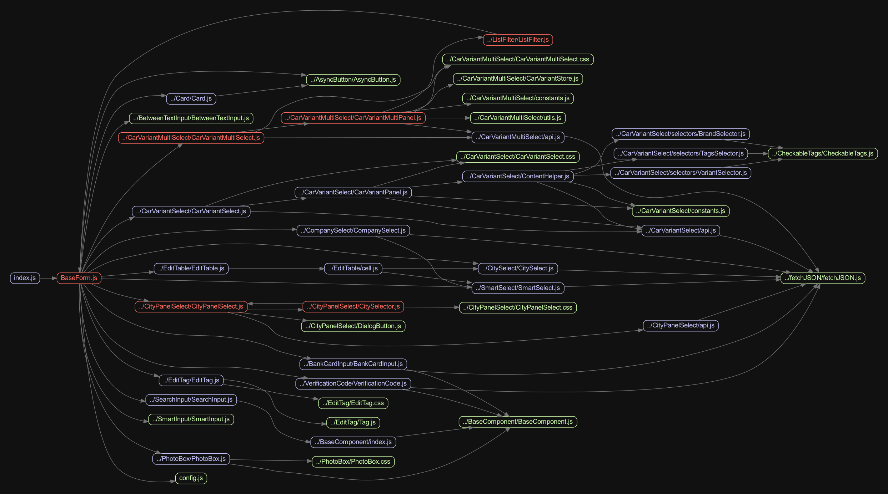

## 背景

作为业务组件库，zen在多个租车B端系统中被广泛使用。

zen在提高租车B端的研发效率的同时，保证B端系统的UI和交互的一致性。

但是当初的维护人员已离职或者转岗，没有专人(团队)维护

- 最新版本为v1.3.12，发布时间2020-12-04 11:15:24，发布人在职。小修补
- 最大版本号v2.2.98，发布时间2019-08-28 11:21:43，发布人已离职。找不到该版本的信息
- v1.3.5 发布时间 2019-11-19 11:13:56 ，v1.3.6发布时间 2020-08-25 19:38:05。间隔了将近一年。同样找不到v1.3.5的记录


## 当前现状



**组件使用情况**



所以，这件事情是有必要做的

## 改进计划



上图是第一次分析时得出的初步计划，在仔细研读zen现有的代码和设计的时候遇到了下面几个比较头疼的点

1. React版本16.3.0和Antd3.x，有很多API提示将要废弃。在此基础上改造收益不高
2. 工程化相关的配置比较老旧和冗余，改造成当前流行的最佳实践成本较大
3. 新增业务组件必须使用老版本的react和antd，开发人员积极性不高

所以决定

1. 原有版本继续维护，只做bugfix
2. 开启新项目zen-next(zen2.0)

***新老项目并存必然会带来一些问题***

1. 老项目新旧版本如何共存？
2. 新老版本依赖了不同版本的react和antD，是否会存在冲突或者冗余，如何解决？

首先明确一点，新老版本共存这个事实将会客观存在，并且将存在一段时间。子应用中可以使用新版本，老系统可以暂时不用care。随着子应用的逐个拆分，老系统最后将会边成一个架子。当不在有项目依赖老版本zen时，zen就可以退出历史舞台。

关于依赖的问题，对于组件库来说，第三方依赖不应该被包含在产出物中，尤其是React,antd之类的超级依赖，(一些小体积的辅助工具可忽略，比如按需引入的lodash函数)。所以zen-next的产出物会将不包含react antd。目前老系统和zen-pc-bc 都是将二者打包在产出物中，所以不会存在冲突。



## Zen-next

首先对zen-next的提出几个要求：

1. 详细的使用文档
2. 兼容的API设计
3. 标准的协作共建
4. 舒适的研发体验

接下来按照下面几个步骤来一步步开始和完善zen-next

1. 制定规范
2. 确定需要改造和迁移的组件
3. 确定API
4. 评审
5. 开始开发
6. 重复步骤2

## 项目规范

### 项目目录

```jsx
|-- docs 项目文档
|-- scripts 工程化相关脚本
|----| webpack webpack配置目录
|----| commander 项目命令集合
|-- src 组件库源码
|----| _style 公共样式目录
|----| _hepler 工具类函数
|----| components 组件目录
|----| components 组件目录
|------| Component1 
|--------| demo demo目录，一个文件为一个demo用例
|----------| start.mdx
|----------| ...
|--------| index.tsx 组件入口
|--------| index.css 组件样式
|--------| index.mdx 文档页面
|--------| ... (其他按需添加)
|-- lib 输出产出物目录
|-- site 组件库文档
```

### 组件规范

```bash
| Component1 
|--| demo demo目录，一个文件为一个demo用例
|----| start.mdx
|----| ...
|--| index.tsx 组件入口
|--| index.css 组件样式
|--| index.mdx 文档页面
|--| ... (其他按需添加)
```

具体细节可查询项目 `docs` 目录

### 代码规范

**ESLint 和 PrettierJS**

为了减少对某些约束的无意义的讨论，采用社区推荐的规范。项目使用 React 和 TypeScript开发，所以使用 **[@typescript/parser](https://www.npmjs.com/package/@typescript-eslint/parser)** 作为parser，配合 **[eslint-plugin-react](https://www.npmjs.com/package/@typescript-eslint/parser)** ，再加上少许定制。

而在代码格式方面则使用**PrettierJS**推荐的配置。

### 提交规范

毫无疑问，采用推荐的 **约定式提交。** 为提交信息增加人机可读含义的规范。

### 为什么使用约定式提交

- 自动化生成 CHANGELOG。
- 基于提交的类型，自动决定语义化的版本变更。
- 向其他人传达变化的性质。
- 触发构建和部署流程。
- 让人们探索一个更加结构化的提交历史，以便降低对你的项目做出贡献的难度。

具体细节可查询 [约定式提交](https://www.conventionalcommits.org/zh-hans/v1.0.0-beta.4/) 。

在约定式提交的基础上，使用 [standard-version](https://github.com/conventional-changelog/standard-version) 可以按照 `semver`标准来实现自动更新版本号和更新 `ChangeLog.md`。

## 工程化



完善的工程化设计，能够很好的帮助开发。

## 高优迁移的组件

使用工具 [madge](https://www.npmjs.com/package/madge) 分析zen的代码依赖，得到下图




结合前面提到的组件使用情况统计


同时对每个组件单独进行依赖分析可以发现最为复杂的是：BaseForm



BaseForm是ListFilter、FormModal、EditForm的下层依赖，而BaseForm又依赖了以下这些组件

1. SmartSelect
2. BankCardInput
3. VerificationCode
4. CitySelect
5. CompanySelect
6. SearchInput
7. EditTable
8. BetweenTextInput
9. CarVariantMultiSelect
10. CarVariantSelect
11. CityPanelSelect
12. PhotoBox
13. Card
14. SmartInput
15. AsyncButton
16. EditTag

所以重构迁移过程中首先以这些为主
