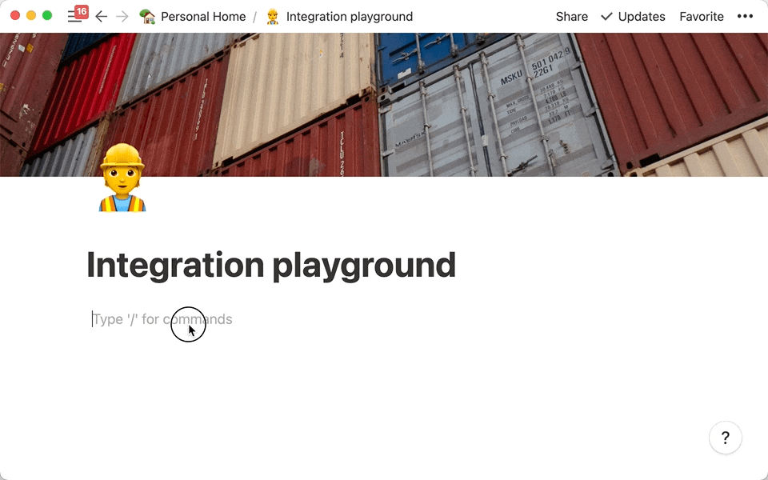

不知不觉，从14年到现在，自己的博客已经维护了8年了。虽然文章写的不多，质量也参差不齐，但是热情还是在的。

之前因为Hexo构建速度慢的问题，我将构建工具迁移到了Hugo生态。到目前为止，运行了小一年。但是本质上来说，除了更换了主题之外，其他并无太多差别。之所以说没有太多差别，原因在于Hexo和Hugo。它们都是静态网页生成器，使用Markdown管理内容，在编译阶段，将内容的信息提取之后，利用模板引擎输出网页。在我看来，这就像吃饭的时候，使用竹筷子还是木筷子一样。

这看起来也挺好，但是对我而言还是有几个不满意的地方：

- 内容创作不连贯。使用git管理博客依赖环境配置，无法随时随地写文章。而我平时喜欢使用笔记软件整理资料，写好之后需要转入git仓库，存在着一种割裂感。

- 博客定制性差。想自定义必须学习其数据格式和对应的模板语言，而学习的收益太低

有没有一种方式，可以实现随时随地写文章，随时随地发布呢？答案是：有！那就是**Notion**和**Gatsby**。

## Notion 和 Gatsby

### Notion

Notion这款工具我已经用了一段时间了。对我来说，是目前使用最舒服的笔记工具了。简单的界面，强大的功能，多平台兼容。同时Notion 提供了开发API，而这就是我最需要的。

将Notion的API和Github Actions 结合，把Notion中的内容转换成博客，以实现随时书写，随时发布的能力。

### Gatsby

Gatsby.js 起初只是一个基于 React 开发的一个框架，用于帮助开发者构建快速的网站或者 apps。通过 GraphQL 处理数据来源，然后输出作为网站的数据，再通过 HTML、CSS、React 将数据展示出来。现在衍生出来一个围绕 Gatsby 的构建，预览和部署网站的云平台。下图是Gatbsby的工作原理


## 重新定义博客工作流

现在博客创建和发布的流程如下


而结合Notion API之后，发布的流程变为：


## 连接Gatsby和Notion

### 01 使用Gatsby创建网站

如果是第一次使用，建议先通读一次[官方文档](https://www.gatsbyjs.com/docs/tutorial/)， 然后选择 [gatsby-starter-blog](https://www.gatsbyjs.com/starters/gatsbyjs/gatsby-starter-blog/) 这个模板开始搭建自己的博客。具体的搭建细节，我就不在这里赘述了。能看到这篇文章的人应该都能搞定的把？

### 02 创建Notion 数据库

在自己的workspace中创建新建一个数据库类型的Page。视图类型选择Table会更加直观。下图是我的database的截图：


你可以按需设置自己需要的字段，也可以参考我的。

- title: 文章标题

- categorise: 文章分类

	- 域 业务领域

	- 术 解决方案

	- 技 技术研究

	- 阵 技术应用

	- 法 手段方法

	- 理 理论学习

	- 器 工具使用

	- 杂 杂七杂八

- tags：文章标签

- date：发布时间

- status: 文章状态

	- working: 未完成

	- publish: 已发布

	- draft: 草稿

### 03 创建API Intergation 

首先，前往 [Notion 开发平台](https://www.notion.so/my-integrations)创建自己的API Intergation，拿到整个流程中最为关键的secret，具体步骤可以参考[这里](https://developers.notion.com/docs/getting-started#getting-started)。 


### 04 关联数据库

当Intergation创建完毕时，还需要将其与我们的目标database关联上。如下图所示，在share中找到



关联完毕之后，就可以通过 secret 和 database id 来实现对数据库的操作了。

### 05 使用插件连接 Gatsby 和 Notion

Gastby 的工作原理在前文已经介绍过了。我们可以选择我们喜欢的数据来源，通过插件，将数据同步至 GraphQL 数据层，之后的事情交给GatsBy就行。

你可以自己写代码调用Notion API，也可以使用gatsby提供的插件。我选用目前排名比较靠前的 [https://github.com/orlowdev/gatsby-source-notion-api](https://github.com/orlowdev/gatsby-source-notion-api)。虽然作者说还在开发中，但是试用之后发现能够满足我的需求，我就不再自己花时间折腾了。

接入的具体步骤如下，在依赖安装完毕之后，修改 `gatsby.config.js` 中的 `plugins`

```javascript
plugins: [
    ...
    // 本地markdown文件，之前的文章
    {
      resolve: `gatsby-source-filesystem`,
      options: {
        path: `${__dirname}/content/blog`,
        name: `blog`,
      },
    },
    {
      resolve: `gatsby-source-notion-api`,
      options: {
        token: `${INTEGRATION_TOKEN}`,
        databaseId: `${DATABASE_ID}`,
        propsToFrontmatter: true,
        lowerTitleLevel: true,
      },
    },
    ...
  ],
```

我保留了之前写的 markdown 博客，放在 content/blog 目录中，新增了 notion api 的插件。这样一来，以前的文章不受影响，新写的文章都在 notion 中。部署时，两个数据源的内容一起部署。

插件接入后，可以通过 `allNotion` 条件进行查询，这种方式可以查询到来自Notion的数据

```graphql
query {
	allNotion {
		edges {
			node {
				id
				parent
				children
				internal
				title
				properties {
					My_Prop_1
					My_Prop_2
				}
				archived
				createdAt
				updatedAt
				markdown
				raw
			}
		}
	}
}
```

如果本地content/blog中有历史文章，可以使用 `allMarkdownRemark` 查询，他会包含所有的数据内容。

```graphql
query {
	allMarkdownRemark {
		edges {
			node {
				frontmatter {
					title
				}
				html
			}
		}
	}
}
```

### 06 使用 GraphQL Schema Resolver 兼容数据（可选）

通常Hugo(Hexo)中定义的tags和categories都是字符串数组。而Notion的database中我将tags和categories定义为Select类型的属性，保存的值对象，Notion 插件返回的 frontmatter中的tags和categories都是包含了id、color和name的对象数组。

GraphQL的类型定义中，没有类似“Any”的类型，而内置的 ScalarType 和 ObjectType 又不能union，解决方案是使用`resolver`处理返回的值，将tags处理为一个字符串数组，categories处理成一个字符串。

```javascript
schema.buildObjectType({
	...
	tags: {
    type: "[String]",
    resolve(source) {
      return source.tags.map((t) => t.name || t);
    } 
  },
  categories: {
    type: "String",
    resolve(source) {
      return source.categories;
    }
  },
  ...
})
```

最后在查询时返回的数据格式如下：


OK，到目前为止，我们已经成功将Gatsby和Notion联系在一起。Notion的内容可以作为Gastby的数据源，输出在网站中，同时现有markdown的也能够无缝迁移。随写随发的目标，我们已经完成了一大半。

### 07 将Notion导出项目目录，通过 source file system 加载

使用了一段时间后，发现 gatsby-notion-api 有几个不太好用的地方（毕竟只是作者的实验性项目）：

- 无法转换Table

- 串行请求页面导致构建时间比较长。

- 无法缓存，导致每次都是全量构建

于是想自己写一个，使用 [**notion-client**](https://www.npmjs.com/package/notion-client) 提供开箱即用的API调用，使用 [**notion-to-md**](https://github.com/souvikinator/notion-to-md) 将页面转换成markdown 文件。不幸的是，Gatsby在 build 的时候总是出现莫名奇妙的错误。


经过百般对比和调试，翻阅Gatsby的文档。最后发现可能是在CreateNode的时候传入的参数有问题，但是调试是在是太麻烦了。随着耐心的逐渐消失，我决定换个思路。构建之前，将内容下载到本地，再通过 source file system 来处理。后续还方便做缓存。具体代码在[这里](https://github.com/zhanglun/zhanglun.github.io/tree/master/scripts/notion)。

**2022年5月21日更新**

下载到本地的方式成功运行了一两周，接下来的时间里，Github在执行Action时，不停地遇到如下图所示的错误。


调试了很久，最后发现是依赖的 [gatsby-remark-images-anywhere](https://www.gatsbyjs.com/plugins/gatsby-remark-images-anywhere/) 所导致。这个插件会做的事情是将远程图片下载到static目录，同时修改文章中图片的引用。我也不想深究背后的问题，自己写一个脚本不是更方便么？

## 自动部署的实现

使用类Hugo的静态网站生成器时，自动部署的关键点在于push操作能够触发配置的CI流程。而改用Notion之后，如何触发构建和部署呢？目前我想到了两个方式：手动触发构建和定时任务。后者相比之下更加“自动化”。

其实有一种取巧地方式：通过Chrome插件在Notion的Web页面上插入一个按钮。这个按钮点击时调用webhook触发Action。不过暂时不打算折腾这些。毕竟还有一些待完成的工作要做。考虑到我已经实现了“随时写”的目标，“随时发”倒也没有那么迫切了。所以我决定先采用定时发布的方式来解决部署的问题。

我在Github Action的市场中找到一个已经做好的Action帮助我实现博客的编译和github page的部署，这里是它的[仓库地址](https://github.com/enriikke/gatsby-gh-pages-action) 。按照它的教程很快就能定制出自己的Action。我在此基础上增加了一个定时任务，每天零时的时候执行一次，暂且先当作是实现了“自动化部署”吧。

```yaml
name: Gatsby Publish
on:
  schedule:
    - cron: "0 0 * * *"
  workflow_dispatch:
  push:
    branches:
      - mast

jobs:
  build:
    runs-on: ubuntu-latest
    steps:
      - uses: actions/checkout@v1
      - uses: enriikke/gatsby-gh-pages-action@v2
        with:
          access-token: ${{ secrets.gatsbyDeploy }}
          deploy-branch: gh-pages
          deploy-repo: gatsby-starter-blog
```

## 其他

现在将Notion作为CMS的想法已经基本实现。接下来地主要工作是定制化设计和开发博客主题。目前设计的第一版已经完成了。


代码已经开发了一部分，维护在[zhanglun/gatsby-starter-blog](https://github.com/zhanglun/gatsby-starter-blog)。等完工之后，将博客迁移到这个方案。期间再研究研究，看看是否能找到更好的自动化方案。在此期间就继续慢慢感受Notion的魅力吧。

> 2022-04-23 更新：  
>网站整体的风格已经变了，欢迎访问

## 参考

- [Making a Blog Using Notion, Gatsby, and Github Pages](https://arnaudvalensi.github.io/blog/making-a-blog-using-notion-gatsby-and-github-pages/)

- [gatsby-gh-pages-action](https://github.com/enriikke/gatsby-gh-pages-action)

- [how-to-trigger-github-action-using-webhook-with-no-code](https://kontent.ai/blog/how-to-trigger-github-action-using-webhook-with-no-code)

- [Updating Notion Pages on a Schedule with GitHub Actions](https://brunoscheufler.com/blog/2021-10-17-updating-notion-pages-on-a-schedule-with-github-actions#scheduling-it)
