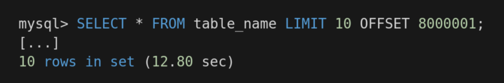
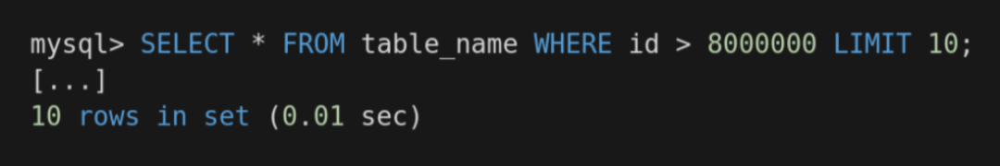

书接上文，本文记录了我在开发Lettura项目时基于Diesel实现的翻页能力。

作为一个ORM工具，Diesel提供了非常便利的查询方法，可以使用[**diesel**](https://docs.rs/diesel/2.0.2/diesel/index.html)**::**[**dsl**](https://docs.rs/diesel/2.0.2/diesel/dsl/index.html#)提供的方法，

```rust
extern crate diesel_learn;
extern crate diesel;

use self::diesel_learn::*;
use self::models::*;
use self::diesel::prelude::*;

// cargo run --bin show_posts
fn main() {
    // 导入代码
    use diesel_learn::schema::posts::dsl::*;

    // 创建连接
    let connection = establish_connection();
    // 查询
    let results = posts.filter(published.eq(true))
        .limit(5)
        .load::<Post>(&connection)
        .expect("Error loading posts");

    // 打印
    println!("Displaying {} posts", results.len());
    for post in results {
        println!("{:?}", post);
    }
}
```

也可以使用[**diesel**](https://docs.rs/diesel/2.0.2/diesel/index.html)**::**[**sql_query**](https://docs.rs/diesel/2.0.2/diesel/fn.sql_query.html#) 执行SQL语句

```rust
let users = sql_query("SELECT * FROM users ORDER BY id")
    .load(connection);
let expected_users = vec![
    User { id: 1, name: "Sean".into() },
    User { id: 2, name: "Tess".into() },
];
assert_eq!(Ok(expected_users), users);

// Checkout the documentation of your database for the correct
// bind placeholder
let users = sql_query("SELECT * FROM users WHERE id > ? AND name <> ?");
let users = users
    .bind::<Integer, _>(1)
    .bind::<Text, _>("Tess")
    .get_results(connection);
let expected_users = vec![
    User { id: 3, name: "Jim".into() },
];
assert_eq!(Ok(expected_users), users);
```

类似的，翻页的能力也可以采用这两种方式来实现。Diesel和其他ORM工具一样，提供了`.limit()` 和`.offset()`。接下来我也会结合这两个方法来实现项目中列表的翻页加载。不过在具体实现之前，需要先了解常见的两种实现方法。

如果你在搜索引擎中搜索类似“数据库、接口、分页“等关键词时，一定会看到这两个种方式的介绍和使用。

- 基于offset和limit的传统分页

- 基于游标的游标分页

### 基于offset和limit的传统分页

如果你做过后端开发或者数据库相关的工作，你一定见过这样的SQL：


这种方式是OK的，基本上所有的后端开发工程师在职业生涯都写过类似的SQL。对于简单的小型应用程序和数据量不是很大的场景，这种方式还是能够“应付”的，简单直接，但是它也有它的缺陷。

最直接的就是潜在的性能问题，为了实现分页，每次收到分页请求时，数据库都需要进行低效的全表扫描。

> 什么是全表扫描？全表扫描 (又称顺序扫描) 就是在数据库中进行逐行扫描，顺序读取表中的每一行记录，然后检查各个列是否符合查询条件。这种扫描是已知最慢的，因为需要进行大量的磁盘 I/O，而且从磁盘到内存的传输开销也很大。

这意味着，如果你有 1 亿个用户，OFFSET 是 5 千万，那么它需要获取所有这些记录 (包括那么多根本不需要的数据)，将它们放入内存，然后获取 LIMIT 指定的 20 条结果。也就是说，为了获取一页的数据，需要先获取5万行数据。所以在数据量和偏移量的值越大时，查询性能越低。

除此之外，还可能会有数据缺失和数据重复的问题。

### 基于指针的游标分页

游标分页是通过 `cursor` 和 `size` 这样的类似两个参数来控制翻页，简单的 SQL 语句如下


这是一种基于指针的分页。每次查询的时候通过一个指针cursor找到开始的位置，这个cursor通常是自增的主键。游标分页通过主键快速定位数据搜索开始的位置，然后查找LIMIT条数据即可，即使在大数据量的场景下性能也是OK的。无论数据发生新增还是减少时，基于游标的分页请求都获取该游标后续的一页数据，而基于偏移的分页请求是获取变更后数据排序后指定偏移位置的数据，这些数据在之前的请求中是否重复或缺失是无从得知的。不过它也有一定的局限性，要使用这种基于游标的分页，需要有一个惟一的序列字段 (或多个)，比如惟一的整数 ID 或时间戳，但在某些特定情况下可能无法满足这个条件。

比较这个查询：



和优化的版本：



返回同样的结果，第一个查询使用了 12.80 秒，而第二个仅用了 0.01 秒。

在Lettura项目中，文章有自增id和时间戳，可以使用游标分页。

```rust
pub struct ArticleQueryResult {
  list: Vec<models::Article>,
}

pub fn get_article(filter: ArticleFilter) -> ArticleQueryResult {
  let mut connection = establish_connection();
  let mut query = schema::articles::dsl::articles.into_boxed();

  match filter.channel_uuid {
    Some(channel_uuid) => {
      query = query.filter(schema::articles::channel_uuid.eq(channel_uuid));
    }
    None => {
      1;
    }
  }

  match filter.read_status {
    Some(0) => {
      1;
    }
    Some(status) => {
      query = query.filter(schema::articles::read_status.eq(status));
    }
    None => {
      1;
    }
  }

  match filter.cursor {
    Some(cursor) => {
      query = query.filter(schema::articles::id.gt(cursor));
    }
    None => {
      1;
    }
  }

  match filter.limit {
    Some(limit) => {
      query = query.limit(limit.into());
    }
    None => {
      1;
    }
  }

  query = query.order(schema::articles::dsl::pub_date.desc());

  let result = query
    .load::<models::Article>(&mut connection)
    .expect("Expect loading articles");

  ArticleQueryResult { list: result }
}
```
