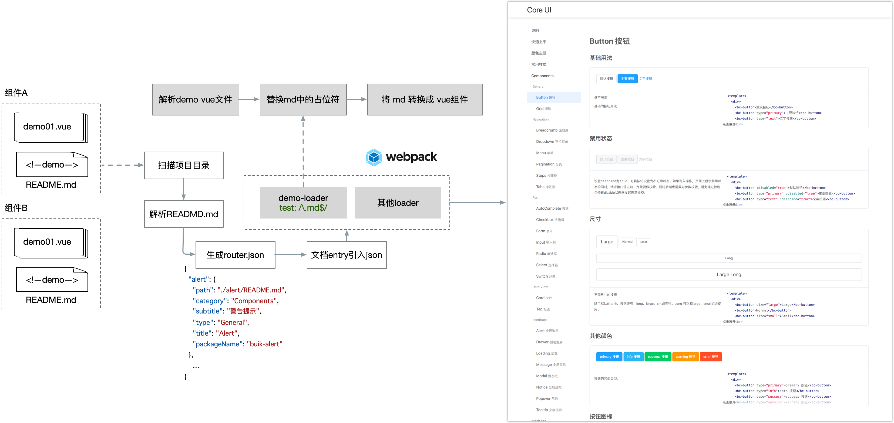
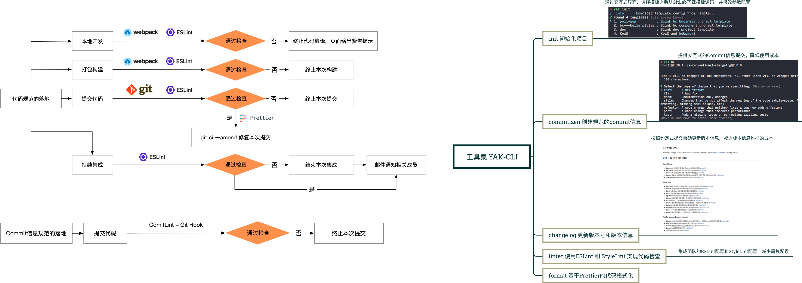
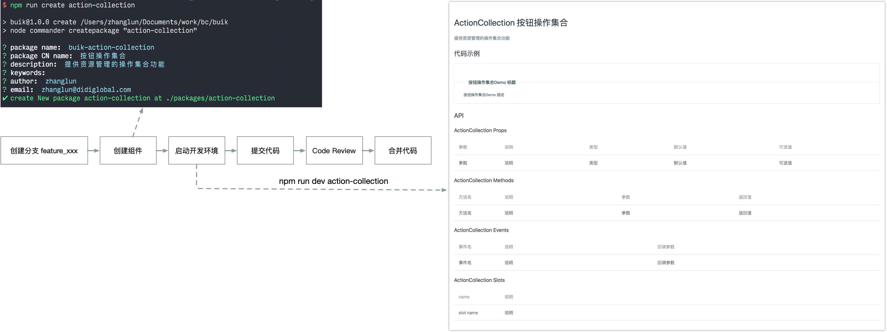

入职的时候团队加上老板就三个人，需要对接5+个公共服务团队，为公共服务开发控制台，每个团队两个控制台系统。在之前，有一些团队有一些正在运行的系统，技术栈有React, Angular和Vue，UI库有内部的 CubeUI 和外部的 AntD，场面一度十分混乱。

好在当时组织架构处于建设阶段，现有的系统功能都还没有太多。乘着这个机会，团队统一了技术栈用vue。

为什么？人少，没有React专家，Angular不好招人，Vue简单，上手快，Vue招人容易。前端的技术选型确定了，后端采用自研的Nodejs的Web框架。

前端UI也需要一个框架？为什么不用外部的，主要考虑到以下几个问题：

1. 开源项目有风险，出问题不能立马响应，可能会不在维护。比如公司内部的 CubeUI 和外面的 ElementUI
2. 开源的UI库往往提供的都是通用性和功能性比较强的组件，风格上比较统一。再者，设计师可能有自己的想法
3. 开源的定制性差点，可能会出现无法满足产品需求的情况，需要在这个基础上改造，有一定成本
4. 锻炼团队能力

刚开始我也没搞过组件库，之前只看过 BootStrap的一点代码，他们是基于 jQuery 的。我来的时候Vue也不太熟练。所以当时只能一边做一个新的系统，一边开发组件库，一边写一边用。
两个星期做出了第一版的Codis控制台系统，和第一版本的ui框架 Core 我具体是怎么做的呢？

首先先捋了一波需求，我们要做的这个组件库到底要有什么样的能力。

1. 提供基础组件库，不对标 AntD或者 ElementUI，提供基础能力，能够当前系统的开发
2. 和社区的组件库一样，支持 `import`、`require` 和 `script` 标签的引用
2. 支持主题色
3. 后续拓展业务组件

下面说一下几个比较关键的点

### Webpack的构建打包

简单来说构建这块使用webpack来构建打包输出，约定好开发规范，包括代码风格，目录结构每个组件通过文件夹来划分，提供一个总入口文件，最后作为index.js 将组件对象引入，最后一起输出。在此基础上，利用Webpack的entry支持数组的能力，构建阶段扫描每一个组件目录，拿到index.js 单独在构建一份。这样使用的时候既可以一次性引入完整的包，也可以单个引入。

里面有几个关键点需要注意，除了组件库最后需要暴露入使用的入口之外，我们还需要将依赖外部化。假设组件库名字叫做 `my-component`，需要至少能提供如下使用的使用能力：

```js
import MyComponent from 'my-component';
Vue.use(MyComponent)
```

同时在`my-component`中不包含Vue的依赖。Webpack提供了这样的能力，总结如下：

* 使用 `externals` 选项，避免将依赖打包到应用程序，而使用者会去加载它。
* 将 `library` 的名称设置为 `MyComponent` 组件名
* 将 `library` 暴露为一个名为 `MyComponent` 的变量。
* 能够访问其他 Node.js 中的 library。

除此之外，组件的使用还要能支持`CommonJS`，`ES6模块`，甚至通过`script`标签引入。具体细节可以参考：[Authoring Libraries](https://webpack.js.org/guides/author-libraries/)

### 文档自动化

第一步算是完成了。接下来是组件文档的问题。组件的文档需要包括组件的一些基本信息，接口说明，和一些demo。第一版本中，我参考了AntD的设计，在每个组件的目录下面有一个README.md文件，文件头部使用YAML语法设置基本信息，来标记组件的一些信息，比如分类、标题和名称之类的，文件内容作为文档的内容。最后通过自己开发的一个 `vue-md-loader`，在文档构建过程中，将md文件转换成vue组件，最后输出一个可访问的单页面应用。构建过程接入了Gitlab CI，利用持续集成的思路将文档的更新发布自动化。

但是这个方案有一个小问题：在markdown文件中编写代码内容确实不方便，缩进不只能，IDE无法帮助识别基本的错误。随后作了一个改进：依然使用`README.md`作为组件文档的入口，但是只保留顶部基本信息和API参数信息，正文部分增加一个插槽`<!-- demo -->`。所有的使用DEMO都放置在新增的`demo`文件夹，在`demo`文件夹按照demo0, demo1的顺序放置demo组件。同时对`vue-md-loader`进行一些改造。编译文档时，将demo文件夹中的demo按照文件名顺序，插入插槽，再将md内容转换成一个vue组件。最后在页面中显示出来。



### 主题色

我们当时做这个组件库是为了支持团队工作的，每个 PaaS 服务会有两个系统，一个面向用户，一个面向服务方。两种系统采用了两种颜色风格，用户侧黑色，服务方侧绿色。这里我采用的比较简单直接的方案，定了一两个变量，通过不同命令打包构建。就两个颜色，这样挺快


### 自动化

提供了几个命令来简化开发流程和提高协作效率。


