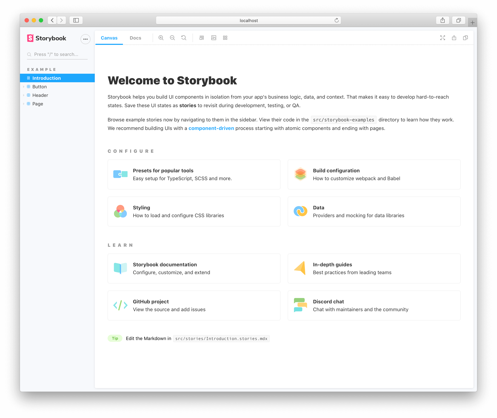
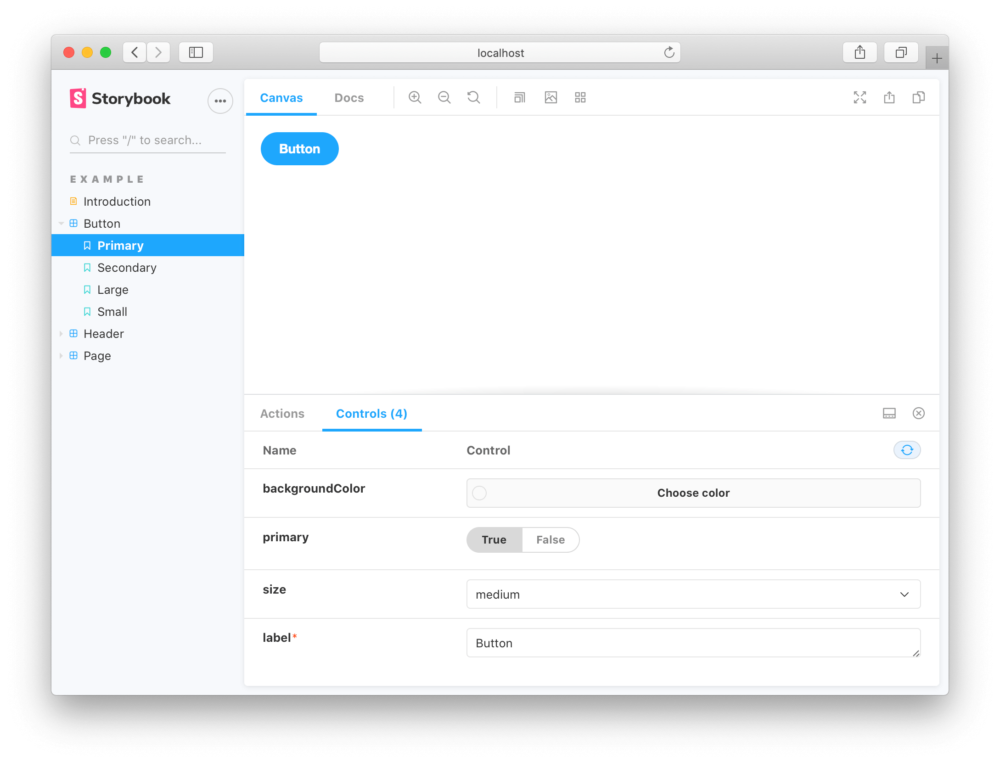

## 什么是Storybook


Storybook 是一个用于UI开发的开源工具，通过隔离组件，使开发更快、更容易。它提供了一套完整的开发流程，你可以不用配置一个复杂的开发环境、不用和数据库交互，也不需要和你的应用程序关联。


Storybook可以帮你记录组件的文档，以便重复使用，并自动对你的组件进行视觉测试来防止出现bug。同时Storybook还有一个插件的生态系统来扩展自身的能力，如微调响应式布局或验证可访问性。支持多种前端框架，甚至目前还在进行试验性的支持服务端渲染组件框架。


当你启动执行 `yarn storybook` 时，会启动一个dev server，并自动在浏览器中打开一个页面，显示欢迎界面。





## 什么是 story


在Storybook中，一个story包含了一个组件渲染时的状态。开发者可以给一个组件写多个story。可以简单的将一个story理解成一个包含了组件特定状态的demo。可以在案例中看到，默认会展示Button，Header和Page三个例子。


在代码层面来看，一个.stories.js就是一个story。这个文件包含了渲染时的状态。最终也会在web中以一个单独的案例呈现。


```javascript
// Button.stories.js

import Button from './Button.vue';

export default {
  /* 👇 The title prop is optional.
  * See https://storybook.js.org/docs/vue/configure/overview#configure-story-loading
  * to learn how to generate automatic titles
  */
  title: 'Button',
  component: Button,
};

export const Primary = () => ({
  components: { Button },
  template: '<Button primary label="Button" />',
});
```





在我们的实际场景中，主要工作就是为每个组件编写story，以展示每个组件的不同能力


## 怎么写 Story?


组件的sotries是独立定义在组件文件之外的story文件。服务于开发环境，不会打包到项目中。


```javascript
Button.js | ts | jsx | tsx
Button.stories.js | ts | jsx | tsx | mdx
```


在storybook中过，定义了一个称为 Component Story Format(CSF)的规范。一个基于ES6 模块的标准，方便书写，并且可以在不同工具间移植。在CSF中，关键部分是用于描述组件的默认导出和描述组件stories的具名导出。


### 两种导出方式


**默认导出 Default export**


默认导出的信息决定Storybook如何排列你的stories和addon使用的信息。例如，下面是一个Button.stories.js 的默认导出


```javascript
// Button.stories.js

import Button from './Button.vue';

export default {
  /* 👇 The title prop is optional.
  * See https://storybook.js.org/docs/vue/configure/overview#configure-story-loading
  * to learn how to generate automatic titles
  */
  title: 'Button',
  component: Button,
};
```


**具名导出 Defining Story**


具名导出一个单独的story。下面是导出一个叫做 Primary 的 story


```javascript
// Button.stories.js

import Button from './Button.vue';

export default {
  /* 👇 The title prop is optional.
  * See https://storybook.js.org/docs/vue/configure/overview#configure-story-loading
  * to learn how to generate automatic titles
  */
  title: 'Button',
  component: Button,
};

export const Primary = () => ({
  components: { Button },
  template: '<Button primary label="Button" />',
});
```


也可以通过 storyName 对 story 的名字进行修改


```javascript
// Button.stories.js

import Button from './Button.vue';

export default {
  /* 👇 The title prop is optional.
  * See https://storybook.js.org/docs/vue/configure/overview#configure-story-loading
  * to learn how to generate automatic titles
  */
  title: 'Button',
  component: Button,
};

export const Primary = () => ({
  components: { Button },
  template: '<Button primary label="Button" />',
});
Primary.storyName = 'I am the primary';
```


### 通过Args对象定义Story


所谓的一个story，是一个带有一组参数的组件，这些参数定义了组件应该如何渲染。在Storybook中，通过Args定义参数。Args是一个JavaScript对象，它可以用来动态地修改props，slot，样式、输入等。允许Storybook和插件实时编辑组件。


Args用法很简单，可以通过story实例的`args`设置为Story级别的参数，也绑定在默认导出对象上作为Component级别的参数。


**Story 级别的Args只对绑定的story生效**


```javascript
// Button.stories.js

import Button from './Button.vue';

export default {
  /* 👇 The title prop is optional.
  * See https://storybook.js.org/docs/vue/configure/overview#configure-story-loading
  * to learn how to generate automatic titles
  */
  title: 'Button',
  component: Button,
};

// 👇 We create a “template” of how args map to rendering
const Template = (args, { argTypes }) => ({
  props: Object.keys(argTypes),
  components: { Button },
});

//👇 Each story then reuses that template
export const Primary = Template.bind({});

Primary.args = {
  primary: true,
  label: 'Button',
};
```


**Component 级别的Args，对组件下所有的Story生效。**


```javascript
// Button.stories.js

import Button from './Button.vue';

export default {
  /* 👇 The title prop is optional.
  * See https://storybook.js.org/docs/vue/configure/overview#configure-story-loading
  * to learn how to generate automatic titles
  */
  title: 'Button',
  component: Button,
  //👇 Creates specific argTypes
  argTypes: {
    backgroundColor: { control: 'color' },
  },
  args: {
    //👇 Now all Button stories will be primary.
    primary: true,
  },
};
```


### 使用Parameters控制Story


parameters是与story有关的一组静态具名元数据，通常用来控制Storybook的功能和addon的行为。


和Args的使用方式类似，不过除了 Story 级别的 Parameters 和 Component 级别的 Parameters之外，可以在`.storybook/preview.js` 中定义 Global Parameter，作用于所有的story。


**Story 级别的 Parameters**


```javascript
// Button.stories.js|ts|jsx|tsx

import { Button } from './Button';

export default {
  /* 👇 The title prop is optional.
  * See https://storybook.js.org/docs/react/configure/overview#configure-story-loading
  * to learn how to generate automatic titles
  */
  title: 'Button',
  component: Button,
};

const Template = (args) => ({
  // 👈 Your template goes here
});

export const Primary = Template.bind({});
Primary.args = {
  primary: true,
  label: 'Button',
};
Primary.parameters = {
  backgrounds: {
    values: [
      { name: 'red', value: '#f00' },
      { name: 'green', value: '#0f0' },
      { name: 'blue', value: '#00f' },
    ],
  },
};
```


**Component 级别的 Parameters**


```javascript
// Button.stories.js

import Button from './Button.vue';

export default {
  /* 👇 The title prop is optional.
  * See https://storybook.js.org/docs/vue/configure/overview#configure-story-loading
  * to learn how to generate automatic titles
  */
  title: 'Button',
  component: Button,
  //👇 Creates specific parameters for the story
  parameters: {
    backgrounds: {
      values: [
        { name: 'red', value: '#f00' },
        { name: 'green', value: '#0f0' },
        { name: 'blue', value: '#00f' },
      ],
    },
  },
};
```


**Global parameters**


```javascript
// .storybook/preview.js

export const parameters = {
  backgrounds: {
    values: [
      { name: 'red', value: '#f00' },
      { name: 'green', value: '#0f0' },
    ],
  },
};
```

> 三种级别的Parameters优先级顺序依次是 Story Parameters > Component Parameters > Global Parameter。Parameters 只会合并，相同的键值会按照优先级覆盖，不会丢弃。

### 添加Decorators 包装 Story


所谓Decorators，可以在保持原有的 story 不变的情况下，额外给它添加额外的 DOM 元素、引入上下文环境、添加假数据等等。


和 Parameters 一样，它也可以定义在全局/组件/story 三个层级，每个 Decorator 按定义顺序依次执行，从全局到 story。


利用 Decorators，我们可以用额外的DOM包装Story的渲染结果，


```javascript
// YourComponent.stories.js

import YourComponent from './YourComponent.vue';

export default {
  /* 👇 The title prop is optional.
  * See https://storybook.js.org/docs/vue/configure/overview#configure-story-loading
  * to learn how to generate automatic titles
  */
  title: 'YourComponent',
  component: YourComponent,
  decorators: [() => ({ template: '<div style="margin: 3em;"><story/></div>' })],
};
```


也可以提供一个独立的Context，将参数或者数据传给Story。


```javascript
// .storybook/preview.js

import Vue from 'vue';

import { library } from '@fortawesome/fontawesome-svg-core';
import { faPlusSquare as fasPlusSquare } from '@fortawesome/free-solid-svg-icons';
import { FontAwesomeIcon } from '@fortawesome/vue-fontawesome';

library.add(fasPlusSquare);

//👇 Storybook Vue app being extended and registering the component
Vue.component('font-awesome-icon', FontAwesomeIcon);

export const decorators = [
  (story, { args, argTypes, globals, hooks, parameters. viewMode }) => ({
    components: { story },
    template: '<div style="margin: 3em;"><story /></div>',
  }),
];
```


同样的，像 Parameters 一样，Decorator 可以在全局、组件级别和单个故事中定义。当Story渲染时，所有与Story相关的Decorator将按以下顺序运行。

- Global Decorator ，按照它们定义的顺序
- Component Decorator，按照它们定义的顺序
- Story Decorator，按照它们定义的顺序

### 调用Play Function实现交互


Play function 在 Story 渲染完成后执行。可以实现与组件的交互，可用于测试需要交互的场景。它的的使用与前面提到的几个概念稍有不同，它的能力由几个插件组合提供，需要先安装好。


```bash
# With npm
npm install @storybook/addon-interactions @storybook/testing-library --save-dev

# With yarn
yarn add --dev @storybook/addon-interactions @storybook/testing-library
```


然后补充一些配置


```javascript
// .storybook/main.js

module.exports = {
  stories:[],
  addons:[
    // Other Storybook addons
    '@storybook/addon-interactions', //👈 The addon registered here
};
```


下面是一个简单的例子，首先引入依赖，然后为Story添加Play方法


```javascript
// RegistrationForm.stories.js

import { screen, userEvent } from '@storybook/testing-library';

import RegistrationForm from './RegistrationForm.vue';

export default {
  /* 👇 The title prop is optional.
  * See https://storybook.js.org/docs/vue/configure/overview#configure-story-loading
  * to learn how to generate automatic titles
  */
  title: 'RegistrationForm',
  component: RegistrationForm,
};

const Template = (args) => ({
  components: { RegistrationForm },
  template: '<RegistrationForm />',
});

export const FilledForm = Template.bind({});
FilledForm.play = async () => {
  const emailInput = screen.getByLabelText('email', {
      selector: 'input',
    });

    await userEvent.type(emailInput, 'example-email@email.com', {
      delay: 100,
    });
    
    const passwordInput = screen.getByLabelText('password', {
      selector: 'input',
    });

    await userEvent.type(passwordInput, 'ExamplePassword', {
      delay: 100,
    });
    
    // See https://storybook.js.org/docs/vue/essentials/actions#automatically-matching-args to learn how to setup logging in the Actions panel
    const Submit = screen.getByRole('button');
    await userEvent.click(Submit);
};
```


当 story 渲染完成后，play方法会自动执行。可以在Interactions面板中一步步查看流程。更多细节可以查看[**官方的详细介绍**](https://storybook.js.org/docs/vue/writing-stories/play-function)。


## 结束语


以上是Storybook的一些基本概念，按照文档走一遍，搭建出自己的组件库文档是没问题的。接下来会介绍如何更好地命名和组织组件的层级结构。


## 参考

- [Storybook 设计系统简介](https://storybook.js.org/tutorials/design-systems-for-developers/react/zh-CN/introduction/)
- [Storybook 教程系列](https://storybook.js.org/tutorials/)
