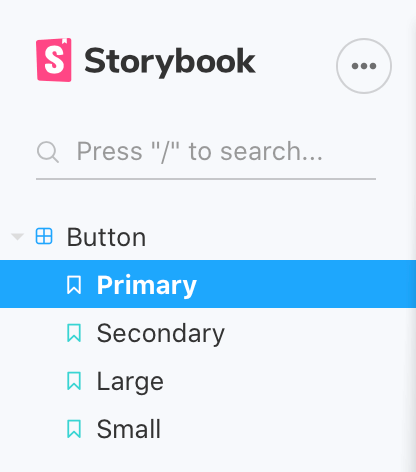
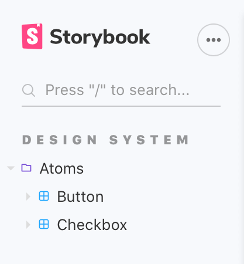
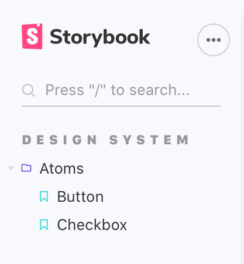

上一篇中介绍了什么是Storybook，以及基本的使用方法。本文将介绍在Storybook中组件组织和结构划分的一些技巧，内容来自官方推荐。


## 在侧边栏展示导出的Story


前面提到过，story 文件可以有默认导出和具名导出两种方式，导出的对象都会在左边的侧边栏展示。具体来说，默认导出的对象作为父级，其余具名导出的对象作为子级。就拿Storybook中提的例子来展示，下面是Story的内容。


```javascript
import { Button } from './Button';

// More on default export: https://storybook.js.org/docs/react/writing-stories/introduction#default-export
export default {
  title: 'Example/Button',
  component: Button,
  // More on argTypes: https://storybook.js.org/docs/react/api/argtypes
  argTypes: {
    backgroundColor: { control: 'color' },
  },
};

// More on component templates: https://storybook.js.org/docs/react/writing-stories/introduction#using-args
const Template = (args) => <Button {...args} />;

export const Primary = Template.bind({});
// More on args: https://storybook.js.org/docs/react/writing-stories/args
Primary.args = {
  primary: true,
  label: 'Button',
};

export const Secondary = Template.bind({});
Secondary.args = {
  label: 'Button',
};

export const Large = Template.bind({});
Large.args = {
  size: 'large',
  label: 'Button',
};

export const Small = Template.bind({});
Small.args = {
  size: 'small',
  label: 'Button',
};
```


在页面中展示的效果如下：





## 控制Story展示的层级关系


可以看到 `title` 的值是一个字符串，允许使用`/`作为分隔符，产生层级效果，可以用以对Story进行分组。比如下面这个例子


```javascript
// Button.stories.js|jsx|ts|tsx

import { Button } from './Button';

export default {
   /* 👇 The title prop is optional.
  * See https://storybook.js.org/docs/react/configure/overview#configure-story-loading
  * to learn how to generate automatic titles
  */
  title: 'Design System/Atoms/Button',
  component: Button,
};
```


```javascript
// Checkbox.stories.js|jsx|ts|tsx

import { CheckBox } from './Checkbox';

export default {
  /* 👇 The title prop is optional.
  * See https://storybook.js.org/docs/react/configure/overview#configure-story-loading
  * to learn how to generate automatic titles
  */
  title: 'Design System/Atoms/Checkbox',
  component: CheckBox,
};
```





不过，还是建议按照文件的目录层级来对组件命名。这样的好处是展示效果和实际目录能够映射起来，方便管理。


## 单个Story的提升


要注意的是，如果一个story文件中只有一个具名导出的story，同时这个story的名字和组件名完全一致，那么这个story将会代替它的父组件，展示在侧边栏中。


```javascript
// Button.stories.js|jsx|ts|tsx

import { Button as ButtonComponent } from './Button';

export default {
  /* 👇 The title prop is optional.
  * See https://storybook.js.org/docs/react/configure/overview#configure-story-loading
  * to learn how to generate automatic titles
  */
  title: 'Design System/Atoms/Button',
  component: ButtonComponent,
};

// This is the only named export in the file, and it matches the component name
export const Button = (args) =>({
  //👇  Your story implementation goes here
});
```





## 对Story进行排序


默认情况下，story按照导入的顺序排序。可以使用storySort参数自定义story的顺序。storySort的值可以是一个对象，包含四个可选值。


```javascript
// .storybook/preview.js

export const parameters = {
  options: {
    storySort: {
      method: '', // 可选。排序的方法。默认值是 Storybook configuration。例如：'alphabetical'
      order: [],  // 可选。需要展示的名字。默认值是空数组。例如：['Intro', 'Components']
      includeName: true, // 可选。排序计算中是否包含story的name。默认值是 false
      locales: '', // 可选。展示的语言。默认值是系统语言。例如：'en-US'
    },
  },
};
```


也可以是一个函数


```javascript
// .storybook/preview.js

export const parameters = {
  options: {
    storySort: (a, b) =>
      a[1].kind === b[1].kind ? 0 : a[1].id.localeCompare(b[1].id, undefined, { numeric: true }),
  },
};
```


## 结束语


可以使用配置Story的标题和名称控制Story的展示层级，不过还是推荐按照组件的文件目录来命名。除此之外，自定义排序的能力也让Story的展示变得更加灵活。下一步，我们将研究如何使用Storybook来构建页面。


## 参考

- [**Naming components and hierarchy**](https://storybook.js.org/docs/vue/writing-stories/naming-components-and-hierarchy)
