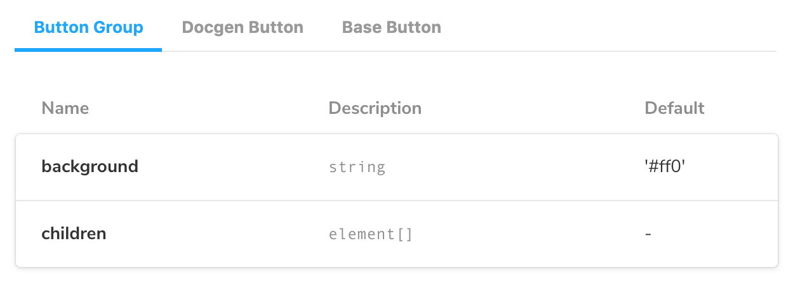

其实在使用手册的前两篇中，已经实现了组件文档的编写。开发过程中编写Story的同时，创建了基本的文档。


此外，Storybook还提供了一些工具，可以用内容和布局来拓展这个基本文档，以突出组件和Story。这在创建组件库的使用指南，设计系统网站时非常好用。下面是一个来自官方的案例


[addon-docs-optimized.mp4](https://storybook.js.org/1087b42ba17e96364b064e75c1d96d5e/addon-docs-optimized.mp4)


如果是第一次在你的项目中加入Storybook，可以使用DocsPage，这是一个文档模板，列出了一个组件的所有 Story 和相关的元数据。它根据源代码、类型和JSDoc注释来推断元数据值。如果你需要，你可以定制这个页面来创建你自己的自定义模板。


如果你已经在使用Storybook并且更新到最新版本，建议安装@storybook/addon-essentials，以便将这个和其他功能纳入项目。


也可以使用MDX为每个组件创建自由格式的页面，这是一种同时记录组件和编写故事的格式。在这两种情况下，需要使用Doc Blocks 作为构建模块来创建全功能的文档。Docs是自动配置的，可以在大多数使用情况下开箱即用。在某些情况下，可能需要调整配置，具体的使用可以参考 [addon-docs](https://storybook.js.org/addons/@storybook/addon-docs)


## DocsPage的使用


DocsPage 是一个零配置的默认文档，所有的Story都是开箱即得。它将Story、文本描述、docgen注释，args和代码实例都聚合到每一个组件的页面上。

> 你可以理解成，最后每个组件对应的那个文档页就是所谓的DocsPage

文档的最佳实践是，每个组件都有自己的DocPage 和Story。


### 组件参数


Storybook 使用Story文件中默认导出的 `component` 来提取组件的描述和属性。


```javascript
// MyComponent.stories.js|jsx|ts|tsx

import { MyComponent } from './MyComponent';

export default {
  /* 👇 The title prop is optional.
  * See https://storybook.js.org/docs/react/configure/overview#configure-story-loading
  * to learn how to generate automatic titles
  */
  title: 'MyComponent',
  component: MyComponent,
};

// Your stories
```


### 子组件参数


有时候需要展示多个组件组合使用的场景，比如Button和ButtonGroup，Select和SelectOptions。DocsPage提供了 `subcomponent` 属性来接受多个子组件。


```javascript
// ButtonGroup.stories.js|jsx

import { Button, ButtonGroup } from './ButtonGroup';

export default {
  /* 👇 The title prop is optional.
  * See https://storybook.js.org/docs/react/configure/overview#configure-story-loading
  * to learn how to generate automatic titles
  */
  title: 'ButtonGroup',
  component: ButtonGroup,
  subcomponents: { Button },
};
```





子组件的参数表格会以Tab的形式展示在文档中。


## 替换 DocsPage 的内容


当然你也可以自定义DocsPage的内容。


### 使用null去除文档


将 [`docs.page`](http://docs.page/) 设置为 `null` 可以去除文档的内容。


```javascript
// Button.stories.js|jsx|ts|tsx

import { Button } from './Button';

export default {
  /* 👇 The title prop is optional.
  * See https://storybook.js.org/docs/react/configure/overview#configure-story-loading
  * to learn how to generate automatic titles
  */
  title: 'Button',
  component: Button,
  argTypes: {
    backgroundColor: { control: 'color' },
  },
  parameters: {
    docs: {
      page: null,
    },
  },
};
```


### 使用 MDX 写文档


用MDX编写你的文档，更新docs.page参数来显示它。引用的id遵循的模式是：group-subgroup-...-name，其中组和子组的定义是根据分组文档的。


首先编写单独的MDX文件


```markdown
<!-- Custom-MDX-Documentation.mdx -->

# Replacing DocsPage with custom `MDX` content

This file is a documentation-only `MDX`file to customize Storybook's [DocsPage](https://storybook.js.org/docs/react/writing-docs/docs-page#replacing-docspage).

It can be further expanded with your own code snippets and include specific information related to your stories.

For example:

import { Story } from "@storybook/addon-docs";

## Button

Button is the primary component. It has four possible states.

- [Primary](#primary)
- [Secondary](#secondary)
- [Large](#large)
- [Small](#small)

## With the story title defined

If you included the title in the story's default export, use this approach.

### Primary

<Story id="example-button--primary" />

### Secondary

<Story id="example-button--secondary" />

### Large

<Story id="example-button--large" />

### Small

<Story id="example-button--small" />

## Without the story title defined

If you didn't include the title in the story's default export, use this approach.

### Primary

<Story id="your-directory-button--primary"/>

### Secondary

<Story id="your-directory-button--secondary"/>

### Large

<Story id="your-directory-button--large"/>

### Small

<Story id="your-directory-button--small" />
```


然后在Story中引入，


```javascript
// Button.stories.js|jsx|ts|tsx

import { Button } from './Button';

import CustomMDXDocumentation from './Custom-MDX-Documentation.mdx';

export default {
  /* 👇 The title prop is optional.
  * See https://storybook.js.org/docs/react/configure/overview#configure-story-loading
  * to learn how to generate automatic titles
  */
  title: 'Button',
  component: Button,
  argTypes: {
    backgroundColor: { control: 'color' },
  },
  parameters: {
    docs: {
      page: CustomMDXDocumentation,
    },
  },
};

const Template = (args) => ({
  //👇 Your template goes here
});

export const Primary = Template.bind({});
Primary.args = {
  backgroundColor: 'primary',
};

export const Secondary = Template.bind({});
Secondary.args = {
  backgroundColor: 'secondary',
};

export const Large = Template.bind({});
Large.args = {
  size: 'large',
};

export const Small = Template.bind({});
Small.args = {
  size: 'small',
};
```


### 使用自定义的组件


Storybook的UI界面使用React开发的。如果你想使用一个自定义组件来展示文档，可能需要一些项目所需的配置和环境。然后用自定义的组件替换 [`docs.page`](http://docs.page/) 参数即可。比如下面是自定义的组件，


```javascript
// CustomDocumentationComponent.js|jsx

import React from 'react';

export function CustomDocumentationComponent() {
  return (
    <div>
      <h1>Replacing DocsPage with a custom component</h1>
      <p>
        The Docs page can be customized with your own custom content written as a React Component.
      </p>
      <p>
       Write your own code here👇
      </p>
    </div>
  );
}
```


然后依样画葫芦替换参数，


```javascript
// Button.stories.js|jsx|ts|tsx

import { Button } from './Button';

import { CustomDocumentationComponent } from './CustomDocumentationComponent';

export default {
  /* 👇 The title prop is optional.
  * See https://storybook.js.org/docs/react/configure/overview#configure-story-loading
  * to learn how to generate automatic titles
  */
  title: 'Button',
  component: Button,
  argTypes: {
    backgroundColor: { control: 'color' },
  },
  parameters: {
    docs: {

      page: CustomDocumentationComponent,

    },
  },
};
```


### 混合使用 Doc blocks


 Doc blocks 是Storybook Docs的基本构建块。 DocsPage 对 Doc Block进行组合，提供一个靠谱的，开箱即用的UI文档体验。


如果你想对默认的DocsPage做一些小的定制，但又不想写你的MDX，你可以重新混合DocsPage。这样可以在不失去 Storybook 的自动文档生成功能的情况下，重新排序、添加或省略文档块。


下面是一个使用 Doc Block 为Button组件重建DocsPage的例子。


```javascript
// Button.stories.js|jsx

import React from 'react';

import {
  Title,
  Subtitle,
  Description,
  Primary,
  ArgsTable,
  Stories,
  PRIMARY_STORY,
} from '@storybook/addon-docs';

import { Button } from './Button';

export default {
  /* 👇 The title prop is optional.
  * See https://storybook.js.org/docs/react/configure/overview#configure-story-loading
  * to learn how to generate automatic titles
  */
  title: 'Button',
  component: Button,
  parameters: {
    docs: {
      page: () => (
        <>
          <Title />
          <Subtitle />
          <Description />
          <Primary />
          <ArgsTable story={PRIMARY_STORY} />
          <Stories />
        </>
      ),
    },
  },
};
```


## 结束语


简单介绍了Storybook中DocsPage的概念，以及DocsPage的使用方法。文中也提到了MDX和DocBlock，接下来的内容将详细介绍这两个新鲜事物。

