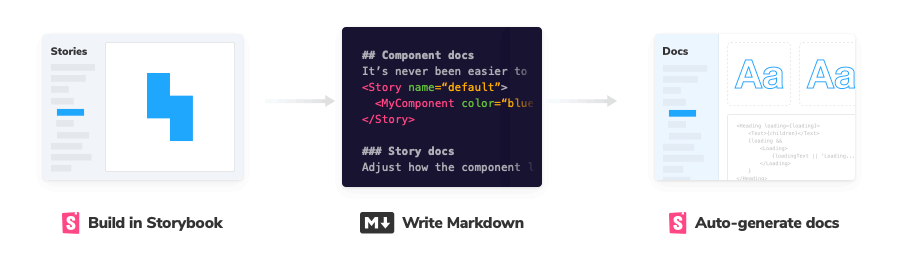
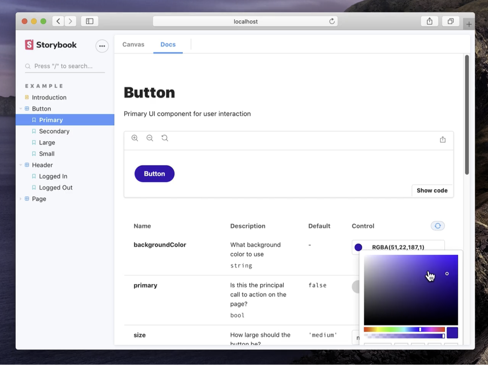
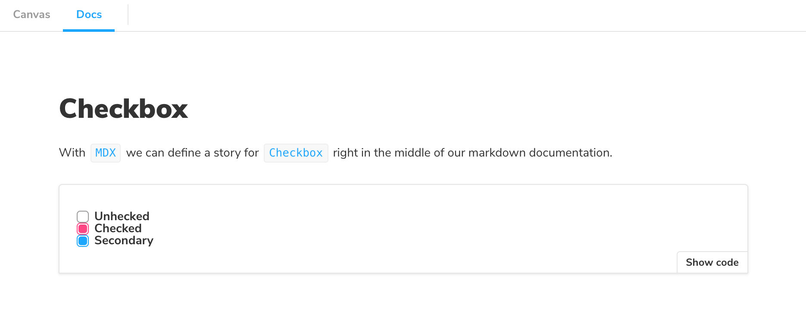
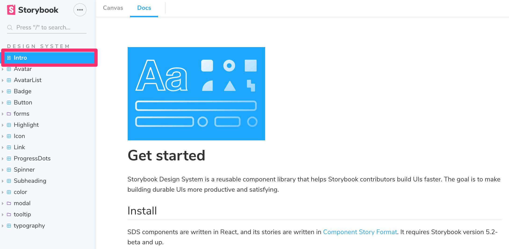

## MDX


MDX是一种标准的文件格式，由Markdown和JSX组合而成，文件后缀是`.mdx`。也就是说你可以在MDX中使用Markdown的语法编写内容，同时还能嵌入JSX编写的组件。


可以用MDX编写纯粹的文档，把文档和Story一起添加到Storybook中。





## Doc Blocks


顾名思义，就是文档中的块。一个Story渲染成的文档就是由若干个Block组成的。在Storybook中有不少Block。常见的可能是ArgsTable，Canvas和Story。


### ArgsTable


Story自动识别组件的Props，自动生成一个表格。表格中会列出这些参数，同时还提供了可交互的参数控制





[addon-controls-docs-optimized.mp4](https://storybook.js.org/386bdaed7a08de9d831f68e43e18142c/addon-controls-docs-optimized.mp4)


### Canvas


提供包含了一个控制条的可交互的画板，内部包含了Source这个Block，用于展示代码


更多Block的信息可以参考[这里](https://storybook.js.org/docs/vue/writing-docs/doc-block-argstable)。


## MDX的简单例子


```javascript
<!-- Checkbox.stories.mdx -->

import { Canvas, Meta, Story } from '@storybook/addon-docs';

import Checkbox from './Checkbox.vue';

<Meta title="MDX/Checkbox" component={Checkbox} />

export const Template = (args, { argTypes }) => ({
  props: Object.keys(argTypes),
  components: { Checkbox },
  template: '<Checkbox v-bind="$props" />',
});

# Checkbox

With `MDX`, we can define a story for `Checkbox` right in the middle of our
Markdown documentation.

<Canvas>
  <Story 
    name="Unchecked"
    args={{ 
      label: 'Unchecked',
    }}>
    {Template.bind({})}
   </Story>

  <Story 
    name="Checked"
    args={{ 
      label: 'Unchecked', 
      checked: true,
    }}>
    {Template.bind({})}
   </Story>
  
  <Story 
    name="Secondary"
    args={{
      label: 'Secondary', 
      checked: true, 
      appearance: 'secondary',
    }}>
    {Template.bind({})}
   </Story>
</Canvas>
```


最终会渲染在Storybook中，可以在页面的`Docs`中查看





可以看到，使用了`@storybook/addon-docs` 提供的几个组件：

- Meta： 用于描述当前组件文档页面的信息
- Canvas：绘制Story渲染使用的画板
- Story：创建一个Story

Story中用于配置的各项参数，都可以做为这几个组件各自的Props传入。比如，使用CSF文件时，我们这么写：


```javascript
// Checkbox.stories.js|jsx|ts|tsx

import { Checkbox } from './Checkbox';

export default {
  /* 👇 The title prop is optional.
  * See https://storybook.js.org/docs/react/configure/overview#configure-story-loading
  * to learn how to generate automatic titles
  */
  title: 'Checkbox',
  component: Checkbox,
};

const Template = (args) => ({
  //👇 Your template goes here
});


export const Unchecked = Template.bind({});
Unchecked.args = {
  label: 'Unchecked',
};
```


在使用MDX编写时，则是如下：


```javascript
<!-- Checkbox.stories.mdx -->

import { Canvas, Meta, Story } from '@storybook/addon-docs';

import Checkbox from './Checkbox.vue';

<Meta title="MDX/Checkbox" component={Checkbox} />

export const Template = (args, { argTypes }) => ({
  props: Object.keys(argTypes),
  components: { Badge },
  template: '<Badge v-bind="$props" />',
});

<Story
  name="Unchecked"
  args={{
    label: 'Unchecked',
  }}>
  {Template.bind({})}
</Story>
```


## 单纯的MDX文件


通常，在使用Storybook MDX时，在MDX中定义Story，而文档会自动与这些Story关联。


也可以编写不包含Story的MDX文档，将其与现有的Story相关联，或者将这个MDX作为文档节点嵌入Storybook的导航中。





MDX编写的方式和普通markdown大同小异，也是非常简单。


## 结束语


到目前为止，Storybook编写文档的基本方式已经介绍得差不多了。接下来将从一个组件库出发，演示如何使用Storybook，从零搭建一个文档站点。

