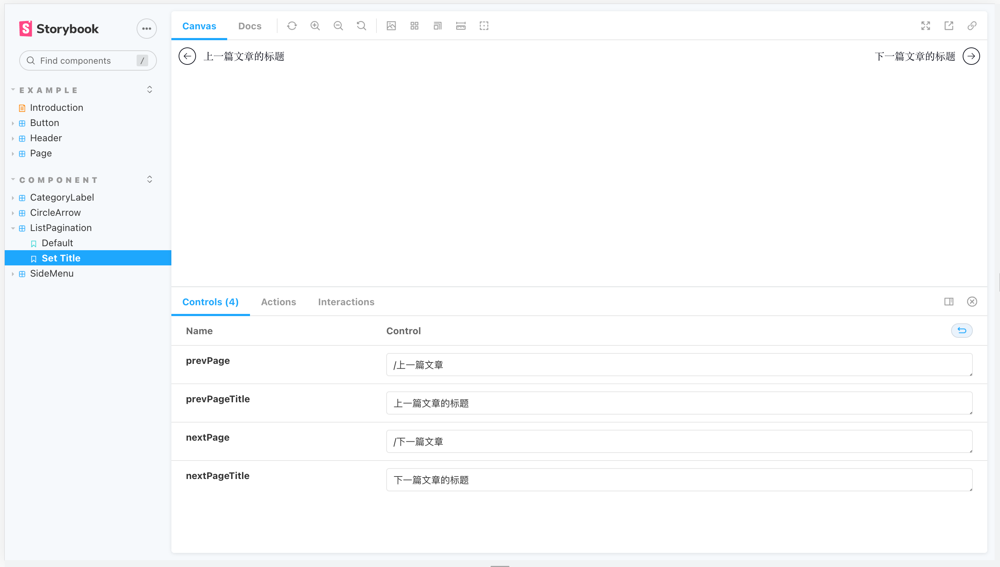
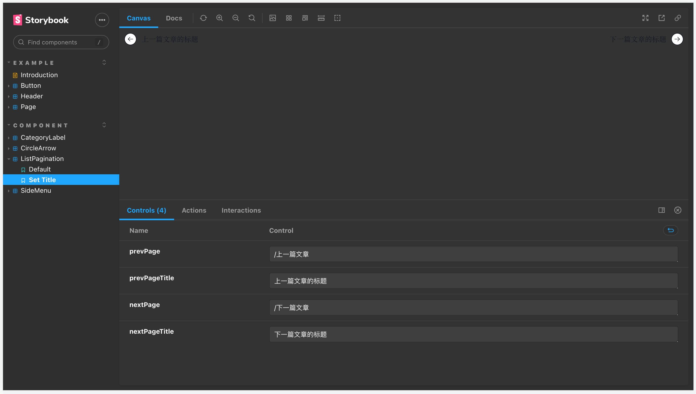
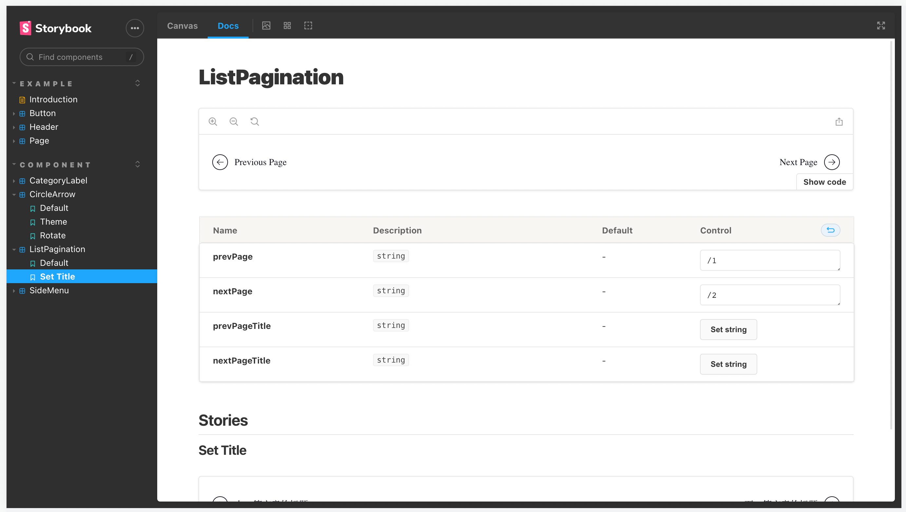
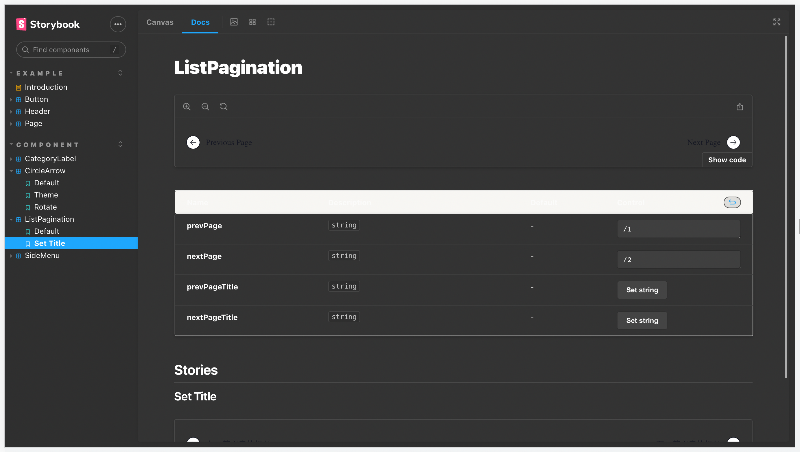
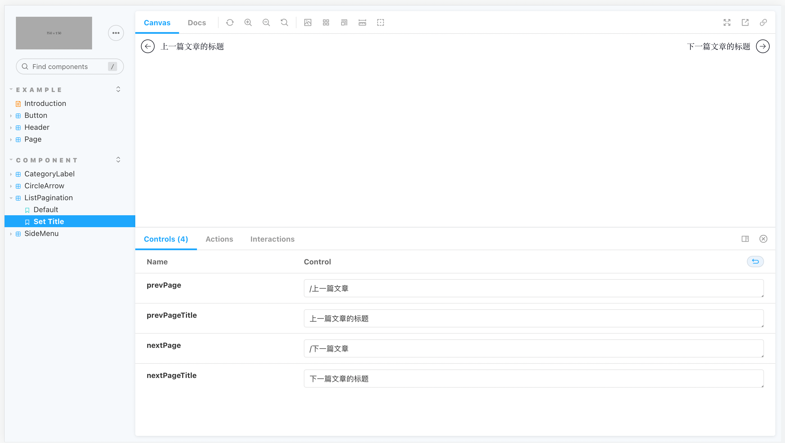
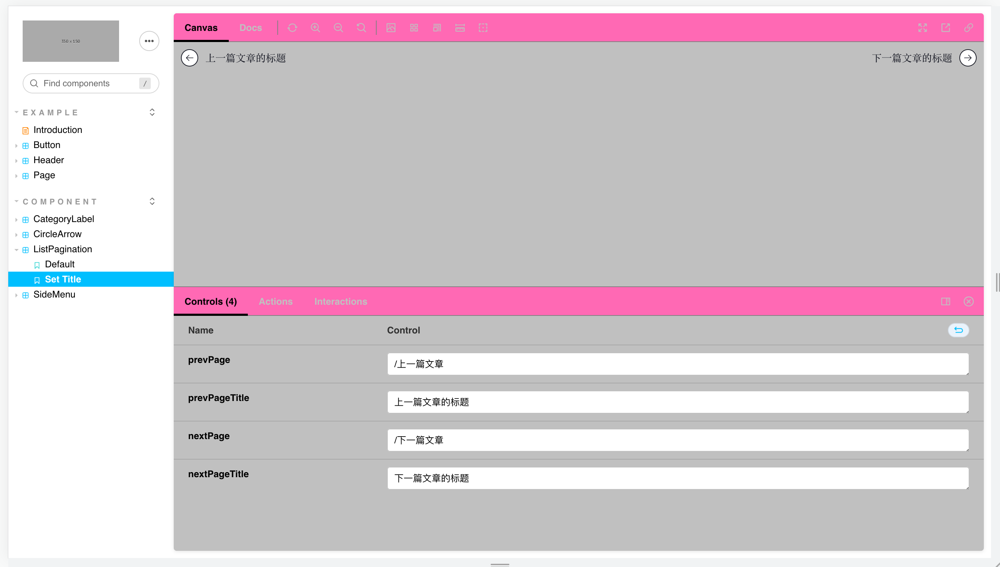
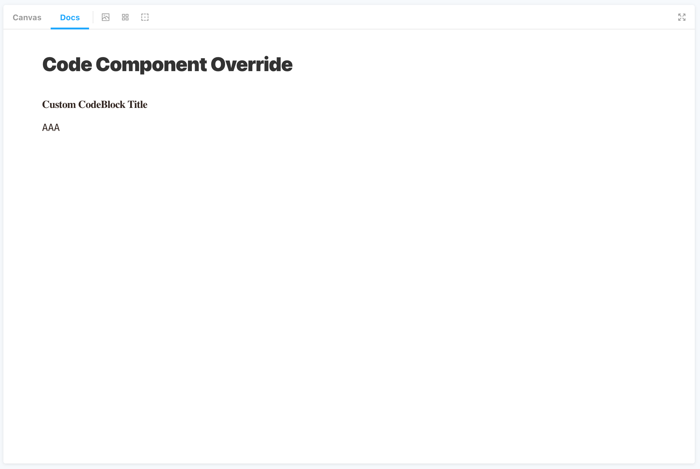

虽然Storybook 提供的默认的样式已经挺漂亮的，但是当在落地自己的设计系统时，还是希望能够在整体风格上做出属于自己的定制。Storybook 提供了主题配置相关的 API，只需要安装几个package。


## 修改 Storybook UI 布局(manager)


要想控制和修改 Storybook 的 UI 布局 (Storybook 官方称之为”manager“）你需要创建 `.storybook/manager.js` 。这个文件中没有什么特别的API，只有可设置的UI属性和可配置的theme属性。例如


```javascript
// .storybook/manager.js

import { addons } from '@storybook/addons';

addons.setConfig({
  isFullscreen: false,
  showNav: true,
  showPanel: true,
  panelPosition: 'bottom',
  enableShortcuts: true,
  showToolbar: true,
  theme: undefined,
  selectedPanel: undefined,
  initialActive: 'sidebar',
  sidebar: {
    showRoots: false,
    collapsedRoots: ['other'],
  },
  toolbar: {
    title: { hidden: false },
    zoom: { hidden: false },
    eject: { hidden: false },
    copy: { hidden: false },
    fullscreen: { hidden: false },
  },
});
```


具体的可以参阅下面的表格


| 名称              | 类型            | 描述                  | 例子                                  |
| --------------- | ------------- | ------------------- | ----------------------------------- |
| isFullscreen    | Boolean       | 全屏展示story组件         | false                               |
| showNav         | Boolean       | 展示用于显示story的面板      | false                               |
| showPanel       | Boolean       | 展示用于显示addon配置的面板    | true                                |
| panelPosition   | String/Object | 面板的位置               | bottom 或者 right                     |
| enableShortcuts | Boolean       | 启用/关闭快捷键            | true                                |
| showToolbar     | Boolean       | 显示/隐藏工具栏            | true                                |
| theme           | Object        | Storybook的主题        | undefined                           |
| selectedPanel   | String        | 选中的面板id             | storybook/actions/panel             |
| initialActive   | String        | 移动端默认选中还能够的tab      | sidebar/canvas/addons               |
| sidebar         | Object        | Sidebar的配置选项，请看下文   | { showRoots: false }                |
| toolbar         | Object        | 使用addon的ID修改工具栏中的工具 | { fullscreen: { hidden: false } } } |


**Sidebar 的配置**


| 名称             | 类型       | 描述                         | 例子                                                                  |
| -------------- | -------- | -------------------------- | ------------------------------------------------------------------- |
| showRoots      | Boolean  | 在侧边栏展示最顶层的根节点              | false                                                               |
| collapsedRoots | Array    | 设置默认收起的根节点                 | ['misc', 'other']                                                   |
| renderLabel    | Function | 为树节点创建自定义标签；必须返回 ReactNode | (item) => <abbr title="...">{[item.name](http://item.name/)}</abbr> |


**Toolbar 的配置**


| 名称 | 类型     | 描述         | 例子                |
| -- | ------ | ---------- | ----------------- |
| id | String | 切换工具栏项的可见性 | { hidden: false } |


## 设置内置主题


Storybook默认有两个开箱即用的主题：“light”和“dark”，默认使用亮色主题。如果想修改默认的主题，你需要先安装好两个依赖，[`@storybook/addons`](https://www.npmjs.com/package/@storybook/addons) and [`@storybook/theming`](https://www.npmjs.com/package/@storybook/theming) 。


```bash
yarn add --dev @storybook/addons @storybook/theming
```


然后在修改 `.storybook/manager.js` 中的配置


```javascript
// .storybook/manager.js

import { addons } from '@storybook/addons';
import { themes } from '@storybook/theming';

addons.setConfig({
  theme: themes.dark,
});
```








文档的主题的实现逻辑和全局主题类似，不过文档的主题设置是独立于全局主题的。所以你会看到文档区域还是亮色主题，看起来就像是bug了。


要想修改文档的主题，必须在 .storybook/preview.js 中增加主题的设置。





```javascript
// .storybook/preview.js

import { themes } from '@storybook/theming';

// or global addParameters
export const parameters = {
  docs: {
    theme: themes.dark,
  },
};
```





## 创建自己的主题


`@storybook/theming` 提供了一个`create()` 方法，用于快速创建自定义的Storybook主题。这个方法接收一个对象参数，用于自定义各种主题相关变量。


```typescript
export interface ThemeVars {
  base: 'light' | 'dark';

  colorPrimary?: string;
  colorSecondary?: string;

  // UI
  appBg?: string;
  appContentBg?: string;
  appBorderColor?: string;
  appBorderRadius?: number;

  // Typography
  fontBase?: string;
  fontCode?: string;

  // Text colors
  textColor?: string;
  textInverseColor?: string;
  textMutedColor?: string;

  // Toolbar default and active colors
  barTextColor?: string;
  barSelectedColor?: string;
  barBg?: string;

  // Form colors
  inputBg?: string;
  inputBorder?: string;
  inputTextColor?: string;
  inputBorderRadius?: number;

  brandTitle?: string;
  brandUrl?: string;
  brandImage?: string;
  brandTarget?: string;

  gridCellSize?: number;
}
```


那应该如何使用呢？你可以在任意目录创建一个 JavaScript 文件，这个文件导出 `create()` 方法执行之后的ThemeVar对象。然后在manager.js中使用这个对象就行了。通常我会讲这个文件放在Storybook的配置目录`.storybook` 中，以方便集中管理。


```javascript
// .storybook/MyTheme.js

import { create } from '@storybook/theming';

export default create({
  base: 'light',
  brandTitle: 'My custom storybook',
  brandUrl: 'https://example.com',
  brandImage: 'https://place-hold.it/350x150',
  brandTarget: '_self',
});
```


上面的代码片段创建了我自己的主题，具体来说它做了这些事情：

1. 使用Storybook的亮色主题作为基础
2. 替换侧边栏的logo
3. 添加了品牌信息
4. 设置了logo点击的跳转链接

然后再导入到manager.js 中使用。


```javascript
// .storybook/manager.js

import { addons } from '@storybook/addons';
import myTheme from './MyTheme';

addons.setConfig({
  theme: myTheme,
});
```





接下来看一个更复杂的例子，把自定义主题的配置中修改为如下内容。


```javascript
// .storybook/MyTheme.js

import { create } from '@storybook/theming';

export default create({
  base: 'light',

  colorPrimary: 'hotpink',
  colorSecondary: 'deepskyblue',

  // UI
  appBg: 'white',
  appContentBg: 'silver',
  appBorderColor: 'grey',
  appBorderRadius: 4,

  // Typography
  fontBase: '"Open Sans", sans-serif',
  fontCode: 'monospace',

  // Text colors
  textColor: 'black',
  textInverseColor: 'rgba(255,255,255,0.9)',

  // Toolbar default and active colors
  barTextColor: 'silver',
  barSelectedColor: 'black',
  barBg: 'hotpink',

  // Form colors
  inputBg: 'white',
  inputBorder: 'silver',
  inputTextColor: 'black',
  inputBorderRadius: 4,

  brandTitle: 'My custom storybook',
  brandUrl: 'https://example.com',
  brandImage: 'https://place-hold.it/350x150',
  brandTarget: '_self',
});
```





## 使用模板开发更强的主题


Storybook的主题API接口设计得将将好，满足大部分基础的功能。虽然方便，但是也有所限制。如果你想更加细粒度地控制样式，需要给UI和文档的组件添加Class。


想给这些元素增加样式，可以把样式标签插入到：

- Storybook 的 UI，使用 `.storybook/manager-head.html`
- Storybook 的文档，使用 `.storybook/preview-head.html`

## 覆盖 MDX 组件


如果你是用MDX格式编写文档，可以使用components的parameter参数，在Markdown中覆盖重写渲染组件。这是一个高级用法，在Storybook中不会正式支持。


要想使用这个特性，你只需要修改 `.storybook/preview.js`。


```javascript
// .storybook/preview.js

import React from 'react';

const CodeBlock = ({ children }) => {
  return (
    <div>
      <h3>Custom CodeBlock Title</h3>
      <div>
        {children}
      </div>
    </div>
  )
}

export const parameters = {
  docs: {
    components: {
      code: CodeBlock,
    },
  },
};
```





你甚至还可以重写 Storybook 的组件。


```javascript
// .storybook/preview.js

import { MyCanvas } from './MyCanvas';

export const parameters = {
  docs: {
    components: {
      Canvas: MyCanvas,
    },
  },
};
```


## 结束语


Storybook提供了轻量级的主题API，我们可以使用这些API快速定制文档的样式。如果想对样式有更细粒度的掌控，还可以使用其提供的模板能力对样式进行更强的定制。除了样式，Storybook还支持自定义文档的渲染组件。如果你对文档有自己独特的设计思考，可以利用其能力，拓展出属于自己的独一无二的文档。

