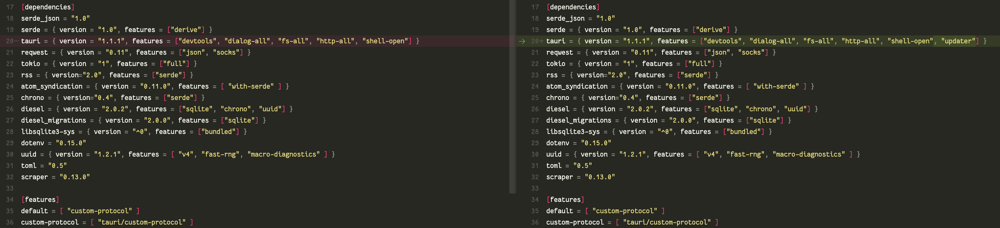
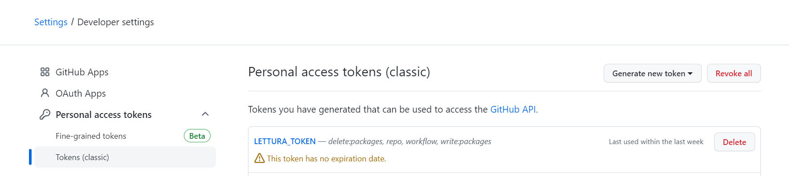
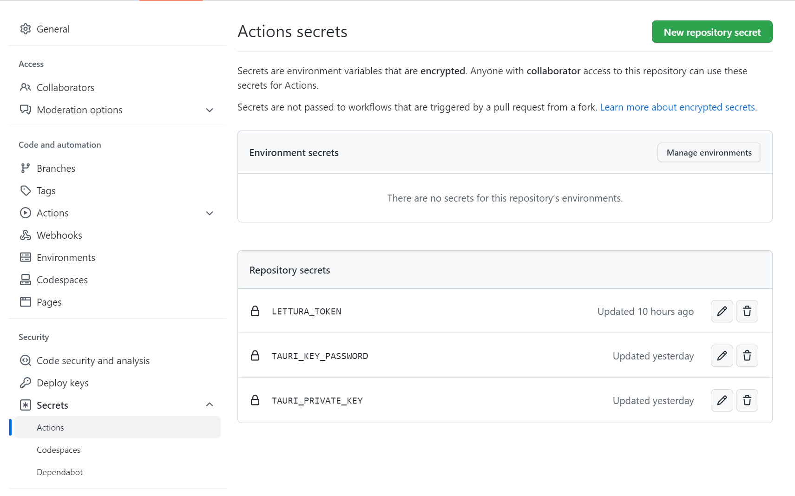
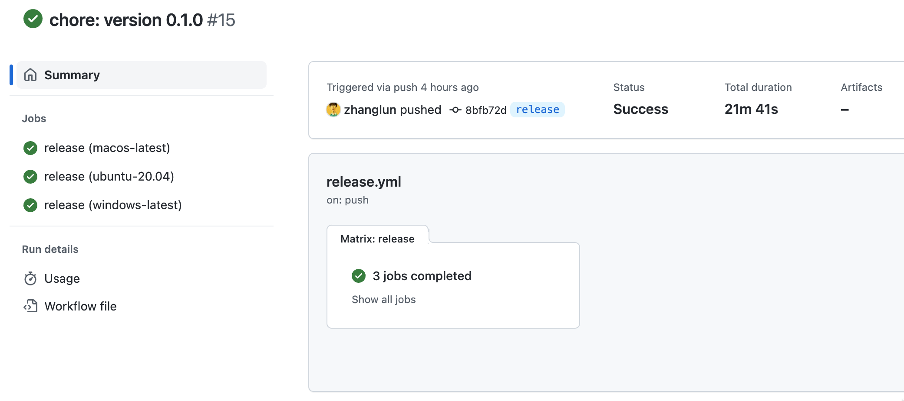
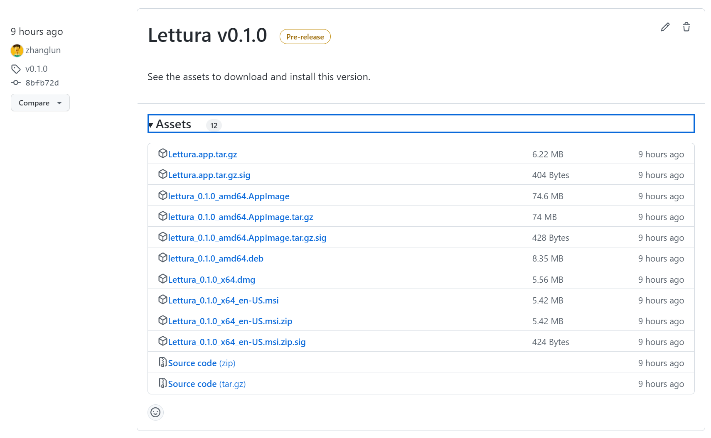
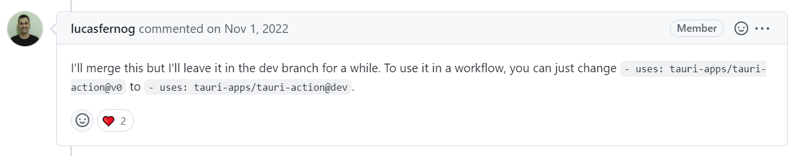
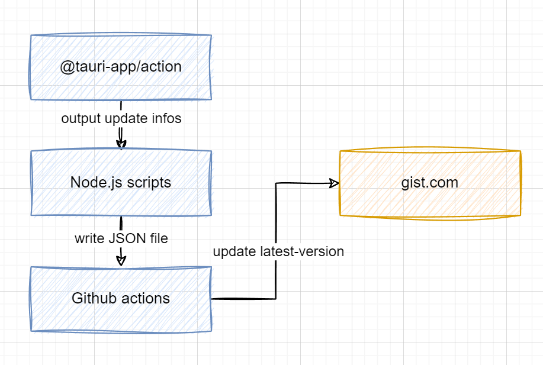

本文主要内容来自：[https://tauri.app/v1/guides/distribution/updater](https://tauri.app/v1/guides/distribution/updater)。不保证时效性，但是可做参考。


[Lettura](https://github.com/zhanglun/lettura) 已经发了三个预览版本了，目前基础功能已经差不多了。在发布正式版本之前，将升级提示的能力补充上。Tauri 在升级提示这块做了一些封装，整体来说还是相对比较简单的。


## 版本更新的机制


在`tauri.conf.json` 中增加 `updater` 配置。


```json
"updater": {
    "active": true,
    "endpoints": [
        "https://releases.myapp.com/{{target}}/{{current_version}}"
    ],
    "dialog": true,
    "pubkey": "YOUR_UPDATER_SIGNATURE_PUBKEY_HERE"
}
```


| key      | type    | description                                                                      |
| -------- | ------- | -------------------------------------------------------------------------------- |
| active   | Boolean | 必填项。是否开启更新检查，默认 `false`                                                          |
| endpoint | Array   | 必填项。更新检查的版本地址，按照顺序检查，直到最后一个地址。字符串 {{target}} 和 {{current_version}} 会在 URL 中自动替换。 |
| dialog   | Boolean | 可选项。默认`true`。开启之后，当更新执行时，Tauri 的事件会被关闭掉。如果想在更新时自定义事件，必须设置为`false`。               |
| pubkey   | String  | 必填项。一个使用Tauri CLI创建的可用的公钥。                                                       |


然后要准备好服务端的支持，以告知Tauri是否需要更新。在服务端侧，返回的JSON数据有两种格式。第一种返回如下的JSON:


```json
{
  "url": "https://mycompany.example.com/myapp/releases/myrelease.tar.gz",
  "version": "0.0.1",
  "notes": "Theses are some release notes",
  "pub_date": "2020-09-18T12:29:53+01:00",
  "signature": ""
}
```


适合 endpoint 包含 `{{target}}` 和 `{{current_version}}` 的情况，比如：`https://releases.myapp.com/{{target}}/{{current_version}}`。Tauri 会根据用户当前的操作系统替换`target`，使用当前的App 版本替换`current_version`。在[这里](https://github.com/tauri-apps/tauri/blob/75a0c79dea39e3e8372097152a0fa82cf6493686/core/tauri/src/updater/core.rs#L364)看到其具体的实现。


第二种则包含了更多平台信息，适合endpoints是固定URL的情况。Tauri 会检查 `version` 字段，如果正在运行的APP的 `version` 小于返回的`version`，那么触发一个更新。你可以把信息保存在JSON文件中，托管在一些静态服务上，比如[这里](https://gist.githubusercontent.com/zhanglun/9094b65b31879a79063f396a254830e1/raw/096c55708d97b80e7a27da143f3f8d6e25609497/lettura-update-info.json)是Lettura项目的更新文件。


```json
{
  "version": "v1.0.0",
  "notes": "Test version",
  "pub_date": "2020-06-22T19:25:57Z",
  "platforms": {
    "darwin-x86_64": {
      "signature": "",
      "url": "https://github.com/lemarier/tauri-test/releases/download/v1.0.0/app.app.tar.gz"
    },
    "darwin-aarch64": {
      "signature": "",
      "url": "https://github.com/lemarier/tauri-test/releases/download/v1.0.0/silicon/app.app.tar.gz"
    },
    "linux-x86_64": {
      "signature": "",
      "url": "https://github.com/lemarier/tauri-test/releases/download/v1.0.0/app.AppImage.tar.gz"
    },
    "windows-x86_64": {
      "signature": "",
      "url": "https://github.com/lemarier/tauri-test/releases/download/v1.0.0/app.x64.msi.zip"
    }
  }
}
```


当你在`tauri.conf.json` 中增加 `update` 相关的配置时，Tauri 启动时会自动更新 `Cargo.toml` 的配置。不得不说，Tauri在开发者体验这块做的真不错。





另外，当你开启了update设置之后, Tauri 在每次构建时会按照操作系统，构建出更新使用的产物，输出约定的目录结构。


**macOS**


```json
target/release/bundle
└── macos
    └── app.app
    └── app.app.tar.gz (update bundle)
    └── app.app.tar.gz.sig
```


**Windows**


```json
target/release/bundle
└── macos
    └── app.app
    └── app.app.tar.gz (update bundle)
    └── app.app.tar.gz.sig
```


**Linux**


```json
target/release/bundle
└── appimage
    └── app.AppImage
    └── app.AppImage.tar.gz (update bundle)
    └── app.AppImage.tar.gz.sig
```


## 创建更新的签名


为了确保应用更新能够安全的被安装，Tauri提供了一个内置的签名。对更新进行签名，需要做两件事情：

1. 将公钥添加到`tauri.conf.json`，应用更新被在安装之前将会进行验证。
2. 使用私钥对更新进行签名。
> 私钥必须保存好。每次发布更新都需要使用私钥。如果私钥丢失或者修改了，用户将无法顺利更新应用。用户只有一种选择，那就是下载最新的安装包，重新安装应用。

使用Tauri提供的命令创建好key之后，记得保存好。


```bash
tauri signer generate -w ~/.tauri/lettura.key

Generating new private key without password.
Please enter a password to protect the secret key.
Password:
Password (one more time):
Deriving a key from the password in order to encrypt the secret key... done

Your keypair was generated successfully
Private: /Users/zhanglun/.tauri/lettura.key (Keep it secret!)
Public: /Users/zhanglun/.tauri/lettura.key.pub
---------------------------

Environment variables used to sign:
`TAURI_PRIVATE_KEY`  Path or String of your private key
`TAURI_KEY_PASSWORD`  Your private key password (optional)

ATTENTION: If you lose your private key OR password, you'll not be able to sign your update package and updates will not work.
---------------------------
```


在 [https://github.com/settings/tokens](https://github.com/settings/tokens) 添加 Github Action 需要使用的 token，以允许workflow运行时有权限访问仓库。

1. 访问 [https://github.com/settings/tokens](https://github.com/settings/tokens)，创建新的 token。



1. 访问 仓库的设置页面， 将 token 保存到 Actions secrets 中




## 配置Github Action


为了方便操作，我将 `TAURI_KEY_PASSWORD` 和  `TAURI_PRIVATE_KEY` 也一并保存在secrets中。然后按照[官方的教程](https://tauri.app/zh-cn/v1/guides/building/cross-platform) 增加 workflow 配置：


```yaml
name: 'Publish'
on:
  push:
    branches:
      - release
env:
  TAURI_PRIVATE_KEY: ${{ secrets.TAURI_PRIVATE_KEY }}
  TAURI_KEY_PASSWORD: ${{ secrets.TAURI_KEY_PASSWORD }}

jobs:
  release:
    strategy:
      fail-fast: false
      matrix:
        platform: [macos-latest, ubuntu-20.04, windows-latest]
    runs-on: ${{ matrix.platform }}
    steps:
      - name: Checkout repository
        uses: actions/checkout@v3

      - name: Install dependencies (ubuntu only)
        if: matrix.platform == 'ubuntu-20.04'
        # You can remove libayatana-appindicator3-dev if you don't use the system tray feature.
        run: |
          sudo apt-get update
          sudo apt-get install -y libgtk-3-dev libwebkit2gtk-4.0-dev libayatana-appindicator3-dev librsvg2-dev

      - name: Rust setup
        uses: dtolnay/rust-toolchain@stable

      - name: Rust cache
        uses: swatinem/rust-cache@v2
        with:
          workspaces: './src-tauri -> target'

      - name: Sync Pnpm version
        uses: pnpm/action-setup@v2
        with:
          version: 6.32.9
      - name: Sync node version and setup cache
        uses: actions/setup-node@v3
        with:
          node-version: 'lts/*'
          cache: 'pnpm'

      - name: Install app dependencies and build web
        # Remove `&& yarn build` if you build your frontend in `beforeBuildCommand`
        run: pnpm install

      - name: Build the app
        uses: tauri-apps/tauri-action@v0
        env:
          GITHUB_TOKEN: ${{ secrets.LETTURA_TOKEN }}
        with:
          tagName: 'v__VERSION__' # This only works if your workflow triggers on new tags.
          releaseName: 'Lettura v__VERSION__' # tauri-action replaces \_\_VERSION\_\_ with the app version.
          releaseBody: 'See the assets to download and install this version.'
          releaseDraft: false
          prerelease: true
```


每当 release 分支推送新代码，就会触发 Tauri 的版本构建和发布过程。





如果一切顺利的话，在Release页面可以看到自动创建的release记录。





## 更新版本信息


现在构建发布的流程已经完成了，接下来需要想办法拿到更新信息，保存到JSON中，以更新到gist。翻了Tauri Action的一些issuse，找到了相关内容。社区讨论过关于在Action中支持生成updater JSON的话题 [https://github.com/tauri-apps/tauri-action/pull/287](https://github.com/tauri-apps/tauri-action/pull/287)，使用dev版本的Action可以在最后release之后创建lastest.json文件，随同产物一起发布。





这里有一个可以参考的案例: [https://github.com/Layendan/NineAnimator-Tauri/blob/master/.github/workflows/publish.yml](https://github.com/Layendan/NineAnimator-Tauri/blob/master/.github/workflows/publish.yml)。不过考虑到这个能力的几个问题：

1. 没出现在官方文档，可以认为是不稳定的，不推荐的。
2. 输出latest.json，但是没有更新到gist的能力。
3. 更新到gist的能力算是我的私人订制，自己实现更合适

最后决定自己实现创建JSON内容和更新gist的能力。基本的思路如下图所示：





2023-04-25更新：


社区推荐使用tauri-app/tauri-aciton@dev创建 latest.json [https://github.com/tauri-apps/tauri/discussions/6385](https://github.com/tauri-apps/tauri/discussions/6385)

