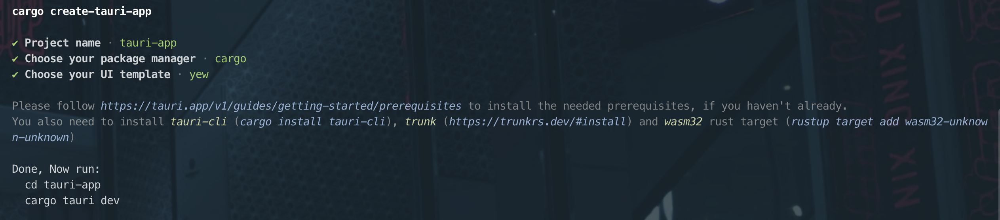

在项目[Pavo](https://github.com/zhanglun/pavo)中尝试使用Rust来实现Web前端部分的实现，选择了Yew作为前端框架。Yew是用Rust编写的前端框架，通过编译成WASM将代码运行在浏览器中。WASM生态系统和Yew仍处于快速发展阶段，网上的一些资料五花八门，有些甚至已经过时了。


在这个项目中，我将在能使用Rust的场景都使用Rust，尝试深度体验Rust生态的一切。作为第一次体验，这里写下一些记录和体验。


## 安装依赖


### Rust


[Rust官方安装教程](https://www.rust-lang.org/tools/install)


### Tauri


[安装Tauri](https://tauri.app/v1/guides/getting-started/setup/)，使用Tauri提供的项目模板：


```shell
cargo install create-tauri-app
cargo create-tauri-app
```


按照提示选择





### Yew


Rust 可以编译源代码输出给不同的操作系统或者平台。基于浏览器的 WebAssembly 的编译目标是`wasm32-unknown-unknown`。Yew依赖WASM的环境，需要提前准备好。


```shell
rustup target add wasm32-unknown-unknown
```


安装trunk，一个WASM Web开发打包工具。


```shell
cargo install --locked trunk
```


## 项目配置


### 配置 TailwindCSS


在`Trunk.toml`中增加hooks设置，每次build前执行一次 TailwindCSS 的编译。


```toml
[[hooks]]
stage = "pre_build"
command = "npx"
command_arguments = ["tailwindcss", "-i", "./src/root.css", "-o", "assets/styles.css", "--minify"]
```

