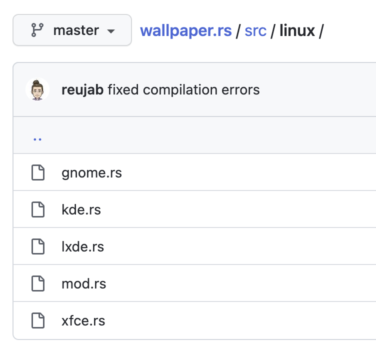

## 使用wallpaper.rs修改壁纸


在开发 [Pavo](https://github.com/zhanglun/pavo) 项目时，使用网友开发的 [wallpaper.rs](https://github.com/reujab/wallpaper.rs)实现壁纸的切换能力。其使用方式非常简单，提供了`get()`、`set_from_path()`、`set_from_url()`和`set_mode()`四个方法。


```rust
use wallpaper;

fn main() {
    // Returns the wallpaper of the current desktop.
    println!("{:?}", wallpaper::get());
    // Sets the wallpaper for the current desktop from a file path.
    wallpaper::set_from_path("/usr/share/backgrounds/gnome/adwaita-day.png").unwrap();
    // Sets the wallpaper style.
    wallpaper::set_mode(wallpaper::Mode::Crop).unwrap();
    // Returns the wallpaper of the current desktop.
    println!("{:?}", wallpaper::get());
}
```


在Window10上开发时，一切顺利。在切换到MacOS时，遇到了如下的报错：


```shell
thread 'tokio-runtime-worker' panicked at 'called `Result::unwrap()` on 
an `Err` value: "unsupported on macos"', src-tauri/src/services/bing.rs:142:52
```


对应的代码是 wallpaper.rs 提供的`set_mode`方法，用于设置壁纸模式。


```rust
wallpaper::set_mode(wallpaper::Mode::Crop).unwrap();
```


我的第一反应是在代码中判断当前操作系统，执行对应的逻辑。但是在此之前，我想先看看 [wallpaer.rs](http://wallpaer.rs/) 实现，为什么 `set_mode` 在 macOS 上不支持呢？


## wallpaper.rs的实现原理


wallpaper.rs的源码其实非常简单清晰。针对Window、Linux 和 MacOS 三种的系统，调用系统命令或者可用的API等实现壁纸的设置能力。在Window系统使用的是[https://crates.io/crates/winapi](https://crates.io/crates/winapi)，这不是微软官方提供的包，但是下载量非常高。其中`set_mode`的实现如下：


```rust
/// Sets the wallpaper style.
pub fn set_mode(mode: Mode) -> Result<()> {
    let hkcu = RegKey::predef(HKEY_CURRENT_USER);
    let (desktop, _) = hkcu.create_subkey(r"Control Panel\Desktop")?;

    desktop.set_value(
        "TileWallpaper",
        &match mode {
            Mode::Tile => "1",
            _ => "0",
        }
        .to_string(),
    )?;

    // copied from https://searchfox.org/mozilla-central/rev/5e955a47c4af398e2a859b34056017764e7a2252/browser/components/shell/nsWindowsShellService.cpp#493
    desktop.set_value(
        "WallpaperStyle",
        &match mode {
            // does not work with integers
            Mode::Center | Mode::Tile => "0",
            Mode::Fit => "6",
            Mode::Span => "22",
            Mode::Stretch => "2",
            Mode::Crop => "10",
        }
        .to_string(),
    )?;

    // updates wallpaper
    set_from_path(&get()?)
}
```


在Linux系统中，针对不同Linux桌面环境，调用不同的命令，做差异化的适配。





比如Gnome桌面调用`gsettings`，`set_mode`的实现如下：


```rust
pub fn set_mode(mode: Mode) -> Result<()> {
    run(
        "gsettings",
        &[
            "set",
            "org.gnome.desktop.background",
            "picture-options",
            &mode.get_gnome_string(),
        ],
    )
}

impl Mode {
    pub(crate) fn get_gnome_string(self) -> String {
        enquote::enquote(
            '"',
            match self {
                Mode::Center => "centered",
                Mode::Crop => "zoom",
                Mode::Fit => "scaled",
                Mode::Span => "spanned",
                Mode::Stretch => "stretched",
                Mode::Tile => "wallpaper",
            },
        )
    }
}
```


再比如KDE桌面执行 `eval()`，其实现如下：


```rust
pub fn set_mode(mode: Mode) -> Result<()> {
    eval(&format!(
        r#"
for (const desktop of desktops()) {{
    desktop.currentConfigGroup = ["Wallpaper", "org.kde.image", "General"]
    desktop.writeConfig("FillMode", {})
}}"#,
        match mode {
            Mode::Center => 6,
            Mode::Crop => 2,
            Mode::Fit => 1,
            Mode::Span => 2,
            Mode::Stretch => 0,
            Mode::Tile => 3,
        }
    ))
}
```


但是在 macOS 的实现上则是：


```rust
/// No-op. Unable to change with AppleScript.
pub fn set_mode(_: Mode) -> Result<()> {
    Err("unsupported on macos".into())
}
```


原来是这里抛出的错误！无法通过AppleScript设置mode。


## 使用条件编译区分系统


条件编译是指根据某些条件来决定特性代码是否被视为源代码的一部分。


可以使用属性 `cfg` 和 `cfg_attr`，还有内置 `cfg` 宏来有条件地编译源代码。这些条件基于：已编译的crate的目标体系结构，传递给编译器的任意值，以及其他一些杂项。例如


```rust
#[cfg(foo)] // 如果配置了foo选项，则为true；如果没有配置则为false。
#[cfg(bar = "baz")] // 如果bar选项的值是"baz"，则为true；如果没有配置则为false。
```


`cfg`还支持`any`、`all`、`not`等逻辑谓词组合。


```rust
#[cfg(any(unix, windows))] // 如果至少一个谓词为true，则为true。如果没有谓词，则为false。
#[cfg(all(unix, target_pointer_width = "32"))] // 只要有一个谓词为false，则为false。如果没有谓词，那就是true。
#[cfg(not(foo))] // 如果其谓词为false，则为true；如果其谓词为true，则为false。
```


你甚至可以任意组合嵌套：


```rust
#[cfg(any(not(unix), all(target_os="macos", target_arch = "powerpc")))]
```


在官方文档中可以找到对和操作系统相关的编译选项[`target_os`](https://rustwiki.org/zh-CN/reference/conditional-compilation.html#target_os)。


```rust
target_os: 
	"windows" | 
	"macos" | 
  "ios" |
  "linux" | 
  "android" | 
  "freebsd" | 
  "dragonfly" | 
  "openbsd" | 
  "netbsd"
```


`cfg`属性允许在任何允许属性的地方上使用，我可以使用 target_os 解决上文提到的编译问题：


```rust
// 该函数只会在编译目标为 macOS 时才会包含在构建中
#[cfg(target_os = "macos")]
fn macos_only() {
  // ...
}

// 该函数只会在编译目标为 Windows 时才会包含在构建中
#[cfg(target_os = "windows")]
fn window_only() {
  // ...
}
```


`cfg_attr`用法稍微有一些不同。从它的定义中就能看出，第一个是断言，第二个是候选的属性：


```rust
cfg_attr(ConfigurationPredicate , CfgAttrs?)
```


`cfg_attr`属性根据配置谓词有条件地包含属性。当配置谓词为真时，此属性展开为谓词后列出的属性。例如：


```rust
#[cfg_attr(target_os = "linux", path = "linux.rs")] 
#[cfg_attr(target_os = windows, path = "windows.rs")]
mod os;
```


当编译目标系统是 linux 时，path为linux.rs，当编译目标系统是windows时，path为windows.rs。可以列出零个、一个或多个属性。多个属性将各自展开为单独的属性。例如：


```rust
#[cfg_attr(feature = "magic", sparkles, crackles)]
fn bewitched() {}

// 当启用了 `magic` 特性时, 上面的代码等效于:
#[sparkles]
#[crackles]
fn bewitched() {}
```


同样的`cfg_attr` 属性允许在任何允许属性的地方上使用。


除此之外，rust还提供了 cfg 宏。内置的 `cfg`宏接受单个配置谓词，当谓词为真时计算为 `true` 字面量，当谓词为假时计算为 `false` 字面量。例如：


```rust
let machine_kind = if cfg!(unix) {
  "unix"
} else if cfg!(windows) {
  "windows"
} else if cfg!(target_or="macos") {
  "macos"
};

println!("I'm running on a {} machine!", machine_kind);
```


回到我自己的场景 我只需要增加一点点小小的逻辑就能解决前面提到的报错问题。


```rust
if cfg!(not(target_os="macos")) {
  wallpaper::set_mode(wallpaper::Mode::Crop).unwrap();
}
```


问题完美解决了。

