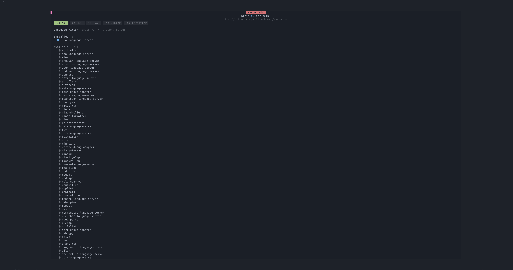
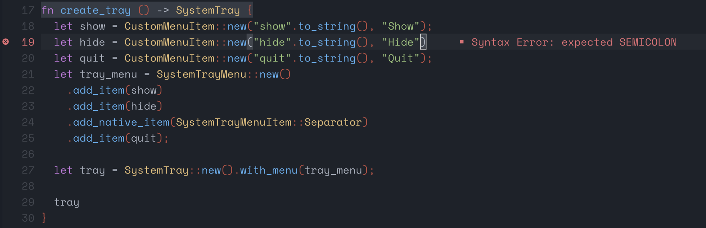

Neovim 是一个基于Vim的可拓展的文本编辑器，可通过一些插件和配置，将其打造成一个顺手的开发工具。


今天在推特上看到有人分享 [lazy.nvim](https://github.com/folke/lazy.nvim)，这让我想到自己在过去配置Vim的日子，突然来了兴致，想体验一把。Neovim老早也安装过了，一直还是习惯在终端上使用vim，这次就来捣鼓一下，体验新的生产工具。


[bookmark](https://github.com/neovim/neovim/wiki/Installing-Neovim)


```shell
brew install neovim
```


按照lazy.nvim的文档和它提供的模板 [https://github.com/LazyVim/starter](https://github.com/LazyVim/starter) 试着配了一下，挺简单的。但是每次启动nvim的时候总是无法顺利进入，需要按一次Cmd+C，同时会出现一个一闪而过的报错信息，一时之间不知该如何解决。


我又尝试了老牌插件管理工具 [packer.nvim](https://github.com/wbthomason/packer.nvim)，安装和启动都很顺利。但是，此时我才意识到：我这只是安装了一个插件管理工具，个性化的配置还得自己一个个调试配置，想想就挺麻烦的。毕竟很久没有折腾这些东西了，对这块的插件生态不是那么了解。


于是乎我决定，找一个现成包装的好的配置或者工具呗！这么活跃的项目，肯定是有。搜索之后发现，无论是插件管理工具还是网友们共享的个性化配置，各有千秋。我也不做所谓的“技术选型”了，就从热门的，简单的，好看的几个方向来做选择吧。我选择了这个 NcChad。他的官网做的挺好的😄。


NcChad是一个使用Lua语言编写的Neovim配置，有着漂亮的UI和极快的启动速度。安装和使用也挺简单的。


```shell
git clone https://github.com/NvChad/NvChad ~/.config/nvim --depth 1 && nvim
```


可能你需要备份或者删除掉之前配置


```shell
rm -rf ~/.config/nvim
rm -rf ~/.local/share/nvim
rm -rf ~/.cache/nvim
```


顺利安装之后就能看到这个界面了





可以看到 NcChad 使用了 [mason.nvim](https://github.com/williamboman/mason.nvim) 来管理外部插件，比如 LSP server、DAP server、linter和formatter等。在我的一通操作安装好了常用的一些插件。接下来在日常工作中多用用，慢慢完善属于自己的定制配置。


可以按照官方给到的建议，组织如下所示的目录结构，在custom目录来维护自己的个性化配置。


```shell
├── init.lua
│
├── lua
│   │
│   ├── core
│   │   ├── default_config.lua
│   │   ├── mappings.lua
│   │   ├── options.lua
│   │   ├── utils.lua  -- (core util functions) (i)
│   │   └── init.lua  -- (autocmds)
│   │
│   ├── plugins
│   │    ├── init.lua -- (default plugin list)
│   │    └── configs
│   │        ├── cmp.lua
│   │        ├── others.lua -- (list of small configs of plugins)
│   │        └── many more plugin configs
|   |
│   ├── custom *
│   │   ├── chadrc.lua -- (overrides default_config)
│   │   ├── init.lua -- (runs after main init.lua file)
│   │   ├── more files, dirs
```


若想将Neovim作为日常开发，还需要自定义一些配置。因为Neovim是基于Vim的文本编辑器，默认情况下，即使访问编程语言，其内容也是单纯的文本。如果你想让Neovim像IDE一样对编程语言支持语法高亮和检测时，你需要增加一下LSP的设置。

> 什么是LSP？语言服务协议（Language Server Protocol，简称LSP）是一种开源的语言服务器协定，由红帽、微软和 Codenvy 联合推出，可以让不同的程序编辑器与集成开发环境（IDE）方便嵌入各种程序语言，允许开发人员在最喜爱的工具中使用各种语言来撰写程序。

基于 [https://github.com/NvChad/example_config](https://github.com/NvChad/example_config) 可以快速设置属于自己的LSP配置。下面是的lspconfig.lua。我采用了默认配置，不够用再做更加精细化的定制。


```lua
-- custom.plugins.lspconfig
local on_attach = require("plugins.configs.lspconfig").on_attach
local capabilities = require("plugins.configs.lspconfig").capabilities

local nvim_lsp = require "lspconfig"
local servers = { "html", "cssls", "cssmodule_ls", "tailwindcss", "rust_analyzer", "jsonls", "purescriptls", "rome", "stylelint_lsp", "tsserver", "volar"}

for _, lsp in ipairs(servers) do
  nvim_lsp[lsp].setup {
    on_attach = on_attach,
    capabilities = capabilities,
  }
end
```


基于example_config，我只要增加我想要的 LSP server就行。配置修改好之后，启动Neovim，执行一次 `:PackerCompile`。重启之后就能看到实际效果啦。





为了保证多个设备上的Neovim配置的一致性，我使用 Github 来托管我自己的配置，点击[这里](https://github.com/zhanglun/neovim-config)可查看。


这几天使用Neovim的场景是Rust开发，但是格式化和缩进这两个操作的使用有点不顺手。这一块也需要额外做一些定制，涉及到Packer.nvim的使用了。它提供了几个命令，使用也很简单。


```lua
-- Regenerate compiled loader file
:PackerCompile

-- Remove any disabled or unused plugins
:PackerClean

-- Clean, then install missing plugins
:PackerInstall

-- Clean, then update and install plugins
:PackerUpdate

-- Perform `PackerUpdate` and then `PackerCompile`
:PackerSync

-- Loads opt plugin immediately
:PackerLoad completion-nvim ale
```


折腾了一番，勉强能用了。太累了，暂时先不搞了。有新进展再来更新吧。


20230209更新：


用了几天，老出问题，有点难搞。


20230210更新：


增加了Rust文件的tailwindcss的支持。


20230215更新：


试用了一周，感觉良好。

