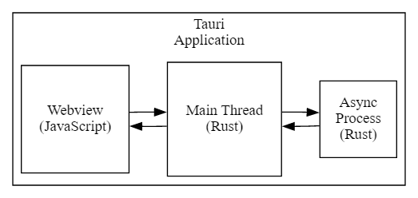
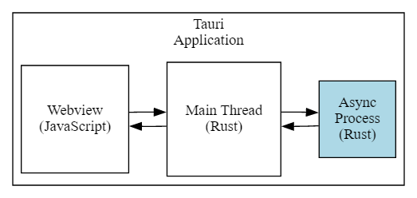
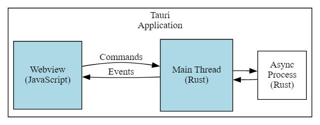
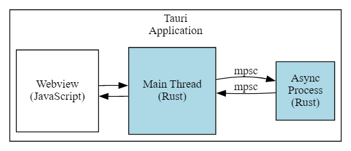
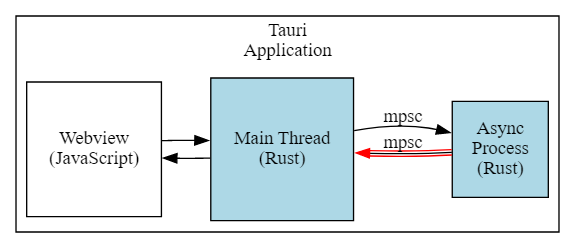

在开发Pavo时，我想利用一个独立的进程来执行壁纸的定时切换任务。这里涉及到Rust的异步进程的使用。在Tauri的上下文中，用户在Webview中进行操作，开启定时任务；Tauri的后台接收到之后，使用一个单独的进程进行壁纸的切换，壁纸需要从本地文件或者远端的URL地址读取，因此这个进程异步的。


我需要将异步 Rust 进程集成到 Tauri 应用程序中。更具体地说，在 Tauri webview 和异步 Rust 进程之间执行双向通信，任何一方都可以启动。


Tauri 主线程同时管理 webview 和异步进程。主线程位于两者之间。





我们可以将其分解为两个较小的问题：

- webview (JavaScript) 和主线程 (Rust)
- 主线程 (Rust) 和异步进程 (Rust)

## 异步进程





异步进程将通过 `tokio::mpsc` （多生产者，单消费者）通道获取输入，并通过另一个 `tokio::mpsc`通道提供输出。


先将创建一个异步流程模型，什么都不做，就放在那。这个模型是一个带有循环的异步函数，循环从输入通道获取字符串并将它们返回到输出通道。我们在 `src-tauri/src/main.rs` 中的异步进程模型：


```rust
use tokio::sync::mpsc;

// ...

async fn async_process_model(
    mut input_rx: mpsc::Receiver<String>,
    output_tx: mpsc::Sender<String>,
) -> Result<(), Box<dyn std::error::Error + Send + Sync>> {
    loop {
        while let Some(input) = input_rx.recv().await {
            let output = input;
            output_tx.send(output).await?;
        }
    }
}
```


## **Rust 和 JavaScript 的双向通信**





Tauri 为 Rust 和 JavaScript 之间的通信提供了两种机制：事件和命令。命令和事件的 Tauri 文档很好地涵盖了这些内容。


### **命令与事件**


事件可以在任一方向发送，而命令只能从 JavaScript 发送到 Rust。


在 JavaScript 端，我们使用 `invoke` 和 `listen` Tauri API 分别发送命令和接收事件。


```html
<script setup>
import { ref } from 'vue'
import { listen } from '@tauri-apps/api/event'
import { invoke } from '@tauri-apps/api/tauri'

const output = ref("");
const outputs = ref([]);
const inputs = ref([]);

function sendOutput() {
  console.log("js: js2rs: " + output.value)
  outputs.value.push({ timestamp: Date.now(), message: output.value }) 2
  invoke('js2rs', { message: output.value }) 3
}

await listen('rs2js', (event) => { 4
  console.log("js: rs2js: " + event)
  let input = event.payload
  inputs.value.push({ timestamp: Date.now(), message: input }) 5
})
</script>

<template>
  <div style="display: grid; grid-template-columns: auto auto;">
    <div style="grid-column: span 2; grid-row: 1;">
      <label for="input" style="display: block;">Message</label>
      <input id="input" v-model="output">
      <br>
      <button @click="sendOutput()">Send to Rust</button> 1
    </div>
    <div style="grid-column: 1; grid-row: 2;">
      <h3>js2rs events</h3>
      <ol>
        <li v-for="output in outputs">
          {{output}}
        </li>
      </ol>
    </div>
    <div style="grid-column: 2; grid-row: 2;">
      <h3>rs2js events</h3>
      <ol>
        <li v-for="input in inputs">
          {{input}}
        </li>
      </ol>
    </div>
  </div>
</template>
```

1. 点击按钮调用 `sendOutput()`
2. 将“js2rs”消息添加到输出数组以向用户显示发送的内容
3. 通过 Tauri `invoke`API 将“js2rs”消息发送到 Rust
4. 通过 Tauri `listen` API 为“rs2js”事件设置监听器
5. 将“rs2js”消息添加到 `inputs`数组以显示收到的内容

在Rust端，使用`Tauri::Manger`发送事件。


```rust
use tauri::Manager;
use tokio::sync::mpsc;

// ...

fn main() {
    // ...

    let (async_proc_input_tx, async_proc_input_rx) = mpsc::channel(1);
    let (async_proc_output_tx, mut async_proc_output_rx) = mpsc::channel(1);

    tauri::Builder::default()
        // ...
        .invoke_handler(tauri::generate_handler![js2rs])
        .setup(|app| {
            // ...

            let app_handle = app.handle();
            tauri::async_runtime::spawn(async move {
                // A loop that takes output from the async process and sends it
                // to the webview via a Tauri Event
                loop {
                    if let Some(output) = async_proc_output_rx.recv().await {
                        rs2js(output, &app_handle);
                    }
                }
            });

            Ok(())
        })
        .run(tauri::generate_context!())
        .expect("error while running tauri application");
}

// 使用Tauri Event 从Rust端发送消息到JavaScript
fn rs2js<R: tauri::Runtime>(message: String, manager: &impl Manager<R>) {
    info!(?message, "rs2js");
    manager
        .emit_all("rs2js", message)
        .unwrap();
}

#[tauri::command]
async fn js2rs(
    message: String,
    state: tauri::State<'_, AsyncProcInputTx>,
) -> Result<(), String> { 1
    info!(?message, "js2rs");
    // ...
}
```


## **主线程与异步进程的双向通信**





Tauri 主线程和异步进程之间传递消息会稍微复杂一些。异步过程的输入和输出被实现为 `tokio::mpsc` （多生产者，单一消费者）通道。


默认情况下，Tauri 拥有并初始化 Tokio  运行时。因此，不需要添加 `async main` 和 `#[tokio::main]`
 。为了获得额外的灵活性，Tauri 允许我们自己拥有和初始化 Tokio 运行时，告诉 Tauri 使用我们的 Tokio 运行时来完成此操作。


```rust
#[tokio::main]
async fn main() {
    tauri::async_runtime::set(tokio::runtime::Handle::current());

    // ...
}
```


如果在 Tauri 内部进行所有异步调用，那么 Tauri 就可以拥有和管理 Tokio 运行时。


```rust
fn main() {
    // ...

    tauri::Builder::default()
        .setup(|app| {
            tokio::spawn(async move {
                async_process(
                    async_process_input_rx,
                    async_process_output_tx,
                ).await
            });

            Ok(())
        }
        // ...
}
```


如果我们在 Tauri 之外进行任何异步调用，那么我们需要拥有和管理 Tokio 运行时。


```rust
#[tokio::main]
async fn main() {
    tauri::async_runtime::set(tokio::runtime::Handle::current());

    // ...

    tokio::spawn(async move {
        async_process(
            async_process_input_rx,
            async_process_output_tx,
        ).await
    });

    tauri::Builder::default()
        // ...
}
```


`tokio::mpsc` 通道需要为两个方向创建：异步进程的输入和异步进程的输出。


```rust
fn main() {
    
// ...
    let (async_process_input_tx, async_process_input_rx) = mpsc::channel(1);
    let (async_process_output_tx, async_process_output_rx) = mpsc::channel(1);

    
// ...

}
```


让 Tauri 拥有并管理 Tokio 运行时，因此我们需要在 `tauri::Builder::setup()` 中运行异步进程。


```rust
fn main() {
    // ...

    let (async_process_input_tx, async_process_input_rx) = mpsc::channel(1);
    let (async_process_output_tx, async_process_output_rx) = mpsc::channel(1);

    tauri::Builder::default()
        // ...
        .setup(|app| {
            tokio::spawn(async move {
                async_process(
                    async_process_input_rx,
                    async_process_output_tx,
                ).await
            });

            Ok(())
        }
        // ...
}
```


## **异步进程到主线程**


从主线程向异步进程发送消息需要更复杂的操作。这种额外的复杂性是由我们的命令对异步进程的输入通道具有可变访问权限的需要决定的。


回顾一下，主线程通过 Tauri 命令接收来自 JavaScript 的消息。然后，命令需要通过异步进程的输入通道将消息转发到异步进程。这个命令需要访问通道。那么如何让命令访问输入通道呢？使用tauri::State<T>。可以使用 Tauri 的状态管理系统将输入通道传递给 Command。我们需要对输入通道的可变访问，但 Tauri 托管状态是不可变的。如何通过不可变状态获得对输入通道的可变访问（mutable)？可以使用Mutex互斥锁，但是得用tokio提供的Mutext。std::sync::Mutex不支持异步。

> **Mutex互斥锁**
>
> 当多个并发任务(tokio task或线程)可能会修改同一个数据时，就会出现数据竞争现象(竞态)，具体表现为：某个任务对该数据的修改不生效或被覆盖。
>
>
> 互斥锁的作用，就是保护并发情况下可能会出现竞态的代码，这部分代码称为临界区。当某个任务要执行临界区中的代码时，必须先申请锁，申请成功，则可以执行这部分代码，执行完成这部分代码后释放锁。释放锁之前，其它任务无法再申请锁，它们必须等待锁被释放。
>
>
> 假如某个任务一直持有锁，其它任务将一直等待。因此，互斥锁应当尽量快地释放，这样可以提高并发量。
>
>

首先，创建一个结构体，将互斥锁包装在输入通道上。


```rust
struct AsyncProcInputTx {
    sender: Mutex<mpsc::Sender<String>>,
}
```


然后，我们将输入通道放入互斥锁中，将互斥锁放入包装结构中，并将其交给 Tauri 过 `tauri::Builder::manage` 进行管理。


```rust
fn main() {
    // ...

    tauri::Builder::default()
        .manage(AsyncProcInputTx {
            inner: Mutex::new(async_proc_input_tx),
        })
        // ...
}
```


最后，我们可以在命令中访问这种不可变状态，锁定互斥体以获得对输入通道的可变访问，将消息放入通道中，并在函数结束时守卫超出范围时隐式解锁互斥体。


```rust
#[tauri::command]
async fn js2rs(message: String, state: tauri::State<'_, AsyncProcInputTx>) -> Result<(), String> {
    info!(?message, "js2rs");
    let async_proc_input_tx = state.inner.lock().await;
    async_proc_input_tx
        .send(message)
        .await
        .map_err(|e| e.to_string())
}
```


## **主线程到异步进程**





相比之下，将消息从异步进程发送到主线程是非常简单的。来看下面的例子，生成一个异步进程，该进程将消息从输出通道中提取并转发到我们的 `rs2js` 函数。


```rust
fn main() {
    // ...

    tauri::Builder::default()
        // ...
        .setup(|app| {
            // ...

            let app_handle = app.handle();
            tauri::async_runtime::spawn(async move {
                loop {
                    if let Some(output) = async_proc_output_rx.recv().await {
                        rs2js(output, &app_handle);
                    }
                }
            });

            Ok(())
        })
        // ...
}
```


## 结束语


将这些过程捋了一遍之后，感觉在立即上没有难度，难度可能是Rust的语法和使用。不过这都是小问题，熟能生巧。在Pavo项目中，我便是单独开辟了一个异步进程来执行定时任务。具体的代码可以在[这里](https://github.com/zhanglun/pavo/blob/main/src-tauri/src/scheduler.rs)找到。经过这次梳理，稍稍加深了我对Tauri和Rust的理解和使用，对我的项目开发也起到了很关键的作用。


**参考：**

- [Tauri + Async Rust Process](https://rfdonnelly.github.io/posts/tauri-async-rust-process/#bidirectional-communication-between-the-main-thread-and-the-async-process)
- [共享状态](https://course.rs/async-rust/tokio/shared-state.html)
- [tokio task的通信和同步(3): 同步](https://rust-book.junmajinlong.com/ch100/06_task_state_sync.html#tokio-task%E7%9A%84%E9%80%9A%E4%BF%A1%E5%92%8C%E5%90%8C%E6%AD%A53-%E5%90%8C%E6%AD%A5)
