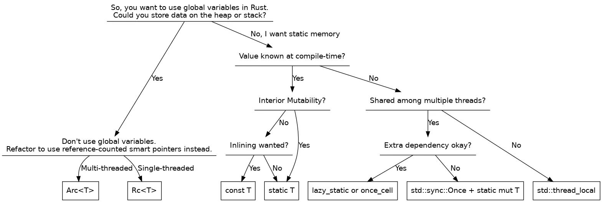

虽然在编程世界中，前辈们总是会告诉我们关于全局变量的缺点，但在实际开发过程中，有少数情况却很适合使用全局变量。


在JavaScript的世界中，有一个永远被定义的全局对象。但在不同宿主环境下提供了不同的全局对象，例如：

- 在 Web 浏览器中，脚本没有专门作为后台任务启动的任何代码都将`Window` 作为其全局对象。这是 Web 上绝大多数的 JavaScript 代码。
- 在 `Worker` 中运行的代码将`WorkerGlobalScope` 对象作为其全局对象。
- 在 Node.js 环境下运行的脚本具有一个称为`global` 的对象作为其全局对象。

在 Rust中，不存在某个全局对象，Rust全局变量需要使用`static`并在顶部声明。 


```rust
static GLOBAL_LEVEL: u8 = 0;
```


使用关键字`static` 时必须指定类型，没有类型无法通过编译。


```shell
1 | static GLOBAL_LEVEL = 0;
  |                    ^ help: provide a type for the static variable: `: i32`
```


如果想跨模块（文件）使用，还需要将变量设置为`pub`。 


```rust
pub static GLOBAL_LEVEL: u8 = 0;
```


通常情况下，全局变量会是一个可修改的变量，所以需要将其设置为 `mut` ，并有一个公共 API 来操作它——比如，一个读取它的函数和另一个写入它的函数：


```rust
static mut LOG_LEVEL: u8 = 0;

pubfnget_log_level() -> u8 {
    LOG_LEVEL
}

pubfnset_log_level(level: u8) {
    LOG_LEVEL = level;
}
```


但上述的代码无法通过编译。因为Rust是多线程的语言，全局变量能在多线程中被访问，读和写的函数调用可能会在线程间出现竞争。所以需要对全局变量加上**锁和原子**。如果是u8类型，将类型替换为`AtomicU8` 。


```rust
use std::sync::atomic::{AtomicU8, Ordering};

static LOG_LEVEL: AtomicU8 = AtomicU8::new(0);

pub fn get_log_level() -> u8 {
    LOG_LEVEL.load(Ordering::Relaxed)
}

pub fn set_log_level(level: u8) {
    LOG_LEVEL.store(level, Ordering::Relaxed);
}
```


但是Rust中没有AtomicString这样的东西，如果全局变量是一个字符串，则需要使用`Mutex`。


```rust
use std::sync::Mutex;

static LOG_FILE: Mutex<String> = Mutex::new(String::new());

pub fn get_log_file() -> String {
    LOG_FILE.lock().unwrap().clone()
}

pub fn set_log_file(file: String) {
    *LOG_FILE.lock().unwrap() = file;
}
```


不出意外，上面这段代码无法通过编译，编译器报错如下：


```markdown
error[E0015]: calls in statics are limited to constant functions, tuple structs and tuple variants
 --> src/lib.rs:3:34
  |
3 | static LOG_FILE: Mutex<String> = Mutex::new(String::new());
  |                                  ^^^^^^^^^^^^^^^^^^^^^^^^^

For more information about this error, try `rustc --explain E0015`.
```


这是因为静态变量的限制。静态变量和常量有一个相同点，那就是定义静态变量的时候必须赋值为在编译期就可以计算出的值(常量表达式/数学表达式)，不能是运行时才能计算出的值(如函数)。


具体来说，Rust 编译器不需要为 `static LOG_LEVEL: u8 = 0` 生成任何初始化代码 ，它只在可执行文件的数据段中保留一个字节，并确保它在编译时包含 0。 `static LOG_LEVEL: String = String::new()`可以通过编译是因为`String::new()`是一个 `const fn` ，函数在编译时专门标记为可运行。因为空字符串不会分配，因此 `String::new()`返回的字符串可以在可执行文件中用 `(0 [length], 0 [capacity], NonNull::dangling() [constant representing unallocated pointer])` 的三元组表示。相反 `static LOG_FILE: String = String::from("foo")` 不会编译，因为 `String::from()` 需要运行时分配，因此不是 `const fn`。


现在回过头来看`Mutex::new(String::new())`。`std::sync::Mutex::new()` 不是 `const fn` ，因为系统互斥锁需要在内存中分配一个固定地址。社区提供`lazy_static` 这个宏，用于懒初始化静态变量，之前的静态变量都是在编译期初始化的，因此无法使用函数调用进行赋值，而`lazy_static`允许在运行期初始化静态变量。


```rust
use std::sync::Mutex;
use lazy_static::lazy_static;
lazy_static! {
    static ref NAMES: Mutex<String> = Mutex::new(String::from("Sunface, Jack, Allen"));
}

fn main() {
    let mut v = NAMES.lock().unwrap();
    v.push_str(", Myth");
    println!("{}",v);
}
```


当然，使用`lazy_static`在每次访问静态变量时，会有轻微的性能损失，因为其内部实现用了一个底层的并发原语`std::sync::Once`，在每次访问该变量时，程序都会执行一次原子指令用于确认静态变量的初始化是否完成。`lazy_static`宏，匹配的是`static ref`，所以定义的静态变量都是不可变引用


下面是一个例子，使用`lazy_static`实现全局缓存的例子:


```rust
use lazy_static::lazy_static;
use std::collections::HashMap;

lazy_static! {
    static ref HASHMAP: HashMap<u32, &'static str> = {
        let mut m = HashMap::new();
        m.insert(0, "foo");
        m.insert(1, "bar");
        m.insert(2, "baz");
        m
    };
}

fn main() {
    // 首次访问`HASHMAP`的同时对其进行初始化
    println!("The entry for `0` is \"{}\".", HASHMAP.get(&0).unwrap());

    // 后续的访问仅仅获取值，再不会进行任何初始化操作
    println!("The entry for `1` is \"{}\".", HASHMAP.get(&1).unwrap());
}
```


除此之外，个人更推荐使用`once_cell`。相比 lazy_static，once_cell 更加灵活一些。提供了`unsync::OnceCell`和`sync::OnceCell`这两种Cell，创建一个只允许写入一次的线程安全单元。要注意的是，前者用于单线程，后者用于多线程。


```rust
use once_cell::sync::OnceCell;
use std::sync::Mutex;

static LOG_FILE: OnceCell<Mutex<String>> = OnceCell::new();

fn ensure_log_file() -> &'static Mutex<String> {
    LOG_FILE.get_or_init(|| Mutex::new(String::new()))
}

pub fn get_log_file() -> String {
    ensure_log_file().lock().unwrap().clone()
}

pub fn set_log_file(file: String) {
    *ensure_log_file().lock().unwrap() = file;
}
```

> once_cell的依赖有lazy_static，好处就是把lazy_static包裹了一层，然后对外提供非宏的方式。tokio 就是基于这个理由换掉了lazy_static。  
> — [awsa2ron ](https://rustcc.cn/blog_with_author?author_id=120c14ae-5f44-4f2c-ab85-6cbb71405937)2021-07-04 11:58 from [https://rustcc.cn/article?id=e347d7ca-60d6-4e57-bfb6-2076009692f3](https://rustcc.cn/article?id=e347d7ca-60d6-4e57-bfb6-2076009692f3)

`OnceCell` 只能写入一次，当你试图对一个非空的Cell进行`set(value)`操作时，程序会返回`Err(value)` ，出现 panic。


```shell
thread 'main' panicked at 'called `Result::unwrap()` on an `Err` value:
```


全局变量往往需要可读写。可以用once_cell提供的`Lazy`。`Lazy` 会在第一次访问时完成值的初始化，并且可以使用在静态变量中。


```rust
use std::collections::HashMap;

use once_cell::sync::Lazy;

static HASHMAP: Lazy<HashMap<i32, String>> = Lazy::new(|| {
    println!("initializing");
    let mut m = HashMap::new();
    m.insert(13, "Spica".to_string());
    m.insert(74, "Hoyten".to_string());
    m
});

fn main() {
    println!("ready");
    std::thread::spawn(|| {
        println!("{:?}", HASHMAP.get(&13));
    }).join().unwrap();
    println!("{:?}", HASHMAP.get(&74));

    // Prints:
    //   ready
    //   initializing
    //   Some("Spica")
    //   Some("Hoyten")
}
```


回到前面的例子，使用 Lazy 更加简单，无需定义`ensure_log_file`函数来实现获取还是初始化数据。


```rust
use std::sync::Mutex;
use once_cell::sync::Lazy;

static LOG_FILE: Lazy<Mutex<String>> = Lazy::new(|| Mutex::new(String::new()));

pub fn get_log_file() -> String {
    LOG_FILE.lock().unwrap().clone()
}

pub fn set_log_file(file: String) {
    *LOG_FILE.lock().unwrap() = file;
}
```


最后配上一张来自互联网的图，加强记忆和理解。





## 参考

- [Rust global variables demystified](https://morestina.net/blog/1774/rust-global-variables-demystified)
- [How to Idiomatically Use Global Variables in Rust](https://www.sitepoint.com/rust-global-variables/)
