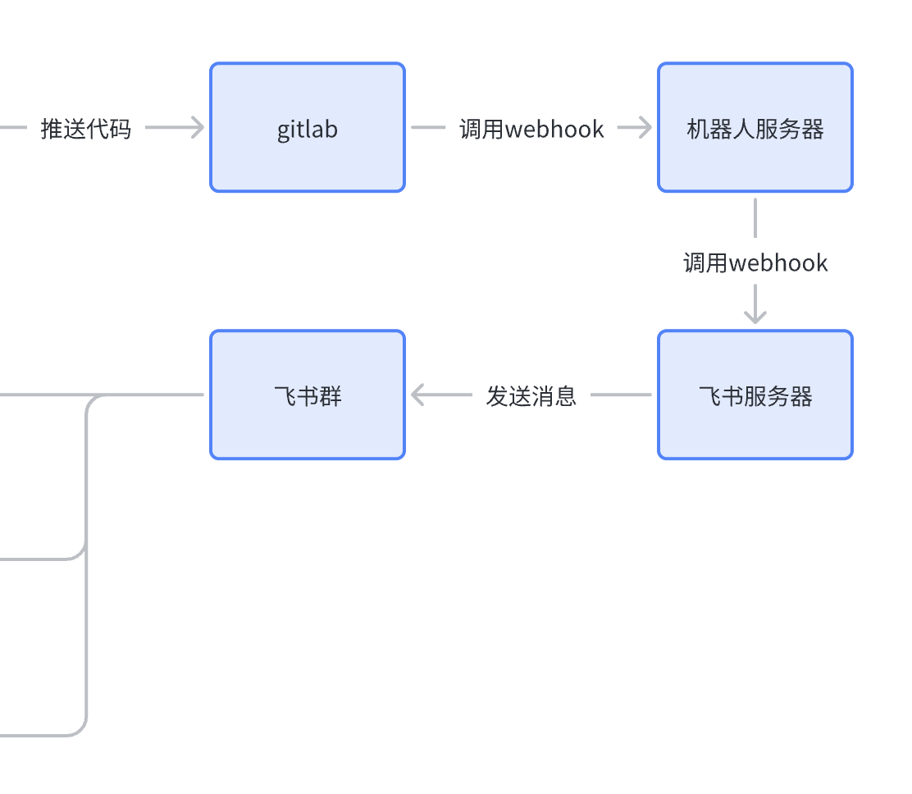
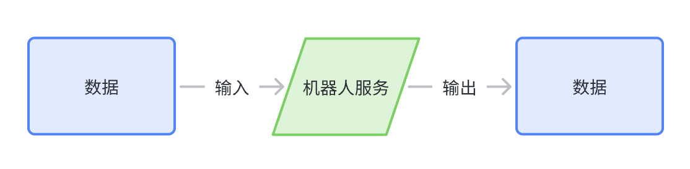
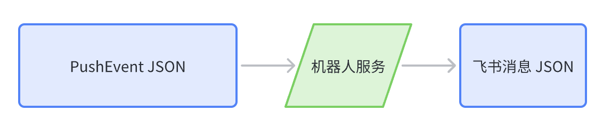
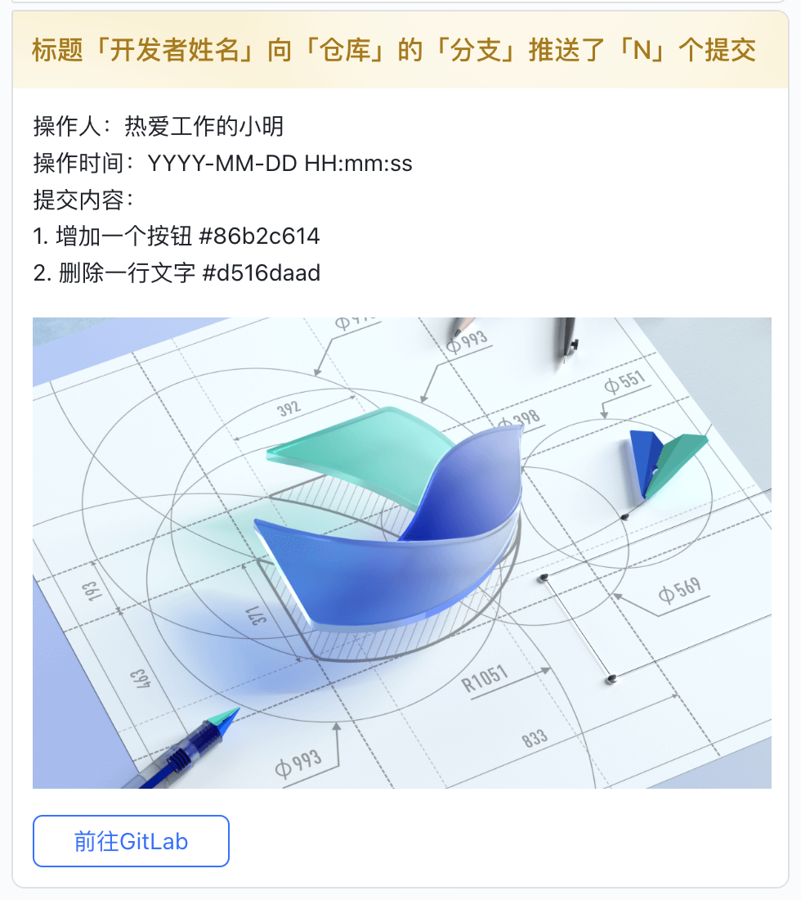
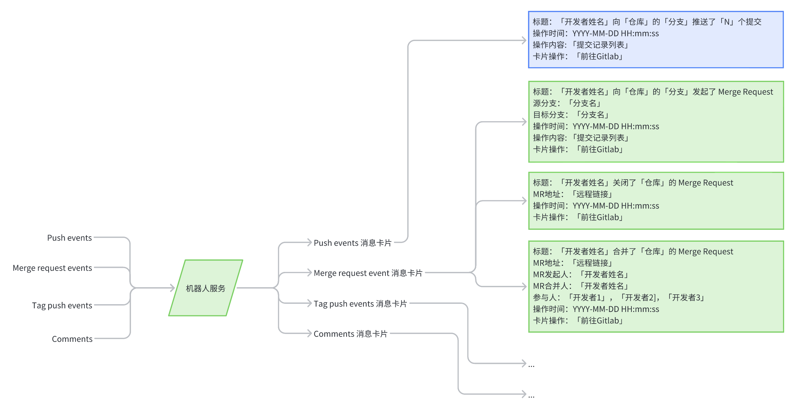
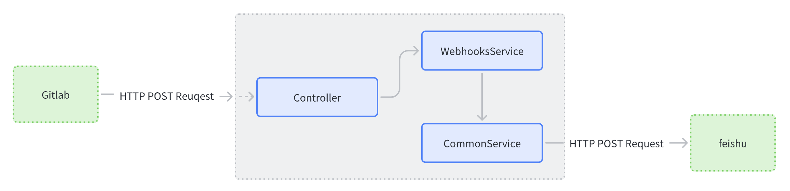
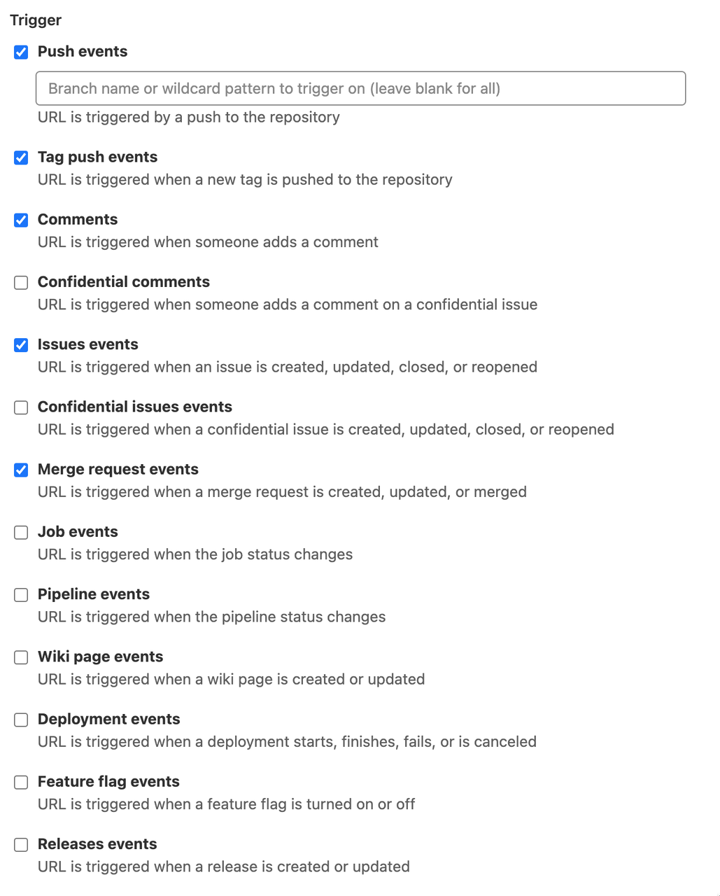
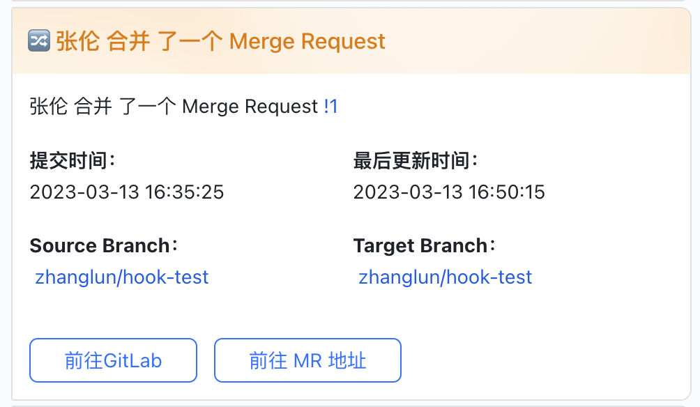
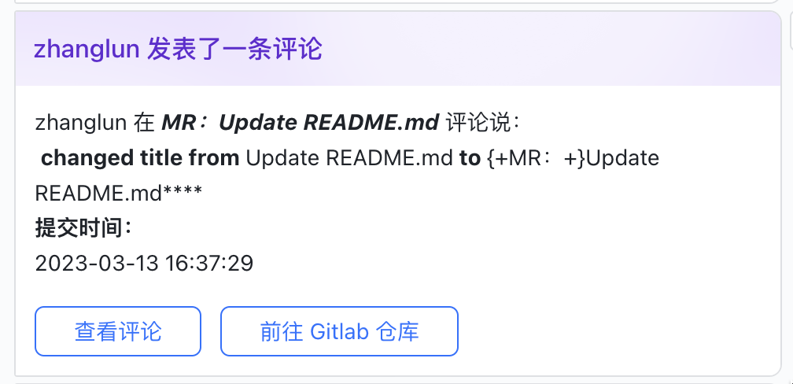
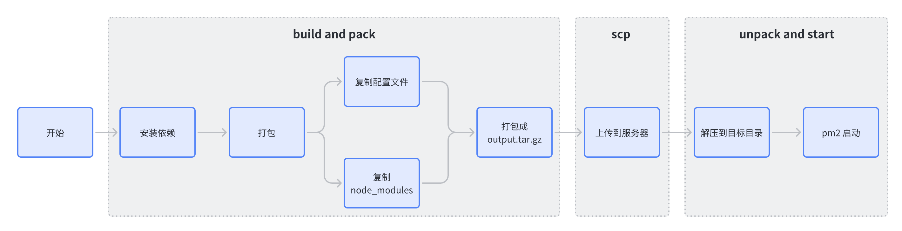

我想开发一个飞书机器人，将日常的工作信息串起来，集中到飞书消息中。目前能结合的使用场景有：

- Gitlab代码变更的通知。
- Sentry监控告警通知。
- Bamboo任务通知。

上述三个场景是日常工作的高频场景。当前这三种场景的信息都没有集成到飞书，因此团队成员无法感知到对应的变化。虽说无法感知这些消息似乎不会影响到日常的工作，但是如果这类消息能广播给团队成员，对团队来说是有一些帮助的。


## 为什么要串流程


在一个团队中，不同的开发者负责不同的模块和功能。存在一些功能模块之间的交叉比较少，这会使得负责这些模块的开发者的工作无法很好的被团队其他开发者感知，最后可能会变成埋头干活，不闻其他的状况。对于管理者来说，当大家的工作的界限太过明显时，不利于整体的人力安排，对backup的形成也有一定的阻力。


接入Sentry监控是为了帮助团队能够在错误发生的第一时间知晓，通过对应用中的错误或异常进行监控和自动反馈，有助于我们尽早发现隐蔽的问题，提升产品质量和研发效率。


Bamboo是产研团队使用的持续集成工具。不知道是它不好用还是咱们不会用，它就像一个独立的孤岛，在那运行着。没有人知道哪些项目正在发布，哪些任务出现错误。

> 另外，每次发布时，打开页面，在一堆plan中找到自己要执行的，执行部署，然后等待。如果plan执行出错，还需要再打开一个单独的页面查看日志。

2月底，OPE项目在进行上线前代码操作时，操作合并的同学发现自己的代码已经被人合并到线上分支。检查线上环境后发现需求已经被发布。通过检查提交记录，发现有开发者将OPE系统测试环境代码合并到自己的需求分支，最后发布到了线上。幸运的是后台管理系统，且及时发现没有造成影响。但是也暴露出一些问题：

1. 有些开发者工作态度存在问题，对自己的工作不负责任，对自己的代码过度自信，对线上毫无敬畏。
2. 对团队成员过于信任，代码合并上线流程不够严格，权限放的太宽。
3. 团队其他成员无法感知其他人对代码变动，不知道发生了什么。

因为信息没有流动起来，从代码合并到最后的部署发布，整个过程除了当事人之外，无人知晓发生了什么事情。


如果能把这些场景的信息串起来，面向团队广播，可以：

1. 开发者的工作展示给其他人，不再闭门造车。
2. 管理者能获取到最新的信息，及时发现潜在的问题。
3. 日常使用的服务串联起来，使用飞书作为入口进行交互，研发体验能够有所提升。
4. 还能在此基础上探索更多的能力。

## 简述其技术实现


要想串起这些流程，技术思路上其实挺简单的，搭建一个机器人服务，这个服务负责接受不同格式的消息，转换成飞书消息，推送给飞书的webhook。





对开发者来说，除了编辑器和浏览器，飞书应该算是打开频率最高的软件了（有的人微信可能比飞书高😄）。飞书平台提供的机器人可以在聊天中通过消息完成内容的触达、信息收集等操作。借助机器人能力，可以将上述的场景信息集成进飞书，在飞书内获得一站式的系统使用体验。飞书的机器人有两种：自定义机器人和应用机器人。前者之后简单的消息推送功能，后者功能则十分丰富。先用自定义机器人试试推送效果，未来有需要再升级到应用机器人。


创建自定义机器人的具体步骤可以看这里的[官方介绍](https://www.feishu.cn/hc/zh-CN/articles/244506653275#tabs0%7Clineguid-z3APVw) ，只需向Webhook地址发起POST请求，自定义机器人就可以向所在的群组发送消息。


```bash
curl -X POST -H "Content-Type: application/json" \\
        -d '{"msg_type":"text","content":{"text":"request example"}}' \\
  <https://open.feishu.cn/open-apis/bot/v2/hook/xxxxxxxxxxxxxxxxx>
```


Gitlab也可以使用Webhook实现一些集成的事情。开发者使用者在推送代码、创建Issue或者提交合并请求的时候可以触发一个事前配置好的URL，GitLab会向设定的Webhook的URL发送一个POST请求，服务端拿到信息之后可以做很多事情。


在开始编码之前，以产品经理的视角，梳理出机器人服务要具备的能力。首先对整个流程做一个简化，简化之后会发现这个问题真的真的非常简单，其本质就是数据的输入输出转换。





以GitLab为例，触发 Push Event 时发送如下数据（更多数据结构可以查阅 [Webhook events | GitLab](https://docs.gitlab.com/ee/user/project/integrations/webhook_events.html)）：


```json
{
  "object_kind": "push",
  "event_name": "push",
  "before": "95790bf891e76fee5e1747ab589903a6a1f80f22",
  "after": "da1560886d4f094c3e6c9ef40349f7d38b5d27d7",
  "ref": "refs/heads/master",
  "checkout_sha": "da1560886d4f094c3e6c9ef40349f7d38b5d27d7",
  "user_id": 4,
  "user_name": "John Smith",
  "user_username": "jsmith",
  "user_email": "john@example.com",
  "user_avatar": "https://s.gravatar.com/avatar/d4c74594d841139328695756648b6bd6?s=8://s.gravatar.com/avatar/d4c74594d841139328695756648b6bd6?s=80",
  "project_id": 15,
  "project":{
    "id": 15,
    "name":"Diaspora",
    "description":"",
    "web_url":"http://example.com/mike/diaspora",
    "avatar_url":null,
    "git_ssh_url":"git@example.com:mike/diaspora.git",
    "git_http_url":"http://example.com/mike/diaspora.git",
    "namespace":"Mike",
    "visibility_level":0,
    "path_with_namespace":"mike/diaspora",
    "default_branch":"master",
    "homepage":"http://example.com/mike/diaspora",
    "url":"git@example.com:mike/diaspora.git",
    "ssh_url":"git@example.com:mike/diaspora.git",
    "http_url":"http://example.com/mike/diaspora.git"
  },
  "repository":{
    "name": "Diaspora",
    "url": "git@example.com:mike/diaspora.git",
    "description": "",
    "homepage": "http://example.com/mike/diaspora",
    "git_http_url":"http://example.com/mike/diaspora.git",
    "git_ssh_url":"git@example.com:mike/diaspora.git",
    "visibility_level":0
  },
  "commits": [
    {
      "id": "b6568db1bc1dcd7f8b4d5a946b0b91f9dacd7327",
      "message": "Update Catalan translation to e38cb41.\n\nSee https://gitlab.com/gitlab-org/gitlab for more information",
      "title": "Update Catalan translation to e38cb41.",
      "timestamp": "2011-12-12T14:27:31+02:00",
      "url": "http://example.com/mike/diaspora/commit/b6568db1bc1dcd7f8b4d5a946b0b91f9dacd7327",
      "author": {
        "name": "Jordi Mallach",
        "email": "jordi@softcatala.org"
      },
      "added": ["CHANGELOG"],
      "modified": ["app/controller/application.rb"],
      "removed": []
    },
    {
      "id": "da1560886d4f094c3e6c9ef40349f7d38b5d27d7",
      "message": "fixed readme",
      "title": "fixed readme",
      "timestamp": "2012-01-03T23:36:29+02:00",
      "url": "http://example.com/mike/diaspora/commit/da1560886d4f094c3e6c9ef40349f7d38b5d27d7",
      "author": {
        "name": "GitLab dev user",
        "email": "gitlabdev@dv6700.(none)"
      },
      "added": ["CHANGELOG"],
      "modified": ["app/controller/application.rb"],
      "removed": []
    }
  ],
  "total_commits_count": 4
}
```


从数据中可以提取出我们关心的信息：**谁在什么时候对哪个仓库推送了哪些提交记录**。





在飞书群中使用卡片消息，可以透传出如下内容（飞书的消息有一定的定制能力，可以慢慢研究）。





呵，代码Push到飞书通知的过程就是这么简单。接下来依葫芦画瓢，Gitlab的消息集成大致就这么些内容，图中展示了Push 和 Merge Request 的卡片内容，其他的后续再补充。





## **让我们先打通GitLab吧**


上图是目前已经打通的两个事件消息，项目代码在[这里](https://github.com/zhanglun/feishu-robot-service)。接下来看看具体怎么做的。


Nest（NestJS）是一个框架，用于构建高效，可扩展的Node.js服务器端应用程序。它使用渐进式JavaScript，使用TypeScript构建并完全支持TypeScript（但仍使开发人员能够使用纯JavaScript编码），并结合了OOP（面向对象编程），FP（函数式编程）和FRP（函数式响应式编程）的元素。它提供了一个开箱即用的应用程序架构，省去了项目配置和搭建的烦恼，可以快速开始一个项目。


### 创建项目


使用 Nest CLI 可以立马创建出一个新项目。它会创建一个新的项目目录，目录是常规的基础结构，提供了一些默认的配置和文件，安装好依赖之后就能启动。


```bash
npm i -g @nestjs/cli
nest new feishu-robot-service
```


得益于NestJS本身的设计，可以创建一个Webhooks模块，提供对外的hook以及调用飞书的接口。使用nest命令快速创建模块的Controller。


```bash
nest g controller webhooks
```


```typescript
import {
  Controller,
  Get,
  Post,
  Req,
  Res,
  HttpStatus,
  Headers,
  Body,
} from '@nestjs/common';
import { Response } from 'express';

@Controller('webhooks')
export class WebhooksController {
  constructor(private webhooksService: WebhooksService) {}

  @Get('/gitlab')
  async gitlab(@Res() res: Response) {
    res.status(HttpStatus.OK).send('OK');
  }

  @Post('/gitlab')
  async PostToGitLab(
    @Req() req: Request,
    @Res() res: Response,
    @Headers() headers,
    @Body() body,
  ) {
    const event: HookEventType = headers['x-gitlab-event'];
    const message = await this.webhooksService.handleGitlab(event, body);

    res.status(HttpStatus.OK).send('ok');
  }
}
```


在`webhooksService`，实现具体的业务逻辑。


```typescript
import { Injectable } from '@nestjs/common';
import { CommonService } from 'src/common/common.service';
import { createPushMessage, createMergeMessage, createNoteMessage } from 'src/helper/messager';
import {
  HookEventEnum,
  HookEventType,
  PushEventJSON,
  MergeEventJSON,
} from './interfaces/gitlab.interface';

@Injectable()
export class WebhooksService {
  constructor(private commonService: CommonService) {}

  async handleGitlab(hookType: HookEventType, body: any): Promise<any> {
    let message = undefined as any;

    switch (hookType) {
      case HookEventEnum.Push_Hook:
        message = createPushMessage(body as PushEventJSON);
        break;
      case HookEventEnum.Merge_Request_Hook:
        message = createMergeMessage(body as MergeEventJSON);
        break;
      case HookEventEnum.Note_Hook:
        message = createNoteMessage(body as MergeEventJSON);
        break;
      default:
        break;
    }

    return await this.commonService.postFeishu(message);
  }
}
```


其中，将消息体构建的逻辑放置在helper/messager中，调用飞书部分的逻辑放在commonService中。postFeishu的逻辑很简单，调用飞书接口，将消息发送出去。下面是一个简单的实现：


```typescript
import { Injectable } from '@nestjs/common';
import { HttpService } from '@nestjs/axios';
import { map, lastValueFrom } from 'rxjs';

@Injectable()
export class CommonService {
  constructor(private readonly httpService: HttpService) {}

  async postFeishu(message: any): Promise<any> {
    const request = this.httpService
      .post(
        'https://open.feishu.cn/open-apis/bot/v2/hook/3cc60041-322f-4fe6-8ec0-085686acb38d',
        {
          ...message,
        },
        {
          headers: {
            'Content-Type': 'application/json',
          },
        },
      )
      .pipe(map((res) => res));

    const data = await lastValueFrom(request);

    return data;
  }
}
```





### 接入Gitlab，测试回调接口


以虚拟人项目为例，进入项目的webhook设置页面，回调地址设置为Node服务提供的接口地址，然后勾选上想要处理的事件。在这里我们选上常用的几个事件。





当选中的事件触发时，机器人便会推送消息至飞书客户端。








至此，一个简易版的飞书机器人服务就完成了。


### 部署到服务器


在进一步优化代码实现之前，先把部署工作跑通。NestCLI 在初始化项目时，提供了开发，调试，测试和打包等npm scripts 命令。执行 npm script 中的 `build`命令，开始打包，产出物默认在`dist` 文件夹中。具体的用法可以查看[这里](https://docs.nestjs.com/cli/usages#nest-build)。


```bash
nest build
```


`nest build` 是在tsc或者webpack上的封装。为什么说是“或”呢？因为nest支持标准的项目模式，也支持monorepo模式。使用`nest new` 创建的项目属于标准模式，使用tsc编译。基于标准模式可以改进为monorepo模式，这时候会用到webpack。具体的改造过程可以看 [https://docs.nestjs.com/cli/monorepo](https://docs.nestjs.com/cli/monorepo)。


因为是Node.js项目，部署方式和普通的静态页面有些许不同。对于纯静态资源的项目而言，所有的依赖和代码都被打包在一起，将产出物上传到服务器上就行。Node.js 项目通常是不打包的，依赖都放在node_modules中，为了能在服务器上正常运行，需要将node_modules 目录等依赖一起上传到服务器。整个过程如下图所示：





为此，需要写一点点脚本。下面是`build.sh`的极简版实现，代码构建之后将需要的依赖复制到output目录，打包成压缩包。


```shell
#! /usr/bin/env bash
# 假定 CI服务上已经集成了Node.js环境
pnpm install
pnpm build

rm -rf ./output
mkdir ./output

cp package.json tsconfig.json ./output/
cp -r ./dist ./output/dist/
cp -r ./node_modules ./output/node_modules/

tar -zcvf output.tar.gz output/*
```


在bamboo中设置shell任务，执行build.sh。然后在集成平台中添加可以执行SCP任务，将压缩包上传到服务器。最后一步，添加SSH任务，连接上服务器，更新文件，启动Node服务。这里不是简单的启动，包含了关闭当前node进程，删除原来的文件，解压最新的压缩包，启动node进程这么一系列过程。同样的，这几个步骤也写在shell脚本中。


```shell
#! /usr/bin/env bash
cd /home/admin/feishu-robot

pm2 delete feishu-robot 2> /dev/null

rm -rf output
tar -zxvf output.tar.gz

pm2 start output/dist/main.js --name feishu-robot
```

> 上述的脚本都是极简版本，不保证CV的可用性。

## 让程序更健壮一些


已经介绍开发飞书机器人服务的原因、技术实现以及开发和部署一个精简版本的Node服务。目前够用，但是对于一个基础服务来说了，还是少了些拓展性。既然如此，那就以后再说吧。


