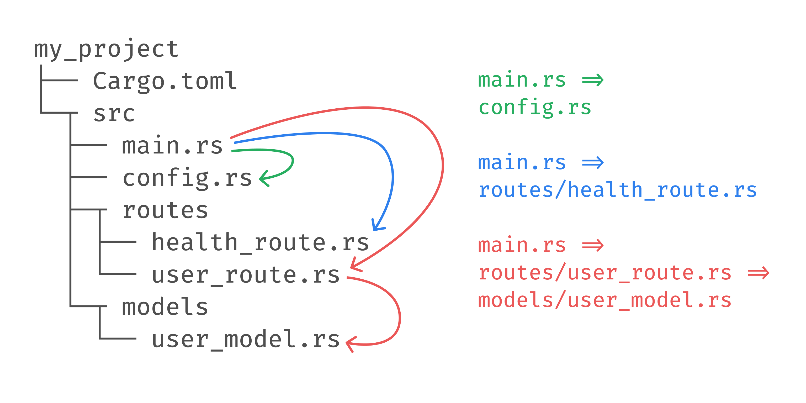
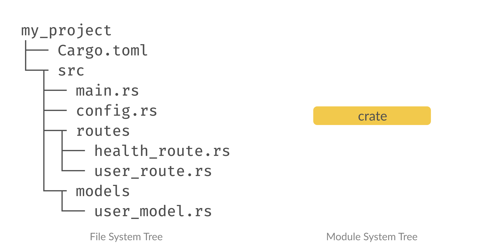
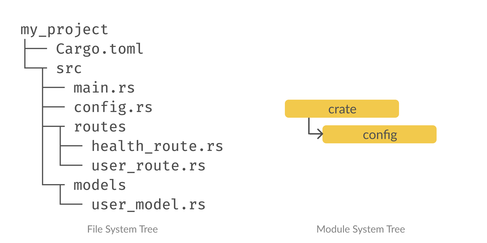
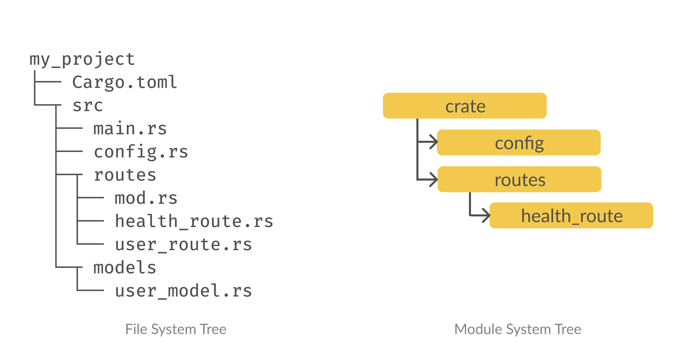
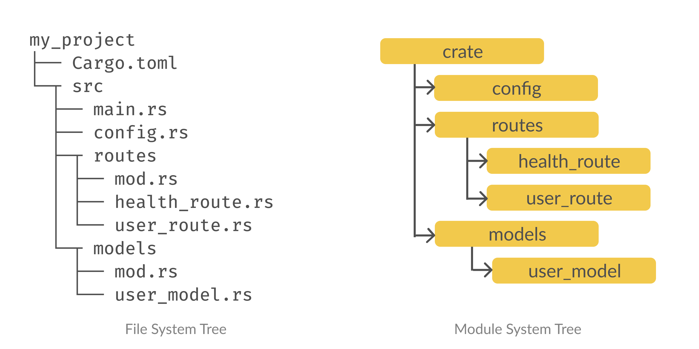

看到一篇关于Rust模块系统的文章，文章内容言简意赅，通俗易懂，清晰解释了Rust的模块系统个。个人感觉非常不错，遂翻译到自己的博客，做此记录。


原文地址：[**Clear explanation of Rust’s module system**](https://www.sheshbabu.com/posts/rust-module-system/) ，作者 Shesh，如果觉得原文不错，可以关注他的[Twitter](https://twitter.com/sheshbabu) 。


下面是正文部分。


---


Rust 的模块系统令人惊讶地令人困惑，并给初学者带来了很多挫败感。


在这篇文章中，我将使用实际示例来解释模块系统，以便您清楚地了解它的工作原理，并可以立即开始在您的项目中应用它。


由于 Rust 的模块系统非常独特，我要求读者以开放的心态阅读这篇文章，并避免将其与其他语言中的模块工作方式进行比较。


让我们使用此文件结构来模拟真实世界的项目：


```rust
my_project
├── Cargo.toml
└─┬ src
  ├── main.rs
  ├── config.rs
  ├─┬ routes
  │ ├── health_route.rs
  │ └── user_route.rs
  └─┬ models
    └── user_model.rs
```


这些是我们应该能够使用模块的不同方式：





这 3 个示例应该足以解释 Rust 的模块系统是如何工作的。


## 示例一


让我们从第一个示例开始 - 在 `config.rs` 中导入 `main.rs`。


```rust
// main.rs
fn main() {
  println!("main");
}
```


```rust
// config.rs
fn print_config() {
  println!("config");
}
```


每个人都犯的第一个错误，只是因为我们有像 `config.rs` ， `health_route.rs` 等文件，我们认为这些文件是 `modules` ，我们可以从其他文件导入它们。


下面是我们看到的（文件系统树）和编译器看到的（模块树）：





令人惊讶的是，编译器只看到 `crate` 模块，即我们的 `main.rs` 文件。这是因为我们需要在 Rust 中显式构建模块树 - 文件系统树到模块树之间没有隐式映射。


我们需要在 Rust 中显式构建模块树，在Rust中没有隐式映射到文件系统。


要将文件添加到模块树中，我们需要使用 `mod` 关键字将该文件声明为子模块。接下来让人们感到困惑的是，你会假设我们将一个文件声明为同一文件中的模块。但是我们需要在不同的文件中声明这一点！由于模块树中只有 `main.rs` ，让我们在 `main.rs` 中将 `config.rs`声明为子模块。


mod 关键字声明了一个子模块，具有以下语法：


```rust
mod my_module;
```


在这里，编译器在同一目录中查找 `my_module.rs` 或 `my_module/mod.rs`。


```rust
my_project
├── Cargo.toml
└─┬ src
  ├── main.rs
  └── my_module.rs

或者

my_project
├── Cargo.toml
└─┬ src
  ├── main.rs
  └─┬ my_module
    └── mod.rs
```


因为 `main.rs` 和 `config.rs` 在同一个目录中，让我们按如下方式声明配置模块，并使用 `::` 语法访问 `print_config` 函数。


```rust
// main.rs
mod config;

fn main() {
  config::print_config();
  println!("main");
}
```


```rust
// config.rs
fn print_config() {
  println!("config");
}
```


模块树结构如下所示：





我们已经成功声明了 `config` 模块！但这还不足以在 `config.rs` 中调用 `print_config` 函数。默认情况下，Rust 中几乎所有内容都是私有的。

>  `pub` 关键字使函数公开：

```rust
// main.rs
mod config;

fn main() {
  config::print_config();
  println!("main");
}
```


```rust
// config.rs
pub fn print_config() {
  println!("config");
}
```


现在我们已经成功地调用了在不同文件中定义的函数！


## 示例二


让我们尝试从 `main.rs` 调用 `routes/health_route.rs` 中定义的 `print_health_route` 函数。


```rust
// main.rs
mod config;

fn main() {
  config::print_config();
  println!("main");
}
```


```rust
// routes/health_route.rs
fn print_health_route() {
  println!("health_route");
}
```


正如我们之前讨论的，我们只能将 `mod` 关键字用于同一目录中的 `my_module.rs` 或 `my_module/mod.rs` 。


所以为了从 `main.rs` 调用 `routes/health_route.rs` 内部的函数，我们需要做以下事情：

- 创建一个名为 `routes/mod.rs` 的文件，并在 `main.rs` 中声明 `routes` 子模块
- 在 `routes/mod.rs` 中声明 `health_route` 子模块并使其公开
- 公开 `health_route.rs` 中的函数

```plain text
my_project
├── Cargo.toml
└─┬ src
  ├── main.rs
  ├── config.rs
  ├─┬ routes
+ │ ├── mod.rs
  │ ├── health_route.rs
  │ └── user_route.rs
  └─┬ models
    └── user_model.rs
```


```rust
// main.rs
mod config;
mod routes;

fn main() {
  routes::health_route::print_health_route();
  config::print_config();
  println!("main");
}
```


```rust
// routes/mod.rs
pub mod health_route;
```


```rust
// routes/health_route.rs
pub fn print_health_route() {
  println!("health_route");
}
```


模块树如下所示：





现在，我们可以调用文件夹中文件中定义的函数。


## 示例三


让我们尝试实现这样的调用关系 `main.rs => routes/user_route.rs => models/user_model.rs` 。


```rust
// main.rs
mod config;
mod routes;

fn main() {
  routes::health_route::print_health_route();
  config::print_config();
  println!("main");
}
```


```rust
// routes/user_route.rs
fn print_user_route() {
  println!("user_route");
}
```


```rust
// models/user_model.rs
fn print_user_model() {
  println!("user_model");
}
```


我们想从 `main`调用函数 `print_user_route` ，再调用`print_user_model` 。让我们进行与以前相同的更改 - 声明子模块，公开函数并添加 `mod.rs` 文件。


```plain text
my_project
├── Cargo.toml
└─┬ src
  ├── main.rs
  ├── config.rs
  ├─┬ routes
  │ ├── mod.rs
  │ ├── health_route.rs
  │ └── user_route.rs
  └─┬ models
+   ├── mod.rs
    └── user_model.rs
```


```rust
// main.rs
mod config;
mod routes;
+ mod models;

fn main() {
  routes::health_route::print_health_route();
+ routes::user_route::print_user_route();
  config::print_config();
  println!("main");
}
```


```rust
// routes/mod.rs
pub mod health_route;
+ pub mod user_route;
```


```rust
// routes/user_route.rs
- fn print_user_route() {
+ pub fn print_user_route() {
  println!("user_route");
}
```


```rust
// models/mod.rs
+ pub mod user_model;
```


```rust
// models/user_model.rs
- fn print_user_model() {
+ pub fn print_user_model() {
  println!("user_model");
}
```


模块树如下所示：





等等，我们实际上还没有从 `print_user_model` 调用 `print_user_route` ！到目前为止，我们只调用了 `main.rs` 中其他模块中定义的函数，我们如何从其他文件中做到这一点？


如果我们查看模块树， `print_user_model` 函数位于 `crate::models::user_model` 路径中。因此，为了在 不是 `main.rs` 的文件中使用模块 ，我们应该考虑在模块树中到达该模块所需的路径。


```rust
// routes/user_route.rs
pub fn print_user_route() {
+ crate::models::user_model::print_user_model();
  println!("user_route");
}
```


我们已经成功地从不是 `main.rs` 的文件中调用了文件中定义的函数。


## super


如果我们的文件组织是多个目录深度，则完全限定的名称会变得太长。假设出于某种原因，我们想从 `print_health_route` 调用 `print_user_route` 。它们分别位于路径 `crate::routes::health_route` 和 `crate::routes::user_route` 下。


我们可以使用完全限定的名称 `crate::routes::health_route::print_health_route()`
来调用它，但我们也可以使用相对路径 `super::health_route::print_health_route();`
 。请注意，我们已使用 `super` 来引用父范围。

> 模块路径中的 super 关键字是指父作用域。

```rust
pub fn print_user_route() {
  crate::routes::health_route::print_health_route();

  // 也可以使用super调用
  super::health_route::print_health_route();

  println!("user_route");
}
```


## use


在上面的示例中使用完全限定的名称甚至相对名称会很乏味。为了缩短名称，我们可以使用 `use`
 关键字将路径绑定到新名称或别名。

> _use 关键字用于缩短模块路径_

```rust
pub fn print_user_route() {
  crate::models::user_model::print_user_model();
  println!("user_route");
}
```


上面的代码可以重构为：


```rust
use crate::models::user_model::print_user_model;

pub fn print_user_route() {
  print_user_model();
  println!("user_route");
}
```


除了使用名称 `print_user_model` ，我们还可以将其别名为其他名称：


```rust
use crate::models::user_model::print_user_model as log_user_model;

pub fn print_user_route() {
  log_user_model();
  println!("user_route");
}
```


## 外部模块


添加到 `Cargo.toml` 的依赖项全局可用于项目内的所有模块。我们不需要显式导入或声明任何内容来使用依赖项。

> _外部依赖项全局可用于项目内的所有模块。_

例如，假设我们将`rand`添加到我们的项目中。我们可以直接在代码中使用它，如下所示：


```rust
pub fn print_health_route() {
  let random_number: u8 = rand::random();
  println!("{}", random_number);
  println!("health_route");
}
```


我们也可以使用 `use` 来缩短路径：


```rust
use rand::random;

pub fn print_health_route() {
  let random_number: u8 = random();
  println!("{}", random_number);
  println!("health_route");
}
```


## 总结

- 模块系统是显式的 - 与文件系统没有 1：1 映射
- 我们将一个文件声明为父级中的模块，而不是本身
- `mod` 关键字用于声明子模块
- 我们需要显式地将函数、结构等声明为公共函数，以便它们可以在其他模块中使用
- `pub` 关键字使内容公开
- `use` 关键字用于缩短模块路径
- 我们不需要显式声明第三方模块
