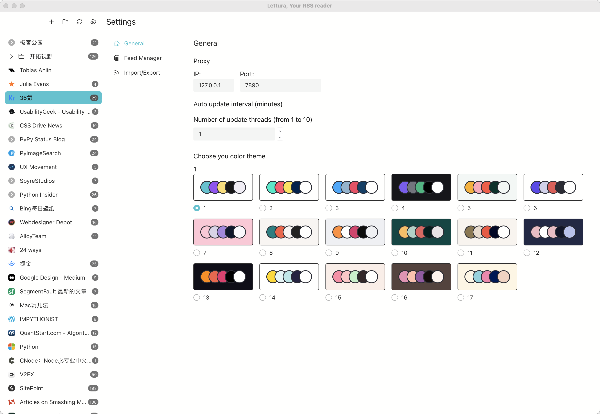

刚度过了一个快乐的五一假期，写一篇小小的流水帐简单记录一下。


为什么说是快乐的，因为很久没有以如此轻松的心态度过的小长假了。


在结束了连续6天的超强度工作后，迎来了五天小长假。一如既往的早起，即使是假期。因为每一个早起的日子，都能够拥有更多可支配的时间。每天早上的标准流程是：洗漱，吃早餐，洗衣服，简单收拾屋子。这套流程走完，时间还不到9点，剩下的时间非常富裕。


### Lettura的开发


在假期前，和设计朋友一起讨论了一下[https://github.com/zhanglun/lettura](https://github.com/zhanglun/lettura)关于这款应用的一些UI和交互的设计问题。所以在假期刚开始的时候，便花了点时间对[Lettura](https://github.com/zhanglun/lettura)进行主题配色的优化。[HappyHues](https://www.happyhues.co/) 是一位设计师创建的配色网站，里面有十几种用于Web开发的色板。我将其中的色板信息按照抓取下来，按照色板号，生成了对应的Design Token，比如一号色板如下：


```json
{
  "palette-1-color-1-elements-background": {
    "value": "#fffffe"
  },
  "palette-1-color-1-elements-headline": {
    "value": "#181818"
  },
  "palette-1-color-1-elements-paragraph": {
    "value": "#2e2e2e"
  },
  "palette-1-color-1-elements-button": {
    "value": "#4fc4cf"
  },
  "palette-1-color-1-elements-button-text": {
    "value": "#181818"
  },
  "palette-1-color-1-illustration-stroke": {
    "value": "#181818"
  },
  "palette-1-color-1-illustration-main": {
    "value": "#f2eef5"
  },
  "palette-1-color-1-illustration-highlight": {
    "value": "#4fc4cf"
  },
  "palette-1-color-1-illustration-secondary": {
    "value": "#994ff3"
  },
  "palette-1-color-1-illustration-tertiary": {
    "value": "#fbdd74"
  },
  "palette-1-color-2-elements-background": {
    "value": "#f6efef"
  },
  "palette-1-color-2-elements-headline": {
    "value": "#181818"
  },
  "palette-1-color-2-elements-sub-headline": {
    "value": "#2e2e2e"
  },
  "palette-1-color-2-elements-card-background": {
    "value": "#f0e2e1"
  },
  "palette-1-color-2-elements-card-heading": {
    "value": "#181818"
  },
  "palette-1-color-2-elements-card-paragraph": {
    "value": "#2e2e2e"
  },
  "palette-1-color-2-icons-stroke": {
    "value": "#181818"
  },
  "palette-1-color-2-icons-main": {
    "value": "#f2eef5"
  },
  "palette-1-color-2-icons-highlight": {
    "value": "#4fc4cf"
  },
  "palette-1-color-2-icons-secondary": {
    "value": "#994ff3"
  },
  "palette-1-color-2-icons-tertiary": {
    "value": "#fbdd74"
  },
  ...
}
```


然后使用Style-Dictionary 将 Design Token 转换成CSS变量。


```css
/**
 * Do not edit directly
 * Generated on Sun, 30 Apr 2023 02:17:24 GMT
 */
:root {
	--palette-1-color-1-illustration-tertiary: #fbdd74;
  --palette-1-color-1-illustration-secondary: #994ff3;
  --palette-1-color-1-illustration-highlight: #4fc4cf;
  --palette-1-color-1-illustration-main: #f2eef5;
  --palette-1-color-1-illustration-stroke: #181818;
  --palette-1-color-1-elements-button-text: #181818;
  --palette-1-color-1-elements-button: #4fc4cf;
  --palette-1-color-1-elements-paragraph: #2e2e2e;
  --palette-1-color-1-elements-headline: #181818;
  --palette-1-color-1-elements-background: #fffffe;
	...
	...
	.
  --palette-17-color-4-elements-background: #fffffe;
	--palette-17-color-5-elements-links: #fef6e4;
  --palette-17-color-5-elements-paragraph: #172c66;
  --palette-17-color-5-elements-headline: #001858;
  --palette-17-color-5-elements-background: #fef6e4;
}
```


使用postcss的for插件，将创建的颜色CSS变量变量和业务CSS变量进行绑定，在实际使用中，只需要关注业务CSS变量即可。


```css
@for $i from 1 to 17 {
  :root body[data-palette='$(i)'] {
    --color-primary: var(--palette-$(i)-color-1-illustration-highlight);
    --color-secondary: var(--palette-$(i)-color-1-illustration-secondary);
    --color-tertiary: var(--palette-$(i)-color-1-illustration-tertiary);
    --headline-color:var(--palette-$(i)-color-1-elements-headline);
    --paragraph-color: var(--palette-$(i)-color-1-elements-paragraph);
    --button-bg-color: var(--palette-$(i)-color-1-elements-button);
    --button-text-color: var(--palette-$(i)-color-1-elements-button-text);
    --stroke-color: var(--palette-1-color-1-illustration-stroke);

    --body-color: var(--paragraph-color);
    --body-bg-color: var(--palette-$(i)-color-2-elements-background);
    --app-main-bg-color: var(--palette-$(i)-color-1-elements-background);

    --feed-list-bg-color: var(--palette-$(i)-color-1-elements-background);
    --feed-headline-color: var(--palette-$(i)-color-1-elements-headling);
    --feed-active-bg-color: var(--palette-$(i)-color-1-elements-button);
    --feed-active-headline-color: var(--palette-$(i)-color-1-elements-button-text);

    --article-list-bg-color: var(--palette-$(i)-color-2-elements-background);
    --article-headline-color: var(--palette-$(i)-color-2-elements-headline);
    --article-paragraph-color: var(--palette-$(i)-color-2-elements-sub-headline);
    --article-active-bg-color: var(--palette-$(i)-color-2-elements-card-background);
    --article-active-headline-color: var(--palette-$(i)-color-2-elements-card-heading);
    --article-active-paragraph-color: var(--palette-$(i)-color-2-elements-card-paragraph);
    --detail-bg-color: var(--palette-$(i)-color-3-elements-card-paragraph);
  }
```


另外，在tailwind的配置中，我也把这些颜色都加上，使用的时候就很方便了。在这些内容准备就绪之后，在Lettura的设置界面增加了主题选择，简单但是有效。





配色板虽好，有的配色组合在最后的实际效果中还是有那么一点点不太合适的，可能有些乍看之下确实有点丑，后续再慢慢调整吧。整体来说，加上了这些配色之后，还是不错的。我再也不用纠结什么主色调了。


过去，在Lettura项目上，我总是想在很短的时间内，开发更多的功能。在早期阶段，有很多基础功能需要开发，这样我很兴奋，效率也很高。但是随着功能逐渐完善，短时间内快速开发功能的这种想法反而让我渐渐长产生了负担。再经历了一些思考之后，我不再纠结功能开发的快慢，回归到打磨自己的产品的初心。Lettura主题色是这次假期我给自己的定的一个小目标，在假期中顺利完成，这让我感觉到很舒心。


### 逛花鸟市场


在毕业之后之后，断断续续养过不少花花草草。在上海时，养过多肉和向日葵，当时养得挺好的，搬家到杭州之后因为工作的关系疏于照看，都倒下了。后来又养了一些绿萝，茉莉，雏菊之类的容易打理的植物，因为工作的关系，也没怎么打理，最后搬家的时候全部都留在了出租房里。


找了一个下午和老婆去了一趟花鸟市场，买了几盆花。一盆很大的月季，将近半米高，正开着花，红彤彤的特笔漂亮，一盆蓝色的绣球，个头小很多，但是也是花团锦簇，甚是好看；另外两盆我也忘了叫什么名字，绿色的叶子，都挺有北欧风格的。


在市场上还看到了很多老桩多肉，价格太高了，没舍得买。回家之后在PDD下单了一盆钱多多，先养养看。晚上又补加了两盆茉莉。乘着这次机会，重新清理了阳台上的花花草草，打造一个花园阳台。


### 运动和健身


假期打了两场球。第一场是在小程序上找到的局，在全民健身中心的5楼。参加是老年局，大部分都是中年男子，见识到了所谓的“球场老大爷”。


他们多是球场老手，以控制为主，打四个点位，以尽可能小的消耗来消耗对手。如果无法快速结束战斗，就要被大爷们全场溜着打。习惯了猛男对轰局的我在开始的时候非常不适应。起球之后习惯性退后压中心准备接杀，结果是网前吊球，打了几局之后菜慢慢适应。整场下来各种失误不说，还被累得半死。哈哈，我真是菜。


整个过程还是蛮开心的，参加的人不多，所以可以一直打。大家都很和气，场下的观战的大爷还告诉我对面大爷的弱点和习惯，教我怎么打他，哈哈，简直欢乐了。以后有机会可以再参加大爷们的球局，练练球商。


第二场是参加群友组织的局，老地方，也有一些常打的朋友参加。熟悉的节奏，熟悉的球路，打起来也是畅快淋漓。但是要想打得好，还是得多动脑子。


每次发完球，浑身都酸痛，不适合立马撸铁。假期有这么多闲暇时光，于是重新开始游泳了。应该是假期的关系，健身房泳池人特别少，除了几个上游泳课的小朋友之外，没有其他人了。


游泳能有效刺激内啡肽的分泌，内啡肽是一种感觉良好激素，可改善人的情绪，帮助缓解压力，所以每次游完都感觉到愉悦。相比撸铁，在水中，我可以彻底放松自己的身体，配合上规律的深呼吸，内心感觉很平静。池底花花绿绿的瓷砖，配上摇曳的水光，仿佛置身在一个如梦如幻的世界中。


虽然我的假期看起来平平无奇，但是为什么我确认为这是一个非常舒心的假期呢？我想，究其原因，应该是我没有给自己设定目标。


过去的长假，我总会在假期开始之前，给自己设定一些必须要做的学习计划。虽然大部分计划都能按时完成，但是每次假期结束，却依然有一种奇怪的感觉。我的计划完成了，然后呢？我得到了什么？变强了吗？快乐了吗？我的假期怎么就结束了？而这次五一假期，从第一天开始的疯狂编程开始，所有的事情都没有规划过。每天想到做什么，就去做了，主打一个随心而为。


希望能够一直快乐。

