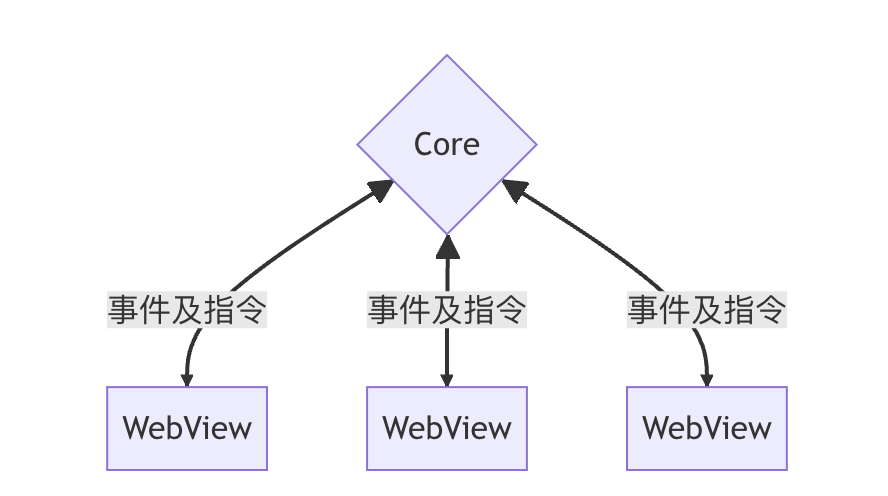
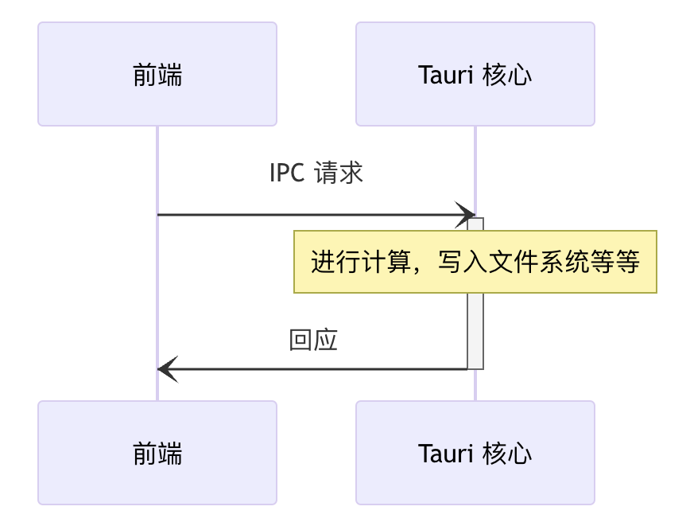

[Lettura](https://github.com/zhanglun/lettura) 是一个开源的RSS阅读器，是我的开源项目。目前还在开发中，但是已经发布了测试版本，欢迎下载[https://github.com/zhanglun/lettura/releases](https://github.com/zhanglun/lettura/releases) 体验。


Lettura中的文章列表只有筛选阅读状态的能力，暂时不支持分页。随着未读文章的数量越来越多，加载的时间越来越长，体验上的表现就是白屏带来的卡顿，即使加上骨架图，本质上也没有太多提升。


你可能会问，你这都数据库都在本地，怎么还卡顿呢？文章能有多少数量啊？其实如果单看数据库的话，SQLite的能力完全够用的。卡顿的主要原因在于数据在进程之间的传输。


Tauri 采用了一种类似 Electron 和大多数现代Web浏览器那样的多进程架构。





每个 Tauri 应用程序都有一个核心进程，它作为应用程序的入口点，是唯一可以完整访问操作系统的组件。在主进程中可以访问SQLite数据库，数据读取之后，将数据发送给Webview进程。


Tauri提供了两种跨进程通信的事件和指令。我采用的是指令方式，主要 API `invoke` 与浏览器中的 `fetch` API 类似，前端可以使用此 API 来调用 Rust 函数、传递参数和接收数据。由于此机制底层使用类似 [JSON-RPC](https://www.jsonrpc.org/) 的协议来序列化请求和回应，所有参数及返回数据均必须序列化为 JSON 格式。





IPC请求传输大数据出现性能下降时，通常有三种优化方式；

1. 使用共享内存

    共享内存可以使多个进程访问同一块内存区域，从而避免了数据的复制和传输。可以使用共享内存来传输大量的数据，以提高传输效率和性能。在使用共享内存时，需要注意对内存的读写顺序和同步机制，以避免数据不一致和竞争条件。

2. 使用流式传输

    流式传输可以将数据分成多个小块，逐块进行传输，从而避免了一次性传输大量数据的问题。可以使用流式传输来传输大量的数据，以提高传输效率和可靠性。在使用流式传输时，需要注意数据块的大小、发送和接收的顺序、数据的完整性和校验等问题。

3. 使用压缩算法

    如果传输的数据比较大，可以使用压缩算法来压缩数据，以减少传输的数据量和传输时间。可以使用诸如zlib、gzip等压缩算法来压缩和解压缩数据，以提高传输效率和性能。


    前面两个有点麻烦，在Tauri中的实现还没有详细研究过，先通过分页来“压缩数据”。分页我采用了游标分页的方案。游标分页是一种常见的分页技术，通常用于处理大量数据的分页查询。游标分页是一种基于游标的分页技术。在游标分页中，我们使用游标（即指向结果集中某一行的指针）来遍历查询结果，并根据游标位置来实现分页。具体来说，我们通过向后或向前移动游标来获取下一页或上一页的数据，直到获取到所有需要的数据为止。


    相比于传统的基于偏移量的分页技术，游标分页具有以下优势：

    - 性能更好：当数据量较大时，偏移量分页需要在每次查询时扫描整个结果集，而游标分页只需要扫描当前页的数据，因此性能更好。
    - 数据稳定：当数据被修改时，偏移量分页可能导致数据顺序混乱或漏掉数据，而游标分页可以保证数据的稳定性。

    ## 游标分页的实现方法


    游标分页可以通过多种方式实现，包括使用数据库分页语句、ORM 框架、原生 SQL 语句等。下面我们将介绍两种常见的实现方法：使用数据库分页语句和使用原生 SQL 语句。


    ### 使用数据库分页语句


    大多数关系型数据库都提供了分页语句，例如 MySQL 的 `LIMIT` 和 `OFFSET`，Oracle 的 `ROWNUM`，PostgreSQL 的 `LIMIT` 和 `OFFSET` 等。使用分页语句可以让我们方便地实现游标分页，而不需要手动构建分页逻辑。


    以下是一个使用 MySQL `LIMIT` 和 `OFFSET` 实现游标分页的示例代码：


    ```sql
    SELECT * FROM orders ORDER BY order_id LIMIT 10 OFFSET 20;
    ```


    在这个示例中，我们使用 `LIMIT` 和 `OFFSET` 子句来实现游标分页。具体来说，我们使用 `ORDER BY` 子句指定排序规则，然后使用 `LIMIT` 子句指定每页返回的行数，使用 `OFFSET` 子句指定当前页在结果集中的起始位置。通过调整 `OFFSET` 的值，我们可以获取不同页数的数据。


    需要注意的是，在使用分页语句时，我们需要注意分页条件、排序条件、数据量等因素，并进行性能测试和优化，以确保查询效率和结果正确性。同时，不同的数据库可能支持不同的分页语句，我们需要根据具体情况选择合适的语句。


    ### 使用原生 SQL 语句


    在某些情况下，我们需要手动构建游标分页逻辑，例如当数据库不支持分页语句时，或者我们需要更复杂的分页逻辑时。在这种情况下，我们可以使用原生 SQL 语句来实现游标分页。


    以下是一个使用原生 SQL 语句实现游标分页的示例代码：


    ```sql
    DECLARE @PageSize INT = 10;
    DECLARE @PageNumber INT = 2;
    
    DECLARE @Offset INT = (@PageNumber - 1) * @PageSize;
    DECLARE @RowCount INT = @PageSize + 1;
    
    IF OBJECT_ID('tempdb..#Orders') IS NOT NULL
        DROP TABLE #Orders;
    
    SELECT TOP (@RowCount)
        *
    INTO #Orders
    FROM orders
    WHERE order_id > (SELECT ISNULL(MAX(order_id), 0) FROM (
        SELECT TOP (@Offset) order_id FROM orders ORDER BY order_id
    ) AS T)
    ORDER BY order_id;
    
    SELECT *
    FROM #Orders
    WHERE order_id > (SELECT ISNULL(MAX(order_id), 0) FROM (
        SELECT TOP (@Offset) order_id FROM orders ORDER BY order_id
    ) AS T)
    ORDER BY order_id;
    ```


    在这个示例中，我们使用原生 SQL 语句构建了游标分页逻辑。具体来说，我们使用 `DECLARE` 语句声明了参数和变量，然后使用 `TOP` 子句和子查询来获取当前页的数据，使用 `ORDER BY` 子句指定排序规则。通过调整 `@PageSize` 和 `@PageNumber` 的值，我们可以获取不同页数的数据。


     


    由于我的列表需要按照数据字段pub_date降序排列，单通过id分页，无法严格保证数据的降序排列，所以需要使用一个子查询来获取按照`pub_date`排序后的文章ID列表，然后在主查询中使用这个ID列表来进行分页和排序。下面是代码示例


    ```rust
    use chrono::{DateTime, Utc};
    use diesel::prelude::*;
    use diesel::row::Row;
    use diesel::sql_query;
    use diesel::sql_types::{BigInt, Text};
    
    #[derive(Debug)]
    struct Article {
        id: i32,
        title: String,
        content: String,
        pub_date: DateTime<Utc>,
    }
    
    impl Article {
        pub fn find_after(conn: &SqliteConnection, cursor: i32, limit: i64) -> Vec<Article> {
            let subquery = format!(
                "SELECT id FROM articles ORDER BY pub_date DESC, id DESC"
            );
            let query = format!(
                "SELECT id, title, content, pub_date FROM articles WHERE id IN ({}) AND pub_date <= (SELECT pub_date FROM articles WHERE id = {}) ORDER BY pub_date DESC, id DESC LIMIT {}",
                subquery, cursor, limit
            );
            let rows = sql_query(query)
                .load::<Row>(conn)
                .expect("Error loading articles");
    
            rows.into_iter()
                .map(|row| {
                    let id: i32 = row.get(0);
                    let title: String = row.get(1);
                    let content: String = row.get(2);
                    let pub_date: DateTime<Utc> = row.get(3);
    
                    Article {
                        id,
                        title,
                        content,
                        pub_date,
                    }
                })
                .collect()
        }
    }
    ```


    除此之外，在前端也需要增加对应的分页加载逻辑。滚动到底部加载更多的能力被我封装在一个hook中，这样我就可以在三种布局中调用了。


    我使用了Intersection Observer API来实现滚动检测。Intersection Observer API可以帮助我们检测元素是否进入了视口（viewport），从而实现滚动到底部时的自动加载功能。以下是通过Intersection Observer API实现滚动到底部加载更多数据的步骤：

    1. 创建IntersectionObserver对象：首先，我们需要创建一个IntersectionObserver对象。可以通过IntersectionObserver构造函数来创建IntersectionObserver对象，并指定一个回调函数。当目标元素进入或离开视口时，回调函数将被调用。

    ```javascript
    const observer = new IntersectionObserver(callback, options);
    ```

    1. 指定目标元素：接下来，我们需要指定要观察的目标元素。可以通过querySelector方法或getElementById方法获取目标元素，并将其传递给IntersectionObserver的observe方法。

    ```javascript
    const target = document.querySelector('#target');
    observer.observe(target);
    ```

    1. 实现回调函数：当目标元素进入或离开视口时，回调函数将被调用。在回调函数中，我们可以检查目标元素的交叉比率（intersection ratio），以确定它是否进入了视口。如果交叉比率大于0，则表示目标元素进入了视口，可以执行加载更多数据的操作。

    ```javascript
    const callback = (entries, observer) => {
      entries.forEach(entry => {
        if (entry.intersectionRatio > 0) {
          // 加载更多数据
        }
      });
    };
    ```

    1. 取消观察：当我们不再需要观察目标元素时，可以调用IntersectionObserver的unobserve方法来取消观察。

    ```javascript
    observer.unobserve(target);
    ```


    当用户滚动到页面底部时，目标元素将进入视口，触发回调函数，可以在回调函数中执行加载更多数据的操作，使用户可以无需手动点击按钮就能加载更多数据。


    下面是完整的代码：


    ```typescript
    import { useBearStore } from "@/hooks/useBearStore";
    import { useEffect, useRef, useState } from "react";
    
    export const useArticleListHook = (props: { feedUuid: string | null }) => {
      const { feedUuid } = props;
      const store = useBearStore((state) => ({
        currentFilter: state.currentFilter,
        setArticleList: state.setArticleList,
        articleList: state.articleList,
        getArticleList: state.getArticleList,
      }));
    
      const [loading, setLoading] = useState(false);
      const [hasMore, setHasMore] = useState(true);
      const listRef = useRef<HTMLDivElement>(null);
      const loadRef = useRef<HTMLDivElement>(null);
      const [cursor, setCursor] = useState(1);
      const getList = () => {
        const filter: { read_status?: number; cursor: number; limit?: number } = {
          read_status: store.currentFilter.id,
          cursor,
          limit: 12,
        };
    
        if (feedUuid === null) {
          return;
        }
    
        setLoading(true);
    
        store
          .getArticleList(feedUuid, filter)
          .then((res: any) => {
            if (res.length === 0) {
              setHasMore(false)
            }
          })
          .finally(() => {
            setLoading(false);
          })
          .catch((err: any) => {
            console.log("%c Line:71 🍎 err", "color:#ffdd4d", err);
          });
      };
    
      useEffect(() => {
        if (feedUuid) {
          store.setArticleList([]);
          setCursor(1);
          setHasMore(true);
          getList();
        }
      }, [feedUuid, store.currentFilter]);
    
      useEffect(() => {
        getList();
      }, [cursor]);
    
      useEffect(() => {
        const $rootElem = listRef.current as HTMLDivElement;
        const $target = loadRef.current as HTMLDivElement;
    
        const options = {
          root: $rootElem,
          rootMargin: "0px 0px 50px 0px",
          threshold: 1,
        };
    
        const callback = (
          entries: IntersectionObserverEntry[],
          observer: IntersectionObserver
        ) => {
          entries.forEach((entry) => {
            console.log(entry);
    
            if (entry.isIntersecting && !loading && hasMore) {
              setCursor((cursor) => cursor + 1);
            }
          });
        };
    
        const observer = new IntersectionObserver(callback, options);
    
        $target && observer.observe($target);
    
        return () => {
          if ($target) {
            observer.unobserve($target);
          }
        };
      }, [loading]);
    
      return {
        getList,
        loading,
        hasMore,
        articleList: store.articleList,
        setLoading,
        listRef,
        loadRef,
      };
    };
    ```

