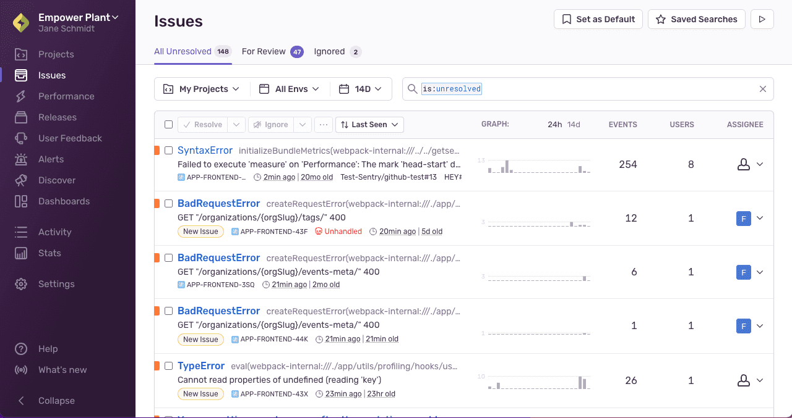
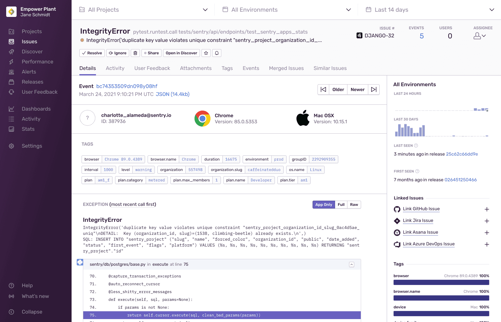
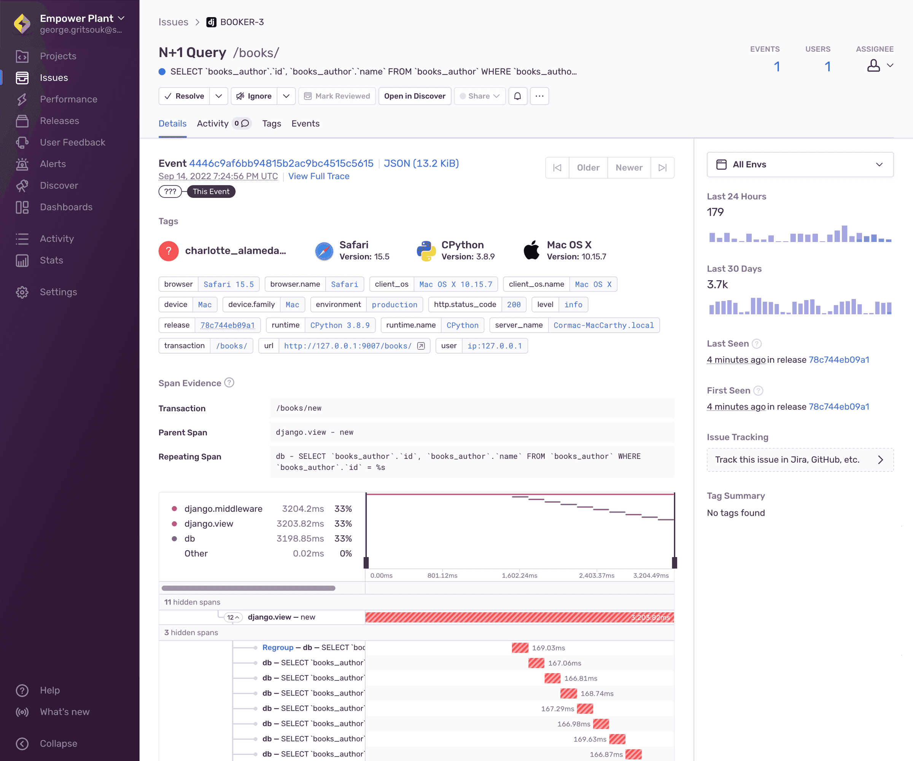
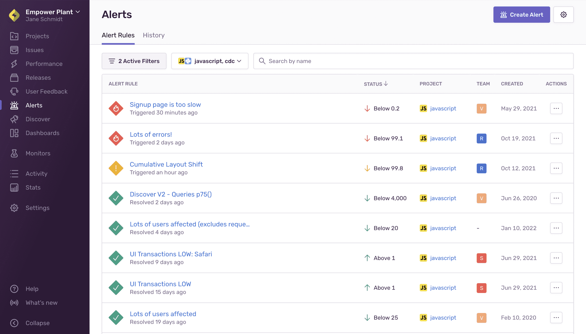
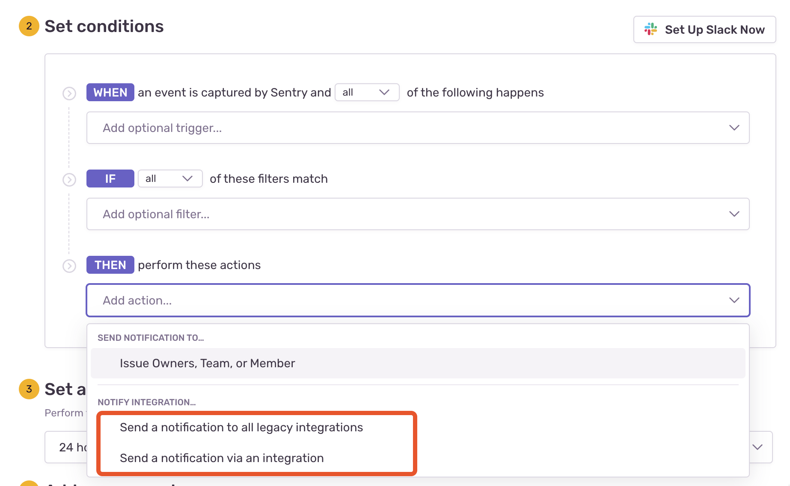

花了点时间私有化部署了一套Sentry服务，本周接入了项目的测试环境。上线后没多久，就捕获到了很多错误，飞书机器人服务不停地推送着错误的告警信息。这些告警信息，本质是因为sentry捕获到错误之后创建issue，通过Alert配置触发webhook发送到飞书群。所以现在收到的信息来自一个个新创建的issue，其中包含了很多重复的issue，有的错误甚至在短时间内频繁触发，信息干扰严重。于是开始研究Sentry的使用细节，试图总结整理出一些比较好的使用套路。

先抛开webhook推送相关的事情，就Sentry本身而言，使用和操作相对简单，不过其中包含了很多概念，需要提前消化吸收，以便后续更深入地使用。

在 Sentry 中，Issue（问题）是指应用程序或服务中发生的错误、异常或事件。当 Sentry 捕获到一个错误或异常时，它会自动创建一个 Issue，并将相关信息（如错误类型、堆栈跟踪、请求信息等）记录到 Issue 中。开发人员可以使用 Sentry 的界面或 API 查看和管理 Issue，以便及时发现和解决问题。

Sentry 的 Issue 包含了大量的信息，包括：

- 错误类型：指发生错误的类型，如 JavaScript 错误、Python 异常等。
- 错误信息：指错误的详细信息，如错误消息、堆栈跟踪等。
- 环境信息：指发生错误的环境，如操作系统、浏览器、应用程序版本等。
- 请求信息：指发生错误的请求信息，如 URL、HTTP 方法、请求参数等。
- 用户信息：指发生错误的用户信息，如用户 ID、IP 地址等。
- 标签：可以用来对 Issue 进行分类和过滤的标签，如错误类型、应用程序模块等。

另外，通过对 Issue 进行分类和过滤，可以更好地理解和管理项目服务中的问题。

Issue 主要有两种类型的 Issue：错误（Error）和性能（Performance）.

1. 错误（Error）Issue

    错误 Issue 是 Sentry 最常见的 Issue 类型，它表示应用程序或服务中发生的错误或异常。当 Sentry 捕获到一个错误或异常时，它会创建一个错误 Issue，并记录错误的详细信息，如错误类型、堆栈跟踪、请求信息等。

    

2. 性能（Performance）Issue

    性能 Issue 是 Sentry 的另一种类型，它用于捕获应用程序或服务中的性能问题。Sentry 可以捕获应用程序或服务中的响应时间、请求次数、请求失败率等性能指标，并将其记录为性能 Issue。

    

> 注意：Sentry 的性能 Issue 并不是用于监控应用程序或服务的整体性能，而是用于捕获一些特定的性能指标。如果需要监控应用程序或服务的整体性能，可以使用其他专业的监控工具。

Sentry Issue 主要用于记录和跟踪错误和异常情况的详细信息，而 Sentry Alert 则是用于实时通知用户系统中出现的异常情况，让用户能够及时采取行动。通常情况下，Sentry 的警报会通过电子邮件、短信、Slack 等渠道向用户发送。用户可以根据自己的需求和实际情况来自定义警报规则，例如设置警报的触发条件、警报的发送方式、警报的接收者等。

在Sentry的Alert页面中可以创建新的警报规则并管理现有警报规则。“警报规则”选项卡显示现有警报规则及其当前状态、项目、团队和创建日期。

每当项目中的任何问题与指定条件匹配时，就会触发问题警报。您可以为问题级别的更改创建警报，例如：

- 新的 Issue
- Issue 频率增加
- 已解决和忽略的issue问题变为未解决

在实际使用场景中，可以自定义Alert触发的规则，在满足条件时发送告警，以此降低信息噪音。

官方推荐的最佳实践中提到，可以使用固定阈值和动态阈值两种策略来配置告警条件。

1. 固定阈值: 即指定一个固定的阈值,当指标超过这个阈值时触发alert。比如指定超过500个HTTP错误则触发alert。
2. 动态阈值: 即根据历史趋势或者模型来计算一个变化的阈值,当指标超过这个动态阈值时触发alert。比如根据过去7天的平均HTTP错误率来计算一个动态的阈值。

固定阈值策略简单直观,但不考虑历史变化和噪声;动态阈值策略根据历史变化来计算阈值,能更准确地反映异常情况。

如果想要服务接收警报规则的webhooks，你得将webhook添加到现有的规则或创建新的规则，设置规则的Action。

