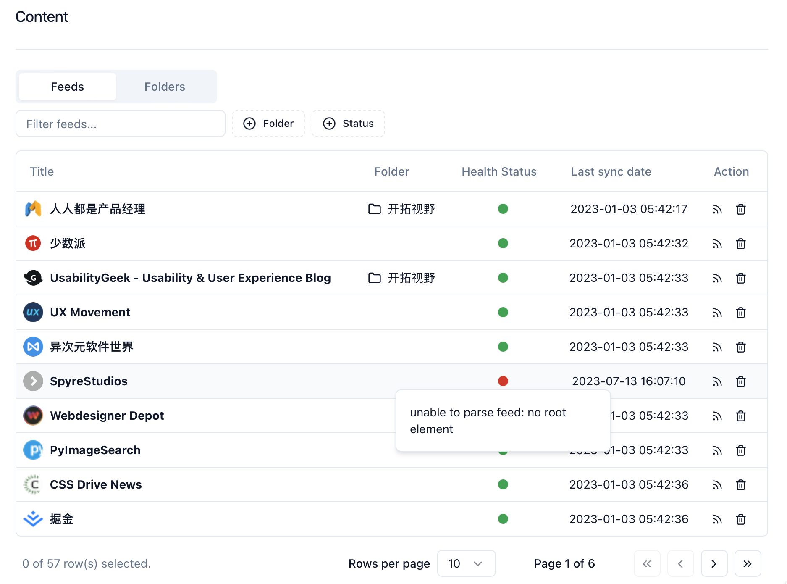

[Lettura](https://github.com/zhanglun/lettura) 是一个开源的RSS阅读器，是我的开源项目。目前还在开发中，但是已经发布了测试版本，欢迎下载[https://github.com/zhanglun/lettura/releases](https://github.com/zhanglun/lettura/releases) 体验。


对于经常使用RSS的朋友一定遇到RSS源不稳定的问题。RSS源不稳定可能有以下原因：

1. 网站服务器故障或维护：如果RSS源所属的网站服务器出现故障或正在维护，可能会导致RSS源无法正常更新或无法访问，从而导致RSS源不稳定。
2. 网络连接问题：如果RSS源所属的服务器或用户端网络出现连接问题，可能会导致RSS源无法正常更新或访问，从而导致RSS源不稳定。
3. 网站更新不及时：有些网站可能不会及时更新其RSS源，或者只在特定时间更新，这可能导致RSS源不稳定。
4. RSS源格式不正确：如果RSS源格式不正确，可能会导致RSS阅读器无法正确解析，从而使得RSS源不稳定。
5. 阅读器问题：有些RSS阅读器可能存在问题，例如无法正确解析RSS源或无法正常更新，这也可能导致RSS源不稳定。

作为一款RSS阅读器，在遇到源不稳定的情况是，需要采取一些针对性措施，在保证应用的正常运行的同时，提高用户的使用体验。


在目前的实现中，在加载RSS源时，如果源不稳定，无法成功获取内容，会给到用户一个消息提醒，告知用户失败的原因。虽然能够给到用户即时的提醒，但是没有将对应的信息保存。提醒关闭之后，用户无法在订阅管理列表快速确定订阅源的状态。在随后的每次更新中，用户会不停地遇到相同的错误提醒。一个源的状态健康与否，只有在更新时才能知道，这让用户无法快速找到并处理存在问题的源。


在Lettura的设置模板中，提供了简单的查看和删除的能力。为了让用户能够更加高效的管理订阅，我决定给每一个RSS源标增加一个健康标记，health_status。每次更新时，如果不能正确获取到源提供的内容，就将其健康标记设置为不健康bad，同时将原因保存在failure_reason中。


Lettura使用SQLite存数据，每个用户的数据库都在用户自己的设备中，为了保证用户在升级应用后不会因为数据库表的变更崩溃，需要平滑地对用户的数据库表进行升级。基本思路是当用户打开升级后的应用时，应用检查是否需要执行数据库相关的升级，升级之前先将数据备份到临时库或者表，升级操作完成之后再将数据恢复到新的数据库或者表中。


为了增加标记状态，我需要为feeds表增加两列：

- health_status 标记健康状态。 0表示健康，1表示不健康。默认0
- failure_reason 当源不健康时，记录原因。

使用ORM创建新的数据库版本，对feeds的数据备份之后，删除表并重新创建一个feeds表。


```sql
PRAGMA foreign_keys = 0;

CREATE TABLE sqlitestudio_temp_table AS SELECT *
                                          FROM feeds;

DROP TABLE feeds;

CREATE TABLE feeds (
    id             INTEGER  NOT NULL
                            PRIMARY KEY,
    uuid           TEXT     NOT NULL
                            UNIQUE,
    title          TEXT     NOT NULL,
    link           TEXT     NOT NULL,
    feed_url       TEXT     NOT NULL,
    feed_type      TEXT     NOT NULL
                            DEFAULT "",
    description    TEXT     NOT NULL,
    pub_date       DATETIME NOT NULL,
    updated        DATETIME NOT NULL
                            DEFAULT (CURRENT_TIMESTAMP),
    logo           TEXT     NOT NULL
                            DEFAULT "",
    health_status  INTEGER  NOT NULL
                            DEFAULT (0),
    failure_reason TEXT     DEFAULT ""
                            NOT NULL,
    sort           INTEGER  NOT NULL
                            DEFAULT 0,
    sync_interval  INTEGER  NOT NULL
                            DEFAULT 0,
    last_sync_date DATETIME NOT NULL
                            DEFAULT CURRENT_TIMESTAMP,
    create_date    DATETIME NOT NULL
                            DEFAULT CURRENT_TIMESTAMP,
    update_date    DATETIME NOT NULL
                            DEFAULT CURRENT_TIMESTAMP,
    UNIQUE (
        link,
        title
    )
);

INSERT INTO feeds (
                      id,
                      uuid,
                      title,
                      link,
                      feed_url,
                      description,
                      pub_date,
                      sync_interval,
                      last_sync_date,
                      sort,
                      create_date,
                      update_date,
                      feed_type,
                      updated,
                      logo
                  )
                  SELECT id,
                         uuid,
                         title,
                         link,
                         feed_url,
                         description,
                         pub_date,
                         sync_interval,
                         last_sync_date,
                         sort,
                         create_date,
                         update_date,
                         feed_type,
                         updated,
                         logo
                    FROM sqlitestudio_temp_table;

DROP TABLE sqlitestudio_temp_table;

PRAGMA foreign_keys = 1;
```


修改好数据库之后，在管理页面中增加health status的搜索和展示，最后效果如下图所示。




