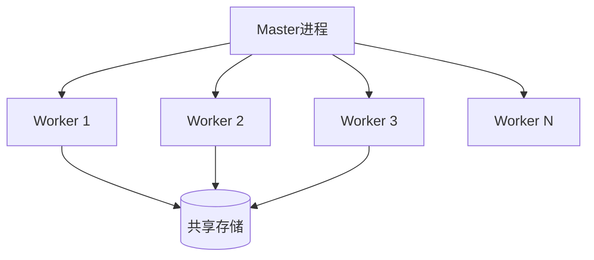
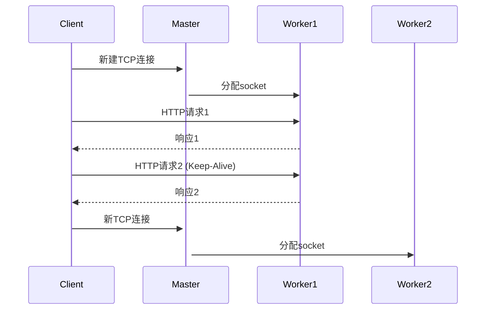
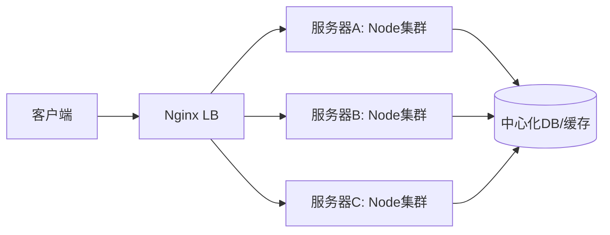
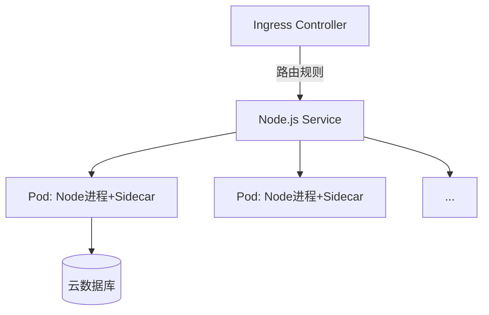
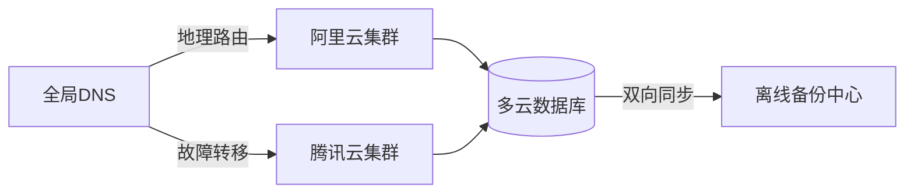

在web应用的生命周期中，最关键的转折点往往出现在流量增长阶段。本文将通过四个维度详解Node.js应用的部署演进：单线程→单机集群→分布式集群→云原生架构，并深入解析每阶段的架构决策与技术实现。


## 第一阶段：单机部署 - 原始形态


### 1.1 基础部署架构


### 特点：

- 单线程运行（事件循环）
- 最多利用单核CPU
- PM2进程守护
- 500 req/s左右的性能瓶颈

### 致命缺陷：


```javascript
// 模拟阻塞事件循环
app.get('/slow', () => {
  let sum = 0;
  for (let i = 0; i < 1e10; i++) { sum += i } // CPU密集型操作
  res.end(sum.toString());
});
```


**一次慢请求可导致服务完全瘫痪**


## 第二阶段：单机集群 - 榨干硬件性能


### 2.1 Node.js Cluster模块工作原理





### 关键技术点：

1. **端口共享策略**主进程监听端口，通过IPC分发socket到Worker
2. **负载均衡算法**

    ```javascript
    // 修改调度策略
    cluster.schedulingPolicy = cluster.SCHED_RR; // Round-Robin
    ```

3. **进程管理**

    ```bash
    # PM2集群模式
    pm2 start app.js -i max --name "api-cluster"
    ```


### 2.2 流量分发深度解析





**关键结论**：同一TCP连接的多请求将始终由同一Worker处理


## 第三阶段：水平扩展 - 跨机器集群化


### 3.1 典型拓扑架构





### 3.2 Nginx负载均衡关键配置


```plain text
upstream node_cluster {
  zone backend 64k;
  least_conn; # 最少连接策略

  server 10.0.1.10:3000 weight=3 max_fails=2;
  server 10.0.1.11:3000 weight=2 max_fails=2;
  server 10.0.1.12:3000 backup; # 备用节点
}

server {
  location /api {
    proxy_pass http://node_cluster;
    proxy_next_upstream error timeout http_500;
  }
}
```


### 动态权重调整策略


```bash
# 热更新服务器配置
curl -X POST -d 'server 10.0.1.13:3000;' \
  http://nginx-admin-api/upstreams/node_cluster/servers
```


### 3.3 会话保持方案对比


| 方案       | 实现方式               | 优缺点           |
| -------- | ------------------ | ------------- |
| IP哈希     | Nginx的ip_hash指令    | 简单但移动端IP易变    |
| Cookie注入 | Nginx + JSESSIONID | 需要客户端支持Cookie |
| 外部存储     | Redis共享Session     | 架构复杂但扩展性强     |


## 第四阶段：云原生架构 - Kubernetes实践


### 4.1 容器化部署拓扑





### 4.2 关键资源配置


### Deployment示例


```yaml
apiVersion: apps/v1
kind: Deployment
metadata:
  name: node-web
spec:
  replicas: 6
  strategy:
    rollingUpdate:
      maxSurge: 2
      maxUnavailable: 1
  template:
    spec:
      containers:
      - name: web
        image: my-node-app:v3.2
        livenessProbe:
          httpGet:
            path: /health
            port: 3000
```


### Service负载均衡


```yaml
apiVersion: v1
kind: Service
metadata:
  name: node-service
spec:
  type: ClusterIP
  selector:
    app: node-web
  ports:
  - protocol: TCP
    port: 80
    targetPort: 3000
```


## 性能优化实战数据


通过压力测试工具 `wrk` 对比不同架构的RPS（每秒请求数）：


| 架构            | 配置                | RPS   | 延迟(avg) | 资源利用率 |
| ------------- | ----------------- | ----- | ------- | ----- |
| 单进程           | 4核8G              | 521   | 23ms    | 12%   |
| 单机集群(8worker) | 同硬件               | 4983  | 17ms    | 86%   |
| 3节点集群         | Nginx + 24个Node进程 | 14420 | 21ms    | 72%   |
| K8s集群(30 Pod) | 自动扩展策略            | 35200 | 19ms    | 82%   |


## 架构演进黄金法则

1. **无状态设计优先**任何会话数据必须外存（Redis/Memcached）
2. **分级健康检查**

    ```mermaid
    graph LR
      L[Liveness探测] -->|重启容器| H[HTTP检查]
      R[Readiness探测] -->|流量切换| T[TCP检查]
      S[Startup探测] -->|慢启动| C[自定义脚本]
    ```

3. **精准监控维度**
    - 进程级别：堆内存/事件循环延迟
    - 容器级别：CPU抢占率
    - 集群级别：分片流量热点

## 终极架构：混合云容灾方案





**核心特性**：

- 跨AZ流量调度
- 数据库异地主从
- 配置中心同步
- 日志聚合分析

## 后记：技术选型方法论


在选择部署架构时，务必遵循 **"3N原则"**：

- **必要性（Need）**：不提前优化，根据压测结果扩容
- **简单性（Naive）**：DevOps成本 vs 业务收益
- **演进性（Next）**：为下个阶段设计逃生通道

牢记：没有完美的架构，只有持续演进的系统。

