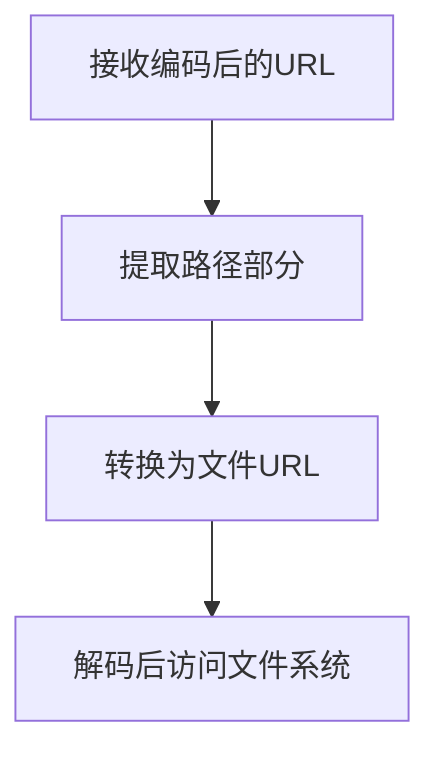

在开发桌面应用时，我们经常需要处理本地资源的访问。本文将以一个实际案例，深入探讨在 Electron 应用中如何正确处理自定义协议和 URL 编码，以确保应用能够稳定地访问包含特殊字符的本地资源。


## 问题背景


在开发一个电子书管理应用时，我们遇到了一个看似简单但实际很棘手的问题：当书名中包含特殊字符（如中文、空格、斜杠等）时，应用无法正确加载书籍封面图片。具体错误是：`TypeError: Invalid URL`。


这个问题涉及到了几个关键点：

1. 自定义协议的注册和使用
2. URL 编码与解码
3. 文件路径的跨平台兼容性

## 深入分析


### 1. 自定义协议的必要性


为什么要使用自定义协议？在 Electron 应用中，我们可能会考虑直接使用文件路径来加载本地资源：


```typescript
// ❌ 不推荐的方式
const coverPath = `/path/to/book/cover.jpg`;

```


这种方式存在几个问题：

- 安全性：直接暴露文件系统路径
- 跨平台兼容性：Windows 和 UNIX 系统的路径分隔符不同
- 文件移动：当文件位置改变时，路径需要更新

使用自定义协议可以解决这些问题：


```typescript
// ✅ 推荐的方式
const coverUrl = `bookwise://book-title/cover.jpg`;

```


### 2. 协议注册与处理


在 Electron 主进程中，我们需要正确注册和处理自定义协议：


```typescript
// 注册协议
protocol.registerSchemesAsPrivileged([
  {
    scheme: "bookwise",
    privileges: {
      secure: true,
      supportFetchAPI: true,
      bypassCSP: true,
      corsEnabled: true,
    },
  },
]);

// 处理协议请求
app.whenReady().then(() => {
  protocol.handle("bookwise", async (request) => {
    const pathname = request.url.replace("bookwise://", "");
    const filePath = url.pathToFileURL(
      path.join(app.getPath("documents"), "Library", pathname)
    );

    return net.fetch(decodeURI(filePath.href), {
      bypassCustomProtocolHandlers: true,
    });
  });
});
```


### 3. URL 编码的重要性


在前端组件中，我们需要正确处理书名中的特殊字符：


```typescript
export const Cover = (props: CoverProps) => {
  const { book } = props;

  const getBookCover = () => {
    try {
      if (!book?.title) {
        return '';
      }
      // 对书名进行 URL 编码
      const encodedTitle = encodeURIComponent(book.title);
      return `bookwise://${encodedTitle}/cover.jpg`;
    } catch (error) {
      console.error('Error generating cover URL:', error);
      return '';
    }
  };

  return ;
};
```


### 4. 编码解码流程


让我们详细看看整个流程：

1. **前端编码**：
    - 原始书名：`"编程之美/Beauty of Programming"`
    - URL 编码后：`"bookwise://%E7%BC%96%E7%A8%8B%E4%B9%8B%E7%BE%8E%2FBeauty%20of%20Programming/cover.jpg"`
2. **主进程处理**：




```typescript
// 示例流程
const title = "编程之美/Beauty of Programming";
const encodedUrl = `bookwise://${encodeURIComponent(title)}/cover.jpg`;
// => bookwise://%E7%BC%96%E7%A8%8B%E4%B9%8B%E7%BE%8E%2FBeauty%20of%20Programming/cover.jpg

const pathname = encodedUrl.replace("bookwise://", "");
// => %E7%BC%96%E7%A8%8B%E4%B9%8B%E7%BE%8E%2FBeauty%20of%20Programming/cover.jpg

const filePath = url.pathToFileURL(path.join(basePath, pathname));
// 转换为文件 URL，可能会再次编码

const finalPath = decodeURI(filePath.href);
// 解码得到最终的文件路径
```


## 最佳实践

1. **错误处理**：

```typescript
const getBookCover = () => {
  try {
    if (!book?.title) {
      console.warn('Book title is missing:', book);
      return '';
    }
    const encodedTitle = encodeURIComponent(book.title);
    const coverUrl = `bookwise://${encodedTitle}/cover.jpg`;
    return coverUrl;
  } catch (error) {
    console.error('Error generating cover URL:', {
      error,
      book,
      errorName: error.name,
      errorMessage: error.message
    });
    return '';
  }
};
```

1. **日志记录**：

```typescript
protocol.handle("bookwise", async (request) => {
  console.log('Protocol request:', request.url);
  const pathname = request.url.replace("bookwise://", "");
  const filePath = url.pathToFileURL(
    path.join(app.getPath("documents"), "Library", pathname)
  );
  console.log('File path:', {
    original: filePath.href,
    decoded: decodeURI(filePath.href)
  });

  return net.fetch(decodeURI(filePath.href), {
    bypassCustomProtocolHandlers: true,
  });
});
```


## 性能考虑

1. **缓存机制**：对于频繁访问的资源，考虑实现缓存
2. **延迟加载**：对于列表中的封面图片，实现懒加载
3. **错误重试**：对加载失败的资源实现重试机制

## 安全考虑

1. **路径验证**：确保请求的路径不会超出允许的范围
2. **协议限制**：限制协议只能访问特定类型的文件
3. **错误处理**：不要在错误信息中暴露敏感信息

## 总结


在 Electron 应用中正确处理自定义协议和 URL 编码是一个看似简单但需要注意很多细节的任务。通过合理的编码解码流程、完善的错误处理和适当的安全措施，我们可以构建一个健壮的本地资源访问机制。


关键点回顾：

- 使用自定义协议替代直接的文件路径
- 在前端正确编码 URL
- 在主进程中正确解码和处理文件路径
- 实现完善的错误处理和日志记录
- 注意性能和安全性考虑

希望这篇文章能帮助你更好地理解和处理 Electron 应用中的 URL 编码问题。如果你有任何问题或建议，欢迎在评论区讨论。

