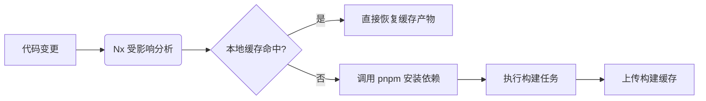
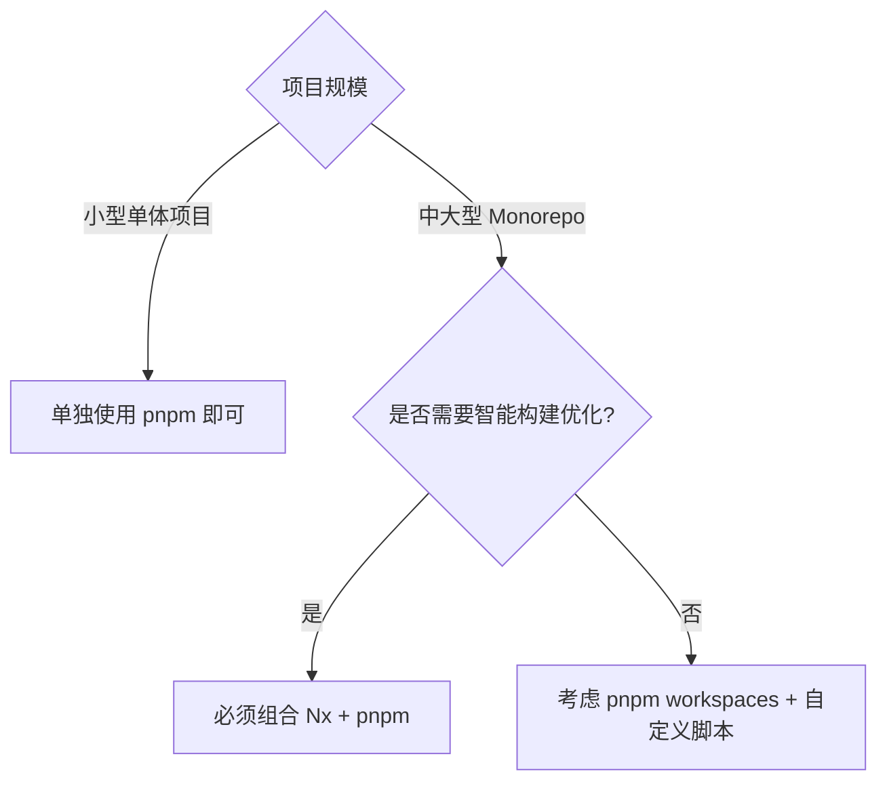

docmost项目已经有了阶段性成果，暂时告一段落。现在要开始搭建一个在线协同白板服务，最近在做技术调研。因为是全栈项目，所以依然选择使用monorepo的方式来管理项目代码。工具选择上和docmost项目保持一致：Nx+pnpm的组合。为什么有了pnpm，还要再加一个Nx呢？

二者解决的问题不一样，pnpm 解决 **磁盘空间与依赖地狱**，Nx 解决 **构建效率与任务优化**，二者形成 Monorepo 的完整解决方案。

| 工具       | 核心职责               | 关键特性            | 解决方案层级  |
| -------- | ------------------ | --------------- | ------- |
| **Nx**   | Monorepo 任务编排与构建优化 | 任务调度、依赖图分析、缓存策略 | 项目流程控制层 |
| **pnpm** | 依赖管理               | 硬链接存储、严格依赖隔离    | 包管理基础层  |

### 概念区分

- **Nx Monorepo** ：Nx 是一个功能强大的构建框架和智能任务运行器，专为管理大型 JavaScript 和 TypeScript 代码库而设计。它提供了一系列工具和功能，用于帮助开发人员高效地构建、测试、发布和维护大型的 Monorepo 项目。
- **pnpm Monorepo** ：pnpm 是一种高效的包管理工具，它通过使用内容寻址存储来避免项目之间的包重复，从而减少了磁盘空间的使用，并且其工作区功能可以管理 Monorepo 中的多个项目，允许在不同子项目之间共享依赖项。

### 关系

- **依赖管理层面** ：pnpm 的工作区功能为 Nx Monorepo 提供了底层的依赖管理支持。在 Nx Monorepo 中使用 pnpm 作为包管理工具，可以更高效地管理各个项目的依赖关系，pnpm 会将所有安装的包存储在一个全局的存储中，然后通过硬链接的方式将所需的包链接到各个项目中，这样可以避免重复下载和存储相同的依赖包，节省了磁盘空间。
- **项目构建与任务执行层面** ：Nx 提供了智能的构建和任务执行功能，它可以与 pnpm 相结合，进一步优化 Monorepo 的构建流程。当运行 Nx 的构建命令时，Nx 会根据项目的依赖关系图来确定需要构建的项目顺序，并且可以利用 pnpm 的高效依赖解析和管理能力，快速地获取和安装所需的依赖包，从而加速整个构建过程。
- **性能优化层面** ：pnpm 本身具有较快的安装速度，而 Nx 的缓存机制可以与之配合，实现更高效的开发体验。在 Nx Monorepo 中，如果项目的依赖没有发生变化，Nx 可以直接从缓存中获取构建结果，而不必重新构建，结合 pnpm 的高效依赖管理，可以大大缩短开发和构建的时间，提高开发效率。
- **功能互补层面** ：Nx 提供了许多高级的功能，如代码生成、项目分析、任务调度等，而 pnpm 则专注于依赖管理的高效性和灵活性。在 Monorepo 中，两者可以相互补充，共同为开发人员提供一个更完善、更高效的开发环境。

### 对比其他组合的优势

- **相比 Yarn + Nx** ：pnpm 在磁盘空间的利用率上比 Yarn 更高，可以避免重复文件的存储，从而节省大量的磁盘空间。对于大型的 Monorepo 项目来说，这可以显著减少存储成本。
- **相比 npm + Nx** ：npm 的安装速度相对较慢，而 pnpm 的安装速度更快，可以提高开发效率。此外，pnpm 的工作区功能在管理 Monorepo 中的项目依赖关系时，比 npm 的工作区支持更加灵活和高效。
- **相比仅使用 pnpm workspaces** ：虽然 pnpm workspaces 提供了基本的 Monorepo 功能，但在任务编排、缓存利用、代码生成等方面的强大功能，能够更好地满足复杂项目的开发需求，提供更丰富的开发体验。

### **Nx的构建加速机制**

三个关键点：

- **增量构建**：仅重建变更影响范围
- **并行任务**：最大化利用 CPU 核心
- **远程缓存**：团队共享构建结果（需 Nx Cloud）

### 选择时机决策树

Nx虽然好，但是也并非适合所有的项目，下面的决策树可以帮助判断时候需要引入Nx。

这种组合模式成为了现代前端工程化的黄金搭档，特别适用于：

- 跨多个框架（React/Vue/Angular）的统一管理
- 微前端架构下的模块化开发
- 工具链共享型团队协作
- 需要持续交付的复杂系统

接下来要投入的**在线白板**项目，是一个需要持续交付的复杂系统，除了前后端的全栈开发之外，还会对外提供SDK。很适合引入Nx来帮助项目的构建和维护。

