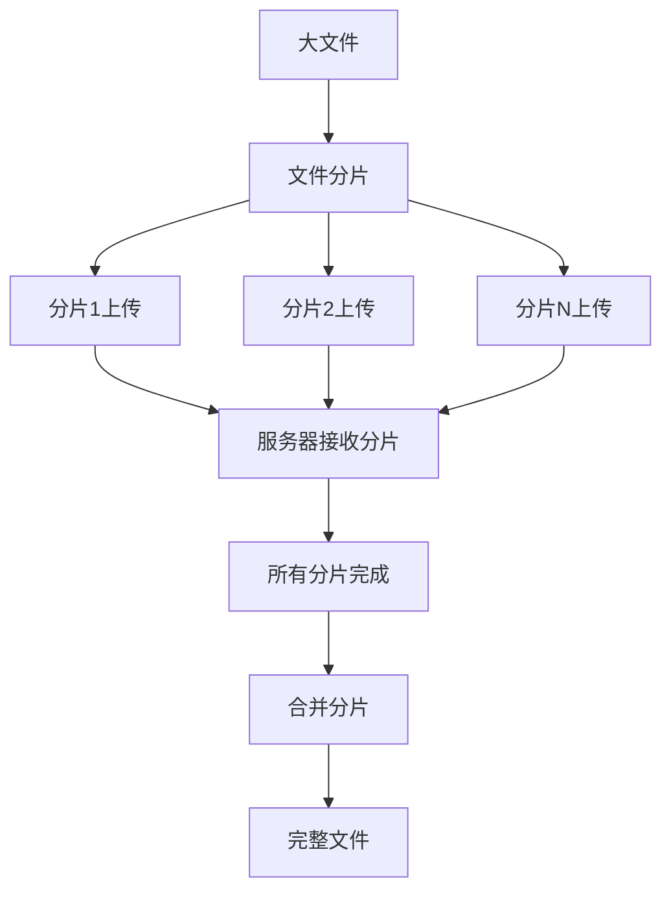
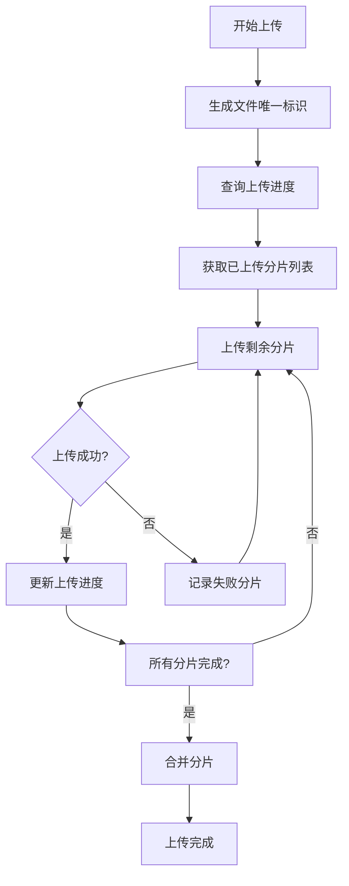

最近在开发在线批注工具时，我遇到了一个让人费解的问题。当用户使用画笔绘制后，系统会自动截图并设为白板背景。这个功能一直运行正常，直到我们发现：当图片超过1MB时，显示在白板上的图片总会缺失底部内容。


### 问题排查


先来看看我们的截图流程：

1. 用户绘制时通过bridge通知客户端截图
2. 客户端截取视频帧转成base64传给白板
3. 白板将base64转成File对象上传到服务器
4. 白板加载服务器返回的图片地址

问题出在第4步，图片显示不完整。


首先怀疑数据传输过程。比对了原始base64和白板接收到的base64，内容完全一致，排除了传输丢失的可能。


接着做了个对比测试：

- 在浏览器地址栏直接打开base64：图片缺失
- 用专业base64转换工具：图片完整

为什么会有这种差异？原来浏览器对地址栏URL长度有限制（通常2MB左右），base64超过这个长度就会被截断。而专业工具没有这个限制。


### 关键的1024KB


检查服务器上的图片时发现，所有有问题的图片大小都精确地停在1024KB。这绝对不是巧合。


我们在关键节点加了日志：


```typescript
// 核心上传代码
export const createAndUploadScreenshotCapture = async (
  url: string,
  title: string
) => {
  try {
    // base64 转 Blob
    const response = await fetch(url);
    const blob = await response.blob();
    console.log('转换后Blob大小:', blob.size); // 1.5MB

    const file = new File([blob], `${title}.png`, { type: blob.type });
    console.log('创建File大小:', file.size); // 1.5MB

    // 创建 FormData
    const formData = new FormData();
    formData.append('file', file);
    const formDataFile = formData.get('file');
    console.log('FormData中文件大小:', formDataFile.size); // 1.5MB

    // 上传
    const res = await api.post(url, formData, {
      headers: { 'Content-Type': 'multipart/form-data' },
    });

    return { src: res.src };
  } catch (error) {
    console.error('截图上传失败:', error);
    throw error;
  }
};
```


日志显示，直到调用上传接口前，文件大小都是完整的。问题一定出在上传环节。


经过排查，发现是 Fastify 的 `@fastify/multipart` 插件在作祟。它默认的文件大小限制正好是1MB。这个出于安全考虑的默认配置，在我们的场景下反而成了问题。


临时解决方案是调整配置：


```javascript
fastify.register(require('@fastify/multipart'), {
  limits: {
    fileSize: 10 * 1024 * 1024, // 提高到10MB
  }
});
```


### 更深层的思考


问题虽然解决了，但我开始想：如果遇到真正的大文件怎么办？总不能无限调大限制。这让我开始研究大文件上传的解决方案。


**分片上传：大文件的优雅处理方案**


分片上传是把大文件切成多个小块，分别上传后再在服务器合并。这种方式有几个明显优势：

- 单个分片失败不影响其他分片
- 支持断点续传
- 可以并行上传提升速度
- 避免单次请求过大

整个流程是这样的：





### 前端实现


下面是前端分片上传的核心代码：


```typescript
class ChunkedUploader {
  private CHUNK_SIZE = 4 * 1024 * 1024; // 4MB每片

  async uploadLargeFile(file: File): Promise<boolean> {
    const totalChunks = Math.ceil(file.size / this.CHUNK_SIZE);
    const fileId = this.generateFileId(file);

    // 检查已上传的分片
    const uploaded = await this.getUploadedChunks(fileId);

    for (let i = 0; i < totalChunks; i++) {
      if (uploaded.includes(i)) {
        continue; // 跳过已上传的
      }

      const chunk = file.slice(i * this.CHUNK_SIZE, (i + 1) * this.CHUNK_SIZE);
      const success = await this.uploadChunk(chunk, i, totalChunks, fileId);

      if (!success) return false;
    }

    return await this.mergeChunks(fileId);
  }

  private async uploadChunk(chunk: Blob, index: number, total: number, fileId: string): Promise<boolean> {
    const formData = new FormData();
    formData.append('chunk', chunk);
    formData.append('index', index.toString());
    formData.append('total', total.toString());
    formData.append('fileId', fileId);

    try {
      const response = await fetch('/upload/chunk', {
        method: 'POST',
        body: formData
      });
      return response.ok;
    } catch {
      return false;
    }
  }
}
```


### 后端实现


Fastify后端处理分片上传：


```javascript
const fs = require('fs').promises;
const path = require('path');

// 上传分片
fastify.post('/upload/chunk', async (request, reply) => {
  const data = await request.file();
  const fields = data.fields;

  const index = parseInt(fields.index.value);
  const fileId = fields.fileId.value;

  // 保存分片到临时目录
  const tempDir = path.join(__dirname, 'temp', fileId);
  await fs.mkdir(tempDir, { recursive: true });

  const chunkPath = path.join(tempDir, `chunk-${index}`);
  await fs.writeFile(chunkPath, await data.toBuffer());

  return { success: true, index };
});

// 合并分片
fastify.post('/upload/merge', async (request, reply) => {
  const { fileId } = request.body;
  const tempDir = path.join(__dirname, 'temp', fileId);

  try {
    // 读取所有分片并按顺序排序
    const files = await fs.readdir(tempDir);
    const chunks = files
      .filter(f => f.startsWith('chunk-'))
      .sort((a, b) => parseInt(a.split('-')[1]) - parseInt(b.split('-')[1]));

    // 创建最终文件
    const finalPath = path.join(__dirname, 'uploads', fileId);
    const writeStream = require('fs').createWriteStream(finalPath);

    for (const chunkFile of chunks) {
      const chunkPath = path.join(tempDir, chunkFile);
      const data = await fs.readFile(chunkPath);
      writeStream.write(data);
    }

    writeStream.end();

    // 清理临时文件
    await fs.rm(tempDir, { recursive: true });

    return { success: true, path: finalPath };
  } catch (error) {
    return { success: false, error: error.message };
  }
});
```


### 拓展：断点续传


通常来说，但凡涉及到大文件的上传，除了分片上传之后，还会有断点续传这个概念。在这里就不再花精力讨论了，网上资料一大把。就简单介绍一下原理好了。断点续传建立在分片上传基础上，其核心流程如下：





断点续传的核心原理是：

- 为每个文件生成唯一标识
- 服务器记录已上传的分片
- 上传中断后，客户端查询上传进度
- 只上传缺失的分片，避免重新开始

这种方式特别适合网络不稳定或文件巨大的场景，能显著提升用户体验。

