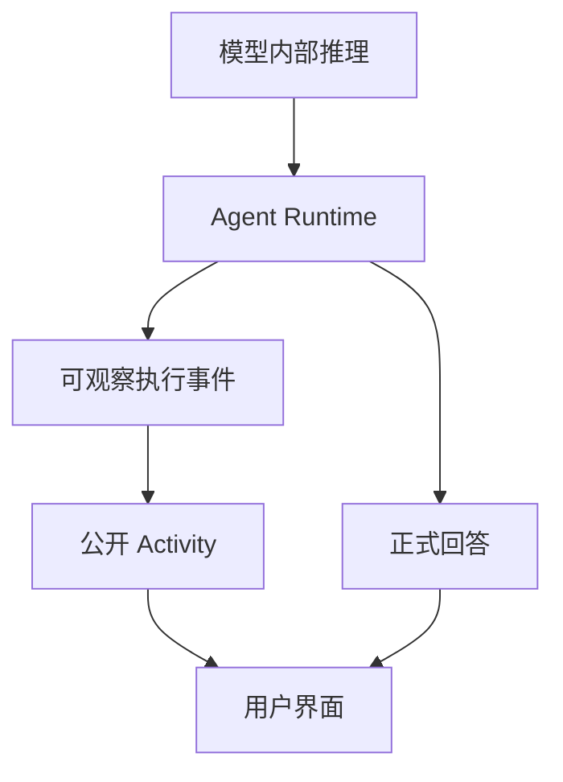
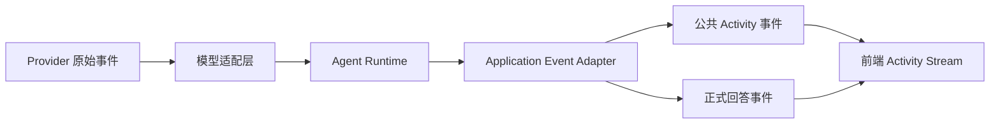

# Codex 风格 Agent Activity Stream：如何展示 Agent 的可观察执行过程

> 从 Runtime 事件到用户界面，展示 Agent 的工作过程，而不暴露模型的私有思维链。

> 本文所说的“Codex 风格”，主要指一种面向用户展示 Agent 活动、正式交付和终态的交互方向，不试图还原某个具体产品的内部协议或实现。

当 Agent 只调用一次模型时，一个 loading 或直接流式输出答案往往已经足够。

但 Coding Agent、文档 Agent 和浏览器 Agent 可能会连续执行多个步骤：

```text
用户请求
  ↓
分析任务
  ↓
读取上下文
  ↓
搜索或查询信息
  ↓
修改资源或执行操作
  ↓
验证结果
  ↓
生成回答
```

如果这些过程全部隐藏，用户只能看到一个“正在生成”。等待时间一长，用户很难判断 Agent 是否仍在工作、已经完成了什么，以及失败后是否还会继续。

因此，一类接近 Codex 的界面会把一次 Agent Run 展示成一条活动链路：

```text
✓ 已准备项目上下文
✓ 已定位相关代码
✓ 已读取 3 个文件
● 正在验证修改结果
```

这条链路不是模型思维的逐字转录，而是 Runtime 确认发生后、经过筛选的工作活动。工具、外部服务、浏览器、子 Agent 或工作流都可能成为活动来源，但它们需要分别定义事件映射和安全边界；Activity Stream 本身不会自动解决这些问题。

本文讨论三个问题：

1. 如何区分模型内部推理、Agent 执行和用户可见活动？
2. 如何把不同来源的执行事件归一化为稳定的 Activity Stream？
3. 如何让活动流在前端可理解、可恢复、可取消，并最终收敛为可信的回答？

---

## 一、先区分三种不同的“过程”

一个 Agent Run 中，通常会同时出现三类内容。它们经常被混在一起，但产品职责并不相同。先把这三类内容分开，后面的事件和 UI 设计才不容易互相污染。

### 1. 模型内部推理

模型可能产生 reasoning token、thinking block 或 reasoning summary，用来判断下一步行动、选择执行方式和修正中间错误。

这些内容不是客观执行记录，也不是稳定的产品协议。它们可能包含内部规则、权限判断、私有上下文或尚未验证的猜测，因此默认留在 Runtime 内部。

### 2. Agent 执行活动

Activity 描述的是 Runtime 已经确认发生的工作单元：

```text
正在读取项目上下文
已定位 4 个相关位置
正在验证修改结果
等待用户确认
```

它回答的是：

> Agent 做了什么？现在进行到哪里？结果如何？

Activity 的来源可能是工具、外部服务、浏览器、子 Agent、工作流或其他机制。每种来源都需要单独处理事件映射、权限、错误和取消语义；来源可以被记录，但不宜直接决定 Activity 的产品语义。

### 3. 用户可见的过程视图

前端不会把底层事件原样打印出来，而是将活动归并成用户可以理解的视图：

```text
✓ 已准备上下文
✓ 已定位相关代码
● 正在验证修改结果

正式回答正文……
```

这条视图可以包含简短说明、当前状态、结果摘要、失败提示、来源和终态，但不应暴露原始 reasoning、Prompt 或未经脱敏的工具载荷。



三者的关系可以概括为：

| 内容 | 主要作用 | 默认是否展示给用户 |
|---|---|---:|
| 模型内部推理 | 支撑模型决策 | 否 |
| Agent 执行活动 | 描述已确认的工作过程 | 可以 |
| 用户可见过程视图 | 将活动整理成可理解的界面 | 可以 |
| 正式回答或其他交付 | 面向用户的主要输出 | 如果本次 Run 产生，则应与过程分离 |

本文主要讨论后两层：如何从 Agent 的执行活动生成稳定的公开视图，以及如何把它与正式交付分开；重点不是转录模型的思维链。

---

## 二、什么是 Agent Activity Stream？

最简单的聊天接口只有一条返回文本：

```text
用户消息
  ↓
模型生成
  ↓
最终回答
```

Agent 的真实运行过程通常更复杂：

```text
用户消息
  ↓
理解任务并准备上下文
  ↓
获取或操作外部资源
  ↓
处理结果并继续推进
  ↓
验证中间产物
  ↓
生成正式回答
```

这些工作可能由工具、外部服务、浏览器、子 Agent、工作流或其他机制完成。Activity Stream 不必为每种机制设计一套独立的 UI，而可以把它们映射成用户能够理解的工作活动；具体机制仍需要各自处理权限、错误和取消。

例如，Runtime 可能产生：

```text
activity.started  { operation: "inspect", target: "项目上下文" }
activity.completed { summary: "找到 4 个相关位置" }
activity.started  { operation: "verify", target: "修改结果" }
answer.delta(...)
run.completed
```

用户最终看到的不是原始事件，而是：

```text
✓ 已准备项目上下文
✓ 已定位 4 个相关位置
● 正在验证修改结果

这里是正式回答正文……
```

如果把这些内容直接展示给用户，Activity Stream 很容易退化成模型日志窗口：协议字段不稳定，敏感载荷可能泄露，用户也难以判断哪些内容已经真正发生。因此，本文把 Activity Stream 定义为：

> **Activity Stream 是一次 Agent Run 的公开工作视图。它由 Runtime 产生的、经过筛选的事件驱动，并在前端归并为当前活动、已完成活动、失败活动、正式交付和终态。**

---

## 三、为什么 Agent 需要 Activity Stream？

### 1. 解释等待发生在哪里

AI 请求的耗时往往难以在开始时准确预估：

```text
读取上下文：100ms
搜索服务：2s
外部 API：5s
多轮模型调用：10s
```

如果页面在这段时间只显示：

```text
正在生成……
```

用户无法判断：

- 请求是否已经被服务端接收；
- 系统是否正在读取资料；
- 外部工具是否超时；
- Agent 是继续运行，还是已经卡住。

一条与实际执行相符的 Activity 可以帮助用户理解等待发生在哪里：

```text
正在查询资料
```

它通常比没有上下文的 spinner 更容易解释，但并不意味着实际耗时一定会缩短。

### 2. 建立有限的可解释性

用户并不一定需要知道模型的完整推理，但通常需要知道：

- Agent 是否使用了资料；
- 是否调用了工具；
- 当前进行到哪个阶段；
- 是否发生了重试；
- 最终回答是否完整；
- 回答依据了哪些来源。

Activity Stream 提供的是一种**有限、可控、面向任务的解释能力**。它说明系统已经确认了哪些工作，而不是替用户解释模型的全部内部决策。

### 3. 支持复杂 Agent

当 Agent 只有一次模型调用、等待时间也很短时，流式文本往往已经足够。

当 Agent 还包含以下能力时，单纯的文本流可能无法表达完整状态：

```text
多轮工具调用
并行任务
长时间 Workflow
人工确认
可恢复任务
失败重试
部分结果
```

Activity Stream 可以把其中一部分状态显式表达出来，同时把过程信息与正式正文分开。是否展示、展示到什么粒度，仍取决于产品场景和安全边界。

### 4. 帮助用户形成正确预期

Activity 文案不宜承诺模型“正在思考某个具体结论”，更适合说明系统已经开始或正在执行的工作：

```text
正在读取资料
正在检查一致性
正在生成回答
```

这样可以减少用户把中间判断误认为最终结论的可能性，但它仍然不能替代正式回答中的事实核验。

---

## 四、为什么不能直接展示原始思维链？

直接转发 reasoning 看似简单，实际上会带来多个问题。

### 1. 安全和隐私风险

推理内容可能携带：

- 系统 Prompt 片段；
- 权限判断；
- 私有上下文；
- 用户隐私；
- 内部工具名和参数；
- 数据库条件或内部 ID。

### 2. 中间判断不是最终事实

模型的中间思考可能是错误的：

```text
也许用户想修改全部镜头……
```

这只是中间假设，不应该被用户当成产品承诺。

### 3. 格式和语义不稳定

不同模型可能：

- 不返回 reasoning；
- 返回不同字段；
- 以 token delta 返回；
- 返回加密或脱敏 block；
- 只提供 summary；
- 在模型升级后改变格式。

如果前端直接依赖这些字段，产品协议就会被 Provider 绑死。

### 4. 思维链不等于执行记录

模型说“我准备搜索资料”，不代表工具真的已经执行。

对于描述具体外部操作的 Activity，最好等 Runtime 确认操作已经开始或完成后再发布。请求已接收、等待输入和生命周期状态则可以使用独立的产品事件表达：

```text
模型意图：可能调用搜索工具
  ↓
Runtime 校验权限和参数
  ↓
工具真正开始执行
  ↓
公开 activity_started
```

可以保留下面这条边界：

```text
原始 reasoning：内部使用，默认隐藏
Runtime：负责识别、过滤和编排
公共协议：只发送安全摘要
前端：展示 Activity、正文、来源和终态
```

---

## 五、设计 Activity Stream 的基本原则

前面的讨论解决了“为什么要展示过程”，这里进一步把它落到设计约束上。下面这些原则不是一套必须完整照搬的协议，而是用来判断某条活动是否适合公开的检查标准。

### 原则一：公开事实，不公开猜测

Activity 最好对应 Runtime 已经确认发生的事实：

```text
✓ 已读取 8 个角色信息
✓ 已完成第 2 场检查
● 正在生成第 3 个镜头
```

避免：

```text
我认为用户真正想要的是……
我决定调用某个内部服务，因为……
```

### 原则二：活动和正文分离

在本文的文本流示例中，只有正式回答增量进入 `answer`：

```text
answer += event.payload.text
```

以下内容不宜混入正文：

- commentary；
- 阶段状态；
- 工具名称；
- 活动结果摘要；
- 心跳；
- 重连提示；
- 内部错误信息。

否则历史消息会留下：

```text
正在查询资料
已找到 3 条
正在整理回答
```

这些是运行过程，不是正式回答。

### 原则三：当前活动突出，历史活动收敛

运行中的界面通常需要突出当前活动：

```text
✓ 已准备上下文
● 正在查询资料
```

完成后可以将过程明细折叠为入口：

```text
✓ 处理完成
⌄ 查看处理过程
```

是否显示活动数量，要看这个数量对用户有没有帮助；如果只是调试统计，就不必放在默认摘要里。Activity Stream 的重点也不是记录更多，而是让过程随着运行逐渐变得清晰。

### 原则四：失败保留，成功折叠

成功活动通常可以压缩：

```text
✓ 已查询资料 · 3 条
```

失败活动通常值得保留，因为它可能影响用户对答案完整性的判断：

```text
✗ 资料查询失败 · 可以重试
```

### 原则五：活动不能伪造进度

不要为了让页面看起来“有变化”而连续发送：

```text
正在分析
正在深度思考
正在整理
马上完成
```

如果没有真实阶段或可计算的进度，这些文案容易变成伪进度。

可以使用保守表达：

```text
正在处理请求
```

不宜伪造：

```text
已完成 83%，预计还需 2 秒
```

除非系统确实能够计算这个进度。

---

## 六、一次 Run 的状态模型

Activity Stream 通常需要围绕一次明确的 Run 建模，而不是只围绕一个全局 loading 状态建模。Run 描述一次完整执行；Activity 描述其中值得公开的工作单元；Interaction 则描述执行暂停并等待外部输入的控制流边界。

```ts
type RunStatus =
  | 'accepted'
  | 'preparing'
  | 'running'
  | 'waiting_for_input'
  | 'cancelling'
  | 'completed'
  | 'cancelled'
  | 'failed';
```

一次 Run 可以经历：

```text
accepted
  → preparing
  → running
  → completed
```

取消分支：

```text
accepted / preparing / running
  → cancelling
  → cancelled
```

失败分支：

```text
accepted / preparing / running
  → failed
```

等待外部输入：

```text
running
  → waiting_for_input
  → running
```

`waiting_for_input` 不只可以表示审批，也可以表示 Agent 正在等待澄清、方案选择或失败恢复决策。人工接管属于更复杂的协作场景，需要额外定义权限和交接语义。

### Human-in-the-loop：Agent 如何暂停并等待外部决策？

Agent 并不总能，也不总应该自主完成任务。当操作具有破坏性、信息不足、权限不足，或者存在多个合理方案时，Runtime 可以暂停 Run，并提出结构化的交互请求。是否暂停以及暂停到什么粒度，要由具体业务的风险和交互成本决定。

这不是普通的工作活动，而是一次控制流转移：

```text
Agent 执行
  ↓
进入决策边界
  ↓
等待外部输入
  ↓
恢复、分支或结束
```

可以把它理解为：

```text
Activity：Agent 正在做什么
Interaction：Agent 为什么停下来，需要人类做什么
```

Human-in-the-loop 的具体形式可以不同，但不必改变 Activity Stream 的核心模型：

```text
approval       确认是否执行
clarification  补充缺失信息
choice         在多个方案中选择
recovery       选择重试、回滚或停止
handoff        转交给人工处理
```

如果交互需要独立过期、鉴权和恢复，通常值得把它单独建模，并关联到触发它的 Activity：

```ts
type Interaction = {
  interactionId: string;
  runId: string;
  requiredByActivityId?: string;
  kind: 'approval' | 'clarification' | 'choice' | 'recovery' | 'handoff';
  title: string;
  prompt: string;
  options?: Array<{ value: string; label: string }>;
  status: 'pending' | 'responded' | 'expired' | 'cancelled';
  expiresAt?: string;
  response?: {
    actorId: string;
    value: unknown;
    respondedAt: string;
  };
};
```

> **假设示例**：下面用 Coding Agent 的配置修改场景说明 approval 类型 Interaction，不代表所有 Agent 都会执行这类操作。

前端可以这样呈现：

```text
✓ 已分析修改范围
✓ 已生成执行方案
⏸ 需要你的确认

即将执行一项可能影响已有资源的操作，是否继续？

[继续] [停止] [查看详情]
```

用户提交的响应必须关联到具体的 `interactionId`。服务端需要再次校验用户权限、Run 状态、交互是否过期，以及待执行资源是否仍是原来的版本；不能只信任前端传来的 `approve`。

如果交互属于原 Run 的暂停点，提交响应后可以恢复原 Run；也有系统会为这次响应创建新的 attempt，具体取决于任务和审计模型：

```text
resume(runId, interactionId, response)
```

用户提出的新问题则可以创建新的 Run，原 Run 保持等待状态。这样“回答审批”和“开始一个新任务”不会混在同一条控制流里。

### 推荐的 Run 状态

```ts
type RunViewState = {
  runId: string;
  assistantMessageId: string;
  status: RunStatus;
  lastSeq: number;
  currentSummary?: string;
  activities: Record<string, ActivityItem>;
  interactions: Record<string, Interaction>;
  answer: string;
  sources: SourceReference[];
  partial: boolean;
  terminal?: TerminalState;
};
```

如果需要处理活动更新、重试或重放，可以为每个活动实例分配稳定的 `activityId`：

```ts
type ActivityItem = {
  activityId: string;
  parentActivityId?: string;
  operation: string;       // inspect / search / change / verify / wait
  title: string;           // 用户看得懂的活动名称
  status:
    | 'queued'
    | 'running'
    | 'waiting_for_input'
    | 'retrying'
    | 'completed'
    | 'failed'
    | 'cancelled'
    | 'skipped';
  target?: { type?: string; label?: string };
  source?: { type?: string; name?: string };
  attempt?: number;
  durationMs?: number;
  resultSummary?: string;
  retryable?: boolean;
};
```

这里固定的是活动的稳定维度，而不是一份封闭的机制清单：

- `operation` 表达 Agent 做了什么；
- `target` 表达它作用于什么对象；
- `source` 可选地记录底层由什么机制完成；
- `parentActivityId` 表达活动之间的阶段或嵌套关系。

未来增加新的执行机制时，可以优先尝试把它映射到这些维度；如果新的交互方式改变了状态模型，仍可能需要扩展协议。

在需要处理重复执行、并行活动或事件重放时，使用 `Record<string, ActivityItem>` 会比较方便：

- 同一个工作活动可能重复执行；
- 并行活动可以交错返回；
- retry 可以更新原活动或创建新尝试；
- 重连重放不会重复渲染；
- 活动状态不依赖数组位置。

### Activity 的生命周期

一个活动可以是：

```text
queued
  → running
  → completed
```

失败时：

```text
running
  → failed
  → retrying
  → running
```

不可恢复时：

```text
running
  → failed
```

用户取消时：

```text
running
  → cancelled
```

需要外部决策时，活动本身保持可追踪，Run 进入等待状态：

```text
running
  → waiting_for_input
  → running
```

如果交互被拒绝、过期或转交人工，Run 可以根据业务规则进入相应分支，而不是强行伪装成成功。

---

## 七、事件协议如何设计

Provider 和 Agent 框架的原始事件通常不适合作为前端协议。应用层可以增加一层自己的事件 envelope，隔离底层实现变化和用户界面的数据需求。下面的事件名称和字段是概念示例，实际协议可以采用不同的命名。

```ts
type StreamEvent<T> = {
  schemaVersion: 1;
  eventId: string;
  runId: string;
  assistantMessageId: string;
  seq: number;
  type: string;
  occurredAt: string;
  payload: T;
};
```

### 字段职责

| 字段 | 作用 |
|---|---|
| `schemaVersion` | 事件协议版本 |
| `eventId` | 事件的稳定身份 |
| `runId` | 区分不同运行 |
| `assistantMessageId` | 关联助手消息 |
| `seq` | 排序、去重和重放游标 |
| `type` | 事件类型 |
| `occurredAt` | 事件发生时间 |
| `payload` | 该事件的具体内容 |

### 一组可参考的事件类型

```text
accepted
run_started
stage_started
stage_progress
stage_completed
activity_started
activity_updated
activity_completed
activity_failed
interaction_requested
interaction_responded
interaction_expired
run_resumed
answer_started
answer_chunk
answer_completed
sources
heartbeat
run_cancel_requested
run_cancelled
run_completed
run_failed
```

不必一开始实现全部事件。验证基本交互时，可以先支持：

```text
accepted
stage_started
activity_started
activity_completed
answer_chunk
run_completed
run_failed
```

### 事件职责

| 事件 | 是否进入正式正文 | 作用 |
|---|---:|---|
| `accepted` | 否 | 请求已经被系统接收 |
| `stage_started` | 否 | 真实阶段开始 |
| `activity_started` | 否 | 一个工作活动开始 |
| `activity_completed` | 否 | 一个工作活动完成 |
| `interaction_requested` | 否 | Run 暂停并等待外部决策 |
| `interaction_responded` | 否 | 收到与交互请求关联的响应 |
| `run_resumed` | 否 | Run 根据响应继续执行 |
| `answer_chunk` | 是 | 正式回答增量 |
| `sources` | 否 | 回答引用来源 |
| `heartbeat` | 否 | 保持连接，不渲染 |
| `run_completed` | 否 | 成功终态 |
| `run_cancelled` | 否 | 取消终态 |
| `run_failed` | 否 | 失败终态 |

### 一个概念示例

```json
{
  "schemaVersion": 1,
  "eventId": "run_123:7",
  "runId": "run_123",
  "assistantMessageId": "assistant_456",
  "seq": 7,
  "type": "interaction_requested",
  "occurredAt": "2026-08-30T10:00:00.000Z",
  "payload": {
    "interactionId": "interaction_3",
    "requiredByActivityId": "activity_12",
    "kind": "approval",
    "title": "确认修改生产配置",
    "prompt": "即将修改 production.yaml，是否继续？",
    "options": [
      { "value": "approve", "label": "继续" },
      { "value": "reject", "label": "停止" }
    ],
    "status": "pending",
    "expiresAt": "2026-08-30T10:05:00.000Z"
  }
}
```

### 终态结构

```ts
type TerminalState = {
  status: 'completed' | 'cancelled' | 'failed';
  persisted: boolean;
  partial: boolean;
  retryable?: boolean;
  errorCode?: string;
  message?: string;
};
```

一个 Run 可以先用下面这些不变量进行检查。它们属于业务状态和公共协议层面的约束，具体实现还需要数据库条件更新、执行所有权和客户端归并逻辑共同保证：

1. 在业务状态上，一个 Run 只收敛到一个终态；网络层仍可能重复投递终态事件；
2. 对用户可见的 Run 事件，终态后不再产生新的业务状态变化；
3. `seq` 在约定的作用域内单调递增；
4. 客户端能够幂等处理重复事件；
5. 迟到的 `answer_chunk` 不会污染已经收敛的回答；
6. `run_cancelled` 不会被后续异步任务覆盖为 `run_completed`；
7. 在文本流模型中，只有正式回答增量进入正文；
8. `reasoning`、Prompt 和原始工具数据不进入公共事件。

---

## 八、`seq`、幂等和至少一次投递

网络系统很难单靠传输层保证事件严格 exactly-once 投递。更常见的做法是：

```text
服务端至少一次投递
  +
客户端按 eventId / seq 幂等归并
  +
正文按事件序号或 chunkId 去重
```

### Run 级序号还是会话级序号？

有两种常见设计。

#### Run 级 seq

```text
run_123: 1, 2, 3, 4
run_456: 1, 2, 3
```

适合单次聊天流，简单，也容易进行 Run 级重连。

#### Conversation 级 seq

```text
conversation_1: 101, 102, 103, 104
```

同一会话中的多个 Run 共享一个序号，可以表达并发 Run 的全局事件顺序，但需要更复杂的事件 journal。

如果当前只需要单次 Run 的恢复，MVP 可以先使用：

```text
runId + run-level seq
```

只有在需要跨 Run 排序、会话级回放或统一订阅时，才有必要进一步引入 conversation-level cursor。

### 客户端归并逻辑

```ts
function reduceRunState(
  state: RunViewState,
  event: StreamEvent<unknown>,
): RunViewState {
  if (event.runId !== state.runId) return state;
  if (event.seq <= state.lastSeq) return state;

  switch (event.type) {
    case 'activity_started':
      // 根据 activityId 创建或更新活动
      break;

    case 'activity_completed':
      // 更新同一个 activityId
      break;

    case 'answer_chunk':
      // 只有正式回答增量可以追加
      break;

    case 'run_completed':
      // 收敛为 completed
      break;
  }

  return {
    ...state,
    lastSeq: event.seq,
  };
}
```

实际实现还可以记录已经处理过的 `eventId`，以应对重复投递或异常重试。下面的简化 reducer 只演示“按序处理”的情况；如果允许事件乱序，不能只依赖 `lastSeq`，还需要缓存缺失事件，或者通过 snapshot 重新建立状态。`seq` 和 `eventId` 如何配合，应根据服务端的重试和排序语义确定。

---

## 九、如何选择流式传输方式

传输方式没有脱离场景的唯一答案。需要同时考虑请求体、鉴权、双向通信、断线恢复、后台执行和实现成本。

### 方案一：POST 直接返回流

```text
POST /chat/stream
  → text/event-stream
```

优点：

- 请求体可以直接传复杂 JSON；
- 可以使用 `fetch` 和 `AbortController`；
- 适合简单的同步聊天 Run。

缺点：

- 断线恢复和后台运行需要额外设计；
- 如果连接断开，客户端需要知道如何重新订阅。

### 方案二：POST 创建 Run，GET 订阅事件

```text
POST /runs
  → { runId, assistantMessageId }

GET /runs/:runId/events
  → text/event-stream
```

优点：

- Run 有独立身份；
- 适合后台执行；
- 适合断线重连和事件重放；
- 可以通过 snapshot 恢复已经完成的 Run。

缺点：

- API 数量更多；
- 需要持久化 Run 状态和事件。

如果 Agent 需要后台执行、独立重连或过程回放，第二种模式通常更合适；如果只是一次简单的同步对话，第一种模式的实现成本更低。

### 方案三：WebSocket

WebSocket 适合：

- 双向实时通信；
- 多方协作；
- 实时人工介入；
- 浏览器控制和服务端事件共享一条长连接。

但普通 Agent 进度推送未必需要 WebSocket。SSE 或 HTTP streaming 通常更简单。

### 一个实用的选择

```text
简单原型：POST + fetch streaming
普通生产聊天：POST 创建 Run + GET SSE
复杂双向协作：WebSocket
```

---

## 十、SSE 的一种实现方式

如果希望利用原生 SSE 的游标机制，除了在 JSON 中保留 `eventId`，还可以使用 SSE 协议的 `id:` 字段：

```text
id: run_123:7
event: activity_completed
data: {"runId":"run_123","seq":7,"type":"activity_completed"}

```

在使用原生 `EventSource`、服务端发送了 `id:`，且连接由浏览器自动重连的情况下，浏览器通常会把最近的事件 ID 通过 `Last-Event-ID` 带给服务端：

```http
Last-Event-ID: run_123:7
```

但需要注意：

> `Last-Event-ID` 只携带游标，不负责自动恢复历史事件。服务端仍需要根据这个游标查询事件并决定是否重放后续内容；如果客户端使用 `fetch()` 自己管理流，则需要显式保存和传递游标。

### SSE 重连流程

```text
连接断开
  ↓
客户端保留 lastEventId / lastSeq
  ↓
使用同一个 runId 重新订阅
  ↓
服务端重放 lastSeq 之后的事件
  ↓
客户端幂等归并
  ↓
继续接收后续事件
```

### 原生 EventSource 的限制

原生 `EventSource`：

- 主要使用 GET；
- 自定义请求头能力有限；
- 适合 Cookie 鉴权或简单订阅；
- 如果在 `onerror` 中主动 `close()`，浏览器不会自动重连；
- 如果希望使用原生 SSE 的自动游标能力，服务端需要发送 `id:` 字段；
- 如果产品要求断线后补齐历史事件，服务端仍需要实现事件重放或提供其他状态恢复接口。

如果需要：

- POST body；
- Bearer Token；
- 自定义取消信号；
- 更细粒度的重连策略；

可以使用 `fetch()` 读取 `ReadableStream`，不必强行使用 `EventSource`。

### 心跳

长时间没有业务事件时，可以发送心跳：

```text
: heartbeat

```

或者发送结构化事件：

```json
{
  "type": "heartbeat"
}
```

心跳主要用于维持连接或探测连接状态，通常不进入可见 Activity 列表，也不应触发消息正文重渲染。它与 Run 的执行租约、取消信号和事件持久化不是同一个概念。

---

## 十一、Runtime 如何转换模型事件

Agent 框架或 Provider 通常会产生比前端更多的事件。例如：

```text
模型文本增量
执行活动开始
执行活动更新
执行活动完成或失败
步骤开始
步骤结束
reasoning 增量
模型完成
```

应用层通常需要增加一层 Adapter，把这些内部事件转换成面向产品的公共事件。是否需要独立的 Adapter，取决于系统规模；但不建议让前端直接依赖 Provider 事件格式。



### 通用映射

```text
模型文本增量       → answer_chunk
工作活动开始       → activity_started
工作活动更新       → activity_updated
工作活动完成       → activity_completed
工作活动失败       → activity_failed
真实阶段开始       → stage_started
真实阶段结束       → stage_completed
模型 reasoning     → 默认隐藏
模型完成           → run_completed
```

同一个公共事件可以承载不同的底层来源：

```text
代码搜索、文档检索、浏览器访问、外部查询
                  → activity.started(operation="search")
文件修改、数据更新、生成产物
                  → activity.completed(operation="change")
测试、构建、事实核验
                  → activity.completed(operation="verify")
```

底层机制可以记录在可选的 `source` 字段中，但不宜成为前端核心分支的唯一依据。

### 原始执行事件不能直接转发

底层执行事件通常包含完整参数：

```json
{
  "toolName": "search_documents",
  "args": {
    "tenantId": "private-tenant",
    "query": "内部搜索条件"
  }
}
```

这些数据不应该直接发到浏览器。

Runtime 应先把底层事件转换成稳定的工作语义，再生成安全摘要：

```json
{
  "activityId": "activity_1",
  "operation": "search",
  "title": "正在查询项目资料",
  "status": "running",
  "target": {
    "type": "documents",
    "label": "当前项目资料"
  }
}
```

工具完成后，再公开有限结果：

```json
{
  "activityId": "activity_1",
  "operation": "search",
  "title": "已查询项目资料",
  "status": "completed",
  "resultSummary": "找到 3 条相关结果",
  "durationMs": 1400
}
```

### 以 Agent 框架事件为例

下面的代码是接近实际框架事件的伪代码，字段名称和事件类型需要以具体 SDK 版本为准：

```ts
const stream = await agent.stream(input);

for await (const part of stream.fullStream) {
  switch (part.type) {
    case 'text-delta':
      publish({
        type: 'answer_chunk',
        payload: { text: part.text },
      });
      break;

    case 'tool-call':
      publishSafeToolActivityStarted(part);
      break;

    case 'tool-result':
      publishSafeToolActivityCompleted(part);
      break;

    case 'reasoning-delta':
      // 默认不发布到公共事件
      break;

    case 'finish':
      publishRunCompleted(part);
      break;
  }
}
```

这里的 `fullStream` 只是 Runtime 的输入，不宜直接当成前端协议。

原因包括：

- 事件类型和 payload 受框架版本影响；
- 不同 Provider 的支持程度不同；
- 工具参数可能包含敏感数据；
- reasoning 事件不一定应该公开；
- `accepted`、`sources`、`cancelled` 等业务事件通常需要应用层补充。

因此应当保持：

```text
Provider Event
  → Framework Event
  → Application Event
  → UI State
```

而不是：

```text
Provider Event → Browser
```

---

## 十二、前端如何把事件变成体验

当事件数量、状态类型或连接生命周期开始变复杂时，前端不宜把每条事件直接 append 到 DOM，而应该维护一个 Run 状态。简单原型也可以先采用更直接的渲染方式，之后再根据重复事件、重连和局部更新的需求演进。

### 运行中

```text
我先读取当前上下文。

✓ 已准备会话资料
● 正在查询相关文档
```

### 活动完成

```text
✓ 已查询相关文档 · 找到 3 条
● 正在整理回答
```

### 生成完成

```text
✓ 处理完成
⌄ 查看处理过程

正式回答正文……
```

### 一个简单的归并过程

```ts
function applyEvent(state: RunViewState, event: StreamEvent<any>) {
  if (event.seq <= state.lastSeq) return state;

  if (event.type === 'activity_started') {
    const item = event.payload;
    return {
      ...state,
      lastSeq: event.seq,
      activities: {
        ...state.activities,
        [item.activityId]: item,
      },
    };
  }

  if (event.type === 'activity_completed') {
    const item = event.payload;
    return {
      ...state,
      lastSeq: event.seq,
      activities: {
        ...state.activities,
        [item.activityId]: {
          ...state.activities[item.activityId],
          ...item,
        },
      },
    };
  }

  if (event.type === 'interaction_requested') {
    const interaction = event.payload;
    return {
      ...state,
      lastSeq: event.seq,
      status: 'waiting_for_input',
      interactions: {
        ...state.interactions,
        [interaction.interactionId]: interaction,
      },
    };
  }

  if (event.type === 'run_resumed') {
    return {
      ...state,
      lastSeq: event.seq,
      status: 'running',
    };
  }

  if (event.type === 'answer_chunk') {
    return {
      ...state,
      lastSeq: event.seq,
      answer: state.answer + event.payload.text,
    };
  }

  if (event.type === 'run_completed') {
    return {
      ...state,
      lastSeq: event.seq,
      status: 'completed',
      terminal: event.payload,
    };
  }

  return {
    ...state,
    lastSeq: event.seq,
  };
}
```

组件可以按职责拆为：

```text
AgentActivityStream
├── ActivityHeader
├── CurrentActivity
├── CompletedActivitySummary
├── ActivityItem
├── ActivityError
├── ActivityToggle
└── ActivityTerminalSummary
```

### UI 层级

Activity 应该服务于正文，而不是抢走正文的视觉权重：

```text
消息头
  ↓
当前 Activity / 处理摘要
  ↓
正式回答
  ↓
来源
  ↓
终态操作
```

### 简单回答不必强行显示过程

不是每次请求都需要完整 Activity Stream。

对于没有工具、没有长时间等待的简单回答，可以直接显示正文。

```text
用户：什么是 StoryBible？
助手：StoryBible 是……
```

是否显示完整 Activity，可以结合等待时长、用户是否需要控制、是否存在外部操作以及界面信息密度来决定：

- 首 token 等待较长；
- 调用了工具；
- 存在多个阶段；
- 运行时间较长；
- 需要用户确认；
- 生成了可追踪的工件。

这样可以避免把每条普通对话都变成冗余的状态列表，同时保留长任务和高风险操作所需的反馈入口。

---

## 十三、取消、失败和部分回答

Activity Stream 的价值不只在于“让等待更好看”，还在于让用户知道运行如何结束。

### 取消应由服务端确认

前端停止读取流，不代表 Agent 已经停止执行。

一种更容易明确责任边界的链路是：

```text
用户点击停止
  → cancel(runId)
  → Run 标记 cancelling
  → AbortSignal 传给模型和工具
  → Runtime 停止启动新的工作
  → 发布 run_cancelled
```

取消接口通常需要具备幂等语义：

```text
第一次取消：accepted
重复取消：already_cancelling
已完成后取消：already_terminal
```

客户端断线也不应该默认等于用户取消。用户可能只是：

- 切换页面；
- 暂时失去网络；
- 浏览器进入后台；
- 重新打开同一会话。

### 部分回答

如果 Run 在输出一部分正文后失败或被取消，最好明确标记：

```text
已停止，以下回答可能不完整
```

对应状态：

```ts
{
  status: 'cancelled',
  partial: true,
  answer: '已经生成的部分内容……'
}
```

不要把部分回答呈现成完整答案。

### 失败不是只有“再试一次”

应该区分：

```text
传输层重试
工具重试
从检查点继续
重新生成
```

例如：

```text
✗ 项目资料暂时无法读取
[重试读取资料] [继续回答]
```

和：

```text
✗ 本次回答生成失败
[重新生成]
```

两者的恢复语义不同。

### 重新生成通常应隔离新的 Run 或 attempt

如果产品需要保留旧答案、比较不同版本，并避免新旧事件相互影响，重新生成通常应创建新的 Run，或至少创建新的 attempt 身份：

```text
assistant message
├── version 1
└── version 2
```

无论采用哪种建模方式，都需要隔离新旧执行的事件；旧 Run 的迟到事件不能污染新版本。

---

## 十四、断线恢复和事件重放

这一节需要区分三个容易混淆的目标：重新建立客户端连接、恢复已经持久化的公开状态，以及恢复模型本身的执行现场。前两者可以通过事件或快照实现；第三者通常还需要独立的任务、检查点和执行接管设计，不能从一次 SSE 重连自然推导出来。

如果事件只保存在进程内内存中，服务重启或客户端断线后通常无法恢复完整的过程信息；是否需要持久化过程，要看产品是否要求断线恢复、审计或后台执行。

如果产品要求在断线后恢复过程，或允许 Run 在后台继续执行，就需要某种持久化的事件或状态来源。事件 journal 是一种常见选择：

```text
Run
├── runId
├── status
├── current answer
├── current activities
└── event journal
    ├── eventId
    ├── seq
    ├── type
    ├── payload
    └── occurredAt
```

存储可以是：

- PostgreSQL event table；
- Redis Streams；
- 具备游标和保留策略的其他事件存储。

### 重连

```text
客户端连接断开
  ↓
显示“连接中断，正在恢复……”
  ↓
使用原 runId 和 lastSeq 重新订阅
  ↓
服务端返回 lastSeq 之后仍可用的事件
  ↓
客户端按协议处理重复、缺号或快照
  ↓
继续显示活动和正文，或收敛到当前状态
```

重连只能恢复服务端已经保存或仍然可获取的内容。如果事件没有持久化，或者客户端错过的事件已经过期，系统需要通过最终状态或 snapshot 兜底。

### 事件过期时返回 snapshot

如果旧事件已经因为 retention 被清理，可以返回当前快照，而不是仅凭客户端的游标重新执行 Agent：

```ts
type RunSnapshot = {
  runId: string;
  assistantMessageId: string;
  status: RunStatus;
  lastSeq: number;
  answer: string;
  activities: Record<string, ActivityItem>;
  sources: SourceReference[];
  partial: boolean;
  terminal?: TerminalState;
};
```

快照恢复的是“当前状态”，事件重放恢复的是“状态变化”。对于既需要快速加载当前状态、又需要补齐增量事件的系统，可以组合使用两者；规模较小时，也可以先只提供最终状态查询。

### 事件先写入 journal，再推送

如果断线恢复要求尽量不丢失公开事件，一种常见顺序是：

```text
生成事件
  ↓
权限过滤和脱敏
  ↓
写入 journal
  ↓
推送 SSE
```

这样客户端暂时不在线时，已经写入 journal 的事件仍有机会在重连时恢复。代价是 journal 写入延迟可能增加实时事件的等待时间；如果系统选择先推送、再异步持久化，则需要明确哪些事件允许丢失，以及如何通过 snapshot 修复状态。

---

## 十五、安全设计：公共活动也需要权限控制

Activity Stream 不是“无害日志”。它可能暴露：

- 用户正在访问的项目；
- 工具名称；
- 资料数量；
- 资源状态；
- 错误类型；
- 内部执行时序。

订阅 Run 时仍然需要进行与消息或资源相匹配的权限检查，例如：

```text
userId
tenantId
conversationId
projectId
run ownership
resource permission
```

### 可以公开

```text
工具展示名
活动状态
结果数量
耗时
安全错误码
是否可以重试
```

### 不应公开

```text
原始 Prompt
原始 reasoning
完整工具参数
原始工具结果
数据库条件
内部文件路径
私有资源 ID
Provider 原始错误
内部堆栈
```

### 工具错误应该分层

内部日志可以记录：

```text
traceId
runId
toolKey
attempt
internal error
stack trace
```

用户只需要看到：

```text
资料查询失败，稍后可以重试。
```

内部日志记录的是实现细节，Activity Stream 表达的是用户需要理解的工作状态。两者不能混为一谈。

### Journal 也要脱敏

事件写入 journal 后，通常会比单次实时连接存活更久，并可能被：

- 重连接口读取；
- 运维工具查询；
- 日志系统采集；
- 测试环境复制；
- 长期存储。

因此，脱敏最好发生在事件写入 journal 之前，而不是只在前端隐藏。这样可以减少重放接口、运维查询或日志链路重新暴露敏感内容的风险。

---

## 十六、如何组织 Activity 的语义层级？

当扁平活动列表无法解释阶段内的嵌套、并行或重试关系时，可以进一步区分三个维度。这里讨论的是一种可选的进阶模型，不是所有 Activity Stream 都需要从第一版开始支持：

### 工作对象：Activity

Activity 是用户值得知道的一个工作单元，例如：

```text
分析任务
搜索信息
读取上下文
修改资源
验证结果
等待确认
生成产物
```

### 组织关系：Stage 与 Parent

在更复杂的任务中，多个 Activity 可以组成一个阶段，也可以嵌套在另一个 Activity 下面：

```text
验证修改结果
├── 执行检查
├── 读取失败信息
└── 重新验证
```

阶段可以帮助用户理解整体进展，父子关系则用于表达执行上的嵌套。两者都不是必需字段，也不要求绑定某种具体技术。简单系统只保留扁平活动列表，往往更容易实现和维护。

### 实现来源：Source

Activity 可以额外记录底层来源，用于调试、审计和展开详情：

```json
{
  "activityId": "activity_17",
  "operation": "verify",
  "title": "正在验证修改结果",
  "status": "running",
  "target": {
    "type": "project",
    "label": "当前项目"
  },
  "source": {
    "type": "execution-mechanism",
    "name": "internal-runner"
  }
}
```

`source` 可以记录底层实现来源，但前端不宜完全依赖它决定核心 UI。未来增加新的执行方式时，可以先尝试映射为已有的工作语义；如果它引入了新的状态或权限边界，仍需要扩展模型。

---

## 十七、前端体验中的几个细节

### 1. 自动滚动

当用户位于消息底部附近时，可以跟随新内容滚动。

当用户主动向上滚动阅读历史时，不应该强行拉回底部。

可以显示：

```text
↓ 有新内容
```

Activity 更新也不应该导致整个消息列表跳动。

### 2. 无障碍

建议：

- 活动区域使用 `aria-live="polite"`；
- 不要让每个 token 都触发屏幕阅读器播报；
- 折叠按钮使用真实 button；
- 提供 `aria-expanded` 和 `aria-controls`；
- 状态不能只依赖颜色或图标；
- 停止、重试、继续和重新生成按钮使用明确文本；
- 支持键盘操作；
- 支持 `prefers-reduced-motion`。

### 3. 动画

动画只用来表达状态变化：

```text
queued → running
running → completed
```

不要使用无意义的循环动画制造“系统正在忙”的错觉。

### 4. 性能

长回答和长活动列表可能产生大量更新。建议：

- token 增量批量刷新；
- 活动按 `activityId` 局部更新；
- heartbeat 不触发可见 UI 更新；
- 完成活动压缩为摘要；
- 不保存无限增长的原始事件数组；
- 长消息列表必要时进行虚拟化。

---

## 十八、一个最小可行实现

如果只想先做出第一版体验，不必一次实现所有生产能力。更实际的方式，是先建立一条最小闭环，再按真实需求逐步增加能力：

### 后端

```text
POST /runs
  → 创建 runId 和 assistantMessageId
  → 返回 accepted

GET /runs/:runId/events
  → 推送 activity 和 answer_chunk
```

### Runtime

```ts
publish('accepted');
publish('stage_started', { label: '正在准备上下文' });

const stream = await agent.stream(input);

for await (const part of stream.fullStream) {
  if (part.type === 'text-delta') {
    publish('answer_chunk', { text: part.text });
  }

  if (isObservableWork(part)) {
    publishActivity(part); // 归一化 operation、target、status、summary
  }

  if (part.type === 'reasoning-delta') {
    // 不把内部推理直接转换为公开 Activity
  }
}

publish('run_completed', { partial: false });
```

这里的关键不是识别某一种具体机制，而是把底层事件归一化为稳定的工作语义：

```text
底层事件
  → operation / target / outcome
  → 脱敏与权限过滤
  → 公共 Activity Event
```

### 前端

```text
维护 RunViewState
  ↓
按 eventId / seq 去重
  ↓
按 activityId 更新活动
  ↓
只有 answer_chunk 追加正文
  ↓
终态后折叠 Activity
```

### 一条渐进式实现路径

可以按下面的顺序逐步增加能力：

```text
第一步：answer_chunk + run_completed
第二步：加入 activity_started / activity_completed
第三步：加入 error、cancel 和 partial
第四步：加入 eventId + seq，处理重复投递
第五步：加入 sources 和 snapshot
第六步：在确有需要时加入 journal、重连和后台运行
第七步：再考虑 Interaction、并行活动和活动树
```

如果当前只是验证交互，第一版可以先支持：

```text
accepted
activity_started
activity_completed
answer_chunk
run_completed
run_failed
```

可以暂缓：

- API 重启恢复；
- 复杂并行活动树；
- 高级 checkpoint；
- 工具级局部重试；
- 多版本回答；
- 完整来源抽屉。

是否加入 durable journal，要看产品是否真的要求断线后的过程恢复、审计或后台执行。延后的能力应明确记录为后续工作，而不是用静态 loading 文案冒充完整的 Activity Stream。

---

## 十九、测试应该验证什么？

Activity Stream 的测试不能只检查“页面上出现了一行文字”。可以按照实现阶段，逐步覆盖下面这些层次；不必在最小版本中一次写完全部测试。

### 协议测试

- envelope 字段完整；
- `schemaVersion` 正确；
- `seq` 在约定作用域内单调递增；
- `eventId` 的生成和重复处理符合协议约定；
- 业务状态只收敛到一个 terminal；
- terminal 后不再产生新的用户可见业务状态变化。

### 安全测试

- reasoning 不进入公共事件；
- Prompt 不进入公共事件；
- 原始工具参数不进入公共事件；
- 原始工具结果不进入公共事件；
- 内部错误不直接展示给用户；
- 无权限用户不能订阅 Run。

### 归并测试

- 重复事件不会重复渲染；
- 在协议允许乱序时，乱序事件不会破坏状态；如果协议要求按序到达，则缺号应能被检测；
- 同一工具多次调用不会互相覆盖；
- 并行活动可以独立更新；
- 活动不会进入正文；
- 迟到 chunk 不会污染终态。

### 终态测试

- 正常完成；
- 模型失败；
- 工具失败；
- 用户取消；
- 取消与完成竞态；
- 部分回答；
- 重试；
- 重新生成。

### 恢复测试

- SSE 中途断开；
- 携带 `Last-Event-ID` 重连；
- 已完成 Run 重新订阅；
- journal 过期后返回 snapshot；
- 重连不重复拼接正文；
- 重连不重新执行 Agent。

### 浏览器体验测试

- 简单无工具对话；
- 多次工具调用；
- 长时间运行；
- 失败和取消；
- 用户上滑阅读；
- 移动端；
- 键盘操作和屏幕阅读器；
- `prefers-reduced-motion`。

---

## 二十、如何判断 Activity Stream 做对了？

可以使用下面这组标准：

### 对用户

```text
我知道请求已经被接收。
我知道系统当前正在做什么。
我能区分处理中、已完成、失败和已取消。
我能看到正式答案逐步生成。
我不会看到不必要的内部信息。
我可以在需要时展开处理过程。
```

### 对 Runtime

```text
公开事件尽量来自已确认的执行状态。
事件有稳定身份和顺序。
事件可以幂等处理和重放。
取消请求能够到达服务端，并得到明确的终态反馈。
终态唯一且不可被覆盖。
错误可以区分内部诊断和用户说明。
```

### 对前端

```text
UI 不依赖 Provider 原始事件。
活动和正文职责分离。
当前活动突出，历史活动收敛。
重复和迟到事件不会污染状态。
长时间运行不会造成明显卡顿。
断线后可以恢复同一个 Run。
```

如果目前只能做到：

```text
页面上显示“正在思考”
```

这仍然只是 loading 文案；只有当它与可识别的 Run、活动和终态建立联系后，才开始具备 Activity Stream 的性质。

如果能够做到：

```text
Run 身份明确
事件顺序和恢复语义清楚
活动可以按稳定身份归并
正文独立流式生成
终态可以取消并得到明确结果
```

就具备了接近 Codex 类产品交互基础的几个重要条件。至于是否需要完整事件重放、后台续跑或活动树，还要结合产品的任务时长和可靠性要求判断。

---

## 结语：展示的不是思维链，而是可理解的执行过程

与其追问“如何把 AI 的思考过程全部展示出来”，不如先问：

> 用户在等待 Agent 时，哪些状态是真实、必要且能够帮助他做决定的？

在本文讨论的范围内，一条可行的答案是：

```text
请求已接收
  ↓
公开说明
  ↓
真实阶段
  ↓
工作活动
  ↓
正式回答
  ↓
来源
  ↓
完成、取消或失败
```

接近 Codex 的体验，并不等于把页面变成模型日志窗口，也不等于让模型不断输出“我正在思考”。更重要的是把执行过程整理成用户能够理解和操作的界面：

```text
Agent Run
  +
安全 Activity Stream
  +
流式正式回答
  +
清晰终态
  +
可恢复的事件协议
```

原始 reasoning 可以帮助模型完成任务，但不一定适合作为产品界面。产品真正需要公开的是经过 Runtime 确认、过滤和编排后的活动。

因此，Activity Stream 的目标不是让用户看到更多内部细节，而是让一次复杂的 Agent 运行更容易被理解和处理：

```text
及时
可观察
可理解
可中断
可恢复
可验证
```

这也是过程展示值得投入工程成本的原因。

## 参考资料

- [Mastra Agent Streaming](https://mastra.ai/reference/streaming/agents/stream)
- [Mastra Streaming Chunk Types](https://mastra.ai/reference/streaming/ChunkType)
- [OpenAI Reasoning Models](https://developers.openai.com/api/docs/guides/reasoning)
- [OpenAI Agents SDK Streaming](https://openai.github.io/openai-agents-js/guides/streaming/)
- [Anthropic Extended Thinking](https://platform.claude.com/docs/en/build-with-claude/extended-thinking)
- [WHATWG Server-Sent Events](https://html.spec.whatwg.org/multipage/server-sent-events.html)
- [MDN EventSource](https://developer.mozilla.org/en-US/docs/Web/API/EventSource)
