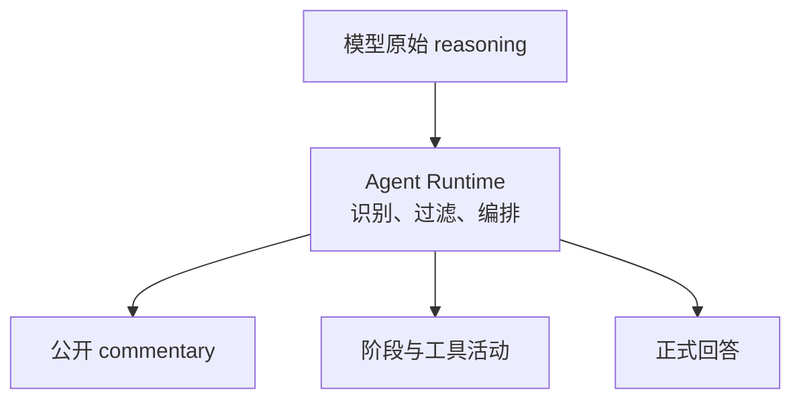
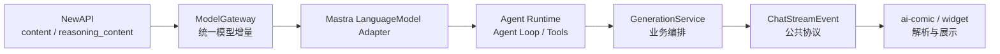

# Agent 的“思考过程”该怎么展示？

> 以 Mastra 和 `drama-agent` 为例，聊聊普通对话 Agent 如何做出类似 Codex 的流式交互。

最近在看 `drama-agent` 和 `ai-comic` 的对话链路时，我反复遇到一个容易混淆的问题：AI 产品里显示的“正在查询资料”“正在整理回答”，到底是不是模型的思考过程？

答案是否定的。

模型的原始 reasoning、Agent 的执行轨迹，以及界面上给用户看的几句状态提示，属于不同层次。要把普通业务 Agent 做得像 Codex，重点也不是把思维链原样放出来，而是把一次运行翻译成一组安全、清楚、可控制的公开活动。

## 从一个答案变成一次运行

最简单的聊天接口只有一条返回文本：

```text
用户发送消息
  ↓
等待模型生成
  ↓
返回答案
```

但一个带有会话上下文、知识库和工具调用的 Agent，实际会经历：

```text
读取上下文
  ↓
判断是否需要资料
  ↓
调用工具
  ↓
根据结果继续生成
  ↓
整理并保存答案
```

如果这些过程全部隐藏，用户只能看到一个“正在生成”。请求一旦变慢，就很难判断系统是在工作，还是已经卡住。

因此，Agent 需要的不只是回答流，还需要一条面向用户的活动流：告诉用户当前正在处理什么，哪些公开活动已经完成，最后再把过程收敛成简洁的结果摘要。

```text
请求已接收
  ↓
公开说明
  ↓
阶段状态
  ↓
工具活动
  ↓
正式回答
  ↓
来源与终态
```

## 三种容易混为一谈的“思考过程”

### 模型原始 reasoning

模型供应商可能返回：

```text
reasoning_content
thinking_delta
reasoning_details
```

其中可能包含工具选择、上下文判断、中间错误和自我修正。这些内容不适合作为稳定的产品协议，也不应默认发给用户。

### Agent 执行轨迹

Runtime 可以确认一些客观事件：

```text
正在查询项目资料
已找到 3 条相关资料
正在整理回答
```

它描述的是系统做了什么，不是模型逐步想了什么。

### Commentary

Commentary 是产品给用户看的短说明，例如：

```text
我先结合当前项目资料确认一下。
```

它的作用是减少等待时的不确定感。Commentary 可以由 Runtime 控制，也可以由模型单独生成，但不应直接复用原始 reasoning。

正式回答则是另一条数据：它需要展示给用户，通常也需要写入消息历史。



## 为什么不能直接展示思维链？

直接转发 `reasoning_content` 看似简单，实际上会带来几个问题：

- 可能泄露系统 Prompt、上下文或权限判断；
- 可能包含工具参数和内部 ID；
- 中间错误会被当成最终结论；
- 不同模型的字段和格式不稳定；
- 多轮工具调用后，很难定义哪些内容该保存、该重放。

更稳妥的边界是：

```text
原始 reasoning：内部使用，默认隐藏
Runtime：识别和过滤
公共协议：只发送安全摘要
前端：展示活动、正文、来源和终态
```

用户可以知道 Agent 正在查询项目资料、找到了多少条结果，但不需要知道模型的完整内部推理。

## `drama-agent` 的实际链路

`drama-agent` 是 `ai-comic` 中“剧梦小助手”的后端 Agent 服务，面向普通业务对话，不是 Coding Agent。

它负责会话上下文、Working Memory、平台知识库、项目资料、工具调用、消息保存和 SSE 输出。相关链路可以概括为：



在模型网关和 Mastra 适配层，`reasoning_content` 可以被转换成内部的 reasoning 增量；Runtime 再消费 `fullStream`，处理正文和工具调用。

但当前主链路没有把 `reasoning-delta` 继续发布到公共 SSE。`ai-comic` 对 reasoning 事件也会丢弃。这不是能力缺失，而是有意保留的安全边界。

目前已经接通的公共事件包括：

```text
init
run_started
commentary
progress
tool_activity
chunk
sources
done
error
```

它们分别承担不同职责：

| 事件 | 作用 | 写入正式回答 |
|---|---|---:|
| `commentary` | 短公开说明 | 否 |
| `progress` | 阶段状态 | 否 |
| `tool_activity` | 工具活动摘要 | 否 |
| `chunk` | 正式回答增量 | 是 |
| `sources` | 引用来源 | 否 |
| `done` / `error` | 运行终态 | 否 |

只有 `chunk` 会累计到 `assistantMessage.content`。这条边界必须保持，否则历史消息中会留下“正在查询资料”之类的临时状态。

## 事件通路，不等于完整体验

第一版实现完成后，很容易得出一个乐观结论：既然 commentary、progress 和 tool activity 都已经到达前端，Codex 风格是不是就完成了？

实际在浏览器里观察，差距仍然很明显。当前更像是：

```text
一段 commentary 文本
  +
一个 steps 列表
  +
流式回答
```

而一个完整的 Activity Stream 应该是：

```text
当前活动
  +
已完成活动摘要
  +
可展开的处理过程
  +
正式回答
  +
来源
  +
终态操作
```

当前实现已经有消息级 `process` 和 active/completed 步骤，但还没有完整的活动表现层，主要差距包括：

- commentary 通常只是一条静态开场白，不会随运行阶段变化；
- progress 和 tool activity 仍然偏扁平，难以表达活动实例、重试和并行调用；
- 已完成活动没有充分折叠成摘要；
- 终态后 commentary 可能仍然保留原文；
- 普通发送和 regenerate 的状态迁移需要统一验证；
- 首条反馈仍可能被服务端准备阶段阻塞；
- 取消、失败、断线和重新生成还需要真实浏览器联合验收。

这说明一个重要事实：

> **事件能到达前端，不代表用户体验已经成立。**

## Activity Stream 不是日志列表

活动流的关键不是把事件一条条追加到页面，而是让状态随着运行逐渐收敛。

运行中：

```text
我先结合当前项目资料确认一下。

● 正在查询项目资料
```

工具完成：

```text
✓ 已查询项目资料 · 找到 3 条 · 1.4 秒
● 正在整理回答
```

回答完成：

```text
✓ 已完成 · 3 个资料来源
⌄ 查看处理过程
```

活动区应该服务于正文，而不是抢走正文的注意力。推荐的交互规则是：当前活动突出显示，已完成活动默认合并或折叠，失败活动保持可见，完成后只保留一行摘要，用户需要时再展开详情。

因此，前端可以从简单的：

```ts
commentary?: string;
steps: AiChatProcessStep[];
status: AiChatProcessStatus;
```

逐步演进为围绕 Run 的状态：

```ts
type RunViewState = {
  runId: string;
  assistantMessageId: string;
  status: 'accepted' | 'preparing' | 'running' |
    'cancelling' | 'completed' | 'cancelled' | 'failed';
  lastSeq: number;
  currentSummary?: string;
  activities: Record<string, ActivityItem>;
  answer: string;
  sources: SourceReference[];
  partial: boolean;
};
```

这里的重点不在于类型名称，而在于职责：`commentary` 负责短说明，活动负责持续状态，正文负责答案，终态负责收口。

## 下一步不是展示更多思考，而是管理好一次 Run

要接近 Codex 的完整体验，后续工作不能只停留在 UI 文案。一次运行至少要回答这些问题：

- 请求什么时候算真正接收？
- 用户多久能看到第一条有意义的反馈？
- 当前 Run 如何取消？
- SSE 断开后，Agent 是否继续执行？
- 重连后如何避免重复正文和重复活动？
- 工具失败后是重试步骤，还是重新生成？
- 部分回答如何标记？
- 什么条件满足后才能发送 completed？

### 先发送 accepted

当前服务端在 SSE 之前仍可能准备上下文、读取 Memory、执行账务预检、创建消息和获取锁。这样用户可能要等准备完成后，才能看到 commentary。

更好的顺序是：

```text
完成鉴权、幂等和最低限度配额检查
  ↓
建立 SSE
  ↓
accepted
  ↓
创建 assistant shell
  ↓
commentary / preparing
  ↓
继续执行 Agent
```

`accepted` 不应绕过安全检查，只负责尽早告诉用户“请求已经被接收”。

### 让取消成为服务端动作

“停止生成”不能只是前端停止读取 SSE。理想链路是：

```text
点击停止
  → cancel(runId)
  → GenerationRun.requestCancel()
  → AbortSignal
  → 模型和工具
  → cancelled 终态
```

取消需要幂等，并区分 `cancelling` 和 `cancelled`。如果已经生成了一部分正文，应明确显示：

```text
已停止，以下回答可能不完整
[继续生成] [重新生成]
```

客户端断线则不应默认等于用户取消，否则切换页面可能导致后台任务和账务状态难以判断。

### 为重连准备事件身份

如果 `GenerationRun` 只是一层进程内缓冲，断线重连和多实例恢复就没有可靠基础。完整方案需要为事件增加：

```text
runId
assistantMessageId
eventId
seq
schemaVersion
```

并在 SSE 中使用 `Last-Event-ID`，或者通过 `afterSeq` 重放。事件过期后返回 Run snapshot，而不是重新执行 Agent。

### 让失败可以继续处理

失败不应该只有一个“再试一次”按钮。至少应区分：

```text
重试失败的工具步骤
从最近检查点继续
重新生成一版回答
```

重新生成应该创建新的 Run 和回答版本，不覆盖旧答案。工具活动也需要稳定的 `activityId`，否则同一工具多次调用或重试时，前端无法正确更新对应卡片。

## Mastra 负责运行，业务层负责公开协议

Mastra 的 `fullStream` 可以提供正文、工具调用和执行边界：

```ts
const stream = await agent.stream(messages);

for await (const part of stream.fullStream) {
  // 转换为业务内部事件
}
```

可以把它转换为：

| Mastra 事件 | 业务事件 |
|---|---|
| `text-delta` | `chunk` |
| `tool-call` | `tool_activity started` |
| `tool-result` | `tool_activity completed` |
| `step-start` | `progress started` |
| `step-finish` | `progress completed` |
| `finish` | 终态事件 |
| `reasoning-delta` | 默认隐藏 |

不要把 Mastra 原始事件直接暴露给前端。业务系统还要处理权限、账务、消息持久化、取消、幂等和错误脱敏，这些都应该由 `drama-agent` 的 Runtime 和 GenerationService 收口。

普通对话也不必为了显示进度而强行改造成 Workflow。动态工具调用使用 Agent 加 `fullStream` 已经足够；只有需要人工确认、长时间暂停、稳定检查点或高风险副作用时，才值得引入 Workflow。

## 结语：从展示过程到建立信任

回头看，问题并不是“如何把 AI 的思考过程显示出来”，而是：

> 用户在等待 Agent 时，应该看到什么？

比较可靠的答案是：

```text
请求已接收
  ↓
公开说明
  ↓
阶段和工具活动
  ↓
正式回答
  ↓
来源
  ↓
完成、取消或失败
```

`drama-agent` 目前已经打通了这条链路的基础部分：有安全的 commentary、progress、tool activity、流式正文、来源和终态，也明确隐藏原始 reasoning。

但这还不等于完整的 Codex 风格体验。当前更准确的判断是：

```text
协议和数据通路：已打通
reasoning 安全边界：已建立
基础消息级过程展示：已有
持续更新和终态收敛：仍需完善
首包、取消、重连和重试：仍需补齐或联合验收
```

真正的下一步，不是让页面显示更多“我正在思考”，而是让一次 Agent Run 变得及时、可观察、可中断、可恢复，并在最后安静地收敛为一个可信的回答。

## 参考资料

- [Mastra Streaming](https://mastra.ai/docs/streaming/overview)
- [Mastra Streaming Events](https://mastra.ai/docs/streaming/events)
- [Mastra Tool Streaming](https://mastra.ai/docs/streaming/tool-streaming)
- [Mastra AI SDK UI Integration](https://mastra.ai/guides/build-your-ui/ai-sdk-ui)
- [DeepSeek Thinking Mode](https://api-docs.deepseek.com/guides/thinking_mode/)
- [Anthropic Extended Thinking](https://platform.claude.com/docs/en/build-with-claude/thinking)
- [Anthropic Streaming](https://platform.claude.com/docs/en/build-with-claude/streaming)
- [OpenAI Agents SDK Streaming](https://openai.github.io/openai-agents-js/guides/streaming/)
