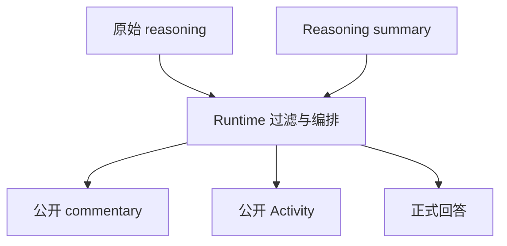
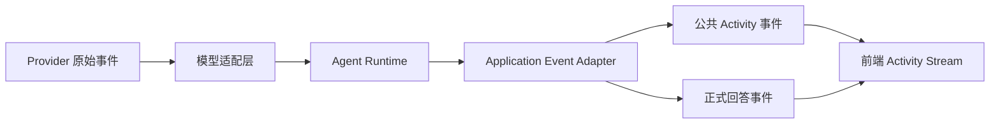

# 不要展示思维链：如何设计 Codex 风格的 Agent Activity Stream

> 从模型 reasoning 到公开活动流，讲清楚 Agent 过程展示的概念边界、产品价值、事件协议和工程实现。

当 Agent 的响应只需要一两秒时，用户可以接受一个简单的 loading。

但当 Agent 需要读取上下文、调用工具、执行多个步骤、等待外部服务，甚至持续几十秒时，单纯显示“正在生成”就不够了。用户不知道系统是否仍在工作，也不知道它正在做什么。

于是，很多 AI 产品开始在回答前或回答过程中显示：

```text
正在分析请求
正在查询资料
已找到 3 条相关结果
正在整理回答
```

这类交互常被称为“显示 AI 的思考过程”。但从技术和产品设计上看，这个说法并不准确。

真正值得设计的，不是把模型的内部思维链原样展示出来，而是建立一条安全、可理解、可收敛的 **Agent Activity Stream**：

```text
请求已接收
  ↓
公开说明
  ↓
阶段活动
  ↓
工具活动
  ↓
正式回答
  ↓
来源与终态
```

本文讨论三个问题：

1. Activity Stream 到底是什么？
2. 为什么它比 loading 和原始思维链更适合 Agent 产品？
3. 如何从 Runtime、事件协议、流式传输和前端状态四个层面实现它？

---

## 一、先区分四种不同的“过程”

一个 Agent 运行过程中，至少存在四类内容。它们经常被混在一起，但职责完全不同。

### 1. 原始 reasoning

模型内部可能产生推理 token，或者 Provider 以以下形式返回部分内容：

```text
reasoning_content
thinking_delta
reasoning_details
thinking blocks
```

这些内容可能包含：

- 模型对用户意图的中间判断；
- 工具选择过程；
- 上下文和权限相关信息；
- 中间错误和自我修正；
- Prompt 中的内部规则；
- 工具参数或内部标识符。

它们通常不是稳定的产品协议。不同模型、不同 Provider、不同 API 版本的字段和语义都可能不同。

**原始 reasoning 默认应该留在模型 Runtime 内部。**

### 2. Reasoning Summary

一些模型或 API 会提供经过压缩的 reasoning summary。它不是原始思维链，而是对推理过程的概括。

例如：

```text
模型比较了当前故事资产与用户提出的修改，判断该修改会影响第 2、3 场分镜。
```

Reasoning summary 比原始 reasoning 更适合被控制，但它仍然可能：

- 不是客观执行日志；
- 包含模型的错误判断；
- 受到模型版本影响；
- 暴露不应该展示的内部信息。

因此，reasoning summary 即使要展示，也应该作为单独的数据类型，经过产品策略和安全过滤，不能直接当作 Activity。

### 3. Agent Activity

Activity 描述的是 Runtime 已经确认发生的客观行为：

```text
正在读取已确认的故事资产
已读取 8 个角色信息
正在生成场次规划
```

它回答的是：

> 系统做了什么？现在做到哪一步？

而不是：

> 模型在脑中逐字想了什么？

### 4. Commentary

Commentary 是产品层给用户看的短说明，用来降低等待时的不确定感：

```text
我先结合当前项目资料确认一下。
```

Commentary 可以由 Runtime 根据阶段生成，也可以由预先定义的模板生成，但不应该直接复用原始 reasoning。

正式回答则是另一条数据：它需要展示给用户，通常也需要写入消息历史。



四者的关系可以概括为：

| 内容 | 主要作用 | 默认是否展示给用户 |
|---|---|---:|
| 原始 reasoning | 支撑模型内部推理 | 否 |
| reasoning summary | 概括模型推理 | 谨慎展示 |
| Agent Activity | 描述已确认的执行行为 | 可以 |
| Commentary | 减少等待的不确定感 | 可以 |
| 正式回答 | 交付最终结果 | 必须 |

---

## 二、什么是 Agent Activity Stream？

最简单的聊天接口只有一条返回文本：

```text
用户消息
  ↓
模型生成
  ↓
最终回答
```

Agent 的真实运行过程通常更复杂：

```text
用户消息
  ↓
读取会话上下文
  ↓
准备工具和权限
  ↓
模型判断下一步行动
  ↓
调用工具
  ↓
处理工具结果
  ↓
继续调用模型
  ↓
生成正式回答
```

Activity Stream 就是把这次运行转换为一组可公开的状态事件，再由前端将它们归并成用户能理解的过程视图。

例如，Runtime 可能产生：

```text
stage_started(preparing)
tool_started(search_documents)
tool_completed(search_documents)
stage_started(answering)
answer_chunk(...)
run_completed
```

用户最终看到的不是原始事件，而是：

```text
✓ 已准备上下文
✓ 已查询项目资料 · 找到 3 条
● 正在整理回答

这里是正式回答正文……
```

所以，Activity Stream 不是：

- 模型思维链的转录；
- Provider 原始事件的直接转发；
- 终端日志窗口；
- 一堆不断追加的 loading 文案。

它更准确的定义是：

> **Activity Stream 是一次 Agent Run 的公开状态视图。它由 Runtime 产生的安全事件驱动，并在前端收敛为当前活动、已完成活动、失败活动、正式回答和终态。**

---

## 三、为什么 Agent 需要 Activity Stream？

### 1. 降低感知等待

AI 请求的耗时通常不可预测：

```text
读取上下文：100ms
搜索服务：2s
外部 API：5s
多轮模型调用：10s
```

如果页面在这段时间只显示：

```text
正在生成……
```

用户无法判断：

- 请求是否已经被服务端接收；
- 系统是否正在读取资料；
- 外部工具是否超时；
- Agent 是继续运行，还是已经卡住。

一条真实的 Activity 可以显著降低这种不确定感：

```text
正在查询资料
```

比一个无上下文的 spinner 更有信息量。

### 2. 建立有限的可解释性

用户并不一定需要知道模型的完整推理，但通常需要知道：

- Agent 是否使用了资料；
- 是否调用了工具；
- 当前进行到哪个阶段；
- 是否发生了重试；
- 最终回答是否完整；
- 回答依据了哪些来源。

Activity Stream 提供的是一种**有限、可控、面向任务的可解释性**。

### 3. 支持复杂 Agent

当 Agent 只有一次模型调用时，流式文本已经足够。

当 Agent 包含以下能力时，单纯的文本流就会变得不够：

```text
多轮工具调用
并行任务
长时间 Workflow
人工确认
可恢复任务
失败重试
部分结果
```

Activity Stream 可以把这些状态显式表达出来，而不会把所有内部细节都塞进正文。

### 4. 帮助用户形成正确预期

一个好的 Activity 不应该承诺模型“正在思考某个具体结论”，而应该说明系统正在执行的阶段：

```text
正在读取资料
正在检查一致性
正在生成回答
```

这比展示未经验证的模型判断更可靠。

---

## 四、为什么不能直接展示原始思维链？

直接转发 reasoning 看似简单，实际上会带来多个问题。

### 1. 安全和隐私风险

推理内容可能携带：

- 系统 Prompt 片段；
- 权限判断；
- 私有上下文；
- 用户隐私；
- 内部工具名和参数；
- 数据库条件或内部 ID。

### 2. 中间判断不是最终事实

模型的中间思考可能是错误的：

```text
也许用户想修改全部镜头……
```

这只是中间假设，不应该被用户当成产品承诺。

### 3. 格式和语义不稳定

不同模型可能：

- 不返回 reasoning；
- 返回不同字段；
- 以 token delta 返回；
- 返回加密或脱敏 block；
- 只提供 summary；
- 在模型升级后改变格式。

如果前端直接依赖这些字段，产品协议就会被 Provider 绑死。

### 4. 思维链不等于执行记录

模型说“我准备搜索资料”，不代表工具真的已经执行。

只有 Runtime 确认工具已经开始或完成，才能产生对应的 Activity：

```text
模型意图：可能调用搜索工具
  ↓
Runtime 校验权限和参数
  ↓
工具真正开始执行
  ↓
公开 activity_started
```

因此，推荐保留以下边界：

```text
原始 reasoning：内部使用，默认隐藏
Runtime：负责识别、过滤和编排
公共协议：只发送安全摘要
前端：展示 Activity、正文、来源和终态
```

---

## 五、设计 Activity Stream 的基本原则

### 原则一：公开事实，不公开猜测

Activity 应尽量对应 Runtime 能够确认的事实：

```text
✓ 已读取 8 个角色信息
✓ 已完成第 2 场检查
● 正在生成第 3 个镜头
```

避免：

```text
我认为用户真正想要的是……
我决定调用某个内部服务，因为……
```

### 原则二：活动和正文分离

只有正式回答增量可以累计到 `answer`：

```text
answer += event.payload.text
```

以下内容不能混入正文：

- commentary；
- 阶段状态；
- 工具名称；
- 工具结果摘要；
- 心跳；
- 重连提示；
- 内部错误信息。

否则历史消息会留下：

```text
正在查询资料
已找到 3 条
正在整理回答
```

这些是运行过程，不是正式回答。

### 原则三：当前活动突出，历史活动收敛

运行中可以展示：

```text
✓ 已准备上下文
● 正在查询资料
```

完成后则应该收敛为：

```text
✓ 已完成 · 3 个处理步骤
⌄ 查看处理过程
```

Activity Stream 的重点不是记录更多，而是让过程随着运行逐渐变得清晰。

### 原则四：失败保留，成功折叠

成功活动通常可以压缩：

```text
✓ 已查询资料 · 3 条
```

失败活动应该保留，因为它影响用户对答案完整性的判断：

```text
✗ 资料查询失败 · 可以重试
```

### 原则五：活动不能伪造进度

不要为了让页面看起来“有变化”而连续发送：

```text
正在分析
正在深度思考
正在整理
马上完成
```

如果没有真实阶段或可计算的进度，这些文案只是伪进度。

可以使用保守表达：

```text
正在处理请求
```

但不能伪造：

```text
已完成 83%，预计还需 2 秒
```

除非系统确实能够计算这个进度。

---

## 六、一次 Run 的状态模型

Activity Stream 最好围绕一次明确的 Run 建模，而不是围绕一个全局 loading 建模。

```ts
type RunStatus =
  | 'accepted'
  | 'preparing'
  | 'running'
  | 'waiting_for_approval'
  | 'cancelling'
  | 'completed'
  | 'cancelled'
  | 'failed';
```

一次 Run 可以经历：

```text
accepted
  → preparing
  → running
  → completed
```

取消分支：

```text
accepted / preparing / running
  → cancelling
  → cancelled
```

失败分支：

```text
accepted / preparing / running
  → failed
```

等待用户确认：

```text
running
  → waiting_for_approval
  → running
```

### 推荐的 Run 状态

```ts
type RunViewState = {
  runId: string;
  assistantMessageId: string;
  status: RunStatus;
  lastSeq: number;
  currentSummary?: string;
  activities: Record<string, ActivityItem>;
  answer: string;
  sources: SourceReference[];
  partial: boolean;
  terminal?: TerminalState;
};
```

活动应该使用稳定的 `activityId`：

```ts
type ActivityItem = {
  activityId: string;
  kind: 'stage' | 'tool' | 'approval' | 'artifact';
  label: string;
  status:
    | 'queued'
    | 'running'
    | 'waiting_for_approval'
    | 'retrying'
    | 'completed'
    | 'failed'
    | 'cancelled'
    | 'skipped';
  attempt?: number;
  durationMs?: number;
  resultSummary?: string;
  retryable?: boolean;
};
```

使用 `Record<string, ActivityItem>` 的原因是：

- 同一个工具可以调用多次；
- 并行调用可以交错返回；
- retry 可以更新原活动或创建新尝试；
- 重连重放不会重复渲染；
- 活动状态不依赖数组位置。

### Activity 的生命周期

一个工具活动可以是：

```text
queued
  → running
  → completed
```

失败时：

```text
running
  → failed
  → retrying
  → running
```

不可恢复时：

```text
running
  → failed
```

用户取消时：

```text
running
  → cancelled
```

高风险操作则可能是：

```text
running
  → waiting_for_approval
  → approved / rejected / expired
```

---

## 七、事件协议如何设计

Provider 和 Agent 框架的原始事件不适合作为前端协议。应用层需要定义自己的事件 envelope。

```ts
type StreamEvent<T> = {
  schemaVersion: 1;
  eventId: string;
  runId: string;
  assistantMessageId: string;
  seq: number;
  type: string;
  occurredAt: string;
  payload: T;
};
```

### 字段职责

| 字段 | 作用 |
|---|---|
| `schemaVersion` | 事件协议版本 |
| `eventId` | 事件的稳定身份 |
| `runId` | 区分不同运行 |
| `assistantMessageId` | 关联助手消息 |
| `seq` | 排序、去重和重放游标 |
| `type` | 事件类型 |
| `occurredAt` | 事件发生时间 |
| `payload` | 该事件的具体内容 |

### 推荐事件类型

```text
accepted
run_started
stage_started
stage_progress
stage_completed
activity_started
activity_updated
activity_completed
activity_failed
approval_requested
answer_started
answer_chunk
answer_completed
sources
heartbeat
run_cancel_requested
run_cancelled
run_completed
run_failed
```

不需要一开始实现全部事件。MVP 可以先支持：

```text
accepted
stage_started
activity_started
activity_completed
answer_chunk
run_completed
run_failed
```

### 事件职责

| 事件 | 是否进入正式正文 | 作用 |
|---|---:|---|
| `accepted` | 否 | 请求已经被系统接收 |
| `stage_started` | 否 | 真实阶段开始 |
| `activity_started` | 否 | 工具或任务开始 |
| `activity_completed` | 否 | 工具或任务完成 |
| `answer_chunk` | 是 | 正式回答增量 |
| `sources` | 否 | 回答引用来源 |
| `heartbeat` | 否 | 保持连接，不渲染 |
| `run_completed` | 否 | 成功终态 |
| `run_cancelled` | 否 | 取消终态 |
| `run_failed` | 否 | 失败终态 |

### 一个事件示例

```json
{
  "schemaVersion": 1,
  "eventId": "run_123:7",
  "runId": "run_123",
  "assistantMessageId": "assistant_456",
  "seq": 7,
  "type": "activity_completed",
  "occurredAt": "2026-08-30T10:00:00.000Z",
  "payload": {
    "activityId": "activity_1",
    "kind": "tool",
    "toolKey": "document_search",
    "label": "已查询项目资料",
    "status": "completed",
    "resultCount": 3,
    "durationMs": 1400
  }
}
```

### 终态结构

```ts
type TerminalState = {
  status: 'completed' | 'cancelled' | 'failed';
  persisted: boolean;
  partial: boolean;
  retryable?: boolean;
  errorCode?: string;
  message?: string;
};
```

一个可靠的 Run 至少应满足这些不变量：

1. 一个 Run 只能有一个终态；
2. 终态之后不能发布新的业务事件；
3. `seq` 在规定作用域内单调递增；
4. 客户端必须能够幂等处理重复事件；
5. 迟到的 `answer_chunk` 不能污染已完成的回答；
6. `run_cancelled` 不能被后续异步任务覆盖为 `run_completed`；
7. 只有 `answer_chunk` 能累加为正式正文；
8. `reasoning`、Prompt 和原始工具数据不能进入公共事件。

---

## 八、`seq`、幂等和至少一次投递

网络系统通常很难保证事件严格的 exactly-once 投递。更现实的设计是：

```text
服务端至少一次投递
  +
客户端按 eventId / seq 幂等归并
  +
正文按事件序号或 chunkId 去重
```

### Run 级序号还是会话级序号？

有两种常见设计。

#### Run 级 seq

```text
run_123: 1, 2, 3, 4
run_456: 1, 2, 3
```

适合单次聊天流，简单，也容易进行 Run 级重连。

#### Conversation 级 seq

```text
conversation_1: 101, 102, 103, 104
```

同一会话中的多个 Run 共享一个序号，可以表达并发 Run 的全局事件顺序，但需要更复杂的事件 journal。

MVP 通常可以先使用：

```text
runId + run-level seq
```

未来需要会话级事件流时，再增加 conversation-level cursor。

### 客户端归并逻辑

```ts
function reduceRunState(
  state: RunViewState,
  event: StreamEvent<unknown>,
): RunViewState {
  if (event.runId !== state.runId) return state;
  if (event.seq <= state.lastSeq) return state;

  switch (event.type) {
    case 'activity_started':
      // 根据 activityId 创建或更新活动
      break;

    case 'activity_completed':
      // 更新同一个 activityId
      break;

    case 'answer_chunk':
      // 只有正式回答增量可以追加
      break;

    case 'run_completed':
      // 收敛为 completed
      break;
  }

  return {
    ...state,
    lastSeq: event.seq,
  };
}
```

实际实现还应使用 `eventId` 去重，因为某些系统可能出现相同序号但不同类型的异常情况。`seq` 和 `eventId` 应该共同构成客户端的幂等依据。

---

## 九、如何选择流式传输方式

### 方案一：POST 直接返回流

```text
POST /chat/stream
  → text/event-stream
```

优点：

- 请求体可以直接传复杂 JSON；
- 可以使用 `fetch` 和 `AbortController`；
- 适合简单的同步聊天 Run。

缺点：

- 断线恢复和后台运行需要额外设计；
- 如果连接断开，客户端需要知道如何重新订阅。

### 方案二：POST 创建 Run，GET 订阅事件

```text
POST /runs
  → { runId, assistantMessageId }

GET /runs/:runId/events
  → text/event-stream
```

优点：

- Run 有独立身份；
- 适合后台执行；
- 适合断线重连和事件重放；
- 可以通过 snapshot 恢复已经完成的 Run。

缺点：

- API 数量更多；
- 需要持久化 Run 状态和事件。

对于包含工具调用、长任务和重连要求的 Agent，通常更推荐第二种。

### 方案三：WebSocket

WebSocket 适合：

- 双向实时通信；
- 多方协作；
- 实时人工介入；
- 浏览器控制和服务端事件共享一条长连接。

但普通 Agent 进度推送未必需要 WebSocket。SSE 或 HTTP streaming 通常更简单。

### 一个实用的选择

```text
简单原型：POST + fetch streaming
普通生产聊天：POST 创建 Run + GET SSE
复杂双向协作：WebSocket
```

---

## 十、SSE 的正确使用方式

SSE 事件不仅要在 JSON 中有 `eventId`，还应该使用 SSE 协议的 `id:` 字段：

```text
id: run_123:7
event: activity_completed
data: {"runId":"run_123","seq":7,"type":"activity_completed"}

```

浏览器在重连时，才会把最近的事件 ID 通过 `Last-Event-ID` 告诉服务端：

```http
Last-Event-ID: run_123:7
```

但需要注意：

> `Last-Event-ID` 只携带游标，不负责自动恢复历史事件。服务端必须根据这个游标查询事件并重放后续内容。

### SSE 重连流程

```text
连接断开
  ↓
客户端保留 lastEventId / lastSeq
  ↓
使用同一个 runId 重新订阅
  ↓
服务端重放 lastSeq 之后的事件
  ↓
客户端幂等归并
  ↓
继续接收后续事件
```

### 原生 EventSource 的限制

原生 `EventSource`：

- 主要使用 GET；
- 自定义请求头能力有限；
- 适合 Cookie 鉴权或简单订阅；
- 如果在 `onerror` 中主动 `close()`，浏览器不会自动重连；
- 服务端必须正确发送 `id:` 字段；
- 服务端仍然需要实现事件重放。

如果需要：

- POST body；
- Bearer Token；
- 自定义取消信号；
- 更细粒度的重连策略；

可以使用 `fetch()` 读取 `ReadableStream`，不必强行使用 `EventSource`。

### 心跳

长时间没有业务事件时，可以发送心跳：

```text
: heartbeat

```

或者发送结构化事件：

```json
{
  "type": "heartbeat"
}
```

心跳的职责是保持连接，不应该进入可见 Activity 列表，也不应该触发消息正文重渲染。

---

## 十一、Runtime 如何转换模型事件

Agent 框架或 Provider 通常会产生比前端更多的事件。例如：

```text
模型文本增量
工具调用
工具结果
步骤开始
步骤结束
reasoning 增量
模型完成
```

应用层应建立一个 Adapter，把这些内部事件转换成自己的公共事件。



### 通用映射

```text
模型文本增量       → answer_chunk
工具开始           → activity_started
工具结果成功       → activity_completed
工具结果失败       → activity_failed
真实阶段开始       → stage_started
真实阶段结束       → stage_completed
模型 reasoning     → 默认隐藏
模型完成           → run_completed
```

### 工具事件不能直接转发

工具调用通常包含完整参数：

```json
{
  "toolName": "search_documents",
  "args": {
    "tenantId": "private-tenant",
    "query": "内部搜索条件"
  }
}
```

这些数据不应该直接发到浏览器。

Runtime 应转换成安全摘要：

```json
{
  "activityId": "activity_1",
  "toolKey": "document_search",
  "label": "正在查询项目资料",
  "status": "running"
}
```

工具完成后，再公开有限结果：

```json
{
  "activityId": "activity_1",
  "toolKey": "document_search",
  "label": "已查询项目资料",
  "status": "completed",
  "resultCount": 3,
  "durationMs": 1400
}
```

### Mastra 作为一个实现例子

以支持 `fullStream` 的 Agent 框架为例：

```ts
const stream = await agent.stream(input);

for await (const part of stream.fullStream) {
  switch (part.type) {
    case 'text-delta':
      publish({
        type: 'answer_chunk',
        payload: { text: part.text },
      });
      break;

    case 'tool-call':
      publishSafeToolActivityStarted(part);
      break;

    case 'tool-result':
      publishSafeToolActivityCompleted(part);
      break;

    case 'reasoning-delta':
      // 默认不发布到公共事件
      break;

    case 'finish':
      publishRunCompleted(part);
      break;
  }
}
```

这里的 `fullStream` 只是 Runtime 的输入，不能直接当成前端协议。

原因包括：

- 事件类型和 payload 受框架版本影响；
- 不同 Provider 的支持程度不同；
- 工具参数可能包含敏感数据；
- reasoning 事件不一定应该公开；
- `accepted`、`sources`、`cancelled` 等业务事件通常需要应用层补充。

因此应当保持：

```text
Provider Event
  → Framework Event
  → Application Event
  → UI State
```

而不是：

```text
Provider Event → Browser
```

---

## 十二、前端如何把事件变成体验

前端不应该直接把每条事件 append 到 DOM，而应该维护一个 Run 状态。

### 运行中

```text
我先读取当前上下文。

✓ 已准备会话资料
● 正在查询相关文档
```

### 工具完成

```text
✓ 已查询相关文档 · 找到 3 条
● 正在整理回答
```

### 生成完成

```text
✓ 已完成 · 3 个处理步骤
⌄ 查看处理过程

正式回答正文……
```

### 一个简单的归并过程

```ts
function applyEvent(state: RunViewState, event: StreamEvent<any>) {
  if (event.seq <= state.lastSeq) return state;

  if (event.type === 'activity_started') {
    const item = event.payload;
    return {
      ...state,
      lastSeq: event.seq,
      activities: {
        ...state.activities,
        [item.activityId]: item,
      },
    };
  }

  if (event.type === 'activity_completed') {
    const item = event.payload;
    return {
      ...state,
      lastSeq: event.seq,
      activities: {
        ...state.activities,
        [item.activityId]: {
          ...state.activities[item.activityId],
          ...item,
        },
      },
    };
  }

  if (event.type === 'answer_chunk') {
    return {
      ...state,
      lastSeq: event.seq,
      answer: state.answer + event.payload.text,
    };
  }

  if (event.type === 'run_completed') {
    return {
      ...state,
      lastSeq: event.seq,
      status: 'completed',
      terminal: event.payload,
    };
  }

  return {
    ...state,
    lastSeq: event.seq,
  };
}
```

真正的组件可以拆为：

```text
AgentActivityStream
├── ActivityHeader
├── CurrentActivity
├── CompletedActivitySummary
├── ActivityItem
├── ActivityError
├── ActivityToggle
└── ActivityTerminalSummary
```

### UI 层级

Activity 应该服务于正文，而不是抢走正文的视觉权重：

```text
消息头
  ↓
当前 Activity / 处理摘要
  ↓
正式回答
  ↓
来源
  ↓
终态操作
```

### 简单回答不必强行显示过程

不是每次请求都需要完整 Activity Stream。

对于没有工具、没有长时间等待的简单回答，可以直接显示正文。

```text
用户：什么是 StoryBible？
助手：StoryBible 是……
```

只有当运行具有足够复杂度时，才显示活动：

- 首 token 等待较长；
- 调用了工具；
- 存在多个阶段；
- 运行时间较长；
- 需要用户确认；
- 生成了可追踪的工件。

这可以避免把每条普通对话都变成冗余的状态列表。

---

## 十三、取消、失败和部分回答

Activity Stream 的价值不只在于“让等待更好看”，还在于让用户知道运行如何结束。

### 取消必须是服务端动作

前端停止读取流，不代表 Agent 已经停止执行。

更可靠的链路是：

```text
用户点击停止
  → cancel(runId)
  → Run 标记 cancelling
  → AbortSignal 传给模型和工具
  → Runtime 停止启动新的工作
  → 发布 run_cancelled
```

取消需要幂等：

```text
第一次取消：accepted
重复取消：already_cancelling
已完成后取消：already_terminal
```

客户端断线也不应该默认等于用户取消。用户可能只是：

- 切换页面；
- 暂时失去网络；
- 浏览器进入后台；
- 重新打开同一会话。

### 部分回答

如果 Run 在输出一部分正文后失败或被取消，必须明确标记：

```text
已停止，以下回答可能不完整
```

对应状态：

```ts
{
  status: 'cancelled',
  partial: true,
  answer: '已经生成的部分内容……'
}
```

不能把部分回答伪装成完整答案。

### 失败不是只有“再试一次”

应该区分：

```text
传输层重试
工具重试
从检查点继续
重新生成
```

例如：

```text
✗ 项目资料暂时无法读取
[重试读取资料] [继续回答]
```

和：

```text
✗ 本次回答生成失败
[重新生成]
```

两者的恢复语义不同。

### 重新生成必须创建新的 Run

重新生成不应该覆盖旧答案：

```text
assistant message
├── version 1
└── version 2
```

新 Run 的事件不能污染旧 Run，旧 Run 的迟到事件也不能污染新版本。

---

## 十四、断线恢复和事件重放

如果事件只保存在进程内内存中，服务重启或客户端断线后就无法可靠恢复。

生产系统通常需要一个事件 journal：

```text
Run
├── runId
├── status
├── current answer
├── current activities
└── event journal
    ├── eventId
    ├── seq
    ├── type
    ├── payload
    └── occurredAt
```

存储可以是：

- PostgreSQL event table；
- Redis Streams；
- 具备游标和保留策略的其他事件存储。

### 重连

```text
客户端连接断开
  ↓
显示“连接中断，正在恢复……”
  ↓
使用原 runId 和 lastSeq 重连
  ↓
服务端返回 lastSeq 之后的事件
  ↓
客户端按 eventId / seq 去重
  ↓
继续显示活动和正文
```

### 事件过期时返回 snapshot

如果旧事件已经因为 retention 被清理，不应该重新执行 Agent，而应该返回当前快照：

```ts
type RunSnapshot = {
  runId: string;
  assistantMessageId: string;
  status: RunStatus;
  lastSeq: number;
  answer: string;
  activities: Record<string, ActivityItem>;
  sources: SourceReference[];
  partial: boolean;
  terminal?: TerminalState;
};
```

快照恢复的是“当前状态”，事件重放恢复的是“状态变化”。两者应该同时存在。

### 事件先写入 journal，再推送

推荐顺序：

```text
生成事件
  ↓
权限过滤和脱敏
  ↓
写入 journal
  ↓
推送 SSE
```

这样即使 SSE 客户端暂时不在线，事件也仍然可以在重连时恢复。

---

## 十五、安全设计：公共活动也需要权限控制

Activity Stream 不是“无害日志”。它可能暴露：

- 用户正在访问的项目；
- 工具名称；
- 资料数量；
- 资源状态；
- 错误类型；
- 内部执行时序。

订阅 Run 时仍然需要检查：

```text
userId
tenantId
conversationId
projectId
run ownership
resource permission
```

### 可以公开

```text
工具展示名
活动状态
结果数量
耗时
安全错误码
是否可以重试
```

### 不应公开

```text
原始 Prompt
原始 reasoning
完整工具参数
原始工具结果
数据库条件
内部文件路径
私有资源 ID
Provider 原始错误
内部堆栈
```

### 工具错误应该分层

内部日志可以记录：

```text
traceId
runId
toolKey
attempt
internal error
stack trace
```

用户只需要看到：

```text
资料查询失败，稍后可以重试。
```

两者不能混为一谈。

### Journal 也要脱敏

一旦事件写入 journal，它就可能被：

- 重连接口读取；
- 运维工具查询；
- 日志系统采集；
- 测试环境复制；
- 长期存储。

因此，事件在写入 journal 之前就应该完成脱敏，而不是只在前端隐藏。

---

## 十六、Agent、Tool 和 Workflow 的活动有什么区别？

三者都可以出现在 Activity Stream 中，但语义不同。

### Agent Activity

```text
模型决定下一步行动
调用次数和顺序不固定
可能循环或并行
```

### Tool Activity

```text
某个具体工具的执行实例
有开始、完成、失败和重试
通常需要 activityId 和 attempt
```

### Workflow Activity

```text
业务流程定义的阶段
步骤顺序通常确定
有明确输入、输出和检查点
```

因此可以在活动数据中标识来源：

```ts
type ActivityKind =
  | 'agent'
  | 'tool'
  | 'workflow'
  | 'approval'
  | 'artifact'
  | 'system';
```

例如：

```json
{
  "activityId": "stage_2",
  "kind": "workflow",
  "source": "scene-planning",
  "label": "正在生成场次规划",
  "status": "running"
}
```

这样前端不需要根据文案猜测活动来自哪里，Runtime 也能为不同活动采用不同的生命周期和重试策略。

---

## 十七、前端体验中的几个细节

### 1. 自动滚动

当用户位于消息底部附近时，可以跟随新内容滚动。

当用户主动向上滚动阅读历史时，不应该强行拉回底部。

可以显示：

```text
↓ 有新内容
```

Activity 更新也不应该导致整个消息列表跳动。

### 2. 无障碍

建议：

- 活动区域使用 `aria-live="polite"`；
- 不要让每个 token 都触发屏幕阅读器播报；
- 折叠按钮使用真实 button；
- 提供 `aria-expanded` 和 `aria-controls`；
- 状态不能只依赖颜色或图标；
- 停止、重试、继续和重新生成按钮使用明确文本；
- 支持键盘操作；
- 支持 `prefers-reduced-motion`。

### 3. 动画

动画只用来表达状态变化：

```text
queued → running
running → completed
```

不要使用无意义的循环动画制造“系统正在忙”的错觉。

### 4. 性能

长回答和长活动列表可能产生大量更新。建议：

- token 增量批量刷新；
- 活动按 `activityId` 局部更新；
- heartbeat 不触发可见 UI 更新；
- 完成活动压缩为摘要；
- 不保存无限增长的原始事件数组；
- 长消息列表必要时进行虚拟化。

---

## 十八、一个最小可行实现

如果只想先做出第一版体验，不需要一次完成所有生产能力。

### 后端

```text
POST /runs
  → 创建 runId 和 assistantMessageId
  → 返回 accepted

GET /runs/:runId/events
  → 推送 activity 和 answer_chunk
```

### Runtime

```ts
publish('accepted');
publish('stage_started', { label: '正在准备上下文' });

const stream = await agent.stream(input);

for await (const part of stream.fullStream) {
  if (part.type === 'text-delta') {
    publish('answer_chunk', { text: part.text });
  }

  if (part.type === 'tool-call') {
    publishSafeActivityStarted(part);
  }

  if (part.type === 'tool-result') {
    publishSafeActivityCompleted(part);
  }
}

publish('run_completed', { partial: false });
```

### 前端

```text
维护 RunViewState
  ↓
按 eventId / seq 去重
  ↓
按 activityId 更新活动
  ↓
只有 answer_chunk 追加正文
  ↓
终态后折叠 Activity
```

### MVP 应该先支持

```text
accepted
activity_started
activity_completed
answer_chunk
run_completed
run_failed
```

可以延后：

- durable journal；
- API 重启恢复；
- 复杂并行活动树；
- 高级 checkpoint；
- 工具级局部重试；
- 多版本回答；
- 完整来源抽屉。

但延后的能力应该明确记录为后续工作，而不能把静态 loading 文案当作完整 Activity Stream。

---

## 十九、测试应该验证什么？

Activity Stream 的测试不能只检查“页面上出现了一行文字”。至少应该覆盖以下层次。

### 协议测试

- envelope 字段完整；
- `schemaVersion` 正确；
- `seq` 单调递增；
- `eventId` 唯一；
- terminal 只出现一次；
- terminal 后拒绝业务事件。

### 安全测试

- reasoning 不进入公共事件；
- Prompt 不进入公共事件；
- 原始工具参数不进入公共事件；
- 原始工具结果不进入公共事件；
- 内部错误不直接展示给用户；
- 无权限用户不能订阅 Run。

### 归并测试

- 重复事件不会重复渲染；
- 乱序事件不会破坏状态；
- 同一工具多次调用不会互相覆盖；
- 并行活动可以独立更新；
- 活动不会进入正文；
- 迟到 chunk 不会污染终态。

### 终态测试

- 正常完成；
- 模型失败；
- 工具失败；
- 用户取消；
- 取消与完成竞态；
- 部分回答；
- 重试；
- 重新生成。

### 恢复测试

- SSE 中途断开；
- 携带 `Last-Event-ID` 重连；
- 已完成 Run 重新订阅；
- journal 过期后返回 snapshot；
- 重连不重复拼接正文；
- 重连不重新执行 Agent。

### 浏览器体验测试

- 简单无工具对话；
- 多次工具调用；
- 长时间运行；
- 失败和取消；
- 用户上滑阅读；
- 移动端；
- 键盘操作和屏幕阅读器；
- `prefers-reduced-motion`。

---

## 二十、如何判断 Activity Stream 做对了？

可以使用下面这组标准：

### 对用户

```text
我知道请求已经被接收。
我知道系统当前正在做什么。
我能区分处理中、已完成、失败和已取消。
我能看到正式答案逐步生成。
我不会看到不必要的内部信息。
我可以在需要时展开处理过程。
```

### 对 Runtime

```text
公开事件来自真实执行状态。
事件有稳定身份和顺序。
事件可以幂等处理和重放。
取消能够传到服务端。
终态唯一且不可被覆盖。
错误可以区分内部诊断和用户说明。
```

### 对前端

```text
UI 不依赖 Provider 原始事件。
活动和正文职责分离。
当前活动突出，历史活动收敛。
重复和迟到事件不会污染状态。
长时间运行不会造成明显卡顿。
断线后可以恢复同一个 Run。
```

如果只能做到：

```text
页面上显示“正在思考”
```

那只是 loading 文案，不是 Activity Stream。

如果能够做到：

```text
Run 身份明确
事件有序可重放
活动真实可归并
正文独立流式生成
终态可取消可恢复
```

才真正接近 Codex 类产品的交互基础。

---

## 结语：展示的不是思维链，而是可信的执行过程

问题并不是：

> 如何把 AI 的思考过程全部展示出来？

更准确的问题是：

> 用户在等待 Agent 时，应该看到哪些真实、必要、可理解的状态？

一个可靠的答案是：

```text
请求已接收
  ↓
公开说明
  ↓
真实阶段
  ↓
工具活动
  ↓
正式回答
  ↓
来源
  ↓
完成、取消或失败
```

Codex 风格的核心不是把页面变成模型日志窗口，也不是让模型不断输出“我正在思考”。

它的核心是：

```text
Agent Run
  +
安全 Activity Stream
  +
流式正式回答
  +
清晰终态
  +
可恢复的事件协议
```

原始 reasoning 可以帮助模型完成任务，但不一定适合作为产品界面。产品真正需要公开的是经过 Runtime 确认、过滤和编排后的活动。

最终，Activity Stream 的目标不是让用户看到更多内部细节，而是让一次复杂的 Agent 运行变得：

```text
及时
可观察
可理解
可中断
可恢复
可验证
```

这才是“过程展示”真正的工程价值。

## 参考资料

- [Mastra Agent Streaming](https://mastra.ai/reference/streaming/agents/stream)
- [Mastra Streaming Chunk Types](https://mastra.ai/reference/streaming/ChunkType)
- [OpenAI Reasoning Models](https://developers.openai.com/api/docs/guides/reasoning)
- [OpenAI Agents SDK Streaming](https://openai.github.io/openai-agents-js/guides/streaming/)
- [Anthropic Extended Thinking](https://platform.claude.com/docs/en/build-with-claude/extended-thinking)
- [WHATWG Server-Sent Events](https://html.spec.whatwg.org/multipage/server-sent-events.html)
- [MDN EventSource](https://developer.mozilla.org/en-US/docs/Web/API/EventSource)
