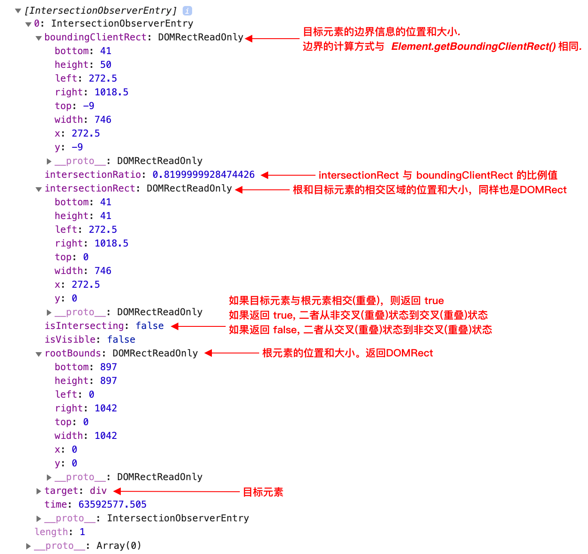
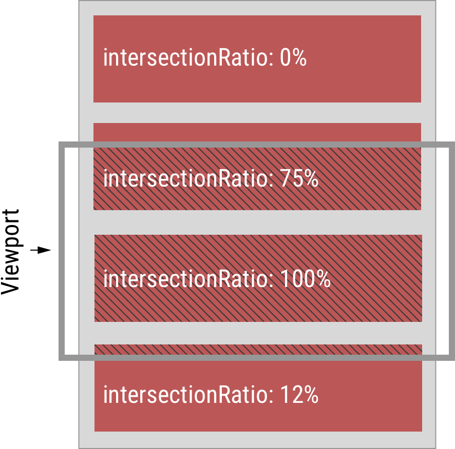
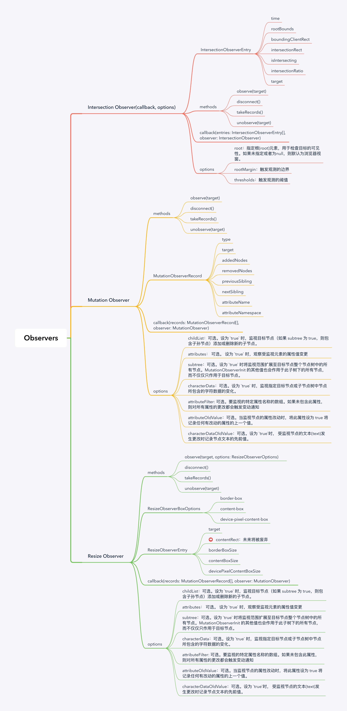

在之前的[从getboundingclientrect到intersection-observer](../从getboundingclientrect到intersection-observer/index.md)中提到了`Intersection Observer API`，今天趁热打铁，将现有的其他几个Observer API 一并整理，方便查阅

## IntersectionObserver

字面翻译：交叉的观察者。即观察两个元素之间的交叉情况

Web的传统位置计算机制依赖于显式查询DOM的状态。 其中一些会导致样式重新计算和布局(比如前文提到的`offsetHeight`, `offsetWidth` 和 `getBoundingClientRect()`)，并且经常需要JavaScript脚本需要轮询此信息，因此经常会让浏览器触发多余的重新计算和布局。在实际工作中，追踪或者判断DOM是否出现在客户端视图窗口中是一个很常见的操作。比如图片懒加载，滚动时元素进入的动画等等。一般来说可以通过监听滚动事件，使用`getBoundingClientRect()`来计算元素的位置。但正如前文所言，这存在性能问题。
`Intersection Observer API` 就是为这而[设计](https://github.com/w3c/IntersectionObserver/blob/master/explainer.md)的，显着降低其CPU，GPU和能源消耗。

### 创建一个 IntersectionObserver

IntersectionObserver 的 API 非常简洁

```js
const observer = new IntersectionObserver(changes => {
  for (const change of changes) {
    console.log(change)
  }
}, {});

// 观察目标元素的可见性变化
observer.observe(target);

// 停止对一个元素的观察
observer.unobserve(target);

// 停止对所有目标元素可见性变化的观察
observer.disconnect();
```

### callback

回调接收 IntersectionObserverEntry 对象和观察者的列表：

```ts
const callback = function(entries: IntersectionObserverEntry[], observer: IntersectionObserver) { 
  entries.forEach(entry => {
    // Each entry describes an intersection change for one observed
    // target element:
    //   entry.boundingClientRect
    //   entry.intersectionRatio
    //   entry.intersectionRect
    //   entry.isIntersecting
    //   entry.rootBounds
    //   entry.target
    //   entry.time
  });
};
```

`entries`是一个数组，和`threshold`对应。即使`threshold`输入的是一个数字，`entries`也会返回数组。下图是`IntersectionObserverEntry`的结构



下图可以清晰的看出`intersectionRadio`的意义



`IntersectionObservers` 是异步传递数据，回调函数中的代码将在主线程中运行。 规范中提到`IntersectionObserver`实现应使用`requestIdleCallback（）`。 这意味着对回调函数的执行是低优先级的，将在客户端空闲时间进行。 这是有意为之。

### options

传递到IntersectionObserver()构造函数的 options 对象包含以下字段：

* **root**
  - 指定根(root)元素，用于检查目标的可见性。必须是目标元素的父级元素。
  - 如果未指定或者为null，则默认为浏览器视窗。
* **rootMargin**  
  - 根元素的外边距。类似于css中的 margin 属性，比如 "10px 20px 30px 40px" (top, right, bottom, left)。
  - 如果有指定root参数，则rootMargin也可以使用百分比来取值。该属性值是用作root元素和target发生交集时候的计算交集的区域范围，使用该属性可以控制root元素每一边的收缩或者扩张。
  - 默认值为0。
* **threshold**
  - 可以是一个数字也可以是一个数字数组。目标元素和根元素相交程度达到该值的时候IntersectionObserver注册的回调函数将会被执行。
  - 如果你只是想要探测当target元素的在root元素中的可见性超过50%的时候，你可以指定该属性值为0.5。
  - 如果你想要target元素在root元素的可见程度每多25%就执行一次回调，那么你可以指定一个数组[0, 0.25, 0.5, 0.75, 1]。
  - 默认值是0(意味着只要有一个target像素出现在root元素中，回调函数将会被执行)。
  - 该值为1.0含义是当target完全出现在root元素中时候 回调才会被执行。

**注意：**

1. 如果使用默认的`options`，目标元素部分进入视图窗口和完全离开视图窗口时，都会触发一次回调函数
2. 如果你想同时观察多个元素，尽可能地在一个`IntersectionObserver`的实例上调用多次`observer`方法

### 常用场景

#### 元素的可见性监听

```html
<!-- 网页中嵌入的广告 -->
<iframe id="theAd"></iframe>
<!-- 嵌入的脚本 -->
<script src="//cdn.example.com/ads.js" async></script>
```

```js
// ads.js

// 上报信息
function logImpressionToServer() { /* ... */ }

// 判断是否可见
function isVisible(boundingClientRect, intersectionRect) {
  return ((intersectionRect.width * intersectionRect.height) /
          (boundingClientRect.width * boundingClientRect.height) >= 0.5);
}

function visibleTimerCallback(element, observer) {
  delete element.visibleTimeout;

  processChanges(observer.takeRecords());

  if ('isVisible' in element) {
    delete element.isVisible;
    logImpressionToServer();
    observer.unobserve(element);
  }
}

// 交叉时的回调函数
function processChanges(changes) {
  changes.forEach(function(changeRecord) {
    const element = changeRecord.target;
    element.isVisible = isVisible(changeRecord.boundingClientRect, changeRecord.intersectionRect);
    if ('isVisible' in element) {
      // 显示
      element.visibleTimeout = setTimeout(visibleTimerCallback, 1000, element, observer);
    } else {
      // 隐藏
      if ('visibleTimeout' in element) {
        clearTimeout(element.visibleTimeout);
        delete element.visibleTimeout;
      }
    }
  });
}

const observer = new IntersectionObserver(
  processChanges,
  { threshold: [0.5] } 
);

const theAd = document.querySelector('#theAd');
observer.observe(theAd);
```

乍看之下好像需要编写更多复杂代码，但是对比传统的方式，这种方式有其优点

1. 无需监听scroll事件
2. 没有频繁的同步计算布局，没有插件依赖，只使用了一个定时器来记录状态

#### 数据滚动

许多系统使用数据绑定列表来管理其视图内内容，可以通过回收DOM的方式保持内存和布局效。率。通常我们在渲染分页加载的列表数据的时候，为了避免滚动的时候出现卡顿感，会一次加载好几页的数据，但是实际上需要渲染的数据是总数据的子集。并且随着页码的加大，这个列表中的DOM会越来越多。我们可以在列表元素上使用 `IntersectionObserver`，来通知系统何时加载数据，何时回收DOM

```html
<style>
  .container {
    overflow: auto;
    width: 10em;
    height: 30em;
    position: relative;
  }

  .inner-scroll-surface {
    position: absolute;
    left: 0px;
    top: 0px;
    width: 100%;
    /* proportional to the # of expected items in the list */
    height: 1000px;
  }

  .scroll-item {
    position: absolute;
    height: 2em;
    left: 0px;
    right: 0px;
  }
</style>

<div class="container">
  <div class="inner-scroll-surface">
    <div class="scroll-item" style="top: 0em;">item 1</div>
    <div class="scroll-item" style="top: 2em;">item 2</div>
    <div class="scroll-item" style="top: 4em;">item 3</div>
    <!-- ... -->
  </div>
</div>
```
As the user moves the container, the children can be observed and as they cross the threshold of the scrollable area, a manager can recycle them and fill them with new data instead of needing to re-create the items from scratch.

当用户滚动列表时，列表元素经过预先设定的阈值时，可以执行对应的处理逻辑

```js
function query(selector) {
  return Array.from(document.querySelectorAll(selector));
}

function init() {
  const opts = { 
    root: document.querySelector(".container"),
    rootMargin: "500px 0px" 
  };
  const observer = new IntersectionObserver(manageItemPositionChanges, opts);

  query(".inner-scroll-surface > .scroll-item")
    .forEach(function(scrollItem) {
      observer.observe(scrollItem);
    });
}

function manageItemPositionChanges(changes) {
  // ...
}
```

#### 延迟加载

使用`IntersectionObserver`轻松实现懒加载

```html
<div class="lazy-loaded">
  <template>
    ...
  </template>
</div>
```

```js
function query(selector) {
  return Array.from(document.querySelectorAll(selector));
}

var observer = new IntersectionObserver(
  // 预先加载在视窗可见区域高度两倍以内的元素
  function(changes) {
    changes.forEach(function(change) {
      var container = change.target;
      var content = container.querySelector("template").content;
      container.appendChild(content);
      observer.unobserve(container);
    });
  },
  { rootMargin: "200% 0%" }
);

query(".lazy-loaded").forEach(function(item) {
  observer.observe(item);
});
```

## MutationObserver

在web应用中，DOM操作是相当频繁的。在过去有一段时间，公认有效的一种方式是使用`Mutation Events`，不过这个特性在API的设计中有缺陷，为DOM添加 mutation 监听器反而会进一步降低修改DOM文档的性能（慢1.5 - 7倍）。而且 移除监听器不会减少性能的消耗。目前已经被废弃了。具体原因可以查看[DOM Mutation Events Replacement: The Story So Far / Existing Points of Consensus](https://lists.w3.org/Archives/Public/public-webapps/2011JulSep/0779.html)。简单来说以下三点原因：

1. 冗余。因为经常触发
2. 慢。因为事件传播所以慢，同时还阻止了一些UA的自我优化
3. 容易crash。

W3C提出了`MutationObserver`来代替`Mutation Events`。

### 创建一个 MutationObserver

`MutationObserver` 可以监听DOM节点的变化，属性的变化，它最基本的语法如下：

```ts
const targetNode = document.querySelector("#someElement")
const observerOptions = {
  childList: true,  // 观察目标子节点的变化，是否有添加或者删除
  attributes: true, // 观察属性变动
  subtree: true     // 观察后代节点，默认为 false
}

const observer = new MutationObserver(callback)

function callback(records: mutationRecord[], observer: MutationObserver) {
  // ...
}
observer.observe(targetNode, observerOptions)

// ...

observer.disconnect() // 停止观察变动。 可以重用观察者。所有已经检测到但是尚未向观察者报告的变动都会被丢弃
```

使用选择器来获取目标节点树。 `observerOptions` 中设定了观察者的选项，通过设定 childList 和 attributes 为 true 来获取所需信息，表示同时观察目标节点树的childList和attributes的变化。

### callback

每当被指定的节点或子树以及配置项有 DOM 变动时，callback会被异步调用。这个函数有两个参数：一个是描述所有被触发改动的 [`MutationRecord`](https://developer.mozilla.org/zh-CN/docs/Web/API/MutationRecord) 对象数组，另一个是调用该函数的MutationObserver 对象。比如：

```js
function callback(mutationRecords, observer) {
  mutationRecords.forEach((mutation) => {
    switch(mutation.type) {
      case 'childList':
        /* 从树上添加或移除一个或更多的子节点；参见 mutation.addedNodes 与
           mutation.removedNodes */
        break;
      case 'attributes':
        /* mutation.target 中某节点的一个属性值被更改；该属性名称在 mutation.attributeName 中，
           该属性之前的值为 mutation.oldValue */
        break;
    }
  });
}
```

:::info
callback 的函数签名和 `IntersectionObserver` 很相似。其实这些 Observer 的callback 的函数签名都是相似的
:::

之后指定目标节点与记录选项，我们开始观察使用 `observe()` 指定的 DOM 节点。

从现在开始直到调用 `disconnect()` ，每次以 targetNode 为根节点的 DOM 树添加或移除元素时，以及这些元素的任意属性改变时，`callback()` 都会被调用。

### options

`observer(target, options)` 中的 `options` 是一个`MutationObserverInit`对象，描述了 MutationObserver 的配置。当调用 `observe()` 方法时，`childList`，`attributes` 或者 `characterData` 三个属性之中，至少有一个必须为 `true`，否则会抛出 `TypeError` 异常。

|参数名|描述|是否可选|默认值|
|---|---|---|---|
| childList |设为 `true` 时，监视目标节点（如果 subtree 为 true，则包含子孙节点）添加或删除新的子节点。|可选|false|
| attributes|设为 `true` 时，观察受监视元素的属性值变更| 可选| false|
| characterData|设为 `true` 时，监视指定目标节点或子节点树中节点所包含的字符数据的变化| 可选 | - |
|attributeFilter| 要监视的特定属性名称的数组。如果未包含此属性，则对所有属性的更改都会触发变动通知|可选| - |
|attributeOldValue|当监视节点的属性改动时，将此属性设为 true 将记录任何有改动的属性的上一个值|可选| - |
|characterDataOldValue| 设为 `true`时， 受监视节点的文本(text)发生更改时记录节点文本的先前值| 可选| - |
|subtree|设为 `true` 时将监视范围扩展至目标节点整个节点树中的所有节点。MutationObserverInit 的其他值也会作用于此子树下的所有节点，而不仅仅只作用于目标节点。| 可选|false|

### takeRecords()

返回**已检测到但尚未由观察者的回调函数处理的所有匹配DOM更改的列表，使变更队列保持为空**。 最常见的使用场景是：在断开观察者之前立即获取所有未处理的更改记录，以便在停止观察者时可以处理任何未处理的更改。比如：

```diff
var targetNode = document.querySelector("#someElement");
var observerOptions = {
  childList: true,
  attributes: true
}

var observer = new MutationObserver(callback);
observer.observe(targetNode, observerOptions);

// 这里做了一些事情
// ...
+// 开始处理尚未结束的变更
+var mutations = observer.takeRecords();

+if (mutations) {
+  callback(mutations);
+}

observer.disconnect();
```

## Resize Observer

这个API和其他的Observer类似，他可以用来观察元素大小的变化。onresize事件则只能有window来触发。大部分使用场景可能是在视窗大小发生变化，或者在移动设备上屏幕旋转时，监听页面元素尺寸的变化。在resizeObserver出现之前，只能使用 `window.resize` 事件来见视窗的大小变化。这种方式稍不留神就容易因为频繁触发resize事件而出现性能问题，从另一个层面来说，`resize`有点“浪费资源”，因为我们只能通过视窗的变化来计算目标元素的变化。

现如今重Web端的SPA页面中，经常需要动态地添加或者删除DOM，频繁修改父元素的尺寸，这种case只有Resize Observer API能够帮我们。

除了监听元素大小变化之外，还有几个有意思的特性：

1. 目标元素被插入或者从DOM中移除时会触发观察
2. 目标元素display修改为`none`时会触发观察
3. 非替换元素([link](https://developer.mozilla.org/zh-CN/docs/Web/CSS/Replaced_element))不会触发观察
4. tranforms不会触发观察
5. 如果元素被渲染了时尺寸不是0，0，也会触发观察

### 创建一个 ResizeObserver

与`intersectionObserver`和`MutationObserver`不同，ResizeObserver的构造函数只需要一个`callback`参数。但是监听和取消监听的方法类似

```js
function callbacl(entries) {
  // ...
}

const myObserver = new ResizeObserver(callback);
const someEl = document.querySelector('.some-element')
const someOtherEl = document.querySelector('.some-other-element')

myObserver.observe(someEl)
myObserver.observe(someOtherEl)
```

### callback

当观察的目标元素尺寸发生变化时触发回调函数，参数是一个`ResizeObserverEntry`对象数组。ResizeObserverEntry的接口如下

```ts
interface ResizeObserverEntry {
    readonly attribute Element target;
    readonly attribute DOMRectReadOnly contentRect;
    readonly attribute sequence<ResizeObserverSize> borderBoxSize;
    readonly attribute sequence<ResizeObserverSize> contentBoxSize;
    readonly attribute sequence<ResizeObserverSize> devicePixelContentBoxSize;
};
```

`contentRect` 是 ResizeObserver API 孵化阶段时的产物，考虑到兼容性问题暂时保留，在未来可能会被废弃。

当观察的目标元素尺寸发生变化时触发回调函数，参数是一个`ResizeObserverEntry`对象数组。`ResizeObserverEntry`对象包含两个属性：`contentRect`，`target`。**target**是被观察的目标对象。**contentRect**是`DOMRectReadOnly`的引用，包含 `width`, `height`, `x`, `y`, `top`, `right`, `bottom` 和 `left`。和`Element.getBoundingClientRect()`返回的数据不同，`contentRect`的`width`和`height`不包含`padding`，`contentRect.top`是元素的`padding-top`，`contentRect.left`是元素的`padding-left`。


比如在元素调整大小时，其内部文本显示为尺寸大小，代码如下：

```js
const resizeObserver = new ResizeObserver(entries => {
  for (let entry of entries) {
    const boxEl = entry.target
    const dimensions = entry.contentRect

    boxEl.textContent = `${dimensions.width} x ${dimensions.height}`
  }
})

resizeObserver.observe(document.querySelector('.box:nth-child(2)'))
```

### observe(target, options)

ResizeObserver实例的observe方法还有第二个参数`options`。不过暂时处于草案阶段，浏览器还不支持第二个参数。

```ts
enum ResizeObserverBoxOptions {
  "border-box", 
  "content-box", 
  "device-pixel-content-box"
};
```

可以控制Observer观察不同的CSS尺寸：

* **border-box** : box-border。返回的尺寸包含padding和border
* **content-box** : content-boder。返回的尺寸不包含padding和border。默认值
* **device-pixel-content-box** : 返回的尺寸是未经缩放的，和设备像素相关的大小，一定是一个整数。

### 常用场景

#### iframe的大小变化

iframe 可以检测到大小的变化然后通知给父窗口

```js
let ro = new ResizeObserver(entries => {
  let idealSize = computeIdealSize();

  window.parent.postMessage({
    name: "iframeResize",
    width: idealSize.width,
    height: idealSize.height
  }, '*');
});

ro.observe(document.body);

// window上监听message事件
window.addEventListener("message", ev => {
  if (ev.data && ev.data.name == "iframeResize") {
    let iframe = findEventSourceIframe(ev.source);
    if (iframe) {
      iframe.style.width = ev.data.width + "px";
      iframe.style.height = ev.data.height + "px";
    }
  }
}, false);
```

#### 聊天窗口自动滚动到底部

在聊天窗口中，最新的消息在底部。为了防止浏览器自动滚动到顶部，当收到新消息时需要将滚动的位置保持在最底部。当窗口自动变化的时候也要保证能够

```css
.chat {
  overflow: scroll;
}
```

```html
<div class="chat">  <!-- chat has the scrollbar -->
  <div class="chat-text"> <!-- chat-text contains chat text -->
    <div>jack: hi </div>
    <div>jill: hi </div>
  </div>
</div
```

```js
let ro = new ResizeObserver( entries => {
  for (let e of entries) {
    let chat = e.target.parentNode;
    chat.scrollTop = chat.scrollHeight - chat.clientHeight;
  }
});
ro.observe(document.querySelector('.chat-text'))
```

ResizeObserver 观察 `chat-text` 的大小，每次检测到变化时，将 `chat` 滚动到底部。新消息插入时也会触发到resize的检测。

当用户向上滚动滚动条阅读历史消息时，新消息插入时自动滚动到底部，这会让用户丢掉之前阅读的信息。所以在这里引出一个新问题，如何保留用户的滚动位置？

我们可以监听scroll事件来判断是否滚动，但是没有API可以区分是scroll事件是用户行为触发还是程序触发，这里hack的方式是使用flag来区分。代码如下：

```js
let ro = new ResizeObserver()

function initScrollPositionChat(chat) {
  let chatText = chat.firstElementChild

  chatText.resizeHandler = entry => {
    let chat = entry.target.parentNode;

    // 判断flag
    if (!chat.saveUserScroll) {
      chat.isResizeScrollEvent = true;
      chat.scrollTop = chat.scrollHeight - chat.clientHeight;
    }
  }

  ro.observe(chatText)

  chat.addEventListener('scroll', ev => {
    // Ignore scrolls generated by ResizeObserver
    if (chat.isResizeScrollEvent) {
      delete chat.isResizeScrollEvent;
      return;
    }

    // 保存用户的位置，除非已经滚动到底部了
    if (chat.scrollTop != chat.scrollHeight - chat.clientHeight) {
      chat.saveUserScroll = true;
    } else {
      chat.saveUserScroll = false;
    }
  });
}
```

Resize Observer API目前还有很多特性处于草稿阶段，有兴趣的朋友可以前往[w3.org](https://www.w3.org/TR/resize-observer/#intro)查阅


## 三个Observer的对比




## 参考

1. [IntersectionObserver’s Coming into View](https://developers.google.com/web/updates/2016/04/intersectionobserver)
2. [IntersectionObserver explainer](https://github.com/w3c/IntersectionObserver/blob/master/explainer.md)
3. [ResizeObserver: it’s like document.onresize for elements](https://web.dev/resize-observer/)