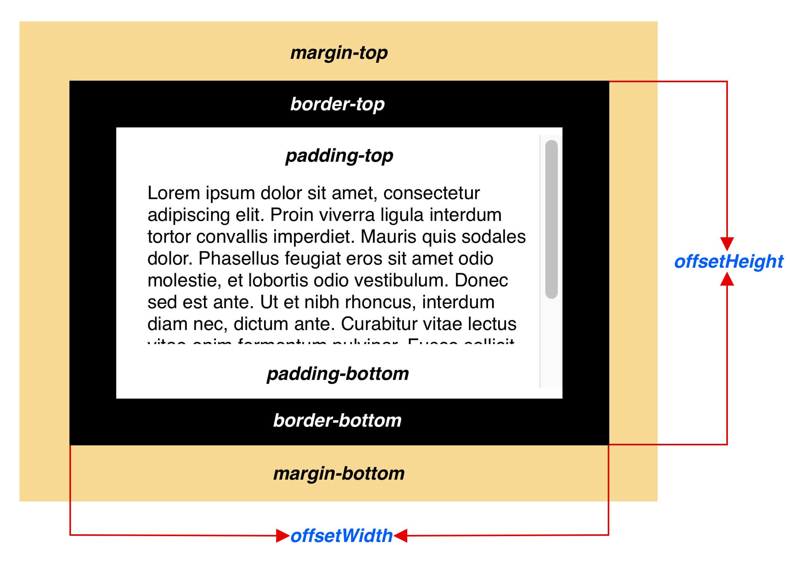
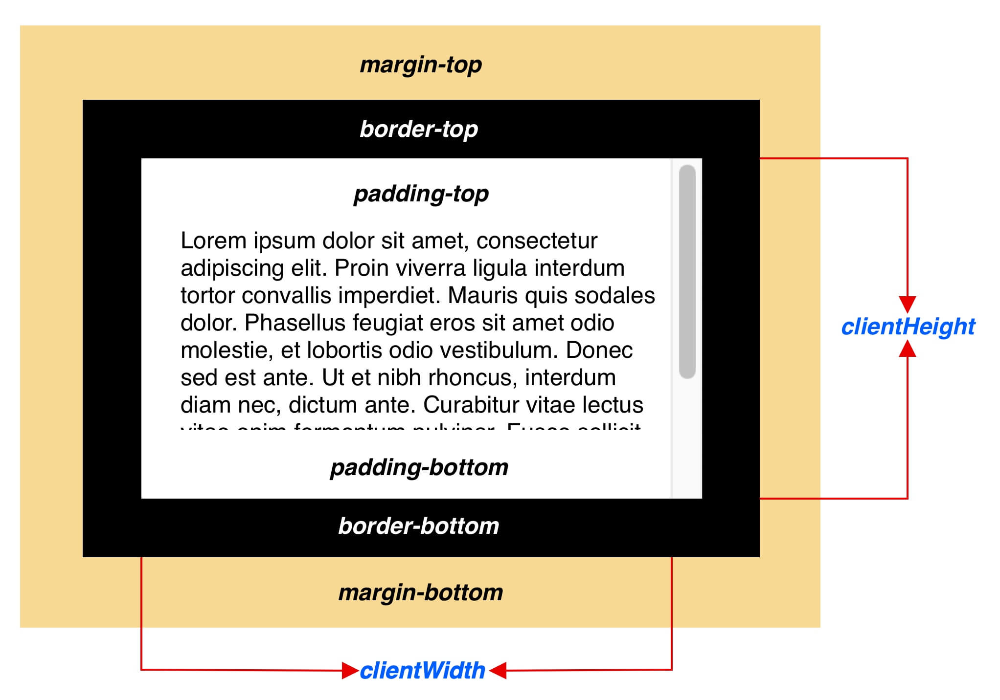
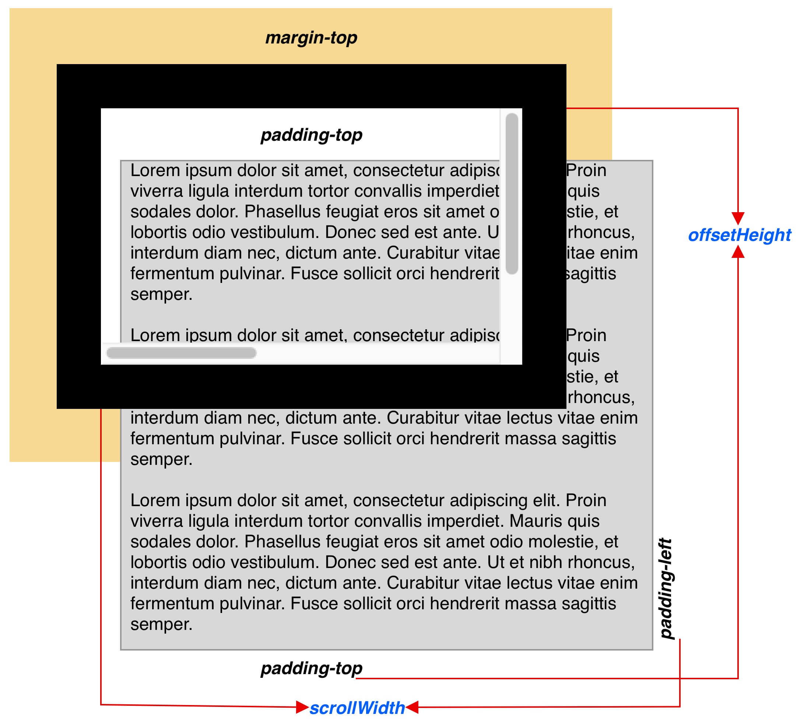
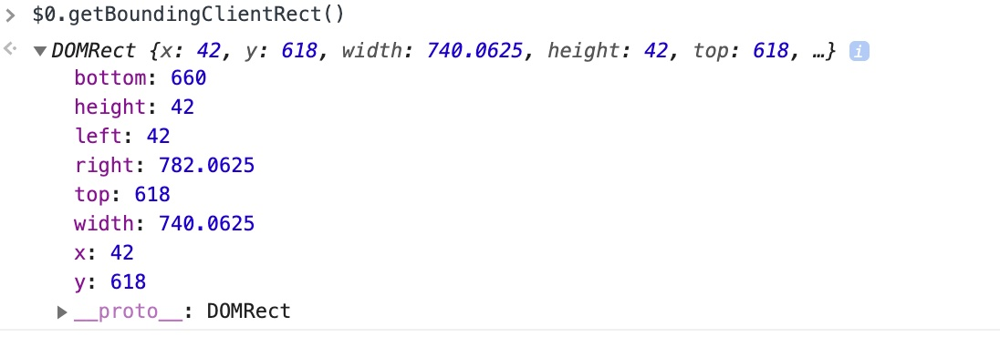
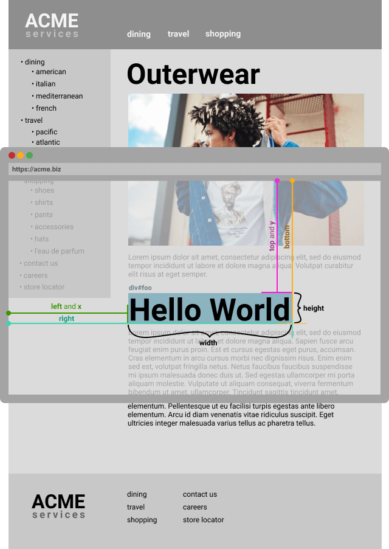
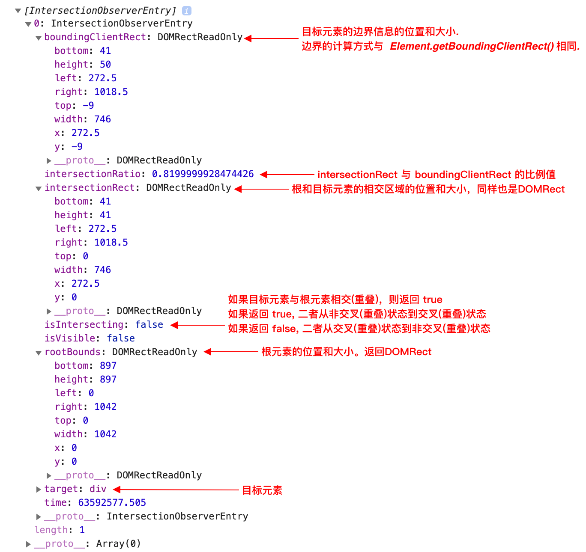

平时在写页面交互的时候经常使用兼容性不错的 getBoundindClientReact 方法，以快速获取元素大小和元素位置。最近无意中看到getBoundingClientRect方法会导致 Reflow的说法，但是并没有提及为什么，很是好奇，遂研究了一番。

<!-- more -->

我按照以下顺序，一一介绍相关内容

1. 常见的几种获取元素大小和位置的方法
2. getBoundingClientRect()的用法
3. Repaint 和 Reflow
4. 为什么 getBoundingClientRect() 会触发 Reflow
5. 使用IntersectionObserver监听元素位置

## 常见的几种获取元素大小和位置的方法

### 获取元素大小

在DOM中提供了多个与元素宽高相关的方法，想要确认元素的宽高时有几种属性可以选择。

#### **offsetWidth和offsetHeight**

分别返回元素包含边框以内的宽和高



#### **clientWidth和clientHeight**

分别返回元素包含内边距以内的宽和高



#### **scorllHeight**

分别返回元素内容的宽和高，包括由于溢出导致的视图中不可见内容。测量方式与clientWidth(clientHeight)相同，包含元素的内边距，但不包括边框，外边距或垂直滚动条



### 获取元素位置

在实际应用中，获取元素位置主要是：

1. 获取元素相对视图窗口(viewport)上右下左的具体数值
2. 获取元素相对父元素上右下左的具体数值

这里将用到`offsetTop`、`offsetLeft` 和 `offsetParent` 三个属性

`offsetParent`返回一个指向最近的（指包含层级上的最近）包含该元素的定位元素或者最近的 table,td,th,body元素。当元素的 `style.display` 设置为 "none" 时，`offsetParent` 返回 `null`。如果元素没有设置了定位属性的父元素，也会返回 `null`

`offsetTop/offsetLeft`用来获取当前元素（不包括上边框） 相对于 `offsetParent` 的位置。

也就是说:

* 如果所有祖先元素都是静态定位 `position:static;`（默认情况），`offsetTop` 表示与 `Document` 最上方的高度差（文档最上方可能已经滚出视口，这个高度可能大于视口高度）。
* 如果存在绝对定位的祖先元素 `position:absolute/fixed`，`offsetTop` 就会相对于这个元素。

因此为了获取相对于 `Document` 最上方的高度差，需要递归地调用：

```ts
function getOffsetPosition(el:HTMLElement): number {
  return el.offsetParent
    ? el.offsetTop + getOffsetTop(el.offsetParent)
    : el.offsetTop
}
```

按照上面的说法，使用offset三兄弟来获取元素到父元素的距离时，必须得实现将目标父元素设置为定位元素。

如果想要获取任意两个元素之间的距离，该怎么办呢？这时候可以使用`getBoundingClientReact()`了

## getBoundingClientRect()

该方法返回元素的大小和当前相对视窗(viewport)的位置，通常大家都用这个方法来判断元素是否出现在可视窗口中。

```ts
const reactObject: DOMRect = $Element.getBoudingClientRect()
```

举个例子

```html
<div id="foo">Hello World</div>
```

调用id为foo的div的`getBoundingClientRect()`方法：

```ts
document.getElementById('foo').getBoundingClientRect();
// =>  {
//       top: Number,
//       left: Number,
//       right: Number,
//       bottom: Number,
//       x: Number,
//       y: Number,
//       width: Number,
//       height: Number,
//     }
```



每一个字段返回的意义如下图所示：



因为`getBoundingClientRect`是相对viewport计算的，所以可以使用`window.scrollY`和`window.scrollX`和返回的`x`,`y`做计算，得出元素相对整个页面的距离。

```ts
const offsetLeft = window.scrollX + $0.getBoundingClientRect().left
const offsetTop = window.scrollY + $0.getBoundingClientRect().top
```

可以使用这种方法来计算任意两个元素之间的记录，按照上述方式分别计算两个元素的结果再做差值即可

## Repaint和Reflow

为什么要谈谈 Repaint 和 Reflow？如果搜索相关关键字，会发现几乎所有的将 Repaint 和 Reflow的文章，都会提到前面所提及的那些属性和方法，但没有明说到底是为什么。

再说 Repaint 和 Reflow 之前先简单介绍一下浏览器如何渲染网页的。

1. 从服务器接受数据
2. 将文档解析成Tokens<, TagName, Attribute, AttributeValue, >)
3. 将Tokens转换成Node节点
4. 利用Node节点生成DOM树
5. 解析CSS,创建CSSOM
6. CSSOM和DOM树合并成一个RenderTree
  * RenderTree只包含渲染网页所需的节点
  * 从DOM树的根节点开始，计算那些显示的元素和对应的计算属性。不显示的元素(meta, script, link标签和display: none)将会忽略
7. Reflow：计算每一个可见元素的布局，精确的位置和大小(Layout tree)
8. Repaint：将像素渲染到屏幕中


## 为什么 getBoundingClientRect() 会触发 Reflow

`offsetTop`、`offsetLeft`和`getBoundingClientRect`皆需要重新计算元素在布局中的精确位置或者大小，这必然会触发Reflow。

在 chromium 的源码中可以找到代码：

**offsetTop/offsetLeft**

[source](https://source.chromium.org/chromium/chromium/src/+/master:third_party/blink/renderer/core/frame/visual_viewport.cc;l=435-461;drc=a3c165458e524bdc55db15d2a5714bb9a0c69c70?originalUrl=https:%2F%2Fcs.chromium.org%2F)

```cpp
double VisualViewport::OffsetLeft() const {
  if (!MainFrame())
    return 0;

  UpdateStyleAndLayout(DocumentUpdateReason::kJavaScript);

  return VisibleRect().X() / MainFrame()->PageZoomFactor();
}
```

其中`UpdateStyleAndLayout`方法调用之后将会触发LayoutTree的重新渲染，也就是我们说的Reflow

再比如`element.innerText`中调用的`UpdateStyleAndLayoutForNode`，最后也是通过调用`UpdateStyleAndLayout`触发Reflow。[source](https://source.chromium.org/chromium/chromium/src/+/master:third_party/blink/renderer/core/dom/document.cc;l=2786-2794;drc=7f2a66319b71e1cd3be556aeaa50cd18d1be70c1)

```cpp
String Element::innerText() {
  // We need to update layout, since |ElementInnerTextCollector()| uses line
  // boxes in the layout tree.
  GetDocument().UpdateStyleAndLayoutForNode(this,
                                            DocumentUpdateReason::kJavaScript);
  return ElementInnerTextCollector().RunOn(*this);
}

// document.cc
void Document::UpdateStyleAndLayoutForNode(const Node* node,
                                           DocumentUpdateReason reason) {
  DCHECK(node);
  if (!node->InActiveDocument())
    return;

  DisplayLockUtilities::ScopedForcedUpdate scoped_update_forced(node);
  UpdateStyleAndLayout(reason);
}
```

搜索`getBoundingClientRect`可以在`rang.cc`中找到对应的代码 [source](https://source.chromium.org/chromium/chromium/src/+/master:third_party/blink/renderer/core/dom/range.cc;l=1620-1622;drc=7f2a66319b71e1cd3be556aeaa50cd18d1be70c1;bpv=1;bpt=1?q=getBoundingClientRect&ss=chromium%2Fchromium%2Fsrc&originalUrl=https:%2F%2Fcs.chromium.org%2F)

```cpp
DOMRect* Range::getBoundingClientRect() const {
  return DOMRect::FromFloatRect(BoundingRect());
}
```

`BoundingRect()`中调用了`UpdateStyleAndLayout()` [source](https://source.chromium.org/chromium/chromium/src/+/master:third_party/blink/renderer/core/dom/range.cc;l=1732-1747;drc=7f2a66319b71e1cd3be556aeaa50cd18d1be70c1;bpv=1;bpt=1?q=getBoundingClientRect&ss=chromium%2Fchromium%2Fsrc&originalUrl=https:%2F%2Fcs.chromium.org%2F)

```cpp
FloatRect Range::BoundingRect() const {
  owner_document_->UpdateStyleAndLayout(DocumentUpdateReason::kJavaScript);

  Vector<FloatQuad> quads;
  GetBorderAndTextQuads(quads);

  FloatRect result;
  for (const FloatQuad& quad : quads)
    result.Unite(quad.BoundingBox());  // Skips empty rects.

  // If all rects are empty, return the first rect.
  if (result.IsEmpty() && !quads.IsEmpty())
    return quads.front().BoundingBox();

  return result;
}
```

> 好吧 说了半天，都是因为代码就这么写的

## Intersection Observer API

一直以来，检测元素的可视状态或者两个元素的相对可视状态都得使用前文中提到的几个属性，但是不幸的是，这些属性都会触发 Reflow。Reflow有GUI渲染线程管理，而GUI渲染线程与JS引擎线程互斥，在一定程度上来说容易拖慢网页的性能(抛开计量谈毒性都是耍流氓)。但是有些情况都需要能都检测到元素可视状态的变化，比如：

* 当页面滚动时，懒加载图片或其他内容。
* 实现“可无限滚动”网站，也就是当用户滚动网页时直接加载更多内容，无需翻页。
* 为计算广告收益，检测其广告元素的曝光情况。
* 根据用户是否已滚动到相应区域来灵活开始执行任务或动画。

Intersection Observer API 会注册一个回调方法，每当期望被监视的元素进入或者退出另外一个元素的时候(或者浏览器的视口)该回调方法将会被执行，或者两个元素的交集部分大小发生变化的时候回调方法也会被执行。通过这种方式，网站将不需要为了监听两个元素的交集变化而在主线程(GUI渲染线程)里面做任何操作，并且浏览器可以帮助我们优化和管理两个元素的交集变化。

通过 Intersection Observer API 获取到两个元素重叠部分的准确值(这可能也是他不需要重新计算的原因吧)。最常用的使用方式是：如果两个元素发生的交集部分在 N% 左右时，需要做处理一些事情(执行回调)"


### 创建一个 intersection observer

它的API非常简单。构造函数有两个参数。callback是触发时调用的回调函数，在目标(target)元素和根(root)元素的交集大小超过阈值(threshold)规定的大小时候被执行。 

```js
const options = {
    root: document.querySelector('#scrollArea'), 
    rootMargin: '0px', 
    threshold: 1.0
}
const observer = new IntersectionObserver(callback, option)
const target = document.querySelector('#listItem')

observer.observe(target)
```

####  **Intersection observer options**

传递到IntersectionObserver()构造函数的 options 对象包含以下字段：

* **root**
  - 指定根(root)元素，用于检查目标的可见性。必须是目标元素的父级元素。
  - 如果未指定或者为null，则默认为浏览器视窗。
* **rootMargin**  
  - 根元素的外边距。类似于css中的 margin 属性，比如 "10px 20px 30px 40px" (top, right, bottom, left)。
  - 如果有指定root参数，则rootMargin也可以使用百分比来取值。该属性值是用作root元素和target发生交集时候的计算交集的区域范围，使用该属性可以控制root元素每一边的收缩或者扩张。
  - 默认值为0。
* **threshold**
  - 可以是一个数字也可以是一个数字数组。目标元素和根元素相交程度达到该值的时候IntersectionObserver注册的回调函数将会被执行。
  - 如果你只是想要探测当target元素的在root元素中的可见性超过50%的时候，你可以指定该属性值为0.5。
  - 如果你想要target元素在root元素的可见程度每多25%就执行一次回调，那么你可以指定一个数组[0, 0.25, 0.5, 0.75, 1]。
  - 默认值是0(意味着只要有一个target像素出现在root元素中，回调函数将会被执行)。
  - 该值为1.0含义是当target完全出现在root元素中时候 回调才会被执行。

#### **callback**

回调接收 IntersectionObserverEntry 对象和观察者的列表：

```ts
var callback = function(entries: IntersectionObserverEntry[], observer: IntersectionObserver) { 
  entries.forEach(entry => {
    // Each entry describes an intersection change for one observed
    // target element:
    //   entry.boundingClientRect
    //   entry.intersectionRatio
    //   entry.intersectionRect
    //   entry.isIntersecting
    //   entry.rootBounds
    //   entry.target
    //   entry.time
  });
};
```

`entries`是一个数组，和`threshold`对应。即使`threshold`输入的是一个数字，`entries`也会返回数组。下图是`IntersectionObserverEntry`的结构



> 注意：注册的回调函数将会在主线程中被执行。所以该函数执行速度要尽可能的快。


## 参考资料

1. [what-forces-layout.md](https://gist.github.com/paulirish/5d52fb081b3570c81e3a)
2. [js-getboundingclientrect](https://www.digitalocean.com/community/tutorials/)
3. [渲染树构建、布局及绘制](https://developers.google.com/web/fundamentals/performance/critical-rendering-path/render-tree-construction?hl=zh-cn)
4. [dom_performance_Reflow_repaint.md](https://gist.github.com/faressoft/36cdd64faae21ed22948b458e6bf04d5)
5. [Intersection Observer API](https://developer.mozilla.org/zh-CN/docs/Web/API/Intersection_Observer_API)