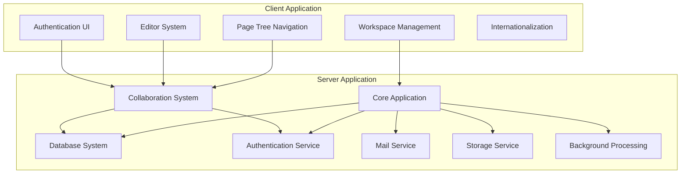
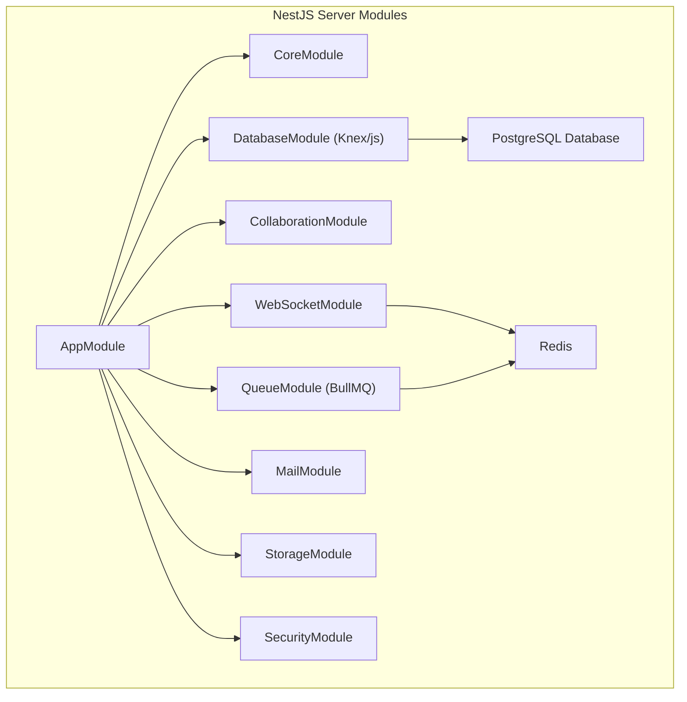
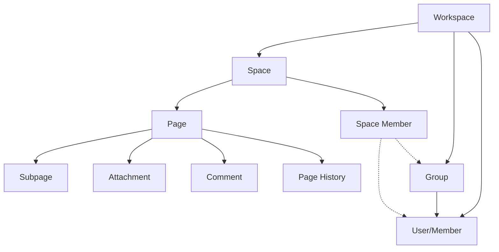
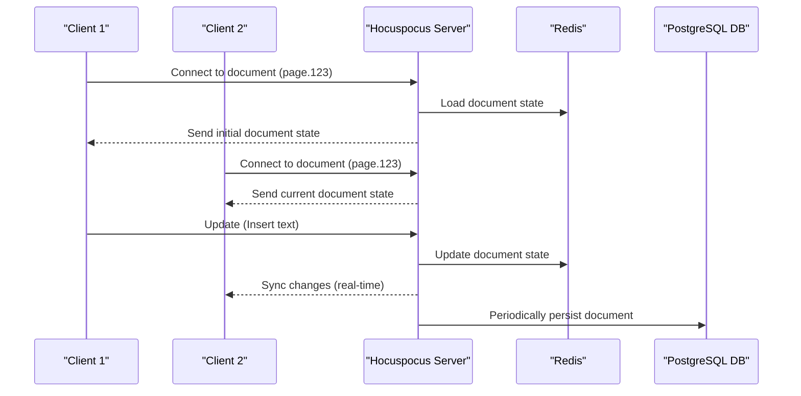
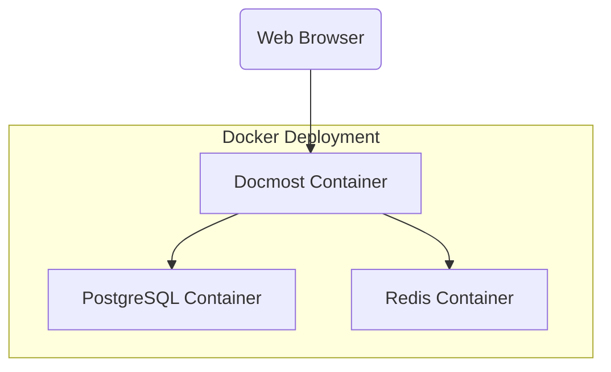

# 总览

DocMost 是一个基于客户端-服务器架构的开源协作维基和文档平台。本页提供了对系统、其组件以及它们之间交互的高级概述。DocMost 支持实时协作编辑、分层页面组织和全面的工作空间管理。

有关特定子系统的详细信息，请参阅相应页面：

- 实时协作详情，请参阅实时协作系统
- 数据模型具体信息，请参阅数据模型和关系
- 页面管理功能，请参阅页面管理
- 工作空间功能，请参阅工作空间管理

## 系统架构

DocMost 采用以实时合作为重点的现代客户端-服务器架构。系统由两个主要应用程序组成：

- 客户端应用程序 - 一个基于 React 的前端，提供用户界面和编辑体验
- 服务器应用程序 - 一个基于 NestJS 的后端，处理数据持久化、身份验证和协作

### **架构图**

## Technology Stack

DocMost 是使用现代的 JavaScript/TypeScript 技术栈构建的：

| **Component**      | **Technologies**                                           |
| ------------------ | ---------------------------------------------------------- |
| **Client**         | React, TypeScript, Vite, Mantine UI, TanStack Query, Jotai |
| **Editor**         | Tiptap, ProseMirror, Yjs, Hocuspocus                       |
| **Server**         | NestJS, TypeScript, Kysely, PostgreSQL                     |
| **Real-time**      | Yjs, Hocuspocus, Redis, WebSockets                         |
| **Authentication** | JWT, Passport                                              |
| **Storage**        | S3-compatible, Local filesystem                            |
| **Queue**          | BullMQ, Redis                                              |

## 关键组件

### 客户端组件

客户端应用程序由几个关键功能和模块组成：

1. 富文本编辑器 - 基于 Tiptap/ProseMirror 构建，具有丰富的格式化、媒体和特殊块扩展
2. 页面树导航 - 页面的分层导航和管理
3. 工作空间管理 - 设置和用户/组管理界面
4. 认证系统 - 登录、注册和用户资料管理
5. 国际化 - 支持多种语言

### 服务器组件

服务器由多个模块组成，负责处理系统的不同方面：

1. 核心应用 - 处理请求和业务逻辑
2. 数据库模块 - 使用 PostgreSQL 进行数据持久化
3. 协作模块 - 通过 Hocuspocus 进行实时编辑
4. 认证服务 - 用户认证和授权
5. 邮件服务 - 邀请和其他事件的电子邮件通知
6. 存储服务 - 文件和附件管理
7. 队列模块 - 背景任务处理

## 数据模型

DocMost 以以下关键实体组织内容，采用分层结构：

1. **工作区（workspace)** - 组织数据的顶级容器
2. **空间（space）** - 工作区内部用于组织相关页面的部分
3. **页面（Page）** - 带有富文本、媒体和附件的基本内容单元
4. **用户（User)** - 可以与内容交互的工作区成员
5. **组（Group）** - 用于权限管理的用户集合

## 实时协作

DocMost 的核心功能是其实时协作编辑能力。这是通过以下方式实现的：

1. Tiptap 编辑器 - 基于 ProseMirror 的富文本编辑器框架
2. Yjs - 用于无冲突同步的 CRDT 库
3. Hocuspocus - Yjs 的协作后端
4. WebSockets - 用于客户端和服务器之间的实时通信

## 编辑扩展

DocMost 编辑器具有高度的可扩展性，支持各种内容类型和格式选项：

```mermaid
flowchart LR
    subgraph Editor Extension
        Core[Core Extension] --> StarterKit[StarterKit]
        Core[Core Extension] --> TextAlign[TextAlign]
        Core[Core Extension] --> Typography[Typography]

        Block[Block Extension] --> Table[Table]
        Block[Block Extension] --> CodeBlock[CodeBlock]
        Block[Block Extension] --> MathBlock[MathBlock]
        Block[Block Extension] --> Callout[Callout]

        Media[Media Extension] --> Image[Image]
        Media[Media Extension] --> Video[Video]
        Media[Media Extension] --> Attachment[Attachment]

        Diagram[Diagram Extension] --> Drawio[Drawio]
        Diagram[Diagram Extension] --> Excalidraw[Excalidraw]
        Diagram[Diagram Extension] --> Mermid("Mermid CodeBlock")

        Collab[Collaboration] --> Collaboration[Collaboration]
        Collab[Collaboration] --> CollaborationCursor[CollaborationCursor]
        Collab[Collaboration] --> Comment[Comment]
    end
```

## 部署

DocMost 可以使用 Docker 在开发和生产环境中进行部署：

Docker 配置包括：

- Docmost 容器 - 运行 Node.js 应用程序
- PostgreSQL 容器 - 用于数据持久化
- Redis 容器 - 用于缓存、队列和实时协作

## 结论

DocMost 提供了一个具有实时编辑功能、层次组织和广泛定制选项的全面协作文档平台。该系统的架构通过深思熟虑的技术选择和模块化设计，优先考虑性能、可扩展性和用户体验。

有关特定子系统的更详细信息，请参阅本概述开头链接的相关文档页面。
