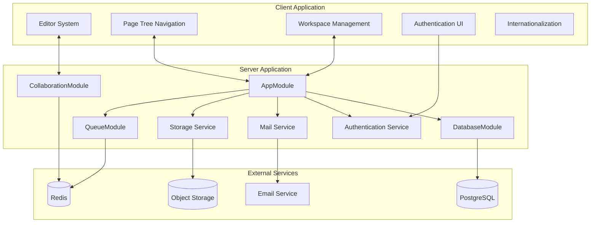
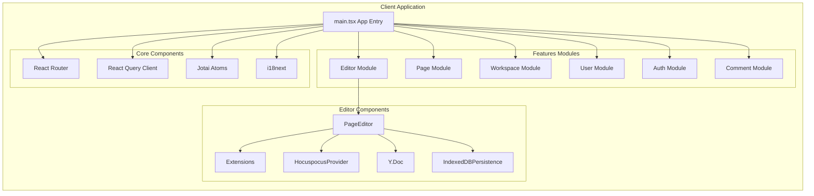
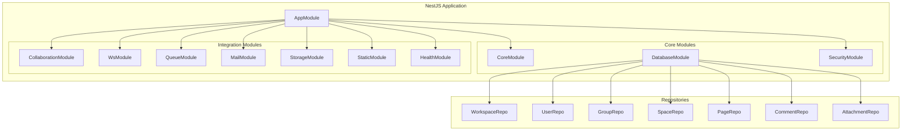
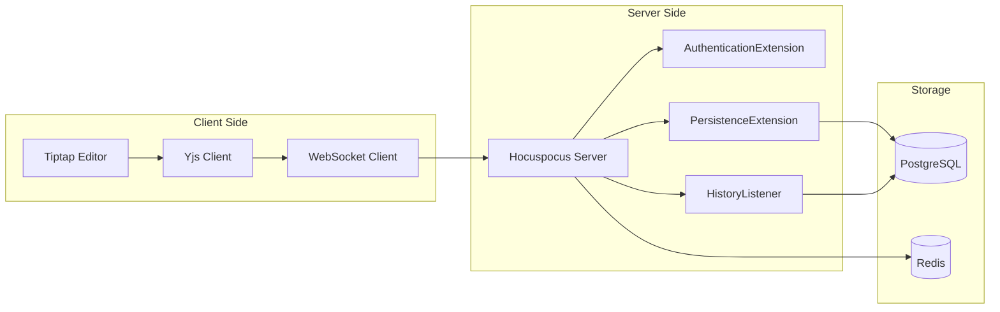
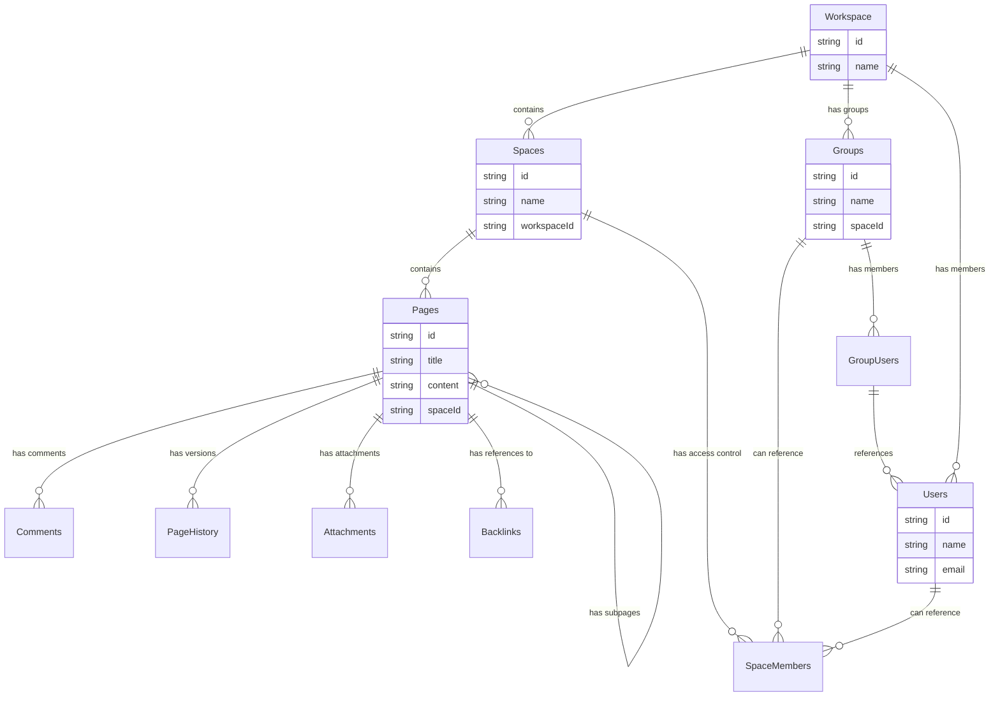
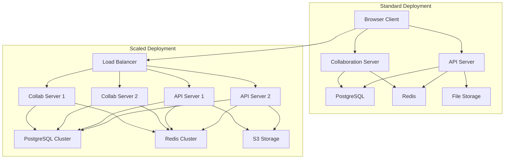
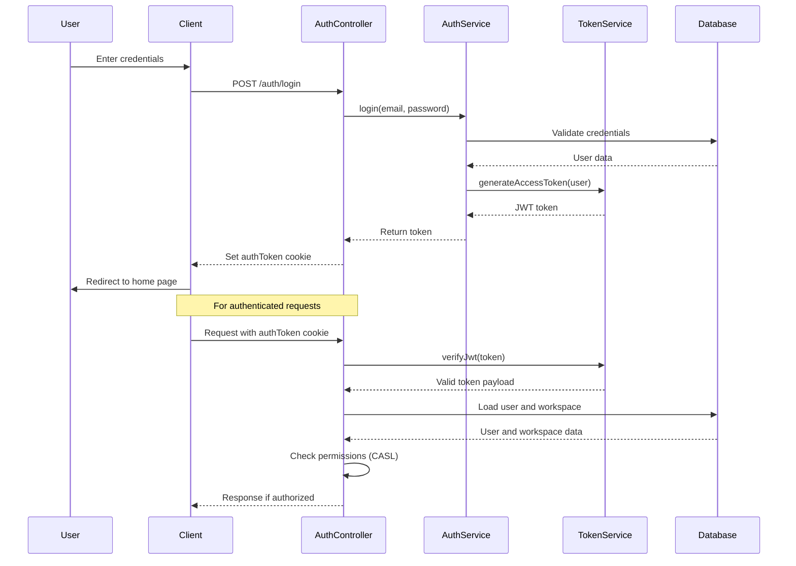
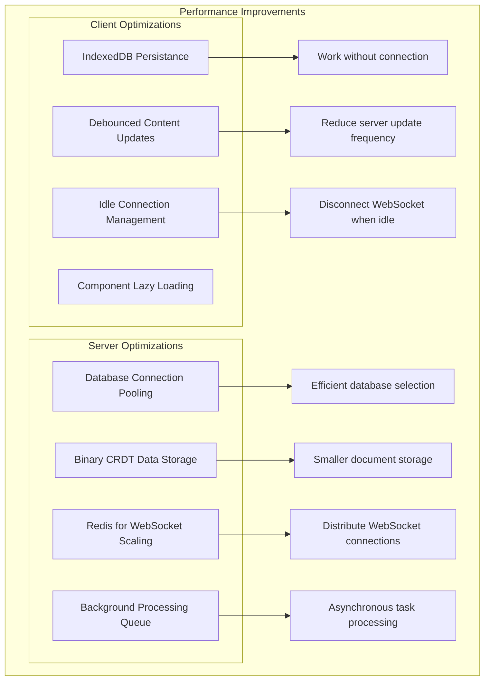

系统架构
====

本文档全面概述了 DocMost 系统架构，包括 client-server 结构、主要组件及其交互。

它涵盖了平台的技术基础，重点介绍各个子系统如何协同工作以实现实时协作编辑、分层页面组织和工作区管理。

<!-- 有关特定子系统的信息，请参阅：

* [实时协作系统]()
* [数据模型和关系]()
* [页面管理]()
* [工作区管理]()
* [编辑器框架]() -->

高级架构
----

DocMost 实现了一个客户端-服务器架构，其中包含用于实时协作的专用组件。该系统由几个不同的层和模块组成。

### 系统架构概述图

该系统由三个主要层组成：

1. **客户端应用程序** ：基于 React 的 SPA，提供用于文档编辑、导航和工作区管理的用户界面。
2. **服务器应用程序** ：基于 NestJS 的后端，具有模块化架构，可处理 API 请求、数据持久性和业务逻辑。
3. **外部服务** ：基础设施组件，包括 PostgreSQL 数据库、用于缓存和发布/订阅的 Redis 以及存储服务。

客户端架构
-----

客户端应用程序是基于 React 的单页应用程序，具有基于功能的组织。

### 客户端架构图

关键客户端组件：

1. **PageEditor**：使用 Yjs 和 Hocuspocus 将 Tiptap 与实时协作集成的核心编辑器组件。
2. **编辑器扩展** ：Tiptap 扩展的集合，提供丰富的编辑功能，包括表格、图像、注释和数学公式。
3. **协作集成** ：使用 `IndexeddbPersistence` 进行本地和远程文档同步以提供离线支持，并使用 `HocuspocusProvider` 进行实时协作。
4. **状态管理** ：用于服务器状态的 React Query 和用于客户端状态的 Jotai 的组合。

服务器架构
-----

该服务器是使用 NestJS 构建的，组织成封装相关功能的模块。

### 服务器模块架构图

服务器应用程序包括：

1. **AppModule**：组织和初始化所有其他模块的根模块。
2. **核心模块** ：
  * `DatabaseModule`：使用 Kysely ORM 的 PostgreSQL 连接
  * `CoreModule`： 核心服务和实用程序
  * `SecurityModule`：身份验证和授权功能
3. **集成模块** ：
  * `CollaborationModule`：实时编辑服务器 （Hocuspocus）
  * `WsModule`：WebSocket 通信
  * `QueueModule`：使用 BullMQ 进行后台作业处理
  * `MailModule`：电子邮件服务
  * `StorageModule`： 文件存储集成
4. **存储库** ：每个实体的数据库访问层组件（工作区、用户、页面等）

实时协作架构
------

实时协作是 DocMost 的核心功能，使多个用户能够同时编辑文档。

### 协作系统架构图

协作系统的工作原理如下：

1. **客户端组件** ：
  * `PageEditor` 组件使用 Yjs 集成初始化 Tiptap 编辑器
  * `HocuspocusProvider` 处理与协作服务器的通信
  * `Y.Doc` 在本地存储文档状态
  * `IndexeddbPersistence` 提供离线功能
2. **服务器端组件** ：
  * `CollaborationModule` 处理 WebSocket 连接
  * `CollaborationGateway` 管理文档会话
  * `AuthenticationExtension` 验证用户访问权限
  * `PersistenceExtension` 将文档更改保存到数据库
  * `HistoryListener` 创建页面版本历史记录
3. **数据流：**
  * 编辑器的更改被转换为Yjs操作
  * 操作通过WebSocket发送到服务器
  * 服务器验证并应用更改到共享文档
  * 更改被持久化到PostgreSQL并分发到其他客户端
  * Redis使跨多个服务器实例进行扩展成为可能

数据库架构
-----

DocMost 使用 PostgreSQL 和 Kysely 作为查询构建器。数据库架构表示系统中的实体和关系。

### 数据模型图

关键数据库实体：

1. **工作区** ：团队/组织内容的顶级容器
  * 属性：id、name、hostname、settings、logo 等。
2. **Users**：具有身份验证和配置文件数据的 System 用户
  * 属性：id、name、email、password （hashed）、role、settings
3. **空间** ：工作区中的内容容器
  * 属性：id、name、slug、visibility、defaultRole
4. **页面** ：具有分层结构的文档实体
  * 属性：id、title、content、position、ydoc（二进制 CRDT 状态）、textContent、contributorIds
5. **PageHistory**：页面的版本历史记录
  * 属性：id、pageId、content、version
6. **评论** ：用户对页面内容的评论
  * 属性：id、pageId、content、creatorId、selection
7. **附件** ：附加到页面的文件
  * 属性：id、pageId、fileName、filePath、fileSize、mimeType

数据库模块使用 Kysely 进行查询构建和事务管理。存储库类提供特定于实体的数据访问方法。

部署架构
----

DocMost 可以部署在不同的配置中，从单个服务器到分布式设置。

### 部署选项示意图

来源：

*   [package.json](https://github.com/docmost/docmost/blob/de57d051/package.json)
*   [apps/server/src/main.ts](https://github.com/docmost/docmost/blob/de57d051/apps/server/src/main.ts)
*   [apps/server/src/collaboration/server/collab-main.ts](https://github.com/docmost/docmost/blob/de57d051/apps/server/src/collaboration/server/collab-main.ts)

部署注意事项：

1. **服务器组件** ：
  * 主 API 服务器：处理 HTTP 请求和 WebSocket 连接
  * Collaboration Server：用于实时编辑会话的专用服务器
  * 数据库：用于持久存储的 PostgreSQL
  * Redis：用于 WebSocket 扩展、协作感知和队列处理
2. **启动应用程序** ：
  * API 服务器：`pnpm start` 或 `pnpm server：start`
  * 协作服务器：`pnpm collab` 或 `pnpm collab：dev`
  * 开发模式：`pnpm dev`（同时运行客户端和服务端）
3. **缩放选项** ：
  * 负载均衡器后面的 API 服务器的水平扩展
  * 用于处理编辑会话的独立协作服务器
  * Redis 支持跨多个服务器实例扩展 WebSocket
  * 数据库可以使用副本或分片进行扩展，以实现大型部署

身份验证和授权
-------

DocMost 实现了一个全面的身份验证和授权系统。

### 身份验证流程图

来源：

*   [apps/client/src/features/auth/queries/auth-query.tsx](https://github.com/docmost/docmost/blob/de57d051/apps/client/src/features/auth/queries/auth-query.tsx)
*
    [apps/server/src/core/auth/token.module.ts](https://github.com/docmost/docmost/blob/de57d051/apps/server/src/core/auth/token.module.ts) （从导入中推断）

关键身份验证组件：

1. **身份验证方法** ：
  * 使用电子邮件/密码进行本地身份验证
  * OAuth 提供商（Google 等）
  * 用于企业 SSO 的 SAML 和 OIDC
2. **代币管理** ：
  * 基于 JWT 的身份验证
  * 由 `useCollabToken` 查询处理的令牌刷新
  * 令牌验证中间件
3. **授权系统** ：
  * 基于 CASL 的权限系统（在 Client package.json 中引用）
  * 基于角色的访问控制
  * 工作区和空间级权限
4. **特殊合作授权** ：
  * 通过 `/api/auth/collab-token` 的专用协作令牌
  * `AuthenticationExtension` 中的令牌验证

性能优化
----

该系统包括针对性能和资源使用的多项优化。

### 性能特点图

来源：

*   [apps/client/src/features/editor/page-editor.tsx244-273](https://github.com/docmost/docmost/blob/de57d051/apps/client/src/features/editor/page-editor.tsx#L244-L273)
*   [apps/client/src/hooks/use-idle.ts](https://github.com/docmost/docmost/blob/de57d051/apps/client/src/hooks/use-idle.ts)
*   [apps/server/src/database/database.module.ts37-48](https://github.com/docmost/docmost/blob/de57d051/apps/server/src/database/database.module.ts#L37-L48)

值得注意的优化：

1. **客户端优化** ：
  * 基于文档可见性和用户空闲状态的 WebSocket 连接管理
  * 用于离线编辑的本地 IndexedDB 持久性
  * Debounced 内容更新以减少服务器负载
  * 编辑器组件和扩展的延迟加载
2. **服务器优化** ：
  * 具有可配置限制的数据库连接池
  * CRDT 状态的二进制存储（Yjs 文档）
  * Redis 用于在多个服务器之间分配 WebSocket 连接
  * 非实时任务的后台作业处理
  * 通过更改检测实现高效的文档更新

结论
--

DocMost 的架构旨在提供一个响应式协作文档平台，该平台可从小型团队扩展到大型组织。

模块化设计允许灵活部署和扩展，而实时协作系统使多个用户能够同时处理文档。

该架构的主要优势包括：

1. 客户端、API 服务器和协作服务器之间的关注点分离
2. 使用成熟的 CRDT 技术实现强大的实时协作
3. 使用 Redis 进行可扩展设计，用于分布式 WebSocket 通信
4. 灵活的数据模型，支持分层文档组织
5. 全面的身份验证和权限系统

有关特定子系统的更多详细信息，请参阅简介中的链接页面。