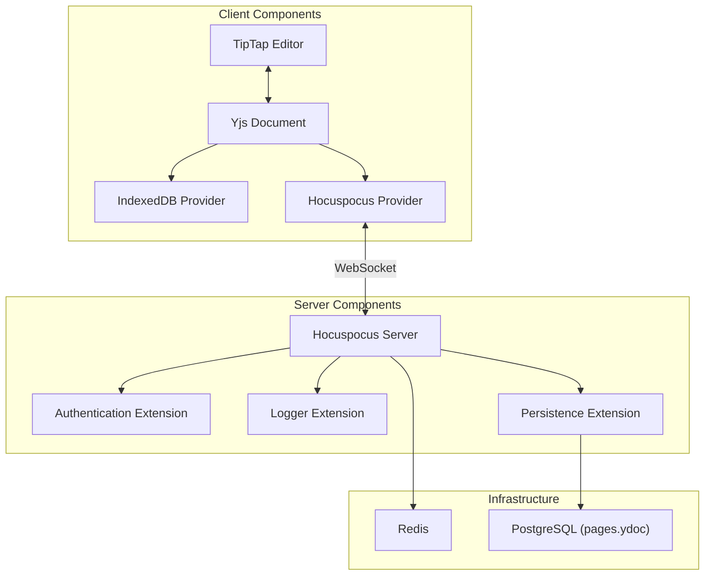
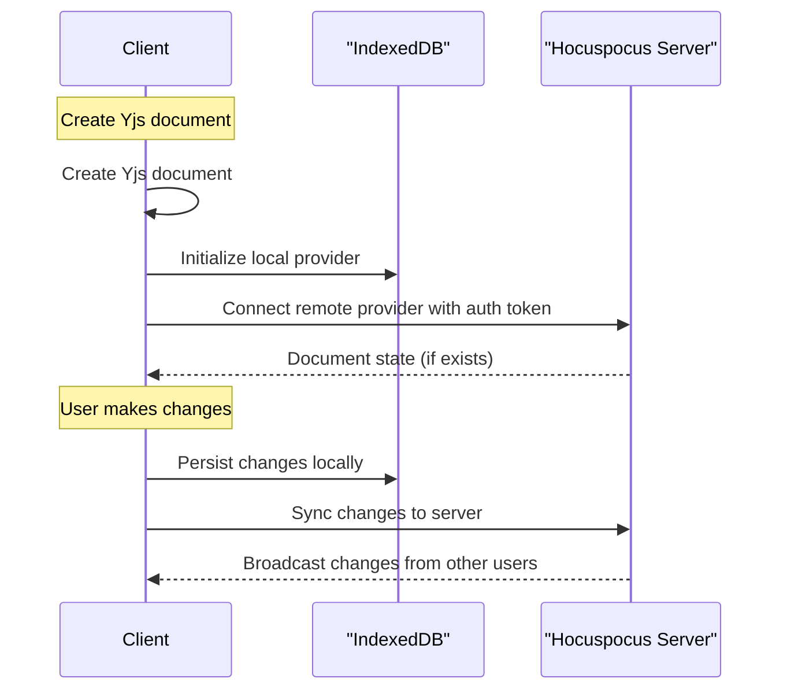
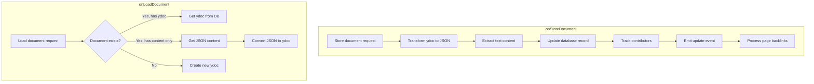
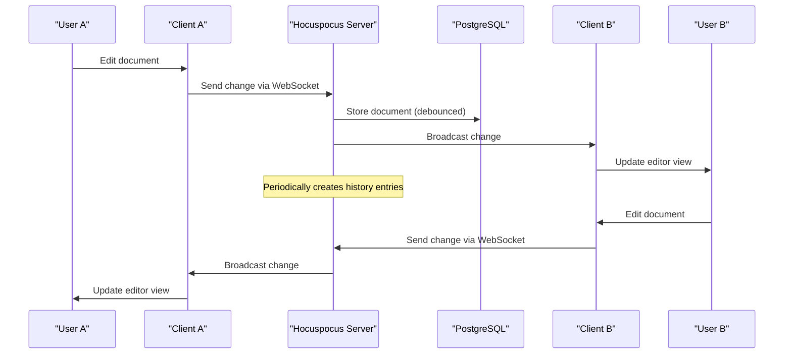

# 实时协作系统

## 目的和范围

本文件描述了实时协作系统，该系统允许多个用户同时编辑文档，所有连接的客户端上的更改会立即同步。该系统是DocMost的核心组件，实现了无冲突的更改合并的并发编辑。

## 架构概述

实时协作系统采用客户端-服务器架构，使用Yjs作为底层无冲突复制的数据类型（CRDT）技术，TipTap作为编辑框架，以及Hocuspocus作为WebSocket服务器。



## 客户端实现

### 文档初始化

客户端创建了一个Yjs文档，并设置了两个同步Provider：
1. IndexedDB Provider：通过在本地持久化文档更改来实现离线编辑
2. Hocuspocus Provider：通过WebSocket连接到服务器，以实现与其他客户端的实时同步




### 代码实现

客户端在 `PageEditor` 组件中设置了本地和远程Provider：

```tsx
// Local persistence with IndexedDB
const localProvider = useMemo(() => {
  const provider = new IndexeddbPersistence(documentName, ydoc);
  provider.on("synced", () => {
    setLocalSynced(true);
  });
  return provider;
}, [pageId, ydoc]);

// Remote collaboration via WebSocket
const remoteProvider = useMemo(() => {
  const provider = new HocuspocusProvider({
    name: documentName,
    url: collaborationURL,
    document: ydoc,
    token: collabQuery?.token,
    connect: false,
    preserveConnection: false,
    // ...
  });
  return provider;
}, [ydoc, pageId, collabQuery?.token]);
```

编辑器配置了协作扩展：

```tsx
const extensions = useMemo(() => {
  return [
    ...mainExtensions,
    ...collabExtensions(remoteProvider, currentUser?.user),
  ];
}, [ydoc, pageId, remoteProvider, currentUser?.user]);

```

### 连接管理

客户端实现了智能连接处理以优化资源使用：

```tsx
useEffect(() => {
  if (
    isIdle &&
    documentState === "hidden" &&
    remoteProvider?.status === WebSocketStatus.Connected
  ) {
    remoteProvider.disconnect();
    setIsCollabReady(false);
    return;
  }

  if (
    documentState === "visible" &&
    remoteProvider?.status === WebSocketStatus.Disconnected
  ) {
    resetIdle();
    remoteProvider.connect();
    setTimeout(() => {
      setIsCollabReady(true);
    }, 600);
  }
}, [isIdle, documentState, remoteProvider]);
```

* 当页面空闲且不可见（标签页在后台）时断开连接
* 当页面再次可见时重新连接
* 管理连接状态以向用户提供反馈

## 服务端实现

### Hocuspocus 服务

服务器端的协作能力由一个带有自定义扩展的Hocuspocus服务器实现：

```ts
this.hocuspocus = HocuspocusServer.configure({
  debounce: 10000,
  maxDebounce: 45000,
  unloadImmediately: false,
  extensions: [
    this.authenticationExtension,
    this.persistenceExtension,
    this.loggerExtension,
    ...(this.environmentService.isCollabDisableRedis()
      ? []
      : [new Redis({ /* Redis configuration */ })]),
  ],
});
```

### 身份验证扩展

身份验证扩展验证用户访问令牌，并确保只有授权用户可以协作编辑文档。

### 持久性扩展

持久性扩展管理从数据库中加载文档并将它们保存到数据库中：



具体来说：
1. **文档加载：**
  * 使用页面ID从数据库中加载文档
  * 如果存在二进制Yjs文档（ydoc），则直接加载
  * 如果只存在JSON内容，则将其转换为Yjs文档
  * 如果不存在文档，则创建新文档
2. **文档保存：**
  * 将Yjs文档转换为TipTap JSON
  * 提取纯文本以供搜索
  * 更新数据库记录以反映更改
  * 跟踪文档贡献者
  * 发出历史和反向链接处理事件

### Redis 集成

Redis用于在多个服务器实例之间同步文档状态：

```ts
new Redis({
  host: this.redisConfig.host,
  port: this.redisConfig.port,
  options: {
    password: this.redisConfig.password,
    db: this.redisConfig.db,
    family: this.redisConfig.family,
    retryStrategy: createRetryStrategy(),
  },
})
```

## 数据流




实时协作数据流：

1. 用户在编辑器中做出更改
2. TipTap将更改应用到Yjs文档中
3. Yjs自动处理冲突解决
4. 更改同步到本地IndexedDB
5. 更改通过WebSocket同步到Hocuspocus服务器
6. 服务器向其他连接的客户端广播更改
7. 服务器定期将更改持久化到PostgreSQL
8. 服务器定期创建历史记录条目

## 其他特性

### 文档历史

系统会自动在适当的时间间隔内创建文档历史记录，使用户能够查看和恢复以前的文档状态：

```ts
@OnEvent('collab.page.updated')
async handleCreatePageHistory(event: UpdatedPageEvent) {
  const { page } = event;

  // Skip for newly created pages
  if (currentTime - pageCreationTime < FIVE_MINUTES) {
    return;
  }

  // Create history if content changed and enough time passed
  if (!lastHistory ||
      (!isDeepStrictEqual(lastHistory.content, page.content) &&
      currentTime - new Date(lastHistory.createdAt).getTime() >= FIVE_MINUTES)) {
    await this.pageHistoryRepo.saveHistory(page);
  }
}
```

### 贡献者跟踪
系统在编辑会话期间跟踪文档贡献者：

```ts
async onChange(data: onChangePayload) {
  const documentName = data.documentName;
  const userId = data.context?.user.id;
  if (!userId) return;

  if (!this.contributors.has(documentName)) {
    this.contributors.set(documentName, new Set());
  }

  this.contributors.get(documentName).add(userId);
}
```

贡献者的数据会保存到数据库中：

```ts
const existingContributors = page.contributorIds || [];
const contributorSet = this.contributors.get(documentName);
contributorSet.add(page.creatorId);
const newContributors = [...contributorSet];
contributorIds = Array.from(
  new Set([...existingContributors, ...newContributors]),
);
```

### 反向链接处理

当文档更新时，系统处理文档之间的内部链接：

```ts
const mentions = extractMentions(tiptapJson);
const pageMentions = extractPageMentions(mentions);

await this.generalQueue.add(QueueJob.PAGE_BACKLINKS, {
  pageId: pageId,
  workspaceId: page.workspaceId,
  mentions: pageMentions,
} as IPageBacklinkJob);
```

这些反向链接使用队列系统异步处理，以避免阻塞主协作流程。

## 性能考虑

系统集成了多个性能优化措施：

1. **防抖持久化**：通过防抖减少写入频率，将更改持久化到数据库中

```
debounce: 10000,
maxDebounce: 45000,
```

2. **智能连接管理**：客户端在非活动状态下断开连接以减少服务器负载

```tsx
if (isIdle && documentState === "hidden") {
  remoteProvider.disconnect();
}
```

3. **异步处理**：背景任务，如反向链接处理，使用队列系统

```ts
await this.generalQueue.add(QueueJob.PAGE_BACKLINKS, { /* ... */ });
```

4. **本地优先的编辑**：更改在同步之前先本地应用，以提供即时反馈。

## 安全考虑

系统实现了几种安全手段：
1. **JWT认证**：WebSocket 链接需要有效的 JWT token

  ```
  token: collabQuery?.token
  ```

2. **Token刷新**：长时间编辑会话的自动刷新令牌

  ```
  onAuthenticationFailed: (auth: onAuthenticationFailedParameters) => {
    const payload = jwtDecode(collabQuery?.token);
    const now = Date.now().valueOf() / 1000;
    const isTokenExpired = now >= payload.exp;
    if (isTokenExpired) {
      refetchCollabToken();
    }
  }
  ```

3. **访问控制**：在允许协作之前，将文档访问与用户权限进行验证

## 数据库模式

|表|字段|描述|
|---|---|---|
|pages|content|JSON格式的文档|
|pages|ydoc|二进制Yjs格式的文档|
|pages|contributorIds|编辑过文章的用户ID数组|
|pages|textContent|用于搜索索引的纯文本内容|
|pageHistory|content|JSON格式的历史文档|
|pageHistory|version|历史记录的版本号|


实时协作系统是DocMost的核心组件，它使多个用户能够同时编辑文档。它使用Yjs进行无冲突协作编辑，TipTap进行富文本编辑，以及Hocuspocus作为WebSocket服务器。该系统设计为可扩展、性能良好且安全，具有离线编辑、文档历史和贡献者跟踪等功能。